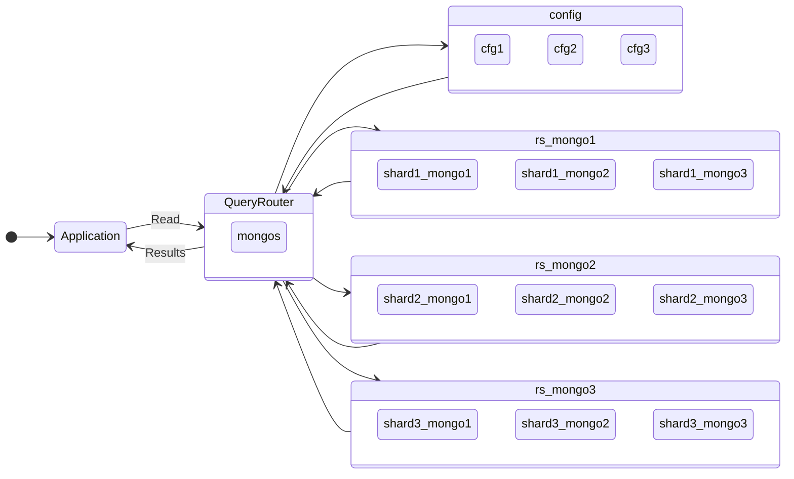

In my previous [blog](2021-09-18-mongodb-rs-docker-persistent-volume.md) post, I posted about configuring Replica Set to meet high availability requirements. 

In this post, i cover 

* MongoDB Sharded Cluster Components 
* Steps to create MongoDB Sharded Cluster using Docker Compose
* Add Replica Set as a Shard
* Sharding Data
* Verify Distribution of Data 

<!--truncate-->

## Replica Set vs Sharding 

**Replica Set** is the way of keeping identical set of data on multiple servers. Sharding refers to the process of splitting data across nodes, also known as horizontal partitioning. 

A database **shard**, is a horizontal partition of data in a database,  each node contains different set of the data. 

MongoDB supports and implements `auto-sharding` by automating balancing of data across the shards. 


## MongoDB Sharding Components 

The first step in creating a Sharded MongoDB cluster is to understand all the components and processes that constitute a cluster 

* **Query Router - mongos**

mongos is the routing process. The goal of sharding is to make cluster of 100-1000 nodes looks like a single interface for the application and abstract all the complexity of data access from multiple shards. The mongos router is table of contents and knows where the  data required by application is located, mongos forwards the application request to appropriate shard(s).   

* **Config Servers**

Config Servers hold all the metadata about which node is holding which data(chunks). mongos retrieves all the metadata from Config Servers. Config Servers are critical and its important to configure and bring the config servers first, backup config servers and setup config servers as Replica Set.  

## Steps to create MongoDB Sharded Cluster using Docker Compose

Below image show different components required to setup MongoDB sharding with Replica Set. The image also shows how application communicates to MongoDB sharded cluster. As discussed in the sharding components application always connects first to mongos and mongos communicates with config server (cfg1, cfg2, cfg3 are part of replicaset in below image)



Lets setup above MongoDB Sharding Cluster using docker compose

### Step 1 - Author Docker Compose file 

:::note
Ensure directory path mentioned in docker compose for persistent volume before the “:” is existing on local host
:::

```YAML
services:
  shard1_mongo1:
    image: mongo_ssh
    hostname: shard1_mongo1
    container_name: shard1_mongo1
    volumes:
      - ~/db/shard1_mongo1/mongod.conf:/etc/mongod.conf
      - ~/db/shard1_mongo1/initdb.d/:/docker-entrypoint-initdb.d/
      - ~/db/shard1_mongo1/data/db/:/data/db/
      - ~/db/shard1_mongo1/log/:/var/log/mongodb/
    ports:
      - 20005:27017
    command: ["-f", "/etc/mongod.conf"]
    network_mode: mongo_net
 
  shard1_mongo2:
    image: mongo_ssh
    hostname: shard1_mongo2
    container_name: shard1_mongo2
    volumes:
      - ~/db/shard1_mongo2/mongod.conf:/etc/mongod.conf
      - ~/db/shard1_mongo2/initdb.d/:/docker-entrypoint-initdb.d/
      - ~/db/shard1_mongo2/data/db/:/data/db/
      - ~/db/shard1_mongo2/log/:/var/log/mongodb/
    ports:
      - 20006:27017
    command: ["-f", "/etc/mongod.conf"]
    network_mode: mongo_net
 
  shard1_mongo3:
    image: mongo_ssh
    hostname: shard1_mongo3
    container_name: shard1_mongo3
    volumes:
      - ~/db/shard1_mongo3/mongod.conf:/etc/mongod.conf
      - ~/db/shard1_mongo3/initdb.d/:/docker-entrypoint-initdb.d/
      - ~/db/shard1_mongo3/data/db/:/data/db/
      - ~/db/shard1_mongo3/log/:/var/log/mongodb/
    ports:
      - 20007:27017
    command: ["-f", "/etc/mongod.conf"]
    network_mode: mongo_net
 
  shard2_mongo1:
    image: mongo_ssh
    hostname: shard2_mongo1
    container_name: shard2_mongo1
    volumes:
      - ~/db/shard2_mongo1/mongod.conf:/etc/mongod.conf
      - ~/db/shard2_mongo1/initdb.d/:/docker-entrypoint-initdb.d/
      - ~/db/shard2_mongo1/data/db/:/data/db/
      - ~/db/shard2_mongo1/log/:/var/log/mongodb/
    ports:
      - 20008:27017
    command: ["-f", "/etc/mongod.conf"]
    network_mode: mongo_net
 
  shard2_mongo2:
    image: mongo_ssh
    hostname: shard2_mongo2
    container_name: shard2_mongo2
    volumes:
      - ~/db/shard2_mongo2/mongod.conf:/etc/mongod.conf
      - ~/db/shard2_mongo2/initdb.d/:/docker-entrypoint-initdb.d/
      - ~/db/shard2_mongo2/data/db/:/data/db/
      - ~/db/shard2_mongo2/log/:/var/log/mongodb/
    ports:
      - 20009:27017
    command: ["-f", "/etc/mongod.conf"]
    network_mode: mongo_net
 
  shard2_mongo3:
    image: mongo_ssh
    hostname: shard2_mongo3
    container_name: shard2_mongo3
    volumes:
      - ~/db/shard2_mongo3/mongod.conf:/etc/mongod.conf
      - ~/db/shard2_mongo3/initdb.d/:/docker-entrypoint-initdb.d/
      - ~/db/shard2_mongo3/data/db/:/data/db/
      - ~/db/shard2_mongo3/log/:/var/log/mongodb/
    ports:
      - 20010:27017
    command: ["-f", "/etc/mongod.conf"]
    network_mode: mongo_net
 
  shard3_mongo1:
    image: mongo_ssh
    hostname: shard3_mongo1
    container_name: shard3_mongo1
    volumes:
      - ~/db/shard3_mongo1/mongod.conf:/etc/mongod.conf
      - ~/db/shard3_mongo1/initdb.d/:/docker-entrypoint-initdb.d/
      - ~/db/shard3_mongo1/data/db/:/data/db/
      - ~/db/shard3_mongo1/log/:/var/log/mongodb/
    ports:
      - 20011:27017
    command: ["-f", "/etc/mongod.conf"]
    network_mode: mongo_net
 
  shard3_mongo2:
    image: mongo_ssh
    hostname: shard3_mongo2
    container_name: shard3_mongo2
    volumes:
      - ~/db/shard3_mongo2/mongod.conf:/etc/mongod.conf
      - ~/db/shard3_mongo2/initdb.d/:/docker-entrypoint-initdb.d/
      - ~/db/shard3_mongo2/data/db/:/data/db/
      - ~/db/shard3_mongo2/log/:/var/log/mongodb/
    ports:
      - 20012:27017
    command: ["-f", "/etc/mongod.conf"]
    network_mode: mongo_net
 
  shard3_mongo3:
    image: mongo_ssh
    hostname: shard3_mongo3
    container_name: shard3_mongo3
    volumes:
      - ~/db/shard3_mongo3/mongod.conf:/etc/mongod.conf
      - ~/db/shard3_mongo3/initdb.d/:/docker-entrypoint-initdb.d/
      - ~/db/shard3_mongo3/data/db/:/data/db/
      - ~/db/shard3_mongo3/log/:/var/log/mongodb/
    ports:
      - 20013:27017
    command: ["-f", "/etc/mongod.conf"]
    network_mode: mongo_net
# MongoDB Confiugration Server 
  cfg1:
    image: mongo_ssh
    hostname: cfg1
    container_name: cfg1
    volumes:
      - ~/db/cfg1/mongod.conf:/etc/mongod.conf
      - ~/db/cfg1/initdb.d/:/docker-entrypoint-initdb.d/
      - ~/db/cfg1/data/db/:/data/db/
      - ~/db/cfg1/log/:/var/log/mongodb/
    ports:
      - 20014:27017
    command: ["-f", "/etc/mongod.conf"]
    network_mode: mongo_net
 
  cfg2:
    image: mongo_ssh
    hostname: cfg2
    container_name: cfg2
    volumes:
      - ~/db/cfg2/mongod.conf:/etc/mongod.conf
      - ~/db/cfg2/initdb.d/:/docker-entrypoint-initdb.d/
      - ~/db/cfg2/data/db/:/data/db/
      - ~/db/cfg2/log/:/var/log/mongodb/
    ports:
      - 20015:27017
    command: ["-f", "/etc/mongod.conf"]
    network_mode: mongo_net
 
  cfg3:
    image: mongo_ssh
    hostname: cfg3
    container_name: cfg3
    volumes:
      - ~/db/cfg3/mongod.conf:/etc/mongod.conf
      - ~/db/cfg3/initdb.d/:/docker-entrypoint-initdb.d/
      - ~/db/cfg3/data/db/:/data/db/
      - ~/db/cfg3/log/:/var/log/mongodb/
    ports:
      - 20016:27017
    command: ["-f", "/etc/mongod.conf"]
    network_mode: mongo_net
 
  mongos:
    image: mongo_ssh
    hostname: mongos
    container_name: mongos
    volumes:
      - ~/db/mongos/mongod.conf:/etc/mongod.conf
      - ~/db/mongos/initdb.d/:/docker-entrypoint-initdb.d/
      - ~/db/mongos/data/db/:/data/db/
      - ~/db/mongos/log/:/var/log/mongodb/
    ports:
      - 20017:27017
    command: ["mongos","-f", "/etc/mongod.conf"]
    network_mode: mongo_net


```

### Step 2 - Draft Config Server configuration file (pass clusterRole: configsvr to indicate this server is Config Server)

```YAML
systemLog:
  destination: file
  logAppend: true
  path: /var/log/mongodb/mongod.log
storage:
  dbPath: /data/db
  journal:
    enabled: true
  engine:  wiredTiger
net:
  port: 27017
  bindIp: 127.0.0.1  # Enter 0.0.0.0,:: to bind to all IPv4 and IPv6 addresses or, alternatively, use the net.bindIpAll setting.
sharding:
  clusterRole: configsvr
replication:
  replSetName: rs_config
```

### Step 3 - Draft Query Router mongos configuration file (pass configDB:config server list)

```YAML
systemLog:
  destination: file
  logAppend: true
  path: /var/log/mongodb/mongod.log
 
net:
  port: 27017
  bindIp: 127.0.0.1  # Enter 0.0.0.0,:: to bind to all IPv4 and IPv6 addresses or, alternatively, use the net.bindIpAll setting.
 
sharding:
  configDB: rs_config/cfg1:27017,cfg2:27017,cfg3:27017
```

### Step 4 - Copy mongod.conf and mongos.conf to the path mentioned in step 1 `docker-compose.yaml`

### Step 5 - Spin up Config Server, mongos, all mongod nodes

```shell 
$ docker compose up -d
```

### Step 6 - Connect to config server and add config server in a Replica Set

```javascript 
rs_config:PRIMARY> rs.initiate() 
rs_config:PRIMARY> rs.add("cfg2:27017")
rs_config:PRIMARY> rs.add("cfg3:27017")
```

### Step 7 -  Add all data nodes to replicaset

```javascript 
# Connect to shard1_mongo1
 
admin> rs.initiate()
rs_mongo1 [direct: primary] admin> rs.add("shard1_mongo2")
rs_mongo1 [direct: primary] admin> rs.add("shard1_mongo3")
 
# Connect to shard2_mongo1
 
admin> rs.initiate()
rs_mongo2 [direct: primary] test> rs.add("shard2_mongo2")
rs_mongo2 [direct: primary] test> rs.add("shard2_mongo3")
 
# Connect to shard3_mongo1
 
test> rs.initiate()
rs_mongo3 [direct: other] test> rs.add("shard3_mongo2")
rs_mongo3 [direct: primary] test> rs.add("shard3_mongo3")

```

### Step 8 – Connect to mongos and convert data replicaset nodes to shards

```javascript

mongos>sh.addShard("rs_mongo1/shard1_mongo1:27017,shard1_mongo2:27017,shard1_mongo3:27017")
 
mongos>sh.addShard("rs_mongo2/shard2_mongo1:27017,shard2_mongo2:27017,shard2_mongo3:27017")
 
mongos>sh.addShard("rs_mongo3/shard3_mongo1:27017,shard3_mongo2:27017,

```

### Step 9 – Connect to mongos and enable sharding on a test database “Employee”

```javascript
mongos> db.adminCommand({enableSharding : "employee"})
```

### Step 10 – Generate test data ; Create an index on the key to be sharded and shard the collection

```javascript
mongos> use employee
switched to db employee
 
mongos> for (var i = 0; i < 100000; i++) { db.emp_list2.insert({ "sr_no": "emp # " + i, "create_date": new Date() }); }
 
mongos> db.emp_list2.ensureIndex({"sr_no" : "hashed"})
 
mongos> sh.shardCollection("employee.emp_list2", {"sr_no":"hashed"})
 
{
    "collectionsharded" : "employee.emp_list2",
    "collectionUUID" : UUID("17195baa-fc6c-4c3e-8a2b-58fb1278e40c"),
    "ok" : 1,
    "operationTime" : Timestamp(1633177398, 26),
    "$clusterTime" : {
        "clusterTime" : Timestamp(1633177398, 26),
        "signature" : {
            "hash" : BinData(0,"AAAAAAAAAAAAAAAAAAAAAAAAAAA="),
            "keyId" : NumberLong(0)
        }
    }
}
```

### Step 11 – Validate sharding status

```javascript 


mongos> sh.status()
--- Sharding Status ---
  sharding version: {
    "_id" : 1,
    "minCompatibleVersion" : 5,
    "currentVersion" : 6,
    "clusterId" : ObjectId("6157efd7982782e314f1b651")
  }
  shards:
        {  "_id" : "rs_mongo1",  "host" : "rs_mongo1/shard1_mongo1:27017,shard1_mongo2:27017,shard1_mongo3:27017",  "state" : 1 }
        {  "_id" : "rs_mongo2",  "host" : "rs_mongo2/shard2_mongo1:27017,shard2_mongo2:27017,shard2_mongo3:27017",  "state" : 1 }
        {  "_id" : "rs_mongo3",  "host" : "rs_mongo3/shard3_mongo1:27017,shard3_mongo2:27017,shard3_mongo3:27017",  "state" : 1 }
  active mongoses:
        "4.4.8" : 1
  autosplit:
        Currently enabled: yes
  balancer:
        Currently enabled:  yes
        Currently running:  no
        Failed balancer rounds in last 5 attempts:  0
        Migration Results for the last 24 hours:
                682 : Success
  databases:
        {  "_id" : "config",  "primary" : "config",  "partitioned" : true }
                config.system.sessions
                        shard key: { "_id" : 1 }
                        unique: false
                        balancing: true
                        chunks:
                                rs_mongo1   342
                                rs_mongo2   341
                                rs_mongo3   341
                        too many chunks to print, use verbose if you want to force print
       employee.emp_list2
                        shard key: { "sr_no" : "hashed" }
                        unique: false
                        balancing: true
                        chunks:
                                rs_mongo1   2
                                rs_mongo2   2
                                rs_mongo3   
```

### Step 12 - Validate chunk distribution 
```javascript

mongos> db.getSiblingDB("employee").emp_list2.getShardDistribution();
 
Shard rs_mongo1 at rs_mongo1/shard1_mongo1:27017,shard1_mongo2:27017,shard1_mongo3:27017
 data : 2.09MiB docs : 33426 chunks : 2
 estimated data per chunk : 1.04MiB
 estimated docs per chunk : 16713
 
Shard rs_mongo3 at rs_mongo3/shard3_mongo1:27017,shard3_mongo2:27017,shard3_mongo3:27017
 data : 2.09MiB docs : 33379 chunks : 2
 estimated data per chunk : 1.04MiB
 estimated docs per chunk : 16689
 
Shard rs_mongo2 at rs_mongo2/shard2_mongo1:27017,shard2_mongo2:27017,shard2_mongo3:27017
 data : 2.08MiB docs : 33195 chunks : 2
 estimated data per chunk : 1.04MiB
 estimated docs per chunk : 16597
 
Totals
 data : 6.28MiB docs : 100000 chunks : 6
 Shard rs_mongo1 contains 33.42% data, 33.42% docs in cluster, avg obj size on shard : 65B
 Shard rs_mongo3 contains 33.37% data, 33.37% docs in cluster, avg obj size on shard : 65B
 Shard rs_mongo2 contains 33.19% data, 33.19% docs in cluster, avg 

```


