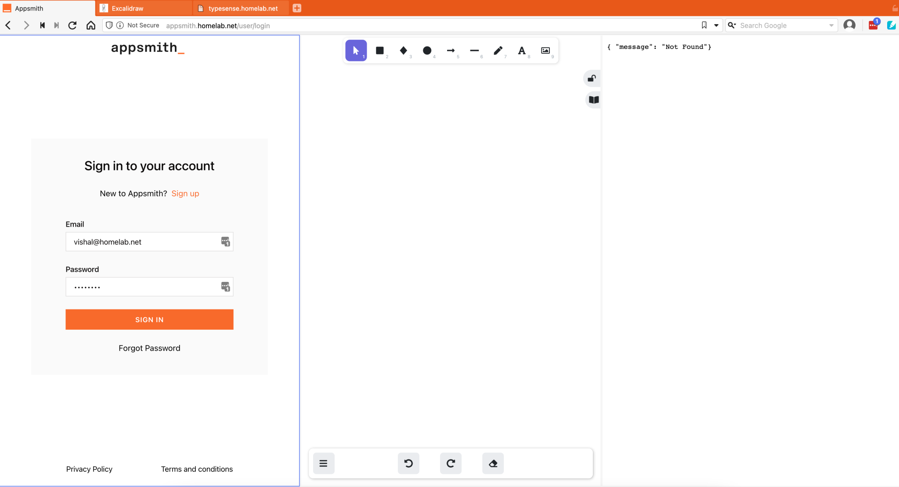

As I explored and set up an increased number of FOSS software using containers(Docker and LXD) and virtual machines(Multipass) in my home lab environment, I realized the difficulty in remembering the different ports the applications and containers are running. The solution to address this problem was to have a Domain Name System for the local network, which works to resolve local and external addresses with a reverse proxy to redirect calls based on DNS resolution.

<!--truncate-->


The below command lists the Docker Containers and ports the container are running on, the requirement is to create a domain for a home setup with domain homelab.net and access the containerized applications with appsmith.homelab.net; typesense.homelab.net; excalidraw.homelab.net

Let’s get the list of docker containers with port numbers

```shell
# get container names and port numbers
$ docker container ls --format "table {{.ID}}\t{{.Names}}\t{{.Ports}}" -a


CONTAINER ID   NAMES                        PORTS
cbb2ac402270   appsmith                     0.0.0.0:9001->9001/tcp, 0.0.0.0:70->80/tcp, 0.0.0.0:444->443/tcp
c9875323b989   typesense_typesense-1_1      0.0.0.0:8108->8108/tcp
c453288c8496   excalidraw                   0.0.0.0:3001->80/tcp
5be5d33f1f50   k8s-control-plane            127.0.0.1:34589->6443/tcp
4140d2fbf7d5   mysql_nocodb_1               0.0.0.0:8082->8080/tcp
e7310461bee9   mysql_root_db_1              3306/tcp, 33060/tcp
9b56c33d45d5   meilisearch_ms_1             0.0.0.0:7700->7700/tcp
9ac6a0e16b0e   mongo2                       0.0.0.0:20002->27017/tcp
2aaf01d2233f   mongo1                       0.0.0.0:20001->27017/tcp
860b521f97dc   mongo3                       0.0.0.0:20003->27017/tcp
d8ad1ec3cab8   rethinkdb_rethinkdb_1        0.0.0.0:28015->28015/tcp, 0.0.0.0:29015->29015/tcp, 0.0.0.0:8081->8080/tcp
```

The containers and applications running on the local home network as shown above do not have a public domain name, the option was to look for setting up a DNS server with [DNSMasq](https://thekelleys.org.uk/dnsmasq/doc.html), and a reverse proxy using [NGINX](https://www.nginx.com/). The containers may not be the only use case scenario for local DNS servers with [DNSMasq](https://thekelleys.org.uk/dnsmasq/doc.html), there could be many others like accessing a local file share across devices; accessing applications from a mobile device, and sharing a printer.


[DNSMasq](https://thekelleys.org.uk/dnsmasq/doc.html) - Dnsmasq provides network infrastructure for small networks: DNS, DHCP, router advertisement, and network boot. It is designed to be lightweight and has a small footprint, suitable for resource-constrained routers and firewalls.

[NGINX](https://www.nginx.com/) - Reverse Proxy – A reverse proxy provides an additional level of abstraction and control to ensure the smooth flow of network traffic between clients and servers.

**Let us get started with the implementation steps for DNSMasq and NGINX. The below steps are performed on Ubuntu 20.04 (Debian-based distro).**

Before starting the installation of DNSMasq, 

### Step 1: Disable systemd-resolve which binds to port 53, the default port for DNSMasq

```shell

 sudo systemctl stop systemd-resolved
 sudo systemctl disable systemd-resolved

```

### Step 2: Install DNSUtils, DNSMasq

```shell
sudo apt update && sudo apt install dnsmasq && sudo apt install dnsutils
```

### Step 3: Create the DNSMasq configuration file

```shell
$ dnsmasq_conf="no-dhcp-interface=enp2s0f0
bogus-priv
domain=homelab.net
expand-hosts
local=/homelab.net/
domain-needed
no-resolv
no-poll
server=8.8.8.8
server=8.8.4.4"

$ sudo echo -e "$dnsmasq_conf" > /etc/dnsmasq.d/home-lab.net 

$ sudo systemctl restart dnsmasq
```


### Step 4: Add container DNS records in the file./etc/hosts. The records in the hosts file will be used by DNSMasq for client responses

```shell
  $ sudo nano /etc/hosts  
  # add the below records to the hosts file
  #Container DNS records
  # appsmith
  192.168.20.113 appsmith
  # excalidraw
  192.168.20.113 excalidraw
  # typesense
  192.168.20.113 typesense
```

### Step 5: Restart DNSMasq service

```shell
$ sudo systemctl restart dnsmasq.service
```

### Step 6: Install NGINX

```shell
$ sudo apt update && sudo apt install nginx
```


### Step 6: To enable reverse proxy feature, create a new NGINX configuration file in `sites-enabled` directory

```shell
 $ sudo nano /etc/nginx/sites-enabled/homelab.conf
  server {
          listen 80;
          listen [::]:80;
          server_name typesense.homelab.net;
          location / {
                   proxy_bind 192.168.20.113;
                   proxy_pass http://localhost:3000;
          }
  }
  server {
          listen 80;
          listen [::]:80;
          server_name appsmith.homelab.net;
          location / {
                  proxy_bind 192.168.20.113;
                  proxy_pass http://localhost:70;
          }

  }
  server {
          listen 80;
          listen [::]:80;
          server_name excalidraw.homelab.net;
          location / {
                  proxy_bind 192.168.20.113;
                  proxy_pass http://localhost:3001;
          }

  }
```

The `proxy_pass` argument will forward all incoming client requests to app.homelab.net to the respective app. The IP address and port number can be easily changed.
 
### Step 7 reload NGINX for the configuration to take into effect
```shell 
$ sudo systemctl reload nginx
```
After a successful implementation, we will be able to access container applications using domain URLs as seen in the below screenshot with three panes first pane is appsmith ; second pane is excalidraw and third pane is typesense.

