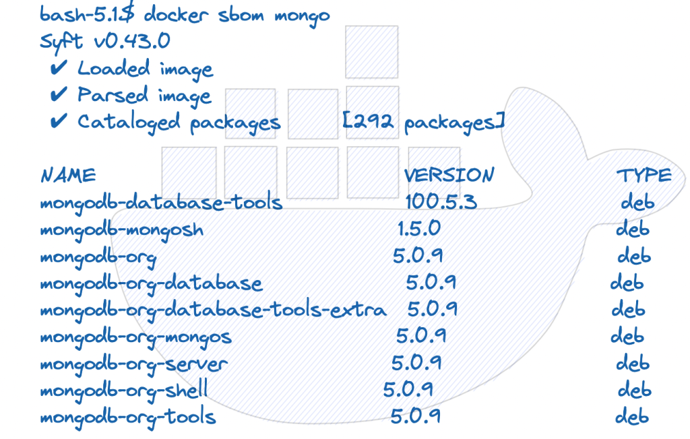

An **Software Bill of Materials (SBoM)** is a formal record containing the details and supply chain relationships of various components used in building the software. These components, including libraries and modules, can be proprietary or open source,free or paid and the data can be widely available or access-restricted.

<!--truncate-->



SBoM is analogous to a list of ingredients on food packaging. In May 2021, the US President released the [Executive Order](https://www.whitehouse.gov/briefing-room/presidential-actions/2021/05/12/executive-order-on-improving-the-nations-cybersecurity/) on improving the Nation’s Cybersecurity. The Software Bill of Materials (SBoM) directly impacts all developers. The SBoM requires third-party software companies to provide customers with the code equivalent of a “nutrition chart.”

## When should SBoM be used – Use cases ?

* **Developing products**
  * Scan vulnerabilities in the components
  * Keep codebase to bare minimum, reduce the number of dependencies and size
  * Generate SBoM for end users

* **IT Operations**
  * Understand operational risk
  * Understand potential exploitations
  * Real time asset inventory
  * Software Selection
  * Identify known vulnerabilities and compliance

* **EOL**
  * Complete visibility to components before evaluation or deploying in production
  * Understand the software architecture and the dependencies of the software

## Why SBOM ?

* Requirement from regulatory bodies to track the components used in the software

* Transparency of components getting shipped

* Container ecosystem has exploded and the need to track the components getting shipped is a must

* Software Vulnerabilities are bugs

* Detecting and remediating Vulnerabilities

## SBOM Formats

* **SPDX (Software Package Data Exchange )**
  * Open standard for communicating software bill of material information, including components, licenses, copyrights and security references. Reduces redundant work by providing a common format for organizations and communities to share and use

* **CycloneDX**
  * Open Web Application Security Project(OWASP) CycloneDX is a lightweight Software Bill of Materials (SBOM) standard designed for use in application security contexts and supply chain component analysis.

* **SWID (Software Identification Tags)**
  * SWID is used primarily to identify installed software and is the preferred format of the NVD. SWID tags are used in the National Vulnerability Database to describe vulnerable components. The CycloneDX specification compliments this work as CycloneDX documents can incorporate SWID tags and other high-level SWID metadata and optionally include entire SWID documents. Use of SWID tag ID’s are useful in determining if a specific component has known vulnerabilities.

## Docker Desktop – SBOM CLI

In Docker Desktop 4.7.0 Docker introduced and included a new experimental docker sbom CLI that is used for displaying SBoM for any container image. docker sbom scans the layer of container images using the Syft Project

## Usage

* Display SBOM in CyloneDX format

```shell

$ docker sbom mongo:latest --format cyclonedx-json | more

{
      "type": "library",
      "publisher": "MongoDB Packaging \u003cpackaging@mongodb.com\u003e",
      "name": "mongodb-org-server",
      "version": "5.0.9",
      "cpe": "cpe:2.3:a:mongodb-org-server:mongodb-org-server:5.0.9:*:*:*:*:*:*:*",
      "purl": "pkg:deb/ubuntu/mongodb-org-server@5.0.9?arch=arm64\u0026upstream=mongodb-org\u0026distro=ubuntu-20.04",
      "properties": [
        {
          "name": "syft:package:foundBy",
          "value": "dpkgdb-cataloger"
        },
        {
          "name": "syft:package:metadataType",
          "value": "DpkgMetadata"
        }
```

* Display SBOM summary of packages. e.g. using the below command we can check for the log4j vulnerabilities

```shell
$ docker sbom neo4j | grep log4j

log4j-api                           2.17.1                                     java-archive
log4j-core                          2.17.1                                     java-archive

$ docker sbom neo4j:4.4.1 | grep log4j

log4j-api                           2.15.0                                     java-archive
log4j-core                          2.15.0                                     java-archive

$ docker sbom elasticsearch:7.16.3 | grep log4j

elasticsearch-log4j                   7.16.3                             java-archive
log4j-1.2-api                         2.17.1                             java-archive
log4j-api                             2.17.1                             java-archive
log4j-core                            2.17.1                             java-archive
log4j-slf4j-impl                      2.17.1                             java-archive
```

There are many benefits to generate SBOM for compliance and vulnerability analysis. Further SBOM can be used for input to open source vulnerability databases like [Snyk](https://github.com/snyk/cli) and open source vulnerability scanning tools like [Grype](https://github.com/anchore/grype)
