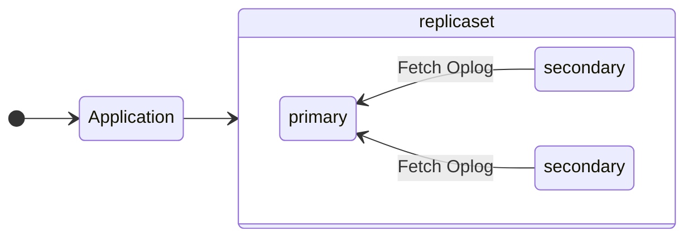

## Introducing Replicasets

The way to achieve fault tolerance in MongoDB is through the use of `replica sets`. 



Two or more `secondary` nodes along with a `primary` node forms a replica set. Application makes all the read/write calls to the primary node which propagate all the write requests synchronously or asynchronously to the secondary nodes. 

The Secondary nodes fetches the data via Oplog pull from Primary or other nodes. 

<!--truncate-->

The Primary node is responsible for all the writes and reads. The secondary nodes can be utilized for reads via [`setSecondaryOk`](https://docs.mongodb.com/manual/reference/method/Mongo.setSecondaryOk/) or [`readPreference`](https://docs.mongodb.com/manual/reference/read-preference/). 

## Understanding Oplog

When the application performs a write, the primary node applies the write to the database like a standalone. 

The difference between Replicaset write and standalone write is that replica set nodes have an `OpObserver` that inserts a document to the **oplog** whenever a write to the database happens, describing the write. The **oplog** is a capped collection called `oplog.rs` in the `local` database. 

For every operation performed in a write, the primary node inserts a document into the oplog. The oplog is a capped collection, which means that it has a maximum size. When the oplog reaches its maximum size, MongoDB removes the oldest entries to make room for new entries. 

For a write which performs create collection and insert, there are two oplog entries created one for `create` collection and another for `insert`.

```cpp
// mongod_main.cpp
setUpObservers(service);
```

```cpp

//op_observer_registry.h
void onCreateCollection(OperationContext* const opCtx,
                            const CollectionPtr& coll,
                            const NamespaceString& collectionName,
                            const CollectionOptions& options,
                            const BSONObj& idIndex,
                            const OplogSlot& createOpTime,
                            bool fromMigrate) override {
        ReservedTimes times{opCtx};
        for (auto& o : _observers)
            o->onCreateCollection(
                opCtx, coll, collectionName, options, idIndex, createOpTime, fromMigrate);
    }

 using OpObserver::onInserts;
    void onInserts(OperationContext* const opCtx,
                   const NamespaceString& nss,
                   const UUID& uuid,
                   std::vector<InsertStatement>::const_iterator begin,
                   std::vector<InsertStatement>::const_iterator end,
                   bool fromMigrate) override {
        ReservedTimes times{opCtx};
        for (auto& o : _observers)
            o->onInserts(opCtx, nss, uuid, begin, end, fromMigrate);
    }
```

## Understanding Write Concern

Write concern is a way to ensure that the write operations are propagated to the secondary nodes.

### Default Write Concern

If a write operation does not explicitly specify a write concern, the server will use a default
write concern. 

This default write concern will be defined by either the

- **Cluster-Wide write concern**, explicitly set by the user 
or
- **Implicit Default write concern**, implicitly set by the server based on replica set configuration.

#### Cluster-Wide Write Concern

The cluster-wide write concern is set by the user using the [`setDefaultRWConcern`](https://docs.mongodb.com/manual/reference/command/setDefaultRWConcern/) command. Setting the cluster-wide write concern will cause the implicit default write concern not to take effect.

On a sharded cluster, the cluster-wide write concern is set on the config server. On a replica set, the cluster-wide write concern is set on the primary node. The below code snippets shows how the cluster-wide write concern is set on the primary node and stored on the config node. 

```javascript
db.adminCommand(
  {
    setDefaultRWConcern : 1,
    defaultReadConcern: { <read concern> },
    defaultWriteConcern: { <write concern> },
    writeConcern: { <write concern> },
    comment: <any>
  }
)
```

```cpp
//cluster_rwc_defaults_commands.cpp 
class ClusterSetDefaultRWConcernCommand : public BasicCommand {
public:
    ClusterSetDefaultRWConcernCommand() : BasicCommand("setDefaultRWConcern") {}

    bool run(OperationContext* opCtx,
             const DatabaseName&,
             const BSONObj& cmdObj,
             BSONObjBuilder& result) override {
        auto configShard = Grid::get(opCtx)->shardRegistry()->getConfigShard();
        auto cmdResponse = uassertStatusOK(configShard->runCommandWithFixedRetryAttempts(
            opCtx,
            ReadPreferenceSetting(ReadPreference::PrimaryOnly),
            NamespaceString::kAdminDb.toString(),
            CommandHelpers::appendMajorityWriteConcern(
                CommandHelpers::filterCommandRequestForPassthrough(cmdObj),
                opCtx->getWriteConcern()),
            Shard::RetryPolicy::kNotIdempotent));

        uassertStatusOK(cmdResponse.commandStatus);
        uassertStatusOK(cmdResponse.writeConcernStatus);

        // Quickly pick up the new defaults by setting them in the cache.
        auto newDefaults = RWConcernDefault::parse(IDLParserContext("ClusterSetDefaultRWConcern"),
                                                   cmdResponse.response);
        if (auto optWC = newDefaults.getDefaultWriteConcern()) {
            if (optWC->hasCustomWriteMode()) {
                LOGV2_WARNING(
                    6081700,
                    "A custom write concern is being set as the default write concern in a sharded "
                    "cluster. This set is unchecked, but if the custom write concern does not "
                    "exist on all shards in the cluster, errors will occur upon writes",
                    "customWriteConcern"_attr = stdx::get<std::string>(optWC->w));
            }
        }
        ReadWriteConcernDefaults::get(opCtx).setDefault(opCtx, std::move(newDefaults));

        CommandHelpers::filterCommandReplyForPassthrough(cmdResponse.response, &result);
        return true;
    }
```

#### Implicit default write concern

The implicit default write concern is calculated and set on startup by the server based on the replica set configuration. The server will set the implicit default write concern to the following:

- If the replica set has a single node, the implicit default write concern is `{ w: 1 }`
- For most of the cases the implicit default write concern is `{ w: "majority" }`

##### PSA 

`implicitDefaultWriteConcern = if ((#arbiters > 0) AND (#non-arbiters <= majority(#voting nodes)) then {w:1} else {w:majority}`

Implicit default to a value that the set can satisfy in the event of one data-bearing node
going down. That is, the number of data-bearing nodes must be strictly greater than the majority
of voting nodes for the set to set `{w: "majority"}`.

For example, if we have a PSA replica set, and the secondary goes down, the primary cannot
successfully acknowledge a majority write as the majority for the set is two nodes. However, the
primary will remain primary with the arbiter's vote. In this case, the DWCF will have preemptively
set the IDWC to `{w: 1}` so the user can still perform writes to the replica set.

##### Sharded Cluster 

For a sharded cluster, the implicit default write concern is set to `{ w: "majority" }` if the
cluster has a majority of voting nodes. Otherwise, the implicit default write concern is set to
`{ w: 1 }`.

## Understanding Secondary Nodes Operations 

The secondary nodes will choose the node with the highest `lastApplied` timestamp as the** sync source**. The secondary nodes will then **pull** the oplog entries from the sync source and apply them to its own oplog.

The Secondary will also keep its **sync source** uptodate with its progress, this helps primary satisfy the read concern. 

Here are the high level steps performed to select and probe the sync source

1. `TopologyCoordinator` checks if user requested a specific sync source using `replSetSyncFrom` command. If so, it will use that sync source. Otherwise, it will use the sync source from the last successful election.
2. Check if **chaining** is disabled. If so, the secondary will always use primary as its sync source 

```cpp
 if (chainingPreference == ChainingPreference::kUseConfiguration &&
        !_rsConfig.isChainingAllowed()) {
        if (_currentPrimaryIndex == -1) {
            LOG(1) << "Cannot select a sync source because chaining is"
                      " not allowed and primary is unknown/down";
            _syncSource = HostAndPort();
            return _syncSource;
        } else if (_memberIsBlacklisted(*_currentPrimaryMember(), now)) {
            LOG(1) << "Cannot select a sync source because chaining is not allowed and primary "
                      "member is blacklisted: "
                   << _currentPrimaryMember()->getHostAndPort();
            _syncSource = HostAndPort();
            return _syncSource;

```

3. Fetch latest opTime. Do not sync from a node where newest oplog is more than `maxSyncSourceLagSecs`

```cpp
    if (_currentPrimaryIndex != -1) {
        OpTime primaryOpTime = _memberData.at(_currentPrimaryIndex).getHeartbeatAppliedOpTime();

        // Check if primaryOpTime is still close to 0 because we haven't received
        // our first heartbeat from a new primary yet.
        unsigned int maxLag =
            static_cast<unsigned int>(durationCount<Seconds>(_options.maxSyncSourceLagSecs));
        if (primaryOpTime.getSecs() >= maxLag) {
            oldestSyncOpTime =
                OpTime(Timestamp(primaryOpTime.getSecs() - maxLag, 0), primaryOpTime.getTerm());
        }
    }
```
4. Loop through all the nodes and find the closest node which satisfies the condition 

```cpp
HostAndPort TopologyCoordinator::chooseNewSyncSource(Date_t now,
                                                     const OpTime& lastOpTimeFetched,
                                                     ChainingPreference chainingPreference) {

...
...
...
```

### Oplog Fetching 

The secondary node will fetch the oplog entries from the sync source to keep its data syncronized. The entire implementation of the oplog fetching is in the `OplogFetcher` class which runs in a separate thread and communicates via a dedicated client connection.

```cpp

void OplogFetcher::setConnection(std::unique_ptr<DBClientConnection>&& _connectedClient) {
    // Can only call this once, before startup.
    invariant(!_conn);
    _conn = std::move(_connectedClient);
}

```

