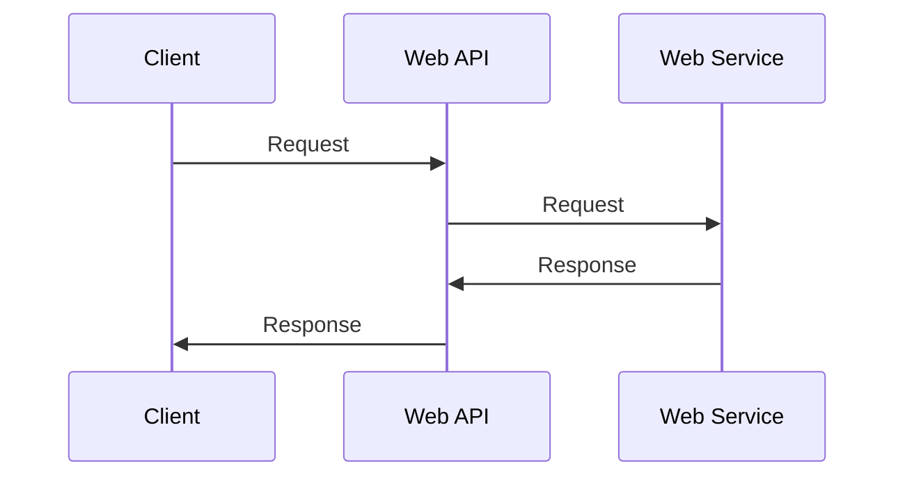

## Introduction to REST API 

REST (Representational State Transfer) is an architectural style for building distributed systems. A Web API conforms to the REST architectural style, called RESTful Web API. 

REST APIs are stateless, client-server, cacheable, layered systems designed around resources. The set of resources is known as the REST API's _resource model_

<!--truncate-->



REST APIs are one of the most common and fundamental ways to expose data and functionality as web services. REST APIs use HTTP requests to GET, PUT, POST, and DELETE data. 

An adequately designed REST API should be easy to understand, use, and evolve over time. It will help clients and browser apps consume the API more efficiently. 

Before designing and developing a REST API, we need to seek answers to the following questions:

- What are URI Paths? Structure of URI Path segments? 
- When to use plural nouns or verbs for URI Path segments?
- What is the HTTP response status code, and how to use it in a specific scenario? 
- How to map non-CRUD operations to HTTP methods? 

## Understanding Uniform Resource Identifier (URI)

REST APIs use Uniform Resource Identifiers (URIs) to identify resources. A resource is any information that can be named. Resources are separated by forward slashes (/). A good URI should be short, easy to remember, and should give the user an idea about the resource.

### URI Format

The URI format is as follows:

URI = scheme "://" host [ ":" port ] [ "/" path ] [ "?" query ] [ "#" fragment ]

```http request
http://<domain-name>/<resource-name>/<resource-id>
```

### URI Resource Model 

Header|Description
------|-----------
Document | A document resource is similar to database record or instance of an object. It is a single resource that can be retrieved, created, updated, or deleted. <br/> For example, information about a blog author is a document resource. <br/> `http://api.blog.com/authors/vishal-gandhi`
Collection | A collection resource is a server-managed directory of resources. <br/> For example, a list of blog authors is a collection resource. <br/> `http://api.blog.com/authors`
Store | A store is a repository which is managed by client. Using store resource client can create, update, delete and retrieve documents. <br/> `http://api.blog.com/store/authors/vishal-gandhi`
Controller | A controller resource models a procedure concept. It is a resource that represents a procedure that can be invoked. A controller resource is a collection resource that supports the POST method. The POST method is used to invoke the controller resource. The controller resource can be used to model a procedure that can be invoked. For example, the following URI models a controller resource that represents a procedure that can be invoked to send an email: <br/> ```POST /api.blog.com/email/email/send``` <br/> ``` {Collection}/{Store}/{Document}/{Controller} ```

## REST API Design Rules  

### URI 

- **Rule : Forward Slash (/) is used to separate resources in the URI and indicate a hierarchical relationship**

A trailing forward slash (/) is not required as the last character of a URI. Many web servers automatically redirect requests with a trailing forward slash to the same URI without the trailing forward slash.


- **Rule : Use plural nouns for URI Path segments that represent collections or resources**

- **Rule : Use HTTP Methods to Perform Operations on Resources**

HTTP methods are used to perform operations on resources. The following table lists the HTTP methods and their corresponding operations:

| HTTP Method | Operation |
| ----------- | --------- |
| GET         | Retrieve a resource |
| POST        | Create a resource |
| PUT         | Update a resource |
| DELETE      | Delete a resource |
| PATCH       | Update a resource with Partial data |


```JS
const express = require('express');
const bodyParser = require('body-parser');
const app = express();
const port = 3000;

app.use(bodyParser.json());

app.get('/authors', (req, res) => {

res.send('Authors List'); 

//get author list from Sql lite backend 

res.json(authors);

});
  
app.post('/authors', (req, res) => {
  
  res.send('Add Author');

  //add author to Sql lite backend

  res.json(author);

});


//update an author

app.put('/authors/:id', (req, res) => {

  res.send('Update Author');

  res.json(author);

});

//delete an author

app.delete('/authors/:id', (req, res) => {

  res.send('Delete Author');

  res.json(author);

});

app.patch('/authors/:id', (req, res) => {

  res.send('Update Author Email');

  res.json(author);

}); 


app.listen(port, () => {
  console.log(`Blog Example app listening at http://localhost:${port}`);
});
```

- **Rule : Hyphen (-) is used to separate words in URI Path**

Hyphens (-) are used to separate words in URI path. For example, the URI path for a resource named _user-profile_ is _/user-profile_.

- **Rule : Underscore (_) is not used in URI**

Underscores (_) are not used in URI path due to text editors and browsers depending on the font hide the underscore by underlining the text.

- **Rule : File Extensions are not used in URI**

A REST API should not use file extensions in the URI. For example, the URI path for a resource named _user-profile_ is _/user-profile_ and not _/user-profile.json_.

- **Rule : If API Provides a developer portal then it should be accessible via a consistent subdomain**

If an API provides a developer portal, then the developer portal should be accessible via a consistent subdomain. For example, the developer portal for the weather API is accessible via _developer.blog.api.com_.

- **Rule : Lowercase letters are preferred in URI**

Lowercase letters are preferred in URI. For example, the URI path for a resource named _user-profile_ is _/user-profile_ and not _/User-Profile_.

- **Rule: Use a Verb or verb phrase for Controller Names**

```http request
POST /api.blog.com/email/email/send
```

- **Rule: CRUD function names should not be used in the URI**

The following table lists the CRUD functions and their corresponding HTTP methods:

| CRUD Function | HTTP Method |
| ------------- | ----------- |
| Create        | POST        |
| Read          | GET         |
| Update        | PUT         |
| Delete        | DELETE      |

e.g. Preferred API Interface

```http request
PUT /api.blog.com/authors/vishal-gandhi
```

Anti pattern 

```http request
DELETE /deleteusers/abc/
```

- **Rule: New URIs should be introduced new concepts**

A REST API should introduce new URIs for new concepts. For example, the following table lists the URIs for a user resource:

| URI | Description |
| --- | ----------- |
| /authors | Returns a list of authors |
| /authors/vishalgandhi | Returns the author details |
| /authors/vishalgandhi/books | Returns a list of articles written by the author 

- **Rule: JSON should be well formed and supported for resource representation**

- **Rule: Add Versioning at the start of the URI**

```http request

http://api.blog.com/v1/authors/vishal-gandhi

```


### HTTP Methods

- **Rule: GET must be used to retrieve representation of a resource**

- **Rule: Head must be used to retrieve metadata of a resource and response headers**

- **Rule: PUT must be used to both insert and update a resource**

- **Rule: POST must be used to create a resource**

- **Rule: POST must be used to execute a controller**

- **Rule: DELETE must be used to delete a resource**

- **Rule: OPTIONS must be used to retrieve supported HTTP methods**

- **Rule : Use HTTP Status Codes to Indicate Response Status**

HTTP status codes are used to indicate the response status of an HTTP request. The following table lists the HTTP status codes and their corresponding meanings:

| HTTP Status Code | Meaning |
| ---------------- | ------- |
| 200 OK           | The request was successful |
| 201 Created      | The request was successful and a resource was created |
| 204 No Content   | The request was successful but there is no representation to return |
| 400 Bad Request  | The request could not be understood by the server |
| 401 Unauthorized | The request requires user authentication |
| 403 Forbidden    | The server understood the request, but is refusing to fulfill it |
| 404 Not Found    | The server has not found anything matching the Request-URI |
| 405 Method Not Allowed | The method specified in the Request-Line is not allowed for the resource identified by the Request-URI |
| 500 Internal Server Error | The server encountered an unexpected condition which prevented it from fulfilling the request |

The approaches and best practices of REST API outlined in this blog article will help anyone follow consistent guidelines for designing and developing REST APIs. 

## References

- [Roy Fielding's Dissertation](https://www.ics.uci.edu/~fielding/pubs/dissertation/rest_arch_style.htm)
- [What is REST](https://restfulapi.net/)
- [REST API Design Rulebook](https://www.amazon.in/REST-API-Design-Rulebook-Consistent-ebook/dp/B005XE5A7Q/ref=sr_1_1?keywords=rest+api+design+rulebook&qid=1665926194&qu=eyJxc2MiOiIwLjQzIiwicXNhIjoiMC41NCIsInFzcCI6IjAuMDAifQ%3D%3D&sprefix=REST+API+D%2Caps%2C194&sr=8-1)
- [Hands-on RESTful API Design Patterns](https://www.amazon.in/Hands-RESTful-Design-Patterns-Practices-ebook/dp/B07BJL399D/ref=sr_1_2?keywords=rest+api+design+rulebook&qid=1665926194&qu=eyJxc2MiOiIwLjQzIiwicXNhIjoiMC41NCIsInFzcCI6IjAuMDAifQ%3D%3D&sprefix=REST+API+D%2Caps%2C194&sr=8-2)


<!-- Change HTTP Codes to below 

100 and above are for "Information". You rarely use them directly. Responses with these status codes cannot have a body.
200 and above are for "Successful" responses. These are the ones you would use the most.
200 is the default status code, which means everything was "OK".
Another example would be 201, "Created". It is commonly used after creating a new record in the database.
A special case is 204, "No Content". This response is used when there is no content to return to the client, and so the response must not have a body.
300 and above are for "Redirection". Responses with these status codes may or may not have a body, except for 304, "Not Modified", which must not have one.
400 and above are for "Client error" responses. These are the second type you would probably use the most.
An example is 404, for a "Not Found" response.
For generic errors from the client, you can just use 400.
500 and above are for server errors. You almost never use them directly. When something goes wrong at some part in your application code, or server, it will automatically return one of these status codes. -->


