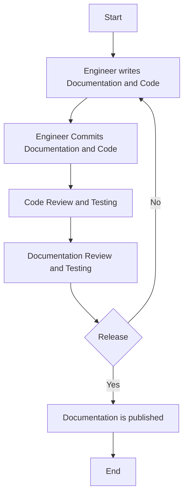

Documentation is the most critical activity of any product development. The engineer and user experience improve when there is up-to-date Documentation. Most often, in organizations and products, Documentation is an afterthought, and this is not a good practice. If we want more engineers to contribute to the product, Documentation should be considered as code and part of the product development. Engineers should be encouraged to write Documentation before writing the source code.

<!--truncate-->

 In many organizations, Documentation is everywhere, but it can be challenging to find. It is often written in various formats, and it is sometimes unclear who is responsible for it. It also needs to be clarified how to contribute to it. Confidence in Documentation could be higher if engineers spent more time writing; there is more incentive to write, and setting up a culture to write docs as part of engineering workflow contributes to Engineer Productivity which is a crucial metric for any organization.

The product engineering teams must identify workflows to integrate Documentation into the existing process to solve the challenges listed below.
* The Documentation is not part of the codebase
* The Documentation is not part of the CI/CD pipeline
* The method of writing Documentation is not integrated into the engineering workflow
* The Documentation is not reviewed and tested
* The Documentation is written in a separate tool and is not version controlled

Documentation will never be part of engineering culture unless integrated into the codebase and workflow.

## What is Docs as Code?

* Store the source file version of Documentation in a version control system like Git
* Automatically build doc artifacts 
* Publish artifacts without human intervention

## Why Docs as Code?

* The Documentation evolves with the code. The flowchart, System Architecture and other diagrams will be up-to-date as the code changes

* Long release cycles may result in logic or flowchart being forgotten or outdated

* Consistency is critical for the adoption of Docs as a code. Teams can collaborate on the Documentation and can ensure that the Documentation is consistent across the product

* Collaboration across product teams is the critical piece of why Documentation should be considered a code

* Documentation can be reviewed and approved by the team members

* Centralized Internal Documentation framework and familiar structured Documentation for all the products 

* Track Documentation mistakes as bugs

* Documentation can be versioned, tested, and tracked

* Manage the complexity around the documentation process

* Visualize the Documentation in the form of diagrams, flowcharts, and images

* Engineer can use other tools to model dependencies. For example, the Product team can use Mermaid  to model the flowchart, system architecture, class diagram, and sequence diagrams

* Avoid effort to redo the Documentation when a team member leaves the organization. 

* The product team can automate Workflows can be automated to generate the Documentation
  
* Makes Documentation standout with [Markdown](https://www.markdownguide.org/)

  :::info
  Markdown is a simple, lightweight markup language that is easy to learn and use for plain text formatting and conversion to HTML and many other formats using a tool. Markdown is often used to format readme files, write messages in online discussion forums, and create rich text using a plain text editor.
  :::

  
## Types of Documentation 

The most common types of Documentation for every product are:

- Long-form 
  - FAQs, User Guides, Tutorials, How-to Guides, etc.

- Functional 
  - REST API Documentation, SDK Documentation, etc.

## How to do Docs as a Code?

* Version your Documentation. Just as you version your code, you should version your Documentation. Versioning allows tracking changes and rollbacks to previous versions if necessary.
* Integrate Documentation with CI/CD pipeline. CI/CD Integration will allow you to automate the process of generating Documentation and publishing it to a central location
* Start with Proof of Concept and extend to all the products gradually  
* Choose a static site generator (Documentation Tool) that can be integrated with the CI/CD pipeline

## Docs As Code Tools 

- Static Site Generators 
  They are used for Long form documentation. Allows integration of diagrams, flowcharts, images, etc.

  - [Docusaurus](http://docusaurus.io), [Hugo](https://gohugo.io), [Gatsby](https://www.gatsbyjs.com), [Jekyll](https://jekyllrb.com), [MkDocs](https://www.mkdocs.org) etc.

- Diagram as a code
 
  Allows creating diagrams, flowcharts, etc., in a code format. Think of documenting and visualizing a complex system architecture in a code format.

  * [Mermaid](https://mermaid-js.github.io/mermaid/#/), [PlantUML](https://plantuml.com/), [Graphviz](https://graphviz.org/), [Draw.io](https://www.draw.io/), [mingrammer/Diagrams](https://diagrams.mingrammer.com)
- Source code-based document generators 
  * [Sphinx](https://www.sphinx-doc.org/en/master/)
- System documentation generators
  * [ronn](https://github.com/rtomayko/ronn)

## Final Thoughts

Everything(Infrastructure, Monitoring, Code, Containers, Documentation) as a code is already a reality. For some organizations, the shift to treating Documentation as a code is a complex overhaul of expectations, attitudes, processes, and toolsets. Once implemented, it will vastly improve the engineer and user experience. For open-source projects, it is even more essential to have good Documentation. It is a great way to attract new contributors and users. 

## References

- [DocOps](https://www.writethedocs.org/guide/doc-ops/#what-is-docops-anyway)
