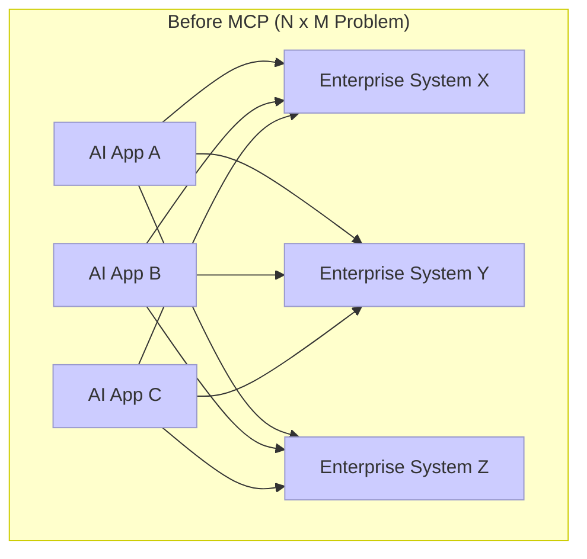
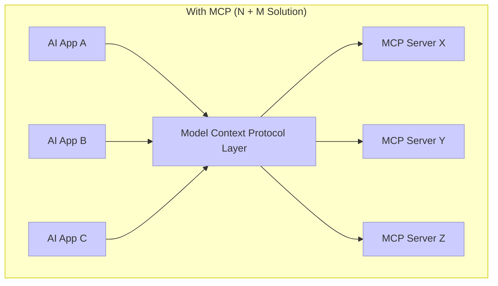
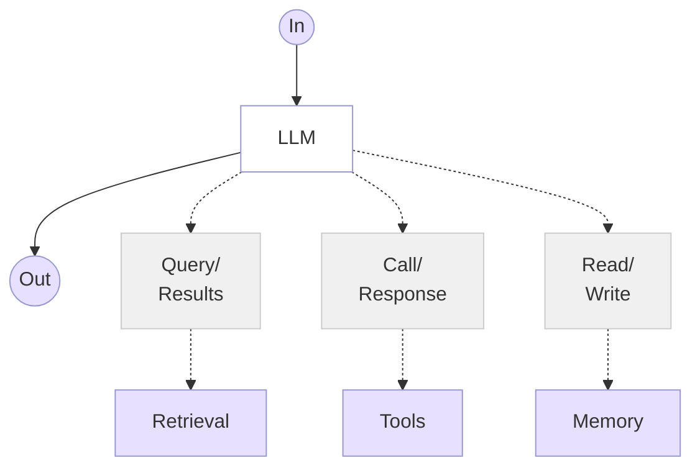

[Vishal Gandhi](https://github.com/ivishalgandhi)
How Open Standardized protocols like the Anthropic Model Context Protocol (MCP) can transform enterprise AI integration from a complex matrix of custom connections to a more manageable ecosystem that accelerates innovation and reduces technical debt.

<!--truncate-->

## Introduction

As enterprises race to integrate AI capabilities into their exisitng and new technology stacks, they will quickly encounter a critical scaling problem: the N×M integration challenge. For every AI application (N) that needs to connect with enterprise data sources and tools (M), a custom integration must be built. This approach creates an exponentially growing matrix of connections that becomes increasingly difficult to maintain, secure, and govern.

Standardized protocols are emerging to address this enterprise integration challenge. One notable example is the Model Context Protocol (MCP), an open protocol introduced by Anthropic. Understanding how these open protocols can impact the AI integration strategy could be the difference between creating sustainable innovation, integration, and avoiding technical debt.

In this article, I'll explore how standardized integration protocols like MCP can transform enterprise AI integration, the strategic advantages they offer. While we'll use MCP as our primary example due to its current momentum, the principles discussed apply broadly to standardized AI integration approaches.

## Understanding the Model Context Protocol (MCP)

MCP is an open protocol that standardizes how AI applications interact with external systems through three primary interfaces: Tools, Resources, and Prompts. Think of it as doing for AI what APIs did for web applications or what the Language Server Protocol (LSP) did for code editors.



The diagram above illustrates the integration challenge enterprises face without MCP. Each AI application requires custom integration with each enterprise system, creating a complex web of connections that grows exponentially as you add more applications or systems.



With MCP, AI applications connect to a standardized protocol layer, which then interfaces with enterprise systems through MCP-compatible servers. This approach dramatically reduces integration complexity and creates a more maintainable architecture.

### The Three Pillars of MCP

MCP's functionality is delivered through three primary interfaces:

1. **Tools**: Model-controlled actions that the LLM can invoke when needed. Examples include reading/writing data, calling APIs, or updating databases. These are the AI's way of taking action in your enterprise systems.
2. **Resources**: Application-controlled data that the client application decides how to use. Examples include files, images, JSON data, or dynamic data structures. Resources support notifications for updates, making them ideal for real-time data integration.
3. **Prompts**: User-controlled templates for common interactions, often manifested as slash commands or predefined queries. These allow for standardized ways to interact with enterprise systems.

This separation of concerns allows for a more robust and flexible integration architecture, giving appropriate control to different parts of the system.

## Strategic Benefits of open protocols like MCP for Enterprise AI

### 1. Reduced Integration Complexity and Technical Debt

By transforming the N×M integration problem into an N+M solution, MCP significantly reduces the number of custom integrations required. This means:
- Lower development costs for connecting AI applications to enterprise systems
- Reduced maintenance burden as each integration point follows a standard protocol
- Faster time-to-market for new AI capabilities
- Reusable Utilize MCP servers in marketplace for multiple AI applications

### 2. Enhanced Governance and Security

Standardizing AI integrations through MCP creates natural control points for governance and security:
- Centralized authentication and authorization through OAuth 2.0 integration
- Consistent audit trails across AI interactions with enterprise systems
- Standardized security practices that can be applied uniformly

### 3. Team Specialization and Efficiency

MCP enables a clear separation of concerns that allows teams to specialize:
- AI teams can focus on model capabilities without needing deep knowledge of every enterprise system
- System owners can create MCP servers for their systems once, then support multiple AI initiatives
- Enterprise architects can design cleaner integration patterns with well-defined boundaries

### 4. Future-Proofing AI Investments

As an open protocol and standard, MCP provides a level of future-proofing for enterprise AI investments:
- Vendor flexibility as any MCP-compatible AI model can work with your MCP servers
- Incremental adoption allowing gradual migration of systems to MCP compatibility
- Ecosystem benefits as more vendors and open-source projects adopt the standard

## Building Effective AI Agents with MCP

**MCP** provides a standardized way to augment **LLMs** with external capabilities



This architecture shows how MCP standardizes the connections between an LLM and its augmentation capabilities:
- **Retrieval**: Query enterprise knowledge sources and receive results
- **Tools**: Call enterprise APIs and services and process responses
- **Memory**: Read from and write to persistent storage

MCP provides the standardized protocol layer that enables these connections to be built once and reused across different agent implementations.

## Real-world Enterprise Applications

Standardized integration protocols like MCP can address several common enterprise challenges:

### Knowledge Management

Enterprises often struggle with fragmented information across multiple systems:
- Document management systems
- Internal wikis and knowledge bases
- Project management tools

Standardized protocols allow AI applications to search and retrieve information across these systems through a single interface, enabling employees to find answers quickly without needing to know where the information is stored.

### Customer Service

Customer data typically exists in multiple systems:
- CRM platforms
- Support ticket systems
- Order management systems

With standardized integration, AI assistants can access comprehensive customer context to provide more personalized support and recommendations.

### Software Development

Developers use numerous tools that could benefit from standardized AI integration:
- Version control systems
- Issue trackers
- CI/CD pipelines
- Document Generation

Standardized protocols enable AI coding assistants to access relevant context across these systems, helping developers write better code more efficiently.

### Data Analysis

Data analysts and business intelligence teams work with multiple data sources:
- Data warehouses
- Business intelligence platforms
- Visualization tools
- Reporting systems

Standardized integration allows AI tools to help analyze data across these systems, generating insights and automating routine analysis tasks.

## Enterprise AI Integration Challenges

Consider a typical enterprise scenario where applications are required to be LLM enabled and these applications need to access various internal systems:

### The Challenge

Without standardized protocols, each new AI application requires custom integration work:
- Duplicated development effort as each team builds similar connectors or extensions
- Security and compliance reviews that must be repeated for each integration
- Maintenance overhead when underlying systems change
- Knowledge silos where only specific teams understand certain integrations
- Inconsistent access patterns across different applications

### A Standardized Approach

By implementing standardized integration protocols, enterprises can:
1. Create a central integration layer that handles authentication, access control, and data formatting
2. Develop standard connectors for commonly used systems
3. Establish governance processes for managing access to enterprise data
4. Monitor and audit all AI interactions with enterprise systems

### Expected Benefits

Organizations that adopt standardized integration approaches typically see:
- Faster development cycles for new AI applications
- Reduced security and compliance overhead
- Lower maintenance costs for integrations
- Improved visibility into how AI systems access enterprise data
- Greater flexibility to adopt new AI technologies as they emerge

## Future Directions for MCP

The MCP ecosystem is rapidly evolving, with several developments particularly relevant to enterprise adoption:

### Remote Servers & OAuth 2.0

Future MCP versions will support remote servers accessible via HTTP(S) using Server-Sent Events (SSE) and authenticated via OAuth 2.0. This will enable:
- Cross-organizational MCP servers that can be securely accessed by partners or customers
- Cloud-hosted MCP services that can be consumed by on-premises applications
- Enterprise-grade authentication and authorization integrated with existing identity providers

### MCP Registry

Just as enterprises maintain centralized API catalogs and management platforms today, there will be a growing need for private MCP registries within organizations. A centralized registry of available MCP servers will enable dynamic discovery of capabilities, allowing AI applications to find and use relevant tools and resources without prior configuration.

For enterprises, implementing a private MCP registry could provide:
- Internal marketplace of AI capabilities exposed through MCP, similar to an API portal
- Self-service AI integration for business units and development teams
- Governance and access control for sensitive enterprise systems
- Metrics and analytics on MCP server usage and performance
- Version management for MCP servers as they evolve
- Trust and Verification of MCP servers and tools by enterprises

This approach mirrors the successful patterns established with enterprise API management, where centralized discovery, governance, and monitoring have proven essential for scaling integration efforts.

As MCP is still maturing, widespread adoption of registries depends on community and vendor support. Enterprises may need to invest in training or infrastructure to fully leverage these tools.

### .well-known Endpoints

```
.well-known
```

Standardized discovery mechanisms through .well-known endpoints will allow domains to publish metadata about their official MCP servers, tools, and resources. This will enable more seamless integration between enterprise systems and AI applications.

## Conclusion

Standardized protocols for AI integration represent a significant advancement in enterprise AI strategy, transforming a complex matrix of custom connections into a more manageable ecosystem that accelerates innovation and reduces technical debt.

For enterprises, adopting standardized integration approaches based on open protocols like MCP offers strategic opportunities to:
1. Reduce the complexity and cost of integrating AI into enterprise systems
2. Accelerate AI adoption across the organization
3. Improve governance and security of AI interactions with enterprise data
4. Future-proof AI investments through open standards

As AI becomes increasingly central to enterprise operations, the organizations that can integrate it most effectively with their existing systems will gain significant competitive advantage. While MCP is one promising approach gaining traction today, the field is evolving rapidly. The key is to embrace standardization principles that align with your enterprise architecture strategy, whether through MCP or other emerging protocols.

What matters most is moving from fragmented, custom integrations toward a more standardized approach that can scale with your AI ambitions. By doing so, the enterprise will be able to leverage AI more effectively across and still maintain the flexibility to adapt as integration standards continue to evolve.

## Citations

1. [Model Context Protocol GitHub Repository](https://github.com/modelcontextprotocol)
2. [Anthropic MCP Documentation](https://docs.anthropic.com/en/docs/agents-and-tools/mcp)
3. [Building Effective Agents](https://www.anthropic.com/news/building-effective-agents)
4. [ClickHouse MCP Server Implementation](https://github.com/ClickHouse/mcp-clickhouse)
