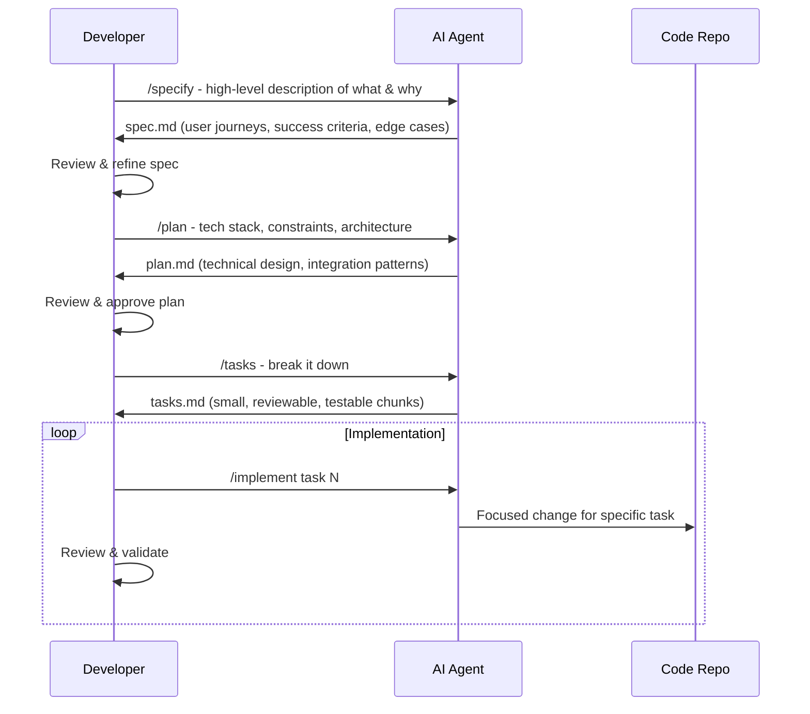

AI agents can generate hundreds of lines of correct, well-tested code. They cannot tell you whether it's the *right* code — and vibe coding is quietly accumulating the kind of reliability debt you won't see until an incident.

I spent a lot of months during 2025 doing what most engineers were doing: throwing prompts at Claude or Windsurf's Cascade, reviewing the output, tweaking, repeating. It felt productive. Until the day I tried to add a feature to a codebase I'd largely handed off to AI agents, and realized I had no real mental model of what had been built. The code was clean. The tests passed. But I couldn't confidently explain *why* it worked the way it did — and as someone responsible for reliability at scale, that's not a position I can afford to be in.

That experience pushed me toward spec-driven development (SDD), and it's genuinely changed how I work with AI agents. This post is my attempt to document what I've learned — the what, the why, and a real example of how I've applied it.

<!--truncate-->

## What Is Spec-Driven Development?

Before we get into workflow mechanics, let's clear up what a "spec" actually is in this context — because it's not a product requirements doc, and it's definitely not just a prompt.

A proper specification explicitly defines the *external behavior* of the software you're building: input/output mappings, preconditions and postconditions, invariants, constraints, interface types, integration contracts, and sequential logic. In the past, specs were written in highly formalized machine-readable formats. Today, with LLMs, we can describe them in structured natural language — but the underlying purpose hasn't changed.

Think of the distinction like this: a PRD says "users should be able to create boards." A spec says "when a user creates a board, it must have a unique name within their workspace, persist to the database before returning success, and emit a `board.created` event for downstream consumers." One guides product decisions; the other drives code generation.

SDD as a development paradigm puts this specification at the center. Instead of: `idea → prompts → AI generates code → hope for the best`, the flow becomes: `idea → spec → plan → tasks → AI generates code grounded in explicit intent`.

The key insight from [GitHub's Spec Kit](https://github.com/github/spec-kit) team captures it well: *"We're moving from 'code is the source of truth' to 'intent is the source of truth.'"* When specs drive generation, the AI knows what to build, how to build it, and in what sequence — rather than making thousands of small guesses that individually seem reasonable but collectively drift from what you actually wanted.

## Why It Matters More with Agentic Tools

Early AI coding assistants like the original GitHub Copilot operated on short context windows — they'd generate a function or a snippet. The risk of drift was limited because the human was still steering every few lines.

Modern agentic tools are different. Windsurf's Cascade can hold your entire codebase in context and autonomously make changes across dozens of files. Claude Code can plan, implement, and self-correct over extended sessions. That autonomy is enormously powerful — and enormously risky without guardrails.

Without a spec, a vague prompt like "add card assignment to the Kanban board" forces the agent to guess at potentially hundreds of unstated requirements: Does assignment notify users? Is it exclusive (one assignee) or shared? Does it respect role permissions? What happens to cards when a user is deleted? The agent will make reasonable assumptions, some will be wrong, and you often won't discover which ones until you're deep into testing.

A spec answers those questions upfront. The agent stops guessing and starts executing.

## SDD vs. Vibe Coding vs. Waterfall

I've seen two common misconceptions about SDD and want to address them directly.

**"Isn't this just vibe coding with extra steps?"** No. Vibe coding is spontaneous and haphazard by design — the magic is the low friction. SDD adds a deliberate planning phase before execution begins, separating *design* from *implementation*. The coding is still AI-assisted and fast; you're just not winging the design part anymore.

**"Isn't this just waterfall development repackaged?"** This one's worth taking seriously. The concern is valid — heavy upfront requirements gathering is exactly what agile development was a reaction against. But there's a crucial difference: in waterfall, specs are locked upfront and changing them is expensive. In SDD, specs are versioned Markdown files that you update iteratively as you learn. You don't move to implementation until the spec is right, but you can update the spec at any point and regenerate downstream artifacts. The feedback cycle is short, not long.

As Thoughtworks put it in their [2025 SDD analysis](https://www.thoughtworks.com/insights/blog/agile-engineering-practices/spec-driven-development-unpacking-2025-new-engineering-practices): *"The problem with waterfall is excessively long feedback cycles. SDD's problem isn't that — it's about bringing serious requirements analysis and human-in-the-loop governance into a world where vibe coding is too fast, spontaneous, and haphazard."*

## What Makes a Good Spec?

This is where most people underinvest. Here's what I've found separates specs that actually improve AI output from specs that are just fancy prompts:

**Use domain-oriented language.** Describe business intent, not implementation. Don't write "call the `/api/cards` endpoint" — write "when a user moves a card, the board state must reflect the change within 500ms for all active session participants."

**Structure with Given/When/Then or EARS notation.** Given/When/Then comes from BDD and maps cleanly to test cases. EARS (Easy Approach to Requirements Syntax) is a complementary format that structures requirements as "WHEN [trigger] the [system] SHALL [behavior]" — more precise for system-level constraints and concurrency rules. Kiro, Amazon's agentic IDE, uses EARS natively to convert natural language prompts into verifiable requirements. Either format beats prose — the structure forces you to be explicit about preconditions, triggering actions, and expected outcomes in ways a paragraph cannot.

**Define acceptance criteria per feature.** Given/When/Then describes behavior; acceptance criteria define *done*. For every feature in your spec, include an explicit list of conditions that must hold for the implementation to be considered correct — not just "it works" but "a card cannot be moved to a deleted column," "assignment is exclusive to one member," "the board reflects the change within 500ms." AC gives the agent a concrete completion target, prevents scope creep during implementation, and becomes the basis for generated tests. Without it, "done" is whatever the agent decides it is.

**Cover edge cases explicitly.** AI agents are excellent at the happy path. They're mediocre at inferring your intent for edge cases. "What happens when a user tries to move a card to a column that was deleted by another user simultaneously?" — if you don't spec it, the agent will invent an answer.

**Separate business specs from technical specs.** Your `spec.md` should describe *what* the system does from a user perspective. Your `plan.md` captures *how* it does it — technology choices, architectural constraints, integration patterns. Mixing them produces confusing output.

**Keep them machine-readable where it matters.** Pure prose specs work, but semi-structured inputs (tables, numbered lists, explicit constraints sections) improve reasoning quality and reduce hallucinations. The extra formatting pays for itself.

## The Spec Kit Workflow in Practice

[GitHub's Spec Kit](https://github.com/github/spec-kit) is the best toolkit I've found for operationalizing SDD. It works with Claude Code, GitHub Copilot, and Gemini CLI. Here's the four-phase flow:



Each phase has a checkpoint where you review and validate before moving on. The agent generates the artifacts; your job is to make sure they're right. This is not optional — catching a misunderstanding at the spec phase costs minutes; catching it after implementation costs hours.

| Phase | You Provide | Agent Generates | Your Checkpoint |
|-------|-------------|-----------------|-----------------|
| **Specify** | What you're building and why | `spec.md` — user journeys, edge cases, acceptance criteria | Does each feature have clear, testable AC? |
| **Plan** | Tech stack, constraints, integration needs | `plan.md` — architecture, design decisions | Does this account for real-world constraints? |
| **Tasks** | Approved spec + plan | `tasks.md` — small, isolated work items each with AC | Are there gaps or missing acceptance criteria? |
| **Implement** | Individual tasks | Focused code changes | Does the implementation satisfy the task's AC? |

## A Real Example: Building a Kanban Board with SDD

Let me walk through a concrete example. I recently used SDD to build a multi-user Kanban board — predefined team members, no login required, drag-and-drop cards with comments. Here's how the spec-first approach played out differently than I expected.

### Step 1: Initialize and Specify

```bash
uvx --from git+https://github.com/github/spec-kit.git specify init taskify --ai claude
```

This creates a `.specify/` directory with templates and sets up Claude integration. Then in Claude:

```
/specify A collaborative Kanban board for a small fixed team. No authentication — 
users are predefined. Team members can create boards and columns, move cards 
between columns via drag-and-drop, assign cards to team members, and comment 
on cards. Changes should be visible to all active users without page refresh.
```

Claude generated a `spec.md` that surprised me — it surfaced questions I hadn't thought through. What happens to card assignments when a team member is removed from the predefined list? If two users move the same card simultaneously, which wins? Can a column be deleted if it has cards? 

These aren't features I'd have specced upfront. But because Claude was working from the spec rather than just generating code, it caught the ambiguities before they became bugs.

### Step 2: Plan with Constraints

```
/plan Stack: .NET Aspire backend, Blazor frontend, PostgreSQL. 
Real-time updates via SignalR. No external auth providers.
Must run in Docker for local dev.
```

The generated `plan.md` included an architecture diagram, database schema outline, SignalR hub design, and a section flagging that simultaneous card moves would need optimistic concurrency handling with conflict resolution UI. I wouldn't have thought to spec that until a bug report landed in my lap.

### Step 3: Tasks

```
/tasks
```

Claude broke the work into 23 tasks, organized by dependency. A few examples:

- `[T01]` Create PostgreSQL schema: boards, columns, cards, members, comments
- `[T04]` Implement card CRUD API endpoints with optimistic concurrency
- `[T09]` Build SignalR hub for real-time board state synchronization  
- `[T14]` Implement drag-and-drop with Blazor — broadcast move events via hub
- `[T18]` Card assignment UI with member picker
- `[T21]` Conflict resolution: last-write-wins with visual indicator for stale moves

Each task was small enough to implement and test in isolation. When I ran `/implement T01`, Claude produced exactly the schema — no more, no less — because it knew what T04 through T23 would need from it.

### What SDD Actually Changed

Without SDD, I'd have typed "build me a Kanban board with real-time updates" and gotten a working prototype in 20 minutes. With SDD, the spec phase took about 45 minutes. But:

- The concurrency handling was designed upfront, not bolted on after users reported lost moves
- The schema was designed to support comments and assignments from day one, not retrofitted
- When I came back to the project two weeks later, I understood the codebase because I'd been forced to think through the design

The time investment at the spec stage paid off during maintenance and extension.

## SDD and Context Engineering

One thing the research community is increasingly connecting is SDD with context engineering — the practice of deliberately curating what information AI agents have access to during long-horizon tasks.

The connection is direct: a well-written spec *is* context engineering. When you write a `spec.md` that covers user journeys and edge cases, you're pre-loading the agent with the context it needs to make good decisions. When you write a `plan.md` with architectural constraints, you're preventing the agent from making locally reasonable but globally inconsistent choices.

Tools like Windsurf's `.windsurfrules` and the `AGENTS.md` convention extend this further — they let you encode persistent project context that every agent session inherits automatically. Think of them as your project's constitution: "We use PostgreSQL, not SQLite. We prefer async/await over callbacks. All public APIs require input validation." Combine these with Spec Kit's per-feature specs, and agents have both the persistent project context and the feature-specific intent they need to produce coherent output across sessions.

Kiro takes this further with **steering files** that support inclusion modes — workspace-wide standards, file-type-specific rules, or manually invoked guidelines — giving teams granular control over what context the agent loads for a given task. More interestingly, Kiro's **agent hooks** introduce event-driven context: background agents that trigger automatically on file saves, test failures, or deployment events to generate documentation, run tests, or flag regressions without manual intervention. The combination of spec-driven intent and event-driven automation is where the next evolution of agentic workflows is heading.

## Why This Matters at Team Scale: A Reliability Perspective

Individual productivity gains are the easy sell for SDD. The harder — and more important — argument is what it does for teams and systems at scale.

**Incident debugging becomes tractable.** When an on-call engineer is paged at 2am, the question isn't just "what is broken" — it's "what was this *supposed* to do?" In vibe-coded codebases, that answer is buried in commit history and Slack threads. In a spec-driven codebase, it's in `spec.md`. The intended behavior, edge cases, and invariants are documented as a first-class artifact, not reconstructed after the fact.

**Onboarding a new engineer onto an AI-assisted codebase is genuinely hard without specs.** The code may be clean and well-tested, but if there's no artifact capturing *why* architectural decisions were made, every new engineer has to reverse-engineer intent from implementation — exactly the problem I ran into myself. Specs give new team members a runnable mental model before they touch a line of code.

**Reliability requires reviewable intent.** In database reliability work specifically, correctness and consistency guarantees matter more than almost anything else. A spec that explicitly defines concurrency behavior, failure modes, and data invariants doesn't just help the AI generate better code — it creates a reviewable, diffable contract that can be audited, challenged in code review, and updated when requirements change. That's a meaningful improvement over reviewing AI-generated code without context for what it was supposed to guarantee.

**AI-generated code accumulates hidden assumptions.** Every vibe-coded session adds implicit decisions that the AI made but no human explicitly approved. At scale, this creates a reliability debt that surfaces in the worst moments — during incidents, migrations, or when a third-party integration changes behavior. SDD forces those assumptions into the open at the spec and plan stage, where they're cheap to challenge and correct.

## The Honest Challenges

SDD isn't without real problems, and I want to be upfront about them:

**There's no consensus on what a good spec looks like.** Unlike test-driven development, where "a passing test suite" is an objective signal, there's no systematic way to evaluate spec quality yet. You develop intuition over time, but it's genuinely hard to know if your spec is good enough before you see the output it produces.

**Spec drift is real.** As implementation progresses and you learn things, the spec can fall out of sync with reality. If you don't maintain the spec alongside the code, you end up with a spec that describes what you *intended* to build, not what you *actually* built. This is especially problematic for brownfield work.

**Code generation isn't deterministic.** The same spec can produce different code across runs. This matters for maintenance: if you regenerate a module from an updated spec, you might get something subtly different from what was there before. Robust CI/CD practices are non-negotiable.

**Over-formalization kills velocity.** I've made the mistake of writing specs that were so detailed they took longer to write than the implementation would have. For a simple CRUD endpoint, a 500-word spec is overkill. Learn to calibrate spec depth to task complexity.

## The AI Stack in 2026: Claude 4.6 and Windsurf

The landscape has improved substantially for SDD workflows. Claude 4.6's 1M token context window means you can feed entire codebases alongside specs without truncation anxiety. Its extended thinking mode is particularly useful during the spec and plan phases — it'll reason through design tradeoffs rather than just pattern-matching to common solutions.

Windsurf is my preferred editor for the implementation phase, with its Cascade AI agent making coordinated changes across multiple files while maintaining a coherent mental model of the codebase — unmatched for the kind of focused, task-by-task implementation that SDD produces.

The combination works well: use Claude for spec generation and planning (where reasoning depth matters), use Windsurf/Cascade for implementation (where multi-file coordination matters).

It's also worth watching [Kiro](https://kiro.dev) — Amazon's agentic IDE that bakes SDD directly into the editor. Rather than reaching for an external toolkit, Kiro generates `requirements.md`, `design.md`, and `tasks.md` natively from a prompt, with EARS-structured requirements and agent hooks that automate background tasks across the development lifecycle. It represents a different philosophy: SDD as an IDE-native workflow rather than a toolkit layered on top. For teams starting fresh with agentic development, it's a compelling alternative to the Spec Kit + external editor approach.

## Where to Start

If you want to experiment with SDD, my recommendation:

1. **Start with a feature, not a project.** Pick a single well-defined feature you need to build and run it through the full Spec Kit flow. The overhead is manageable and you'll learn the rhythm quickly.

2. **Don't skip the review steps.** The value of SDD comes from catching misalignments before they become code. If you rubber-stamp the agent's spec without actually reading it critically, you're back to vibe coding with extra steps.

3. **Version your specs.** Treat `spec.md`, `plan.md`, and `tasks.md` like code — commit them, review changes in PRs, keep them in sync with what was actually built.

4. **Calibrate depth to complexity.** Simple CRUD features need lighter specs. Anything involving concurrency, real-time sync, complex business rules, or third-party integrations deserves thorough spec coverage.

SDD isn't magic — it's discipline applied earlier in the process. But in a world where AI agents can generate hundreds of lines of code per minute, the bottleneck has shifted from "can we generate code fast enough?" to "do we know clearly enough what we want?" Specs are the answer to that second question.

Give [GitHub's Spec Kit](https://github.com/github/spec-kit) a try. Start small. And resist the urge to jump straight to implementation.