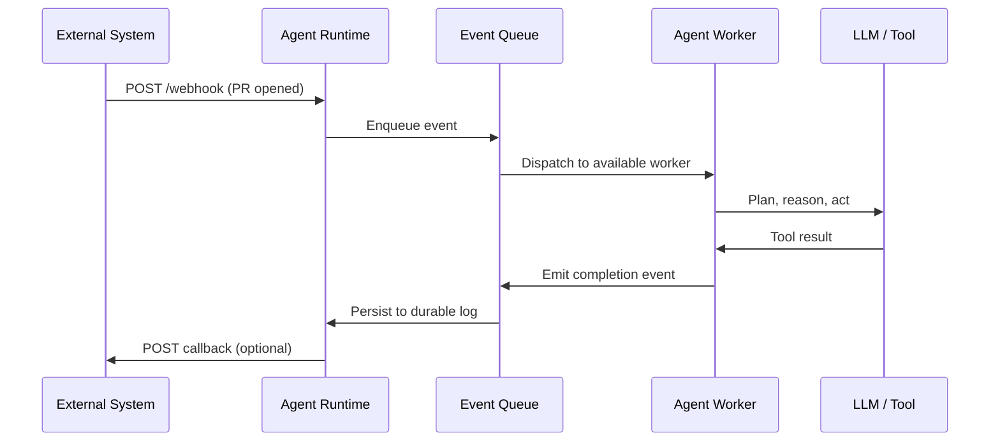

When we talk about AI agents, the conversation usually centers on the LLM's reasoning capabilities—the brain. But as an architect, when I look at agents like [Pi](https://github.com/earendil-works/pi), [Keen Code](https://github.com/mochow13/keen-code), and [OpenHands](https://github.com/OpenHands/OpenHands), the most interesting part is not the brain; it is the nervous system.

This post is a scaffold-level analysis: we look at the code that wraps the model—the control loops, concurrency primitives, state management, and event plumbing—to understand what makes a coding agent usable in production. Building a coding agent is not just about calling an API; it is a distributed systems problem. You have to manage long-running state, coordinate multiple sub-agents, and ensure that a thought process that takes 30 seconds does not freeze your entire environment. The runtime that wires these pieces together is what separates a demo from a production-grade agent.

<!--truncate-->

## 1. The Concurrency Spectrum: Real Implementation Patterns

Agents do not think in clean request-response cycles. A single user request can spawn tool calls, sub-agents, file-system operations, LLM completions, and observability events. How a runtime orchestrates that work determines its latency, throughput, and reliability. Let us look at three real approaches from the open-source landscape.

### Pi: Process-Based Orchestration

[earendil-works/pi](https://github.com/earendil-works/pi) treats isolation as a first-class concern. An orchestrator spawns child Pi processes and communicates with them over JSONL streams via Unix-socket IPC. Each child runs in its own process, so a crash or runaway loop in one agent does not take down the whole system.

```typescript
// Conceptual pattern based on Pi's Orchestrator
const child = spawn("pi", ["--session", sessionId]);
child.stdout.on("data", (data) => {
    const event = JSON.parse(data);
    handleAgentEvent(event);
});
```

The trade-off is clear: process boundaries give you fault isolation at the cost of higher overhead and more complex serialization. Spawning a process per sub-agent is fine for a handful of agents, but it becomes expensive when you want thousands of concurrent thought-loops.

### Keen Code: Goroutines and Streaming Channels

[mochow13/keen-code](https://github.com/mochow13/keen-code) is a Go-based terminal coding agent. Its LLM client runs each assistant turn inside a goroutine and streams results back through a Go channel, so the REPL stays responsive while the agent is thinking.

```go
// From keen-code/internal/llm/anthropic.go (simplified)
func (c *AnthropicClient) StreamChat(
    ctx context.Context,
    messages []Message,
    toolRegistry *tools.Registry,
    opts ...StreamOptions,
) (<-chan StreamEvent, error) {
    eventCh := make(chan StreamEvent)

    go func() {
        defer close(eventCh)
        // ... turn loop emits StreamEvents into eventCh ...
    }()

    return eventCh, nil
}
```

This pattern is deceptively simple. A single goroutine can represent one agent thought-loop; a channel can represent a work queue, a result sink, or a cancellation signal. The runtime scheduler multiplexes tens of thousands of goroutines onto a small number of OS threads, so you do not pay the process-per-agent tax.

### OpenHands: Asyncio and the Durable Event Log

[OpenHands/OpenHands](https://github.com/OpenHands/OpenHands) uses Python's `asyncio` for concurrency and a durable Event Log—usually persisted as JSON files—to record every action. The durability is the key insight: if an agent is interrupted, the conversation can be resumed from the event log rather than reconstructed from memory.

```python
# Conceptual pattern based on OpenHands' event-driven architecture
class EventStream:
    def add_event(self, event: Event) -> None:
        self._queue.put(event)
        self._file_store.write(event.id, event)
        for subscriber in self._subscribers:
            subscriber(event)
```

Asyncio is excellent for I/O-bound work and integrates well with the Python ML ecosystem. The durability model is the real architectural bet: by making state a log of immutable events, OpenHands can recover from failures, support multi-agent collaboration, and replay history for debugging.

These three agents are not discrete categories; they are points on a spectrum. A recent source-code taxonomy of thirteen open-source coding agents shows that real scaffolds compose multiple loop primitives—ReAct, generate-test-repair, plan-execute, retry, and tree search—rather than relying on a single control structure. Pi, Keen Code, and OpenHands each emphasize one primitive, but a production system usually layers them. A goroutine-based runtime may still need durable event logs; a process-based sandbox may still need async I/O.

## 2. Comparing the Concurrency Models

| Runtime | Concurrency Primitive | Isolation | Overhead | Best Fit |
|---|---|---|---|---|
| **Pi** | Child processes + JSONL/IPC | Strong | High per-agent | Security-critical, multi-tenant agents |
| **Keen Code** | Goroutines + channels | Cooperative | Very low per-agent | High-throughput, many sub-agents |
| **OpenHands** | Asyncio + Event Log | Same-process | Low per coroutine | Long-running sessions, ML-heavy workflows |

The right choice depends on what you are optimizing for. If you want to run a thousand agent loops without melting your CPU, lightweight, language-level concurrency wins. If you need to survive a server restart mid-task, durable event logs win. If you want to sandbox untrusted tools, process isolation wins.

## 3. Why Systems Languages Are Taking Over Agent Runtimes

After spending time with all three approaches, I believe the orchestration layer of a production agent belongs in a systems language, not in a dynamic runtime. Go and Rust are the two strongest candidates today. Go is the pragmatic default; Rust is the correctness-first choice.

### 1. The C10K Problem

Handling 10,000 concurrent agent thought-loops is trivial with goroutines (Keen Code) or Rust's async tasks, but it is a nightmare with `asyncio` (OpenHands) or child-process pools (Pi) under heavy load. Lightweight, language-level concurrency lets you model *each* sub-agent, *each* tool call, or *each* wait-state as a separate unit. That granularity changes how you design the agent.

C++ could also handle this load, but its concurrency model is too error-prone for a domain where safety and iteration speed matter. C is even further from the right level of abstraction. Go and Rust give you the concurrency without the footguns.

### 2. Type-Safe and Memory-Safe Boundaries

Tool-calling is where agents fail silently. A malformed schema, a wrong argument type, or a mismatched return value can send an agent into a hallucinated loop. Rust's type system and ownership model make the strongest guarantee here: invalid state is often impossible to express. Go's static typing is simpler but still catches whole classes of runtime errors that Python or TypeScript would miss at the boundary between components.

The same source-code taxonomy shows another tool-calling tradeoff: while agents converge on the same four capability categories—read, search, edit, execute—tool counts range from a single bash command to dozens of specialized action classes. More tools reduce the LLM's per-tool reasoning burden but expand the action space it must navigate. Type-safe boundaries help, but so does scoping: only exposing the tools that matter for the current phase keeps the LLM from getting lost in the toolbox.

For a runtime where manager agents dispatch work to worker agents, those boundaries matter. Go gives you good-enough safety with low friction. Rust gives you the strongest correctness guarantees if you can afford the learning curve and compile-time complexity.

### 3. Single Binary Distribution

A coding agent must live close to the code it is editing. A single Go or Rust binary is vastly easier to sandbox, deploy, and replicate across a fleet of machines than a Node.js or Python environment. Dependencies are compiled in, startup time is predictable, and the operational surface is small.

That does not mean Go or Rust replaces Python for every agent. The ML ecosystem is still Python-first. But the *runtime* layer—the orchestration, the IPC, the lifecycle management—belongs in a language built for concurrency and distribution. Go is the fastest path there; Rust is the most rigorous.

## 4. The Missing Layer: Webhooks and Events

Concurrency primitives answer the question, "How do we run many agents at once?" They do not answer the question, "How do agents react to the world?"

Real agents are not batch scripts that run once and exit. They are long-lived services that respond to file changes, CI failures, pull requests, chat messages, scheduled timers, and external API callbacks. The only way to build that without polling every few seconds is an event-driven backbone—and webhooks are the lingua franca of that backbone.

A webhook is simply an HTTP callback that tells the agent, "Something happened. Here is the payload. Decide what to do." For an agent runtime, this matters in several ways:

- **Triggering work**: A GitHub PR webhook can start a code-review agent. A PagerDuty webhook can start an incident-response agent. A calendar webhook can start a meeting-prep agent.
- **Sub-agent notifications**: A manager agent can register a webhook endpoint that its worker agents call back when they finish, fail, or need human approval.
- **External integration**: Many SaaS tools only support webhooks for real-time updates. The agent runtime must receive, validate, route, and persist these events reliably.

Without webhooks, the agent is a chatbot. With webhooks, the agent is an autonomous participant in your toolchain.

### Events Are the Real State Machine

A durable event log, like the one in OpenHands, is powerful because it turns state into a replayable history. Webhooks are the inbound events that feed that log. The combination—event-driven webhooks plus durable logs plus lightweight concurrency—is the architecture I expect to dominate production agents.

Event sourcing solves the persistence problem, but it does not solve the context-growth problem. As an agent processes webhooks and tool outputs, its trajectory snowballs into the token budget. The source-code taxonomy documents seven distinct context-compaction strategies across agents, from rule-based truncation to LLM-initiated summarization. A durable log is the foundation; a compaction strategy is what keeps the log from becoming a token sink.



## 5. Webhook Design for Production Agent Runtimes

Adding a webhook endpoint is easy; making it production-ready is not. Here are the design decisions that separate a toy integration from a reliable one.

### Idempotency

External systems retry. A GitHub webhook may fire twice. A PagerDuty callback may be duplicated. If your agent starts two code-review sessions for the same PR, you have a bug. Every inbound webhook must carry an idempotency key, and the runtime must record processed keys before dispatching work.

```go
// Simplified idempotency check for an agent webhook handler
func (h *WebhookHandler) HandleEvent(ctx context.Context, event WebhookEvent) error {
    if h.store.IsProcessed(ctx, event.ID) {
        return nil // already handled
    }
    if err := h.dispatcher.Dispatch(event); err != nil {
        return err
    }
    return h.store.MarkProcessed(ctx, event.ID)
}
```

### Event Schemas and Versioning

A webhook payload is a contract. The runtime should validate it against a schema before trusting it. If the schema changes—GitHub's `pull_request` event adds a field, or Slack changes its payload shape—the agent should not silently break. Versioned event types and strict parsing give you a place to handle drift.

### Retries and Backpressure

If the agent is overloaded, blindly accepting more webhooks will crash it. The runtime should acknowledge the webhook quickly (HTTP 200) and queue the event, then apply backpressure when the queue grows. Failed dispatches should be retried with exponential backoff, and events that cannot be processed should land in a dead-letter queue for inspection.

### Authentication and Validation

Webhooks must be authenticated. A public endpoint that triggers agent work is a tempting target. Use signature verification (GitHub's `X-Hub-Signature-256`, Stripe's `Stripe-Signature`, etc.) and reject unauthenticated or replayed payloads before they reach the event queue.

### Persistence Before Action

The durable log should be written before the agent acts. If the agent crashes after accepting a webhook but before persisting it, the event is lost. Writing the event to the log first, then dispatching, makes recovery deterministic: on restart, the runtime replays unprocessed events and resumes work.

## 6. What to Consider When Designing an Agent Runtime

If you are building or evaluating an agent runtime, here are the questions I would ask before choosing a concurrency model:

1. **How many concurrent agents must you support?** A few agents favor process isolation; thousands favor goroutines or coroutines.
2. **Can a task survive a process restart?** If yes, you need a durable event log and a recovery mechanism.
3. **Are the tools trusted?** Untrusted tools require process isolation or sandboxing; trusted tools can run in lightweight threads.
4. **What is the integration surface?** If the agent must react to external systems, you need webhook receivers, event routing, and idempotency guarantees.
5. **What language owns the tools?** Python is still hard to beat for ML workloads; a systems language like Go or Rust is hard to beat for orchestration. A hybrid is often the right answer.

## Conclusion

The brain of an AI agent gets the attention, but the runtime is what makes it usable. Pi, Keen Code, and OpenHands represent three different philosophies: process isolation, lightweight concurrency, and durable event-driven workflows. Each is valid; each has a place.

What makes a production agent reliable is not choosing one of these models in isolation. It is combining them: a systems-language runtime for orchestration, durable event logs for state, and webhooks for real-world integration. Whether that runtime is Go or Rust depends on whether you prioritize shipping speed or correctness guarantees. Either way, the agents that win will not be the ones with the smartest LLM prompts; they will be the ones with the most reliable nervous systems—observable, recoverable, and safe to plug into the rest of your toolchain.

## References

1. **Ginart et al., “Asynchronous Tool Usage for Real-Time Agents” (arXiv 2024)** — Proposes an event-driven finite-state machine architecture that lets agents process tool calls and user interactions asynchronously rather than in strict turn-based loops. [Link](https://arxiv.org/abs/2410.21620)
2. **Zhu et al., “ReDel: A Toolkit for LLM-Powered Recursive Multi-Agent Systems” (EMNLP 2024)** — A recursive multi-agent toolkit built around a central event-driven system, event-based logging, and interactive replay. [Link](https://aclanthology.org/2024.emnlp-demo.17/)
3. **Aratchige and Ilmini, “LLMs Working in Harmony: A Survey on the Technological Aspects of Building Effective LLM-Based Multi-Agent Systems” (arXiv 2025)** — Surveys the architecture, memory, planning, and coordination challenges in modern multi-agent systems. [Link](https://arxiv.org/abs/2504.01963)
4. **Rombaut, “Inside the Scaffold: A Source-Code Taxonomy of Coding Agent Architectures” (arXiv 2026)** — A source-code-level taxonomy of 13 open-source coding agents, grounding architectural claims in pinned commits and file paths. Validates the scaffold-level approach this article takes. [Link](https://arxiv.org/abs/2604.03515)

