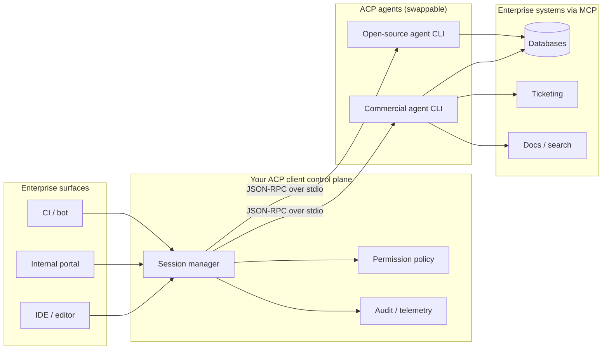
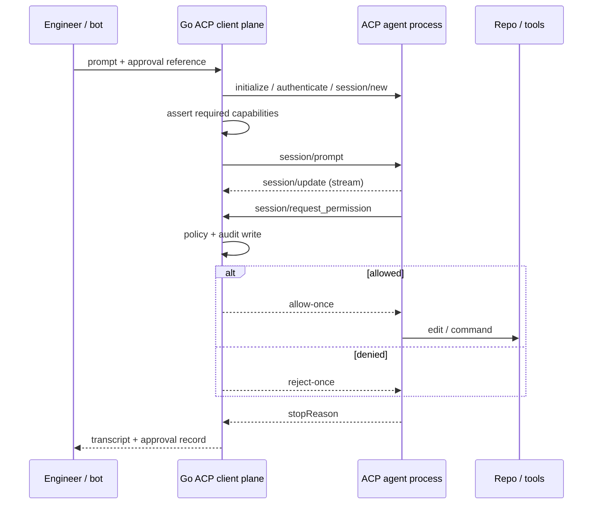

Enterprises keep adopting coding agents the way they once adopted IDEs: one vendor UI, one permission model, one audit story. That breaks the moment the same agent has to sit behind a CI gate, an internal portal, and an engineering org that will not standardize on a single desktop app.

The Agent Client Protocol (ACP) is the seam that lets you reverse that dependency. Own a client control plane — sessions, modes, permissions, audit — and treat the agent as a swappable stdio backend. Go is a strong language for that plane: process supervision, typed JSON-RPC, and concurrent session fan-out are boring Go problems, not demo glue.

The harder question, which I take up below: how much lock-in does that actually remove? Less than the protocol marketing implies, and the remainder is the part enterprises should negotiate.

<!--truncate-->

Agents multiply along a second axis: N agents × M surfaces — editors, bots, pipelines, portals. Every surface that wires itself directly to one agent's API rebuilds the same plumbing, which is the combinatorial trap [MCP was built to break on the tools axis](./2025-12-15-mcp-llm-servers.md). With ACP the surface speaks one client contract and the agent becomes a configuration value.

This is not a single-vendor story. As of August 2026 the [ACP registry](https://agentclientprotocol.com/get-started/registry) lists 38 agents that speak the protocol, including commercial CLIs (`agent acp` from Cursor, `devin acp` from Cognition) and open-source ones (`goose acp`, `hermes acp`, opencode, a `pi` adapter). On the client side, Zed, JetBrains AI Assistant, and Neovim plugins already act as ACP hosts — and some products are both, as Devin Desktop is when it runs third-party ACP agents. Every command in this post has an equivalent in the others.

## ACP and MCP solve different halves

MCP standardizes how an agent reaches tools, data, and prompts. ACP standardizes how a *host* drives an agent: initialize, authenticate, open a session, stream updates, answer permission requests, cancel.



Collapse those layers and you buy coupling twice: once in the chat UI, once in the tool adapters. Keep them separate and you can change agents without rewriting every internal surface — the same reason LSP outlived several editor generations.

ACP sits outside the agent runtime itself — the control loops and concurrency primitives I dug into when [reading agent source code](./2026-07-04-the-orchestration-gap.md). It is the wire contract between *your* host and *their* agent process. How the agent schedules its own work still matters; governance at the client boundary is the part enterprises actually own.

## What the wire looks like

ACP is JSON-RPC 2.0, newline-delimited, over stdio for local agents. A production client implements roughly this flow:

1. `initialize` — protocol version plus client capabilities
2. `authenticate` — the method ID is agent-specific (`cursor_login`, a Devin credential from `devin auth login`, a Hermes provider setup, and so on)
3. `session/new` (or `session/load`)
4. `session/prompt`
5. Handle `session/update` streams
6. Answer `session/request_permission`, or tool work stalls
7. Optional `session/cancel`

Where the agent supports session modes, they map to risk appetite: read-only planning or Q&A versus a mode that permits edits and shell. That mapping belongs in *your* policy layer, not in tribal knowledge about which IDE toggle someone left on. Agents that do not implement modes express the same idea through session config options — a portability wrinkle I come back to when the lock-in question gets serious.

Agents also ship extension methods — vendor-prefixed JSON-RPC calls for richer UX like multiple-choice questions, plan approval, or todo streams. Treat them as optional capability negotiation. The portable enterprise surface is sessions, permissions, and audit of tool outcomes.

## Why Go for the control plane

Platform teams already run Go for operators, admission controllers, and CLI tooling. An ACP client is the same shape: spawn a child process, correlate request IDs, multiplex session updates, enforce timeouts, emit structured logs.

The [coder/acp-go-sdk](https://github.com/coder/acp-go-sdk) gives typed client and agent connections so you are not hand-rolling JSON-RPC correlation. A conceptual client loop, with the agent binary read from config rather than hardcoded:

```go
cmd := exec.CommandContext(ctx, cfg.AgentBinary, cfg.AgentArgs...) // e.g. "agent","acp" / "devin","acp" / "goose","acp"
stdin, _ := cmd.StdinPipe()
stdout, _ := cmd.StdoutPipe()
if err := cmd.Start(); err != nil {
    return err
}
defer cmd.Process.Kill()

client := &PolicyClient{ // implements acp.Client
    AllowPaths: []string{repoRoot},
    AllowEdits: false, // promoted only by an explicit, recorded approval
}
conn := acp.NewClientSideConnection(client, stdin, stdout)

initResp, err := conn.Initialize(ctx, acp.InitializeRequest{
    ProtocolVersion: acp.ProtocolVersionNumber,
    ClientCapabilities: acp.ClientCapabilities{
        Fs: acp.FileSystemCapabilities{ReadTextFile: true, WriteTextFile: true},
    },
})
if err != nil {
    return err
}

if _, err := conn.Authenticate(ctx, acp.AuthenticateRequest{
    MethodId: cfg.AuthMethodId, // agent-specific
}); err != nil {
    return err
}

sess, err := conn.NewSession(ctx, acp.NewSessionRequest{
    Cwd:        repoRoot,
    McpServers: cfg.ApprovedMcpServers, // inject the reviewed inventory
})
if err != nil {
    return err
}

_, err = conn.Prompt(ctx, acp.PromptRequest{
    SessionId: sess.SessionId,
    Prompt:    []acp.ContentBlock{acp.TextBlock("Summarize the failure in this PR diff.")},
})
```

The load-bearing interface is not `Prompt`. It is `RequestPermission` on your `acp.Client` implementation. That is where enterprise policy lives:

```go
func (c *PolicyClient) RequestPermission(
    ctx context.Context,
    params acp.RequestPermissionRequest,
) (acp.RequestPermissionResponse, error) {
    c.audit.Record(ctx, params) // identity, session, tool title, paths — before the decision
    if !c.AllowEdits || !c.pathAllowed(params) {
        return rejectOnce(params), nil
    }
    return allowOnce(params), nil
}
```

Trade-off: auto-approving everything makes demos fly and audit useless. Human-in-the-loop on every shell call makes unattended surfaces unusable. The middle path I would ship first is **path-scoped allow-once with mandatory structured audit**, defaulting new surfaces to a read-only mode until someone explicitly approves edit-and-execute for that session.

## ACP removes one layer of lock-in, not all of them

It removes *integration* lock-in — the wiring between your surfaces and one agent's API. It leaves several other layers untouched, and pretending otherwise is how enterprises end up with a protocol badge and the same dependency.

| Lock-in layer | Removed by ACP? | What it means in practice |
|---|---|---|
| Surface integration | Yes | One client contract; agent becomes config |
| Model and inference | No | Commercial CLIs route to their own model stack and pricing |
| Capability coverage | No | Agents implement different subsets: modes, terminals, client-passed MCP |
| Extension methods | No | Vendor-prefixed methods and slash commands re-couple your UX |
| Agent inventory | No | Your agreement covers the agent you bought, not the one a developer adds |
| Exit rights | Only with open source | You can keep running an OSS agent after a price or policy change |

Two of those deserve detail because they bite quietly.

**Capability coverage is a governance problem, not a UX problem.** If your policy depends on running unattended jobs in a read-only mode, and you swap in an agent that expresses modes as session config options instead, your control silently changes shape. Some hosts do not advertise terminal capabilities at all; some agents honor MCP servers handed over in `session/new` while others only read a project config file. Do not discover this in production — assert it at `initialize` and refuse to start:

```go
if cfg.RequireReadOnlyMode && !supportsReadOnlyMode(initResp.AgentCapabilities) {
    return fmt.Errorf("agent %s does not advertise a read-only mode; refusing unattended session", cfg.AgentBinary)
}
```

Capability negotiation is the only part of the swap story the protocol will enforce for you, and only if you write the assertion.

**Your agreement covers the agent you bought, not the one a developer can add.** Enterprises generally do the procurement part well. The major agent vendors offer privacy modes enforced org-wide, zero-retention arrangements with model providers, SOC 2 reports, DPAs, data residency, and customer-managed keys. If you signed that paperwork, the objection "but where does our code go" is already answered — for that vendor.

ACP changes the cost of introducing a different one. An agent is a subprocess the client launches from a config file: in JetBrains AI Assistant that is `~/.jetbrains/acp.json`, in the developer's home directory, with the agent's own credentials in `env`. One edit points an approved IDE at an unapproved agent running on a personal subscription. JetBrains says so plainly — ACP agents come with their own subscription, and that is between you and them. Cognition documents the same boundary for third-party agents inside Devin Desktop.

The vendors are not hiding this; they are already building controls for it. Cursor offers an allowed-team-IDs policy so corporate devices cannot log into personal accounts. Devin Desktop lets team admins push an approved ACP registry to their users. Both are acknowledgements that the governing question has shifted. It is no longer "is our agent vendor compliant." It is "which agent binaries can actually run here, and who decided that."

This is where open-source agents change the calculus rather than just the vendor name. An agent like Hermes runs ACP through its own provider resolver, so the credentials and model endpoint are the ones you configured — including a self-hosted one. Goose and opencode are similar: the runtime is yours to fork, pin, and audit. That is genuine exit right.

The trade-off is real and I would not soft-pedal it. A commercial agent gives you capability you did not have to build and a vendor to escalate to; you rent the model brand and accept its data path. An open-source agent gives you exit rights and inference control; you inherit the scaffold, the sandboxing, the evals, and the on-call for all of it. The honest enterprise position is a portfolio: control plane in-house, at least one commercial and one open-source agent wired behind it, and a swap you have actually rehearsed. A swap option you have never exercised is not leverage — it is a slide.

## Enterprise topology that ships

Do not embed an agent inside every microservice. Start with one control plane process (or a small replica set) that owns this split:

| Concern | Own in the client plane | Leave to the agent |
|---|---|---|
| Authn to agent provider | Credential broker, short-lived secrets | Model routing internals |
| Authorization | Repo/path/env allowlists, mode caps | Tool execution once allowed |
| Session lifecycle | Create, resume, cancel, TTL | Context window and memory |
| Audit | Who prompted, what was approved, diffs | Token accounting if exposed |
| MCP inventory | Approved server list per environment | Tool schemas at runtime |



That topology mirrors how we already treat database access: applications do not each invent TLS and credential handling, they go through a governed path. Agents that can run `rm` and `kubectl` deserve at least the same seriousness.

## What fails if you treat ACP as a thin wrapper

**Permission handlers that always allow.** If your client approves unconditionally, ACP gave you IPC, not governance. The protocol cannot enforce a policy you did not write.

**UI-shaped clients on machine surfaces.** A portal or CI runner cannot block on an interactive question the way a desktop IDE can. Map blocking extension methods to ticket metadata or fail closed with a clear error. Do not pretend an unattended job is an attended session.

**Config drift on MCP.** Agents differ on where the tool inventory comes from: a project file, servers passed by the client at session start, or a vendor console that does not follow the binary into ACP mode. Centralize MCP delivery in your control plane so every surface gets the same reviewed inventory.

**Agent brand in your API.** If your internal path is `/api/<vendor>/…`, you already gave the coupling back. Expose `/api/agent-sessions` and pass the agent as configuration.

**Assuming remote ACP is settled.** The protocol targets local and remote agents, and remote hosting is still maturing. Design for local stdio first, keep transport behind an interface, and do not stake a compliance milestone on unfinished remote semantics.

## Decision questions before you write the client

1. Which surfaces need the agent in the next two quarters — IDE only, or also CI and an internal portal?
2. What is the default mode for unattended sessions, and who may promote a session to edit-and-execute?
3. Where do approval records land, who reviews them, and which fields are mandatory?
4. Is MCP inventory delivered as reviewed files in the repo, or injected by the control plane at session start?
5. Which agent binaries are allowed to run against your repos, who approved that list, and what stops a developer adding one more?
6. Can you swap the agent binary in staging without changing the portal API?

If you cannot answer (2) and (3), you are not ready for edit-and-execute mode in production. Stay read-only and spend the time instrumenting permissions. Question (6) is the proof: if swapping the agent binary requires an API change, you never owned the client — you rented the brand with extra steps.

Own the client. Rent the model brand. ACP is how you keep that distinction when the agent market moves under you — and a swap you have actually rehearsed is how you prove you still have it.

## References

- [Agent Client Protocol](https://agentclientprotocol.com/) and the [ACP registry](https://agentclientprotocol.com/get-started/registry)
- [coder/acp-go-sdk](https://github.com/coder/acp-go-sdk)
- [Cursor CLI ACP](https://cursor.com/docs/cli/acp)
- [Devin Desktop ACP, including team registry config](https://docs.devin.ai/desktop/acp)
- [JetBrains AI Assistant ACP setup](https://www.jetbrains.com/help/ai-assistant/acp.html)
- [Cursor enterprise privacy and data governance](https://cursor.com/docs/enterprise/privacy-and-data-governance)
- [Hermes ACP host integration](https://hermes-agent.nousresearch.com/docs/user-guide/features/acp)
- [goose in ACP clients](https://goose-docs.ai/docs/guides/acp-clients/)
- [Breaking the N×M Barrier: MCP](./2025-12-15-mcp-llm-servers.md)
- [What Coding Agents Teach Us About Concurrency](./2026-07-04-the-orchestration-gap.md)
