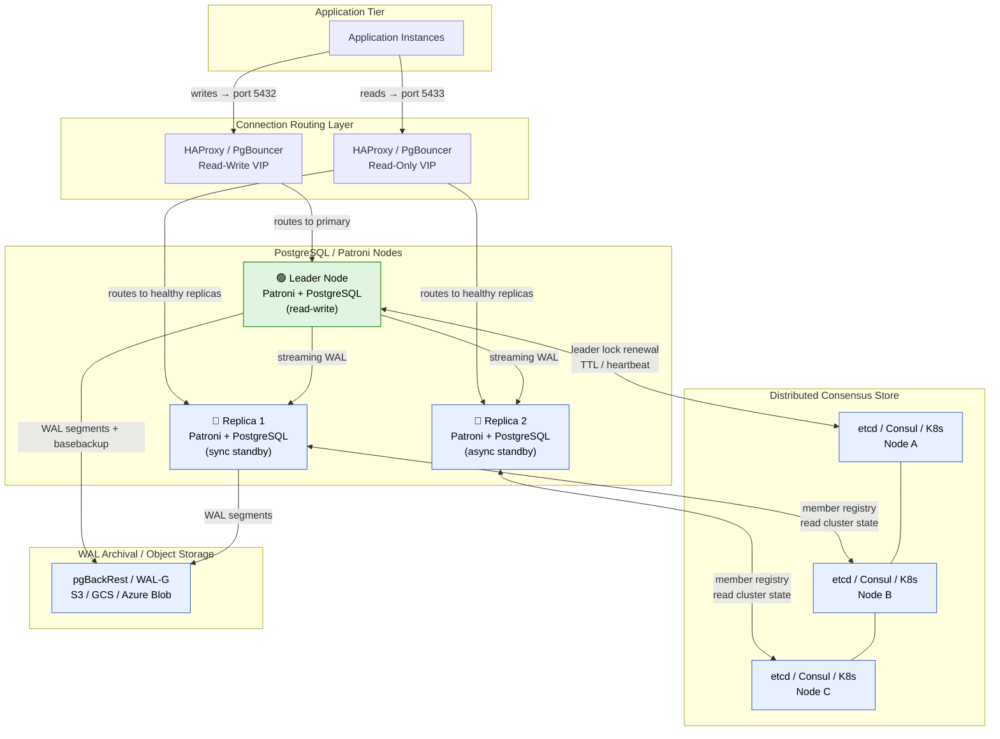

# Chapter 01 — Foundations of Postgres HA at Scale

## Executive Summary

High availability is not a feature you bolt on at the end of a project. It is a set of deliberate design choices that determine what your system does when the inevitable happens: a node dies, a network partitions, a storage device silently returns garbage, or a DBA runs the wrong command at 2 AM. This chapter builds the conceptual foundation every subsequent chapter assumes. We define what HA actually means at enterprise scale — beyond the marketing simplicity of "five nines" — and enumerate the failure modes Patroni is designed to handle, the failure modes it is not designed to handle, and the edge cases where it makes things worse if misconfigured. We introduce the RPO and RTO targets that drive every configuration decision in the book, and we explain why Patroni's DCS (Distributed Consensus Store — an external system like etcd, Consul, or Kubernetes that holds the cluster's leader lock and coordinates failover decisions) backed consensus model is the correct tool for this problem class while covering where its closest alternatives fall short. By the end of this chapter, you will have the vocabulary and mental model to evaluate any HA configuration choice with first principles rather than folklore.

---

## Failure Model Taxonomy Diagram

The diagram below shows a complete Patroni HA stack from the application tier to WAL archival, with each component annotated by the class of failure it can surface.



**Failure surfaces in this stack, enumerated:**

| Layer | Component | Failure Class |
|-------|-----------|--------------|
| App Tier | Application Instances | Client-side retry logic; not Patroni's concern |
| Routing | HAProxy / PgBouncer | SPOF if single instance; health-check misconfiguration silently routes writes to demoted replica |
| Primary | Leader Patroni + PG | Node crash, OOM kill, kernel panic, storage I/O error |
| Replica | Standby Patroni + PG | Replication lag, slot bloat, cascading lag from primary overload |
| DCS | etcd / Consul / K8s | Network partition between DCS nodes, DCS quorum loss, TLS cert expiry |
| WAL Storage | pgBackRest / WAL-G | Archive gap (missing WAL segment breaks PITR chain), cloud storage outage |
| Cross-cutting | All nodes | Clock skew, credential/cert expiry, operator error |

---

## What HA Actually Means at Scale

Marketing speaks in nines. Five nines — 99.999% availability — sounds precise. It works out to 5.26 minutes of downtime per year. But **which five minutes, over what failure domain, measured how**? That precision evaporates the moment you define it rigorously.

### Planned vs. Unplanned Downtime

**Planned downtime** — major version upgrades, OS patching, storage migrations, certificate rotations — is the category most HA architectures handle worst. Teams accept unplanned downtime as inevitable and invest heavily in failover automation, then discover that their quarterly maintenance window costs them more total downtime than the two unplanned outages they prevented. Patroni's `patronictl switchover` and zero-downtime upgrade procedures (Chapter 09) are your tool here, but they require understanding the replication lag and sync/async trade-offs covered in this chapter before you can use them safely.

**Unplanned downtime** comes in two flavors that require different responses:

- **Sudden failure**: node crash, OOM kill, kernel panic, power loss. The leader stops renewing its DCS lease. After TTL seconds, a replica wins the election and promotes. Your RTO is dominated by `ttl + loop_wait + PostgreSQL promotion time`.
- **Degraded-mode failure**: the node is alive and accepting connections but producing incorrect results — silent storage corruption, returning stale reads after a failed pg_wal_replay path, or accepting writes after losing network connectivity to the DCS. These are the failures that cause data loss, not the dramatic ones. Patroni's watchdog integration (Appendix B) exists specifically to fence a node in this state.

### Partial vs. Total Failure

A total failure — every node in a cluster goes dark simultaneously — is rare and usually catastrophic regardless of your HA tooling. Your DR strategy (Chapter 08) handles this, not Patroni's failover automation.

**Partial failure** is the common case and the design center for Patroni:

- **Single-node failure**: one Patroni + PostgreSQL node dies. If it was the leader, a replica promotes. If it was a replica, the leader continues serving writes. RTO for the leader-loss case is the critical path.
- **DCS minority failure**: one or two DCS nodes in a three-node cluster die. Quorum is maintained. The Patroni cluster continues operating normally. This is the "do nothing" case.
- **DCS majority failure**: two of three etcd nodes die. Patroni enters a safe mode: the existing leader continues serving writes (it holds the current lock in memory), but no new leader elections can complete. A replica that loses connectivity to the DCS will not promote. This is correct behavior — Patroni defaults to preserving consistency over availability when consensus is unavailable.

### Cascading Failures

Cascading failures are the failure mode that kills clusters that look healthy on paper. The pattern:

1. A high-traffic event causes replication lag on all replicas.
2. Lag-based health checks mark replicas unhealthy, routing all traffic to the primary.
3. Increased load on the primary causes further lag accumulation.
4. A DCS heartbeat miss (caused by CPU starvation on the primary node) triggers a spurious failover.
5. The new primary is a replica that is 30 seconds behind the traffic peak. Applications see stale data. Connection pools queue against the new leader as it catches up.
6. The old primary (now a replica) comes back. Patroni correctly demotes it. But PgBouncer still holds its connection pool open, splitting traffic.

At FAANG scale, this cascade happens at 2 AM when oncall response is slowest and traffic is unexpectedly high (background jobs, batch ingestion, analytics queries that escaped the read-replica tier). Chapter 07 provides the decision trees. This chapter provides the vocabulary to use them.

**Key insight**: HA is not a property of any single node. It is a property of the cluster *as a system*, including the routing layer, the DCS, the WAL archive path, and the application's retry behavior. Patroni owns a well-defined slice of this. You own the rest.

---

## Failure Model Taxonomy

Every failure your Patroni cluster will encounter maps to one of seven categories. Understanding these categories lets you reason about coverage gaps without having to enumerate every specific incident.

### 1. Node Crash

The failure Patroni was built for. The primary process (PostgreSQL and/or Patroni) terminates unexpectedly — kernel panic, OOM kill, power loss, `kill -9`, hardware fault. The leader stops renewing its DCS lease. After the TTL expires, a replica acquires the leader lock and promotes.

**Coverage**: Full, assuming watchdog is configured. Without watchdog, a node that crashes after writing to the DCS but before fencing itself can cause a brief split-brain window.

**Config levers**: `ttl`, `loop_wait`, `retry_timeout`.

### 2. Network Partition

The most operationally complex failure class. A network partition separates some nodes from others. Sub-cases matter:

- **Primary partitioned from replicas, DCS reachable from both**: The primary loses quorum and cannot renew its lock. It fences itself (via watchdog or `pg_ctl stop`). Replicas elect a new leader. Correct.
- **Primary partitioned from DCS, replicas can reach DCS**: Same outcome — lock expires, election proceeds.
- **All Patroni nodes partitioned from DCS**: No election can complete. The existing leader continues serving writes (from its in-memory lock state) until Patroni detects DCS unavailability and pauses or stops (configurable via `master_stop_timeout` / `primary_stop_timeout`). This is where your `master_stop_timeout` / `primary_stop_timeout` configuration choice — stop vs. pause — has significant data-loss implications.
- **Network partition that creates two DCS majorities**: Virtually impossible with a properly deployed DCS (requires a perfectly even split of an odd-numbered cluster), but the failure mode if it occurs is full split-brain. This is why you run DCS nodes in three or more distinct failure domains (AZs or racks).

### 3. DCS Failure

The DCS is the single point of truth for leader election. Its failure modes warrant explicit enumeration:

- **DCS quorum loss**: Majority of DCS nodes unavailable. New leader elections cannot complete. Patroni's behavior on the existing primary depends on `primary_stop_timeout` — if set, the primary stops after the timeout; if zero, it continues indefinitely (dangerous).
- **DCS performance degradation**: High DCS latency causes Patroni to miss heartbeat deadlines without the DCS node actually failing. This triggers spurious failovers. Monitor DCS `p99` write latency; alert at >200ms.
- **DCS data corruption**: Rare, but etcd compaction bugs and disk I/O errors have caused this in production. Always run etcd with periodic compaction and snapshot backups.
- **DCS cert expiry**: TLS certificates on etcd or Consul expire silently. Patroni cannot connect to DCS. The cluster enters the same state as DCS quorum loss. Automate certificate rotation (Chapter 04) and alert on `cert_expiry_days < 30`.

### 4. Storage Corruption

Silent storage corruption is the failure that HA cannot fix. Patroni promotes a replica, the replica serves reads, and both the old primary and new primary have the corrupt data because the corruption was replicated before the failure was detected.

**Patroni's role is limited here**: it can fence the node, promote a replica, and redirect traffic. It cannot detect data-level corruption. That is the job of PostgreSQL checksums (`data_checksums = on`), filesystem-level checksums, and your monitoring stack.

**What Patroni does do**: if a node's PostgreSQL is down (because the filesystem has gone read-only after detecting I/O errors), Patroni will attempt to restart it, fail, and eventually trigger a failover. The fencing prevents the broken node from accepting connections after it is demoted.

### 5. Cascading Replication Lag

High sustained write throughput, long-running transactions that hold WAL slots open, or `max_slot_wal_keep_size` exhaustion can cause all replicas to fall significantly behind the primary. When the primary then fails:

- All candidates for leader election have large recovery deltas.
- PostgreSQL promotion takes longer (it must replay the recovery queue before accepting new connections).
- RTO blows past the stated target.

Additionally, Patroni's `maximum_lag_on_failover` setting (default: unlimited, **change this**) prevents a severely lagged replica from being elected, but this means you may enter a state where *no* replica is eligible for promotion and the cluster waits for human intervention.

**Pre-emptive action**: Monitor `pg_replication_slots` for slot lag exceeding your `maximum_lag_on_failover` threshold. Alert and drop stale slots before they become a failover blocker.

### 6. Human Error

In production postmortems, human error is a contributing factor in a majority of data-loss incidents. Patroni-specific patterns:

- `patronictl edit-config` with incorrect `postgresql.parameters` syntax — Patroni applies the config and PostgreSQL fails to restart; the node demotes.
- `patronictl pause` left in paused state — automatic failover is silently disabled.
- Running `pg_ctl stop -m immediate` directly on the primary bypasses Patroni's shutdown sequence; the node may not have flushed WAL.
- Dropping a replication slot on the primary while it is the only slot feeding a downstream logical replica — causes replication chain break that does not trigger a Patroni event.
- Confusion between `patronictl failover` (forced, no data-safety check) and `patronictl switchover` (graceful, checks sync state). Using `failover` in a situation where `switchover` was intended.

**Mitigation pattern**: Role-based `patronictl` access (`patronictl` supports `--config-file` and can be wrapped in scripts that require a `--dry-run` confirmation step for destructive commands). Chapter 04 covers this in the configuration governance section.

### 7. Certificate and Credential Expiry

At scale, the most common cause of a "mystery outage" at 90-day or 1-year boundaries is cert/credential expiry. Patroni uses TLS for:

- REST API (inter-node communication and health checks)
- DCS connections (etcd TLS client certs, Consul tokens)
- PostgreSQL replication (`pg_hba.conf` client cert authentication)

**Any of these expiring will silently break cluster coordination** before it causes a visible service outage, because Patroni continues running but cannot perform leader elections or health checks reliably.

Alert rule template: `(cert_expiry_timestamp - now()) / 86400 < 30` — alert 30 days before expiry, page at 7 days. Automate renewal with cert-manager (Kubernetes) or a cron-based renewal script with a post-renewal Patroni reload hook.

---

## RPO and RTO Primer

### Definitions That Actually Matter

**RPO (Recovery Point Objective)** is the maximum data loss your organization can accept, expressed in time. An RPO of zero means you cannot lose any committed transactions. An RPO of 5 minutes means you accept that up to 5 minutes of committed transactions may be lost in the worst case. RPO is a *business requirement* first, a technical target second. Make sure the business has explicitly signed off on a number.

**RTO (Recovery Time Objective)** is the maximum acceptable duration of the service outage from the moment of failure. RTO of 30 seconds means that within 30 seconds of a failure event, the service must be accepting writes again. RTO includes detection time, DCS lease expiry time, election time, and PostgreSQL promotion time.

### Relating RPO and RTO to Patroni Configuration

These are the knobs, and the math behind them:

| Patroni Parameter | Default | Effect on RTO | Effect on RPO |
|------------------|---------|--------------|--------------|
| `ttl` | 30s | Directly adds to RTO: leader must miss heartbeats for `ttl` seconds before election starts | No direct effect |
| `loop_wait` | 10s | Polling interval; adds up to `loop_wait` seconds of detection latency to RTO | No direct effect |
| `retry_timeout` | 10s | DCS operation retry window; effectively caps RTO reduction from reducing `ttl` (you cannot safely set `ttl < retry_timeout`) | No direct effect |
| `maximum_lag_on_failover` | 0 (unlimited) | No effect on RTO; restricts *which* replica can be elected | Limits RPO exposure by preventing promotion of severely lagged replicas |
| `synchronous_mode` | off | Increases RTO slightly (election must check sync standby availability) | Zero RPO for committed transactions when enabled |
| `synchronous_mode_strict` | off | Blocks writes when no sync standby available; increases durability at cost of availability | Guarantees zero RPO at cost of potential availability loss |
| `master_stop_timeout` / `primary_stop_timeout` | 0 (no timeout) | Setting to nonzero causes primary to stop if it cannot reach DCS; adds that many seconds to RTO | Prevents split-brain; reduces RPO exposure |

**Safe minimum configuration** for a Patroni cluster targeting RTO ≤ 30 seconds:

```yaml
bootstrap:
  dcs:
    ttl: 30
    loop_wait: 10
    retry_timeout: 10
    maximum_lag_on_failover: 10485760  # 10 MB; tune to match your write rate
    primary_stop_timeout: 30
    synchronous_mode: true  # for zero RPO; remove if latency is unacceptable
```

:::caution `ttl` should always be greater than `retry_timeout`
Setting `ttl ≤ retry_timeout` creates a race condition where the current leader's DCS operation retries outlast the lease, triggering a spurious election while the leader is still operational. The rule: `ttl ≥ 2 × retry_timeout`.
:::

### Failure-to-RPO/RTO Mapping

The table below maps each failure class to typical observed RPO and RTO ranges. These are empirical observations from production deployments, not theoretical minimums.

| Failure Scenario | Typical RPO | Typical RTO | Dominant Factor |
|-----------------|-------------|-------------|----------------|
| Node crash (async mode) | Last checkpoint to failure (0–30s) | `ttl` + promotion time (20–45s) | DCS TTL expiry |
| Node crash (sync mode) | Zero (committed transactions safe) | `ttl` + promotion time (20–45s) | DCS TTL expiry |
| Network partition, primary isolated | Same as node crash | Same as node crash | Watchdog fence time |
| DCS majority loss, existing leader running | Zero (primary continues) | Human intervention required | `primary_stop_timeout` |
| Storage corruption (silent) | Potentially unbounded | Depends on detection time | Checksum monitoring |
| Cascading replication lag at failover | Up to lag delta at failure time | `ttl` + replay time (minutes) | Replica lag depth |
| Human error (wrong `patronictl` command) | Variable | Variable | Depends on command |
| Cert expiry (DCS TLS) | Zero | Until cert replaced + Patroni restart | Cert expiry detection latency |

**How to use this table**: For each failure scenario, compare your current configuration against the dominant factor column. If your `primary_stop_timeout` is 0 (no timeout) and DCS goes down, your cluster will never automatically stop the primary — that is a deliberate, defensible choice for write-availability-first deployments, but you need to own it consciously.

---

## Why Patroni

### The Landscape in 2026

Four tools compete for the PostgreSQL automatic-failover space. Here is an honest comparison:

**repmgr**: The incumbent. Mature, widely deployed, well-understood. Uses a witness-based model rather than a consensus DCS. The critical weakness: repmgr's split-brain protection relies on a witness node and network-level fencing scripts that you write and maintain. In practice, these scripts fail in subtle ways during network partitions. Additionally, repmgr's failover decision is made by the `repmgrd` daemon on each node independently — there is no shared consensus for the election decision itself. Two `repmgrd` daemons can simultaneously believe they should promote, and the witness node cannot always break the tie when it is itself partitioned. If you are running repmgr today and happy with it, this book is not telling you to migrate. If you have ever debugged a repmgr split-brain event, you understand why Patroni's DCS-backed election is architecturally superior.

**Stolon**: Uses etcd/Consul, similar DCS-backed consensus model to Patroni. Its key architectural difference: Stolon introduces a separate `stolon-sentinel` process that makes promotion decisions, decoupled from the Postgres nodes themselves. This allows for sophisticated multi-datacenter placement of the sentinel, but it also introduces a new component to operate, monitor, and upgrade. Stolon's adoption has plateaued relative to Patroni's; the ecosystem of operators, Helm charts, and cloud provider tooling is thinner.

**pg_auto_failover**: Microsoft's contribution. Elegant for simple two-node primary + monitor setups, and has a compelling Kubernetes operator story. The monitor node is a single point of coordination — sophisticated, but a SPOF if not highly-available itself. For N-node clusters (N > 3) with complex sync/async topologies across multiple DCS backends, pg_auto_failover becomes complex to configure. Strong choice for Azure-native deployments and teams already in the Microsoft ecosystem.

**Patroni**: DCS-backed leader election using Raft consensus (via etcd, Consul, or Kubernetes). The key properties:

1. **True consensus**: The leader election decision is not made by any single Patroni process. It is made by the DCS — a distributed system that requires a quorum of participants to agree. This is the only architectural model that provably prevents split-brain without relying on fencing script correctness.
2. **Ecosystem density**: Patroni is the reference implementation used by Zalando (its creator), Crunchy Data, Percona, and the majority of Kubernetes PostgreSQL operators (CloudNativePG's ancestor, Stackgres, Zalando Postgres Operator). The operational tooling, Helm charts, Ansible roles, and Grafana dashboards are more mature than any alternative.
3. **Configuration expressiveness**: Patroni's `patroni.yml` and DCS-stored configuration support fine-grained per-node and per-cluster settings that repmgr and pg_auto_failover cannot match.
4. **Active upstream maintenance**: Patroni 4.x (current at publication) actively tracks new PostgreSQL major versions. The test coverage for new PG features (incremental base backups, logical replication improvements, new WAL formats) is best in class.

**When not to use Patroni**: If your team has never operated a consensus DCS (etcd or Consul) and you are running a two-node primary + standby for a non-critical internal system, pg_auto_failover's simpler operational model may be a better fit. Patroni's power comes with operational complexity that must be paid.

---

## The Road Ahead

This book is structured so that each chapter builds on the previous. Here is what each chapter delivers and how to navigate it:

| Chapter | What You Get | Skip If |
|---------|-------------|---------|
| **02 — Patroni Architecture & DCS** | How Patroni's state machine, leader election, watchdog, and DCS interaction actually work. Mental model for debugging. | You have deployed Patroni before and can describe what `loop_wait`, `ttl`, and `retry_timeout` each do. |
| **03 — Deploying a Patroni Cluster** | Step-by-step cluster deployment, etcd/Consul/K8s DCS choice, and the first "break it on purpose" lab (LAB-03-A). | You have a running Patroni cluster and just need configuration tuning guidance. |
| **04 — Configuration Best Practices** | Every `patroni.yml` parameter that matters, with production-recommended values, commentary, and the governance patterns that prevent human-error incidents. | Never. This chapter is the reference you return to repeatedly. |
| **05 — Performance Tuning Under HA** | How HA constraints interact with PostgreSQL performance. Sync replication latency math, checkpoint tuning, shared_buffers under failover, connection pool sizing. | Your performance issues are not HA-related. |
| **06 — Observability & Monitoring** | The metric stack, alert rules, Grafana dashboards, and log patterns that map to every failure mode in this chapter's taxonomy. | Never. You need this to know when something is wrong before it fails. |
| **07 — Troubleshooting Playbooks** | Symptom-keyed decision trees. Start here when something is broken and you are oncall. | You are not oncall for this cluster. |
| **08 — Backup, DR, and PITR** | pgBackRest and WAL-G configuration, PITR procedures, cross-region restore, and empirically validated RTO/RPO measurement. | Your backup strategy is already tested and your RTO/RPO numbers are measured, not estimated. |
| **09 — Zero-Downtime Operations** | Major version upgrades, minor upgrades, certificate rotation, configuration changes — all without stopping writes. | You have no upcoming maintenance operations. |
| **10 — Geo-Distributed Patroni** | Quorum placement across regions, synchronous replication latency trade-offs, split-brain in WAN partitions, data sovereignty patterns. | Your cluster is single-region. |
| **11 — Agentic AI for Autonomous Ops** | Autonomous monitoring, predictive failover, self-tuning, auto-remediation, and NL operations — with explicit guardrails and manual fallbacks for each workflow. | Your environment prohibits AI-assisted operations. The manual fallbacks in this chapter still apply. |
| **12 — Case Studies & Anti-Patterns** | Anonymized FAANG-scale incidents with pattern extraction. Best read after you have deployed your own cluster and have specific failure modes to compare against. | You are in a hurry. Return to it later. |
| **Appendix A** | Managing the Python runtime for Patroni (3.6 → 3.12 migration). | You are not responsible for Patroni binary upgrades. |
| **Appendix B** | Patroni internals: full state machine enumeration, watchdog semantics, DCS lease math. | You are satisfied with the operational-level understanding from Chapters 02–04. |

---

## Chapter Checklist

Use this against your current deployment, your design documents, or your team's tribal knowledge:

- [ ] **I can name at least three failure modes in the taxonomy above that my current deployment is not protected against**, and I have a ticket or plan for each.
- [ ] **I know my cluster's current RTO target** (from a signed-off SLA or architecture document), and I have measured it in a staging failover test within the last 90 days.
- [ ] **I know my cluster's current RPO target**, and I have verified that `synchronous_mode` is configured (or explicitly and consciously disabled) in accordance with that target.
- [ ] **I have confirmed that `ttl ≥ 2 × retry_timeout`** in my Patroni DCS configuration.
- [ ] **I have a monitoring alert for DCS write latency p99 > 200ms** that fires before a spurious failover occurs.
- [ ] **Watchdog is configured and enabled** on every Patroni primary in my cluster (softdog or hardware watchdog; not `required: false`).
- [ ] **Certificate expiry is monitored** for all TLS paths: DCS client certs, Patroni REST API cert, and PostgreSQL replication client certs; alert fires at 30-day horizon.
- [ ] **`maximum_lag_on_failover` is set** to a nonzero value commensurate with my RPO target, not left at the default (unlimited).

---

## Gotchas

### 1. Confusing TTL Expiry with Failover Completion

The Patroni TTL is the time the DCS will wait before *allowing* a new election to begin — it is not the total failover time. After TTL expires, a replica must still acquire the lock, promote PostgreSQL, and update the DCS. Total failover time is `ttl + election_jitter + pg_promotion_time`. For a PostgreSQL instance with a large shared_buffers and dirty page cache, promotion (which triggers a checkpoint) can add 10–30 seconds on top of the TTL. Measure promotion time in your specific environment before publishing an RTO commitment.

### 2. Pausing Patroni and Forgetting

`patronictl pause` disables automatic failover cluster-wide. It is the correct tool during controlled maintenance windows. It is a very dangerous tool when your maintenance window overruns, you get paged about something else, and your cluster stays paused for six hours. Implement a maximum pause duration check in your runbook: `patronictl show-config | grep pause` and alert if `pause: true` persists beyond a configurable threshold (e.g., 4 hours). Patroni does not enforce this itself.

### 3. `synchronous_mode: true` Without Monitoring the Sync Standby

When `synchronous_mode` is on and no synchronous standby is available (the sync replica has fallen behind or disconnected), PostgreSQL's `synchronous_commit` behavior depends on `synchronous_mode_strict`. With `strict: false`, writes continue asynchronously — you lose your RPO guarantee silently. With `strict: true`, writes block — you get an availability outage. Neither outcome is desirable. The fix: alert on `pg_stat_replication` showing no sync standbys in `sync_state = 'sync'` and treat it as a P1 event.

### 4. Shared DCS Clusters Across Unrelated Workloads

A single etcd cluster serving multiple independent Patroni clusters (database A, database B, monitoring, service discovery) creates an operational coupling that will eventually cause a cascading incident. A compaction event, a write storm from an unrelated cluster, or a key space collision can degrade DCS performance for all tenants simultaneously. The anti-pattern and its resolution are detailed in the Case Study below.

### 5. The `primary_stop_timeout: 0` Default

The default value of `primary_stop_timeout` (also named `master_stop_timeout` in older Patroni versions) is `0`, meaning the primary will **never** stop itself due to DCS unavailability. If your primary loses its connection to etcd and a replica promotes (because replicas can still reach etcd), you have a split-brain: two nodes both believe they are the primary. Without a watchdog, both will accept writes. This default prioritizes write availability over safety. For most production systems, set `primary_stop_timeout: 30` and deploy a watchdog. Understand the trade-off you are making explicitly.

---

## Case Study: The Cascading Failover Storm

### Context

A large social media company operates 50+ PostgreSQL clusters across three regions, serving hundreds of millions of daily active users. Database clusters range from primary write clusters (600K QPS at peak) to analytics and feature-flag stores. All clusters were managed by Patroni. All clusters shared a single three-node etcd cluster per region for DCS.

### The Incident

A Tuesday deployment introduced a configuration change that caused one of the high-write clusters to generate anomalously high etcd write throughput — approximately 40× its normal heartbeat volume. The etcd cluster remained healthy by its own metrics (no node failures, quorum maintained) but p99 write latency climbed from 4ms to 380ms over 20 minutes.

At 380ms, Patroni nodes across *all* clusters sharing that etcd instance began missing heartbeat deadlines. Within 90 seconds:

- 11 Patroni clusters simultaneously detected their leaders as unhealthy.
- All 11 clusters started concurrent leader elections.
- The election process itself generated additional etcd write load, further degrading latency.
- 7 of the 11 elections completed; 4 entered a retry loop as etcd latency exceeded `retry_timeout`.

The 4 clusters in retry loops effectively had no leader. Their HAProxy health checks were routing to the now-demoted old primaries (which had stopped accepting writes) while the new leaders were elected, failed to update the DCS, and paused.

**MTTR for the 7 clusters that successfully elected: ~45 minutes** (time to detect, diagnose, and drain connections from the degraded state).

**The 4 clusters required manual intervention**: `patronictl resume` after the etcd storm abated.

### Root Cause

Shared DCS across unrelated database clusters. A misbehaving tenant degraded DCS performance for every other tenant without any isolation mechanism.

### Pattern Extracted: Dedicated DCS Per Fleet Segment

After the incident, the company implemented a DCS segmentation policy:

- **Tier-1 write clusters** (business-critical, >100K QPS): Dedicated 5-node etcd cluster, isolated network namespace, no other tenants.
- **Tier-2 standard clusters**: Shared etcd cluster, but segmented by functional domain (analytics etcd, feature-flag etcd, ops tooling etcd) — never mixed workload classes.
- **Tier-3 non-critical clusters**: Shared etcd acceptable, but with `primary_stop_timeout` set conservatively and explicit runbook for manual promotion.

Each dedicated etcd cluster was provisioned with explicit `--quota-backend-bytes` limits, compaction schedules, and dedicated Prometheus scrape targets with p99 latency alerts at 100ms.

### Anti-Pattern Documented

**Shared DCS across unrelated database clusters is an anti-pattern when:**
- Any tenant cluster has significantly different write throughput from the others.
- You cannot afford correlated failures across all tenants.
- You cannot guarantee that a misbehaving tenant's DCS writes are rate-limited or isolated.

### Outcome

After DCS segmentation:

- **MTTR for DCS-related incidents**: reduced from ~45 minutes to under 2 minutes (automated recovery; human intervention no longer required for the common case).
- **Zero correlated failovers** in the 12 months following segmentation, despite three separate DCS incidents on individual segments.
- **Operational overhead**: approximately 4× more etcd clusters to manage, offset by reduced on-call burden and the elimination of correlated-failover risk.

**The transferable lesson**: Treat your DCS like you treat your database — size it for its workload, isolate tenants with different performance profiles, and monitor it with the same rigor you apply to Patroni itself.

---

## Version Support

:::info Version Support — Chapter 01
This chapter covers conceptual foundations and configuration principles that apply across the supported version matrix. No version-specific configuration differences exist for the concepts described here.

| Component | Supported Versions |
|-----------|-------------------|
| **PostgreSQL** | 18.x, 17.x (N-1) |
| **Patroni** | Latest stable (4.x) |
| **etcd** | 3.5.x |
| **Consul** | 1.18+ |
| **Kubernetes** | 1.31+ |

**Compatibility window**: 12 months from publication. Consult the companion repository's `ARTIFACT-IDS.md` for exact tested version pins if you are operating outside this window.
:::

---

*Continue to [Chapter 02 — Patroni Architecture and the Distributed Consensus Store](./02-patroni-architecture-dcs) for the state machine and leader-election mechanics that make everything in this chapter concrete.*
