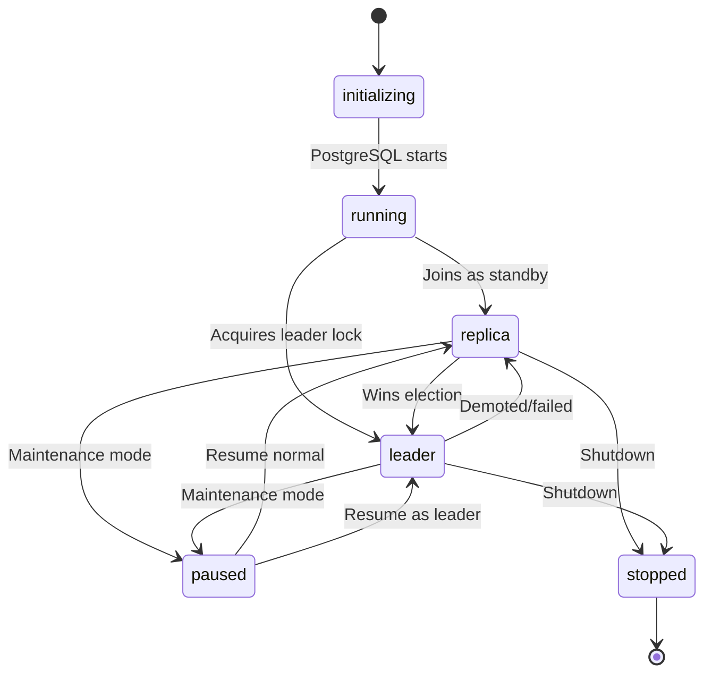
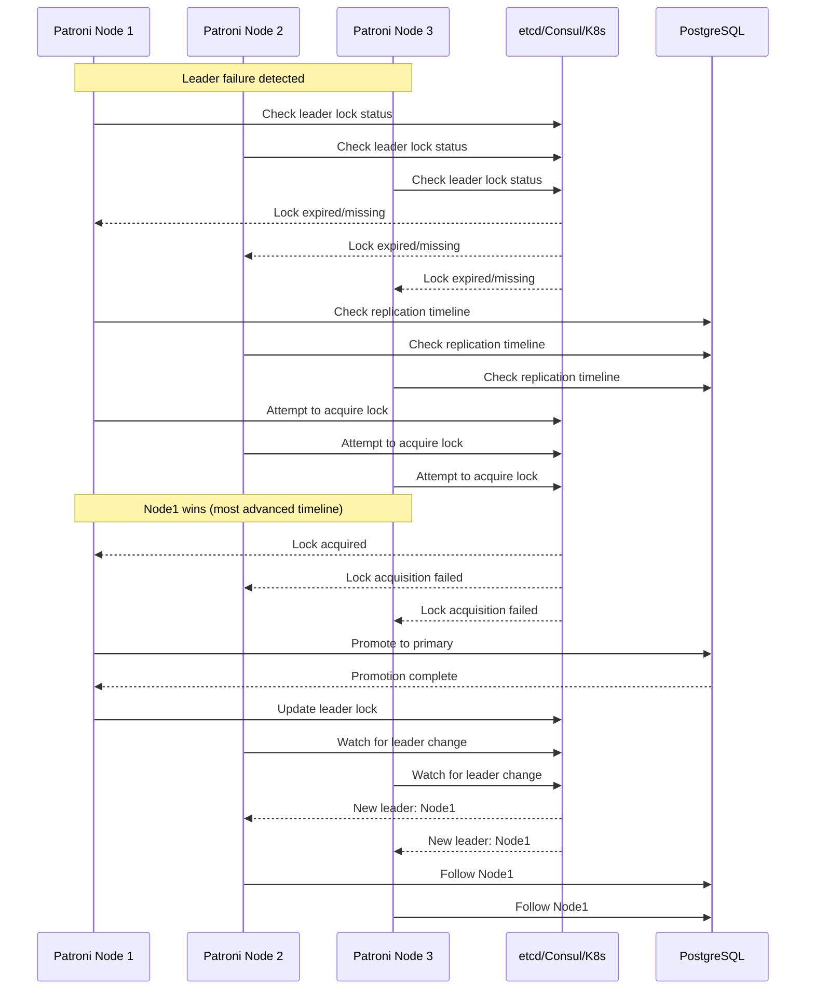

# Patroni Architecture and the Distributed Consensus Store

## Executive Summary

Patroni's architecture centers on a lightweight daemon that orchestrates PostgreSQL instances through a distributed consensus store (DCS). The DCS serves as the single source of truth for cluster state, enabling leader election, configuration management, and failover coordination. Patroni supports etcd, Consul, and Kubernetes as DCS backends, each offering different trade-offs in consistency, operational complexity, and failure modes. Understanding the interaction between Patroni nodes, the DCS, and PostgreSQL is essential for designing resilient high-availability deployments that meet enterprise requirements for zero-downtime operations and disaster recovery.

## Patroni's Architecture

Patroni operates as a supervisory daemon that manages PostgreSQL lifecycle through a well-defined architecture:

- **Patroni Daemon**: The core process that monitors PostgreSQL health, handles configuration changes, and orchestrates failover operations. Each node runs an independent Patroni instance that communicates with other nodes via the DCS.

- **REST API**: Every Patroni instance exposes a REST API (default port 8008) for health checks, status queries, and manual failover triggers. The API serves as the primary interface for monitoring systems and orchestration tools.

- **DCS Interaction**: Patroni maintains persistent connections to the DCS, watching for changes in cluster state and publishing node-specific information. The DCS interaction follows a publish-subscribe pattern where nodes react to events rather than polling.

- **PostgreSQL Management**: Patroni controls PostgreSQL through standard pg_ctl operations, manages recovery.conf settings, and handles promotion/demotion commands. It also manages PostgreSQL configuration files, applying changes dynamically through reloads when possible.

- **Callback Hooks**: Extensible hook system allows custom scripts to run at specific lifecycle events (on_start, on_stop, on_reload, on_role_change). This enables integration with external systems like load balancers, monitoring tools, or custom orchestration logic.

The architecture emphasizes loose coupling between components, with the DCS serving as the coordination layer. This design allows Patroni to scale horizontally and handle network partitions gracefully by relying on the DCS's consensus algorithms.

## The DCS: Heart of Consensus

The Distributed Consensus Store is the foundation of Patroni's coordination mechanism. It stores critical cluster information and ensures all nodes agree on the current state through consensus algorithms.

**Key DCS Data Structures:**

- **Leader Lock**: A time-limited lease that designates the current primary node. The lock includes TTL (Time To Live) metadata and must be continuously renewed by the leader. If the leader fails to renew, other nodes can acquire the lock after expiration.

- **Member Registry**: A directory of all cluster members with their current status, connection information, and last update timestamps. This registry enables nodes to discover each other and assess cluster health.

- **Cluster Configuration**: Centralized storage for PostgreSQL parameters, replication settings, and Patroni-specific options. Changes propagate through the DCS to all nodes, ensuring configuration consistency.

- **Failsafe Mode**: A special state that prevents automatic failover when manual intervention is required. When enabled, Patroni suspends leader election until explicitly disabled.

**Why Consensus Matters:**

Consensus algorithms prevent split-brain scenarios where multiple nodes believe they are the primary. The DCS ensures that only one node can hold the leader lease at any time, even during network partitions. This guarantee is critical for data integrity in PostgreSQL, where simultaneous writes from multiple primaries would cause unrecoverable corruption.

The DCS also provides durability guarantees through replication of its state across multiple nodes. This ensures that cluster state survives individual node failures and enables new nodes to join the cluster with complete historical context.

## DCS Comparison: etcd vs Consul vs Kubernetes Endpoints

| Feature | etcd | Consul | Kubernetes Endpoints |
|---------|------|--------|----------------------|
| **Consistency Model** | Strong consistency via Raft | Strong consistency via Raft | Eventual consistency |
| **Operational Complexity** | Medium - requires cluster management | High - multiple services (agent, server, UI) | Low - leverages Kubernetes control plane |
| **Failure Modes** | Network partition handling, leader election | Network partition handling, leader election | API server failures, etcd dependencies |
| **Community Maturity** | Very mature, CNCF project | Mature, HashiCorp ecosystem | Mature, native to Kubernetes |
| **Performance** | Low latency, high throughput | Higher latency due to gossip protocol | Dependent on Kubernetes API performance |
| **Security** | TLS, mTLS, RBAC support | TLS, ACLs, intentions | Kubernetes RBAC, service accounts |
| **When to Pick** | Dedicated HA clusters, performance-critical | Multi-service discovery, existing Consul | Kubernetes-native deployments |

**etcd** provides the most straightforward integration with Patroni and offers excellent performance for HA workloads. It requires operational expertise to manage clusters but provides strong consistency guarantees.

**Consul** offers additional service discovery features but introduces more operational complexity. Choose Consul when you already have a Consul infrastructure or need service mesh capabilities.

**Kubernetes Endpoints** simplify operations by leveraging the existing Kubernetes control plane. This approach is ideal for cloud-native deployments but inherits Kubernetes' eventual consistency model, which can affect failover timing.

## Leader Election Deep-Dive

Patroni's leader election process is a carefully orchestrated race that ensures only one primary exists while minimizing failover time. The process involves multiple phases:

**1. Initialize Lock Attempt**
- Node checks if leader lock exists and is valid (not expired)
- If no valid lock exists, node attempts to create a new lock with its identifier
- Lock creation is atomic within the DCS, preventing race conditions

**2. TTL Validation**
- Existing leader locks have associated TTL values (typically 30 seconds by default)
- Nodes monitor lock renewal timestamps to detect leader health
- Failed leaders cannot renew locks, causing natural expiration

**3. Timeline Comparison**
- Nodes compare their replication timelines using `pg_last_wal_replay_lsn()`
- The node with the most advanced timeline has priority in election
- This prevents promoting outdated replicas that have fallen behind

**4. Promotion Process**
- Winning node executes `pg_ctl promote` to transition replica to primary
- PostgreSQL updates its state machine and begins accepting writes
- Patroni updates the leader lock with new metadata

**5. DCS Update**
- Newly promoted primary updates the leader lock with its information
- Other nodes observe the change and adjust their replication targets
- Cluster state converges to the new topology

**Synchronous Mode Considerations:**
When `synchronous_mode` is enabled, leader election rules change to prioritize data consistency over availability. The election process includes additional checks for synchronous replica availability and may delay promotion until sufficient replicas are ready to accept synchronous commits.

The entire election process typically completes within 10-20 seconds, depending on DCS latency and PostgreSQL promotion time. This timing can be tuned through `loop_wait`, `ttl`, and `retry_timeout` parameters.

## Replication Topology Patterns

Patroni supports multiple replication topologies to address different availability and performance requirements:

**Single-Leader + N Replicas**
The most common pattern with one primary and multiple read replicas. Provides read scalability and automatic failover. Suitable for most workloads with balanced read/write ratios.

**Cascading Replication**
Hierarchical replication where replicas replicate from other replicas rather than directly from the primary. Reduces primary load in large clusters but increases replication lag and complexity.

**Synchronous vs Asynchronous**
- **Synchronous**: Guarantees zero data loss but increases commit latency. Requires at least one synchronous replica.
- **Asynchronous**: Better performance but potential data loss during failover. Default mode for most deployments.

**synchronous_node_count**
Controls the number of synchronous replicas required for transaction commit. Higher values provide better durability guarantees but reduce performance. Typical values range from 1 (default) to 2 for critical workloads.

The choice of topology depends on your specific requirements for data durability, performance, and geographic distribution. Chapter 10 covers geo-distributed patterns in detail.

## Cross-Reference: Patroni Internals

For the complete Patroni state machine enumeration, leader-election protocol details, watchdog/fencing behavior, and DCS lease tuning math, see [Appendix B — Patroni Internals Deep-Dive](./appendix-b-patroni-internals).

---

## Diagrams

### Patroni Node State Transitions

### Leader Election Flow

*Note: A detailed Excalidraw topology diagram of a 3-region cluster is available in `_diagrams/excalidraw/`. See Chapter 10 for the full geo-distributed walkthrough.*

---

## Implementation Checklist

- [ ] Deploy DCS cluster with odd number of nodes (3 or 5 recommended)
- [ ] Configure appropriate TTL values based on network latency (default: 30s)
- [ ] Set up monitoring for DCS health and leader lock renewal
- [ ] Implement callback hooks for load balancer integration
- [ ] Test failover scenarios in staging environment
- [ ] Configure backup strategy for DCS state
- [ ] Document emergency procedures for manual intervention

## Gotchas

1. **Even-numbered DCS clusters**: Deploying 2-node etcd or Consul clusters creates split-brain scenarios. Always use odd numbers for quorum-based consensus.

2. **TTL misconfiguration**: Setting TTL too low causes unnecessary failovers during network hiccups. Setting it too high delays failover detection. Start with 30 seconds and adjust based on observed network behavior.

3. **Clock skew**: Significant time differences between nodes can cause premature lock expiration. Ensure NTP synchronization across all cluster nodes.

4. **Resource starvation**: Patroni processes consume minimal resources, but DCS nodes (especially etcd) require sufficient memory and I/O. Monitor DCS performance under load.

5. **Callback hook failures**: Faulty callback scripts can block Patroni operations. Test hooks thoroughly and implement proper error handling and timeouts.

## Case Study: Fintech Migration from repmgr to Patroni

A mid-sized fintech company migrated from repmgr to Patroni to improve their PostgreSQL HA capabilities. During the initial deployment, they underestimated etcd's operational requirements and deployed a 2-node etcd cluster for their production database.

**Problem**: The 2-node etcd cluster could not maintain quorum during network partitions or node maintenance, causing complete loss of DCS availability. This prevented any failover operations and left the database cluster in a vulnerable state.

**Pattern Identified**: Always deploy DCS clusters with odd numbers of nodes (3 or 5) to ensure majority-based quorum can be maintained during single-node failures.

**Anti-Pattern**: Even-numbered DCS deployments create split-brain scenarios and should be avoided in production environments.

**Resolution**: The team reconfigured their etcd deployment to use 3 nodes across different availability zones. They also implemented proper monitoring and backup procedures for etcd state.

**Outcome**: After fixing the DCS topology, the company experienced zero unplanned failovers in the following 8 months. The improved stability allowed them to consolidate multiple databases under Patroni management, reducing operational overhead by 40%.

The incident highlighted the critical importance of understanding DCS consensus mechanics when designing HA architectures. The team now includes DCS topology validation in their standard deployment checklist.

---

## Version Support

This chapter covers PostgreSQL versions 18.x and 17.x (N-1 support), Patroni latest stable (4.x), and DCS versions including etcd 3.5.x, Consul 1.18+, and Kubernetes 1.31+. The concepts and architectural patterns described here are expected to remain valid through the next 12 months of releases, though specific configuration options may evolve.