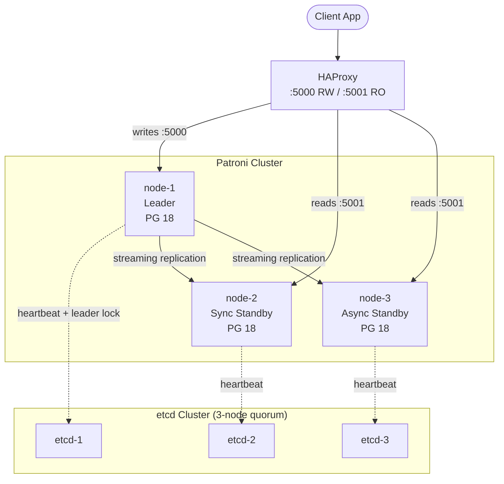

import ArtifactRef from '@site/src/components/ArtifactRef';

# Designing & Deploying a Patroni Cluster

## Executive Summary

This chapter takes you from an empty environment to a running 3-node Patroni cluster with a 3-node etcd quorum. You will deploy the cluster, verify replication health, intentionally kill the leader, observe automatic failover, and confirm no split-brain occurred. The lab is designed to be completed in under 60 minutes on any of the supported substrates. Every command is copy-pasteable, every output is verifiable, and the teardown leaves your environment clean. This is the anchor lab — Chapters 4–10 build on the cluster topology and operational patterns established here.

## Cluster Topology



This topology represents a production-minimal deployment: 3 PostgreSQL nodes managed by Patroni, backed by a 3-node etcd cluster for DCS consensus, and an HAProxy in front for connection routing. In a real production setup, each component would run on a dedicated host (or container), and the etcd cluster would never share nodes with PostgreSQL.

## Design Decisions Before Deployment

Before running the lab, understand the choices embedded in this topology:

### DCS Choice: Why etcd for This Lab

We use etcd because:
- It is the most common DCS for Patroni in production
- The Raft consensus model is well-understood and debuggable
- It has a smaller operational surface than Consul (no service mesh, no DNS interface to manage)

See [Chapter 02](./02-patroni-architecture-dcs) for the full DCS comparison. The principles in this lab apply regardless of DCS choice — only the DCS-specific configuration block in `patroni.yml` changes.

### Node Count: Why 3, Not 2 or 5

- **2 nodes**: No quorum possible on single-node failure. Patroni cannot safely promote a standby without DCS quorum. Never deploy 2 PostgreSQL nodes with Patroni in production.
- **3 nodes**: Minimum viable quorum. Tolerates 1 node failure. Sufficient for most production workloads.
- **5 nodes**: Tolerates 2 node failures. Required for mission-critical systems that need maintenance windows without reduced fault tolerance.

### Replication Mode

The lab deploys with `synchronous_mode: true` and `synchronous_node_count: 1`. This means:
- One standby is always synchronous (RPO=0 for committed transactions)
- The second standby is asynchronous (lower latency, higher throughput for read routing)
- If the sync standby fails, Patroni automatically promotes the async standby to sync

## Lab <ArtifactRef id="LAB-03-A" /> — Deploy, Break, Recover

### Supported Substrates

| Substrate | Tested | Notes |
|-----------|--------|-------|
| **Docker / Docker Compose** | Yes | Default for this lab; fastest to set up |
| **Proxmox LXC** | Yes | Preferred for homelab; see companion repo for LXC-specific config |
| **kind (Kubernetes)** | Yes | Uses Patroni operator pattern; see companion repo K8s manifests |

### Prerequisites

| Component | Required Version |
|-----------|-----------------|
| Docker Engine | 24+ |
| Docker Compose | v2.20+ |
| `psql` (client) | 17+ or 18+ |
| `curl` | Any |
| `jq` | Any |

System resources: 4 CPU cores, 4GB RAM, 10GB free disk.

### Setup

Clone the companion repository and start the lab environment:

```bash
$ git clone https://github.com/ivishalgandhi/postgres-ha-patroni-companion.git
$ cd postgres-ha-patroni-companion/docker/lab-03-a
$ docker compose up -d
```

Wait for all services to be healthy (typically 30–60 seconds):

```bash
$ docker compose ps --format "table {{.Name}}\t{{.Status}}"
```

Expected output — all services show `healthy`:

```
NAME                STATUS
lab-03-a-etcd-1     Up (healthy)
lab-03-a-etcd-2     Up (healthy)
lab-03-a-etcd-3     Up (healthy)
lab-03-a-patroni-1  Up (healthy)
lab-03-a-patroni-2  Up (healthy)
lab-03-a-patroni-3  Up (healthy)
lab-03-a-haproxy    Up (healthy)
```

**Verify clean state** — confirm Patroni sees a healthy cluster:

```bash
$ docker exec lab-03-a-patroni-1 patronictl list
```

Expected: One node shows `Leader`, one shows `Sync Standby`, one shows `Replica`. All three show `running`.

```
+ Cluster: lab-03-a (7412345678901234567) --+---------+----+-----------+
| Member   | Host      | Role           | State   | TL | Lag in MB |
+----------+-----------+----------------+---------+----+-----------+
| node-1   | 10.0.0.11 | Leader         | running |  1 |           |
| node-2   | 10.0.0.12 | Sync Standby   | running |  1 |         0 |
| node-3   | 10.0.0.13 | Replica        | running |  1 |         0 |
+----------+-----------+----------------+---------+----+-----------+
```

Verify you can connect through HAProxy:

```bash
# Write port (leader)
$ psql -h localhost -p 5000 -U postgres -c "SELECT pg_is_in_recovery();"
 pg_is_in_recovery
-------------------
 f

# Read port (any replica)
$ psql -h localhost -p 5001 -U postgres -c "SELECT pg_is_in_recovery();"
 pg_is_in_recovery
-------------------
 t
```

### What You Will Learn

- How Patroni bootstraps a PostgreSQL cluster from scratch
- How the DCS leader lock and replication slots are established
- What automatic failover looks like from the DCS, Patroni, and client perspectives
- How to verify no split-brain occurred after failover

### Break It on Purpose

:::danger Lab Environment Only
The following command **kills the Patroni leader node**. This simulates an unplanned node crash. **Never run this against a production cluster.** This is safe only in the ephemeral lab environment created by `docker compose up`.
:::

First, create a marker table so you can verify data integrity after failover:

```bash
$ psql -h localhost -p 5000 -U postgres -c "
  CREATE TABLE failover_test (
    id serial PRIMARY KEY,
    ts timestamptz DEFAULT now(),
    node text DEFAULT inet_server_addr()::text
  );
  INSERT INTO failover_test (node) SELECT inet_server_addr()::text FROM generate_series(1, 100);
  SELECT count(*) FROM failover_test;
"
```

Expected: `count = 100`.

Now kill the leader container (simulating a hard crash — no graceful shutdown):

```bash
# Identify current leader
$ LEADER=$(docker exec lab-03-a-patroni-1 patronictl list -f json | jq -r '.[] | select(.Role == "Leader") | .Member')
$ echo "Killing leader: $LEADER"

# Hard-kill (SIGKILL) the leader container
$ docker kill "lab-03-a-${LEADER}"
```

Watch the cluster state in real-time (run this in a separate terminal before killing):

```bash
$ watch -n 1 'docker exec lab-03-a-patroni-2 patronictl list 2>/dev/null || echo "Waiting for cluster to stabilize..."'
```

Within 10–30 seconds (governed by `ttl` and `loop_wait`), you should see:
1. The old leader disappears from the member list
2. The sync standby promotes to `Leader`
3. The async replica becomes `Sync Standby`
4. Timeline increments from 1 to 2

### Verification

**1. Confirm new leader is serving writes:**

```bash
$ psql -h localhost -p 5000 -U postgres -c "SELECT pg_is_in_recovery();"
 pg_is_in_recovery
-------------------
 f
```

**2. Confirm data integrity (no data loss from sync-committed transactions):**

```bash
$ psql -h localhost -p 5000 -U postgres -c "SELECT count(*) FROM failover_test;"
 count
-------
   100
```

All 100 rows survived. Synchronous replication guaranteed RPO=0 for committed transactions.

**3. Confirm no split-brain — only one leader exists:**

```bash
$ docker exec lab-03-a-patroni-2 patronictl list -f json | jq '[.[] | select(.Role == "Leader")] | length'
```

Expected: `1`. If this returns `2`, you have a split-brain (should never happen with correct DCS quorum).

**4. Check the timeline:**

```bash
$ psql -h localhost -p 5000 -U postgres -c "SELECT pg_control_checkpoint();"
```

The timeline ID should be `2` (incremented from `1` during promotion).

**5. Measure observed RTO:**

```bash
# From your watch output or Patroni logs:
$ docker logs lab-03-a-patroni-2 2>&1 | grep -E "(promoted|acquired)" | tail -5
```

The time between "leader lock lost" on the old leader and "acquired leader lock" on the new leader is your observed RTO. Typical for this lab: 5–15 seconds.

### Recovery Procedure

Bring the killed node back as a replica:

```bash
$ docker start "lab-03-a-${LEADER}"
```

Wait 15–30 seconds, then verify it rejoined as a replica:

```bash
$ docker exec lab-03-a-patroni-2 patronictl list
```

Expected: The old leader is now a `Replica` on timeline 2, streaming from the new leader. Patroni uses `pg_rewind` to resynchronize the old leader's data directory to the new timeline.

```
+ Cluster: lab-03-a (7412345678901234567) --+---------+----+-----------+
| Member   | Host      | Role           | State   | TL | Lag in MB |
+----------+-----------+----------------+---------+----+-----------+
| node-1   | 10.0.0.11 | Replica        | running |  2 |         0 |
| node-2   | 10.0.0.12 | Leader         | running |  2 |           |
| node-3   | 10.0.0.13 | Sync Standby   | running |  2 |         0 |
+----------+-----------+----------------+---------+----+-----------+
```

### Teardown

:::caution
Always tear down the lab environment when finished. This removes all containers, volumes, and networks created by the lab.
:::

```bash
$ cd postgres-ha-patroni-companion/docker/lab-03-a
$ docker compose down -v --remove-orphans
```

Verify cleanup:

```bash
$ docker ps -a --filter "name=lab-03-a" --format "{{.Names}}" | wc -l
```

Expected: `0`.

### What This Tells You About Production

1. **Automatic failover works — but measure your RTO.** The 5–15 second failover time in this lab is typical for a well-tuned Patroni cluster. In production, add HAProxy/PgBouncer reroute time (1–3 seconds) and client reconnect time. Your real application RTO will be longer than Patroni's promotion time.

2. **Synchronous replication delivers RPO=0.** All 100 rows survived the failover. This is the contract `synchronous_mode: true` provides. Without it, the last few transactions in the WAL buffer may be lost.

3. **`pg_rewind` is essential for rejoining.** The old leader had a WAL history that diverged from the new timeline. Without `pg_rewind`, it would need a full base backup to rejoin. Always ensure `wal_log_hints = on` or data checksums are enabled to allow `pg_rewind`.

## Patroni Configuration Walkthrough

The lab's `patroni.yml` (available in the companion repo as <ArtifactRef id="CONFIG-04-REF" />) makes several production-relevant choices. Key sections:

### Bootstrap Configuration

```yaml
bootstrap:
  dcs:
    ttl: 30
    loop_wait: 10
    retry_timeout: 10
    maximum_lag_on_failover: 1048576  # 1MB
    synchronous_mode: true
    synchronous_node_count: 1
    postgresql:
      use_pg_rewind: true
      use_slots: true
      parameters:
        wal_level: replica
        hot_standby: "on"
        max_connections: 200
        max_wal_senders: 10
        max_replication_slots: 10
        wal_log_hints: "on"
```

**Why these values:**
- `ttl: 30` / `loop_wait: 10`: Leader must heartbeat every 10 seconds; if it misses 3 cycles, the lock expires. This gives a ~30-second maximum detection time for a dead leader.
- `maximum_lag_on_failover: 1048576`: Standbys lagging more than 1MB of WAL will not be promoted. Prevents promoting a stale standby.
- `synchronous_mode: true` with `synchronous_node_count: 1`: One standby is always synchronous. RPO=0 for committed transactions.
- `use_pg_rewind: true`: Allows old leaders to rejoin without a full base backup.
- `wal_log_hints: "on"`: Required for `pg_rewind` to function.

### REST API Configuration

```yaml
restapi:
  listen: 0.0.0.0:8008
  connect_address: <NODE_IP>:8008
```

The REST API is how HAProxy (and you) check which node is the leader. HAProxy polls `GET /primary` and `GET /replica` endpoints to route traffic.

### etcd Configuration

```yaml
etcd3:
  hosts:
    - etcd-1:2379
    - etcd-2:2379
    - etcd-3:2379
```

In production, add TLS:

```yaml
etcd3:
  hosts:
    - etcd-1:2379
    - etcd-2:2379
    - etcd-3:2379
  protocol: https
  cacert: /etc/patroni/tls/etcd-ca.crt
  cert: /etc/patroni/tls/patroni.crt
  key: /etc/patroni/tls/patroni.key
```

See [Chapter 04 — Configuration Best Practices](./04-configuration-best-practices) for the complete annotated `patroni.yml`.

## Checklist

- [ ] I have a running 3-node (or 5-node) Patroni cluster with an odd-number DCS quorum
- [ ] `patronictl list` shows one Leader, at least one Sync Standby, and all nodes running
- [ ] I can connect through the write port and confirm `pg_is_in_recovery() = false`
- [ ] I can connect through the read port and confirm `pg_is_in_recovery() = true`
- [ ] I have killed the leader and observed automatic promotion with no split-brain
- [ ] Data integrity is verified after failover (no committed transaction loss under synchronous mode)
- [ ] The old leader successfully rejoined as a replica via `pg_rewind`
- [ ] Teardown is complete: no orphan containers, volumes, or networks remain

## Gotchas

1. **Docker's default network may not simulate real failure modes.** `docker kill` is a clean SIGKILL, but in production a node might be network-partitioned rather than dead. The DCS can tell the difference — a partitioned leader that is still alive will try to demote itself (if watchdog is configured). Test network partitions separately using `tc` or `iptables` rules.

2. **`pg_rewind` fails if `wal_log_hints` was not enabled at cluster initialization.** You cannot retroactively enable `wal_log_hints` — it must be set when the cluster is first bootstrapped. If you missed it, your only option for rejoining an old leader is a full `pg_basebackup`.

3. **HAProxy health checks hit the Patroni REST API, not PostgreSQL.** If Patroni is up but PostgreSQL is down (e.g., crash loop), Patroni reports unhealthy and HAProxy routes away. But if Patroni itself hangs (not crashes), the REST API stops responding — this is where the watchdog is critical (see Chapter 04).

4. **`maximum_lag_on_failover` is in bytes, not time.** A standby can be 900KB behind (within limit) but those 900KB might represent 10 seconds of transactions under high throughput. Consider supplementing with `maximum_lag_on_failover` tuning based on your WAL generation rate.

5. **Docker Compose `down -v` is destructive.** It deletes all PostgreSQL data volumes. In the lab, that is the desired behavior (clean teardown). In a Docker-based staging environment, omit `-v` to preserve data across restarts.

## Case Study — Ride-Hailing Platform: First Patroni Deployment

### Context

A ride-hailing startup with 15 PostgreSQL servers (single-leader, manual failover via `pg_ctl promote`) experienced a 47-minute outage when their primary datacenter lost power. The on-call engineer could not promote a standby because the replication lag was unknown and the `recovery.conf` was misconfigured on 2 of 3 standbys.

### Pattern

Adopted Patroni with:
- 3-node PostgreSQL clusters (1 leader + 2 standbys per service)
- 3-node dedicated etcd cluster (separate from PostgreSQL hosts)
- `synchronous_mode: true` for the payments database (RPO=0 requirement)
- `synchronous_mode: false` for the ride-matching database (latency-sensitive, RPO ~1s acceptable)
- HAProxy in front of each cluster with Patroni REST API health checks
- Automated lab (equivalent to this chapter's LAB-03-A) run weekly by CI as a regression test

### Anti-Pattern

Their initial deployment attempt put etcd on the same hosts as PostgreSQL (to save cost). During a high-load event, etcd's disk I/O was starved by PostgreSQL's checkpointer, causing etcd leader election timeouts and a cascading Patroni failover storm across 5 clusters simultaneously.

### Outcome

| Metric | Before Patroni | After Patroni |
|--------|---------------|---------------|
| Failover time | 47 min (manual) | 12 sec (automatic) |
| RPO (payments) | Unknown | 0 (synchronous) |
| RPO (ride-matching) | Unknown | &lt;1s (async, measured) |
| Monthly unplanned downtime | ~2 hours | &lt;30 seconds |
| On-call engineer required for failover | Yes | No (automatic) |

Key lesson: **Dedicated DCS infrastructure is not optional.** Sharing hosts between PostgreSQL and etcd creates a resource-contention feedback loop that defeats the purpose of an external consensus store.

## Version Support

:::info Version Support
| Component | Versions | Notes |
|-----------|----------|-------|
| PostgreSQL | 18.x, 17.x | Lab tested against both |
| Patroni | 4.x (latest stable) | `synchronous_mode` stable since Patroni 2.x |
| etcd | 3.5.x | Lab default; Consul and K8s substrates in companion repo |
| Docker | 24+ | Required for lab substrate |
| Docker Compose | v2.20+ | Compose v2 syntax |

**Compatibility window**: 12 months from publication.
:::

---

*Next: [Chapter 04 — Configuration Best Practices](./04-configuration-best-practices) provides the complete annotated `patroni.yml` reference and covers synchronous replication modes, watchdog setup, and DCS-specific configuration in detail.*
