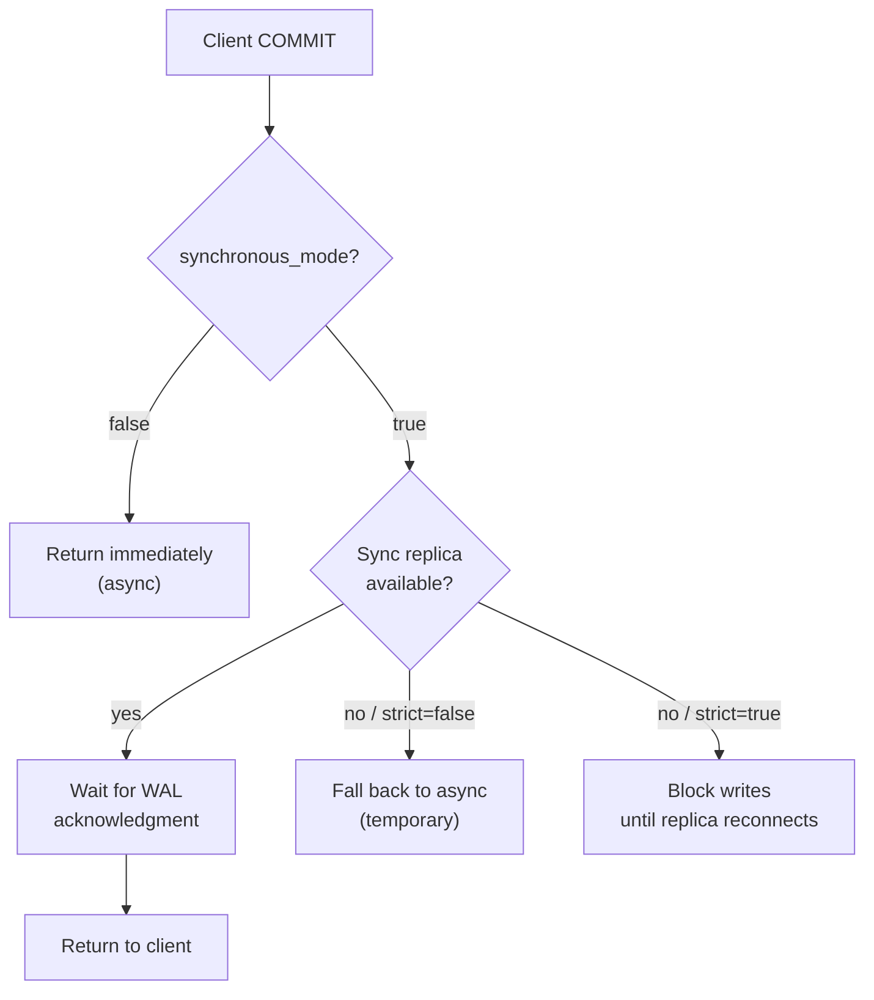

import ArtifactRef from '@site/src/components/ArtifactRef';

# Configuration Best Practices

## Executive Summary

Getting Patroni configuration right is the difference between a cluster that fails over cleanly in 8 seconds and one that splits brains at 2 AM. This chapter is an end-to-end practitioner guide to `patroni.yml` and everything it touches: the bootstrap lifecycle, `pg_hba.conf` handoff, synchronous replication modes, watchdog fencing, replication slot hygiene, DCS-specific authentication, and the chronic problem of configuration drift across large fleets. We treat each section of `patroni.yml` as a first-class engineering artifact — not a one-time setup file — and show you how to govern it accordingly. The annotated reference configuration for all topologies covered in this book lives in the companion repository:

<ArtifactRef id="CONFIG-04-REF" />

By the end of this chapter you will be able to audit any Patroni cluster's configuration for correctness, detect drift across a fleet of nodes using only Patroni's REST API, and make a deliberate, documented choice for each of the three synchronous replication modes.

---

## Anatomy of `patroni.yml`

`patroni.yml` is Patroni's single configuration surface for a node. Every field you set here is either a **local override** (applied only to this node) or a **dynamic configuration** key (stored in the DCS and shared cluster-wide). Understanding which is which is the foundation of config governance.

### Top-Level Structure

A production `patroni.yml` has six logical blocks:

```yaml
# patroni.yml — top-level structure
scope: <CLUSTER_NAME>          # Must match across all nodes in the cluster
namespace: /service/           # DCS key prefix (etcd/Consul path; ignored for k8s)
name: <NODE_NAME>              # Unique per node — use hostname

restapi:                       # Local REST API listener
  ...

bootstrap:                     # One-time cluster initialization; ignored on restart
  ...

postgresql:                    # PostgreSQL integration for this node
  ...

watchdog:                      # Fencing device — do not skip
  ...

tags:                          # Node capability tags used in role assignment
  ...
```

`scope` and `name` are the two values that must differ from a template when you deploy a new node. Every other block may be identical across a fleet — and for drift prevention, should be.

### `bootstrap` Block

`bootstrap` runs exactly once: when the cluster is first initialized on the designated bootstrap node. On all subsequent starts it is ignored. This makes it safe to leave in the file permanently.

```yaml
bootstrap:
  dcs:
    ttl: 30                          # Leader lock TTL (seconds). Start here; tune down only with evidence.
    loop_wait: 10                    # Patroni main loop interval (seconds).
    retry_timeout: 10                # Timeout for DCS operations. Set equal to loop_wait.
    maximum_lag_on_failover: 1048576 # 1 MiB WAL lag ceiling. Replicas beyond this are excluded from election.
    synchronous_mode: false          # See "Synchronous Replication Modes" below.
    synchronous_mode_strict: false   # If true, block writes when no sync replica available.
    postgresql:
      use_pg_rewind: true            # Allow rewind of a demoted primary; essential for fast re-join.
      use_slots: true                # Enable replication slots. See "Replication Slot Strategy" below.
      parameters:
        wal_level: replica           # Minimum for streaming; set logical only if you need it.
        hot_standby: "on"
        wal_keep_size: 128           # MiB. Belt-and-suspenders alongside slots.
        max_wal_senders: 10
        max_replication_slots: 10
        wal_log_hints: "on"         # Required for pg_rewind.
        archive_mode: "on"
        archive_command: <ARCHIVE_COMMAND>

  pg_hba:                            # Written to pg_hba.conf at bootstrap time
    - host replication replicator 0.0.0.0/0 scram-sha-256
    - host all all 0.0.0.0/0 scram-sha-256

  initdb:
    - encoding: UTF8
    - data-checksums            # Always. Enables heap page validation; required for pg_rewind.
```

:::caution `bootstrap.dcs` vs local `postgresql.parameters`
Keys under `bootstrap.dcs.postgresql.parameters` are written to the DCS on first init and govern the entire cluster thereafter. Keys under `postgresql.parameters` (the node-level block, covered next) are local overrides and **will not** propagate to other nodes. Mixing these up is the most common source of configuration drift.
:::

### `postgresql` Block

The `postgresql` block configures this node's integration with its local PostgreSQL instance. It is evaluated on every Patroni start.

```yaml
postgresql:
  listen: 0.0.0.0:5432             # PostgreSQL listener — include all interfaces Patroni needs to reach.
  connect_address: <NODE_IP>:5432  # Address that other nodes and clients use to reach this node. Must be routable.

  data_dir: /var/lib/postgresql/18/main
  bin_dir: /usr/lib/postgresql/18/bin
  config_dir: /etc/postgresql/18/main   # Where Patroni writes postgresql.conf

  pgpass: /var/lib/postgresql/.pgpass   # Auto-maintained by Patroni for replication user auth.

  authentication:
    replication:
      username: replicator
      password: <REPLICATION_PASSWORD>  # Use a secrets manager reference in production.
    superuser:
      username: postgres
      password: <SUPERUSER_PASSWORD>
    rewind:
      username: rewind_user             # Dedicated rewind user — do not reuse superuser.
      password: <REWIND_PASSWORD>

  parameters:
    # Node-local overrides — use sparingly. Prefer bootstrap.dcs.postgresql.parameters for cluster-wide settings.
    unix_socket_directories: "/var/run/postgresql"
```

:::tip Keep `postgresql.parameters` minimal
Every key you put in the node-local `parameters` block is a potential drift vector. Reserve it for genuinely node-specific settings (e.g., `listen_addresses` if nodes have different network configurations). Move everything else to the DCS via Patroni's dynamic configuration API.
:::

### `restapi` Block

```yaml
restapi:
  listen: 0.0.0.0:8008
  connect_address: <NODE_IP>:8008
  authentication:
    username: patroni_api
    password: <API_PASSWORD>          # Required in production. The API can trigger failovers.
  certfile: /etc/patroni/ssl/patroni.crt
  keyfile:  /etc/patroni/ssl/patroni.key
  cafile:   /etc/patroni/ssl/ca.crt
```

Secure the REST API with TLS and HTTP Basic Auth. HAProxy and Kubernetes readiness probes need credentials — document them in your runbook.

### `watchdog` Block

See the dedicated section below. Do not leave this as `mode: off` in production.

```yaml
watchdog:
  mode: required   # "off" | "automatic" | "required". Use "required" in production.
  device: /dev/watchdog
  safety_margin: 5  # Seconds of buffer before the watchdog fires. Must be > 0.
```

### `tags` Block

Tags control role assignment and exclusion from election:

```yaml
tags:
  nofailover: false     # true = this node will never be promoted. Use for delayed replicas.
  noloadbalance: false  # true = exclude from read-traffic routing (HAProxy health check).
  clonefrom: false      # true = allow pg_basebackup clones from this node.
  nosync: false         # true = never designate as a synchronous standby.
```

Tags are the right mechanism for carve-outs like delayed replicas (`nofailover: true`, `noloadbalance: true`) and dedicated backup nodes (`clonefrom: true`).

---

## `pg_hba.conf` Under Patroni

### How Patroni Owns `pg_hba.conf`

Once Patroni manages a PostgreSQL cluster, **Patroni owns `pg_hba.conf`**. On every start, Patroni regenerates it from two sources:

1. `bootstrap.pg_hba` — entries written at cluster init and persisted in the DCS.
2. `postgresql.pg_hba` — local per-node entries appended after the DCS-derived entries.

If you edit `pg_hba.conf` directly on disk, Patroni will overwrite your changes on the next restart. This surprises operators more than almost any other Patroni behavior.

### Replication User Setup

The replication user must appear in `pg_hba.conf` before Patroni can establish streaming replication. The canonical entry is:

```
host replication replicator 0.0.0.0/0 scram-sha-256
```

Restrict the CIDR to your cluster subnet in production — `0.0.0.0/0` is acceptable in an isolated VPC but not on a network shared with untrusted hosts.

Patroni also needs a superuser entry for management operations, and a separate entry for the rewind user if `use_pg_rewind: true`:

```
host all postgres          127.0.0.1/32 scram-sha-256
host all rewind_user       0.0.0.0/0    scram-sha-256
```

### Updating `pg_hba` After Bootstrap

After the cluster is running, update `pg_hba` entries through Patroni's dynamic configuration API — not by editing the file:

```bash
# Add a new pg_hba entry cluster-wide via the REST API
curl -s -u patroni_api:<PASSWORD> \
  -X PATCH http://<LEADER_IP>:8008/config \
  -H 'Content-Type: application/json' \
  -d '{"postgresql": {"pg_hba": ["host all all 10.0.0.0/8 scram-sha-256", "host replication replicator 10.0.0.0/8 scram-sha-256"]}}'
```

This writes the new entries to the DCS, which Patroni then propagates to every node's `pg_hba.conf` on its next loop.

### Common Mistakes

- **Editing `pg_hba.conf` directly**: Overwritten by Patroni on restart.
- **Missing replication user entry**: Results in streaming replication failures that look like authentication errors in the PostgreSQL log.
- **Forgetting the rewind user**: `pg_rewind` fails silently at reconnect time if the rewind user can't authenticate.
- **Too-broad CIDR on the replication entry**: A common audit finding in shared-network deployments.

---

## Synchronous Replication Modes

Patroni exposes three interrelated parameters for synchronous replication. Understanding their interaction with PostgreSQL's own `synchronous_commit` and `synchronous_standby_names` is essential for making the right RPO trade-off.

### The Three Parameters

| Parameter | Scope | What it does |
|---|---|---|
| `synchronous_mode` | DCS (cluster-wide) | Enables Patroni to manage `synchronous_standby_names` automatically |
| `synchronous_mode_strict` | DCS (cluster-wide) | Blocks all writes when no synchronous replica is available |
| `synchronous_node_count` | DCS (cluster-wide) | Number of replicas required to confirm each WAL write |

### `synchronous_mode: false` (Default)

Asynchronous replication. PostgreSQL does not wait for any replica to confirm WAL before returning commit to the client. Maximum write performance; potential data loss of up to `loop_wait` seconds on failover (the replication lag at the moment of failure).

**Use when**: Your RPO > 0 and you prioritize write throughput over zero-loss guarantees. Most OLTP workloads with aggressive backups fall here.

### `synchronous_mode: true`

Patroni dynamically manages `synchronous_standby_names`, automatically promoting a replica from async to sync as nodes join and leave the cluster. At least one replica must acknowledge WAL before commit returns.

```yaml
# In bootstrap.dcs:
synchronous_mode: true
synchronous_node_count: 1   # Number of replicas required for commit acknowledgment
```

When the designated synchronous replica falls behind or disconnects, Patroni automatically promotes another eligible replica to synchronous standby, maintaining the `synchronous_standby_names` list in PostgreSQL. This is the key difference from configuring `synchronous_standby_names` manually: Patroni heals the list automatically.

**Use when**: RPO = 0 is required and you have at least 2 replicas. Adds commit latency proportional to round-trip time to the nearest replica.

### `synchronous_mode_strict: true`

When enabled alongside `synchronous_mode: true`, Patroni sets `synchronous_commit = remote_apply` in PostgreSQL and blocks all writes if no synchronous replica is available. This eliminates any window of data loss but at the cost of availability — a cluster with all replicas down becomes completely read-only.

```yaml
synchronous_mode: true
synchronous_mode_strict: true
synchronous_node_count: 1
```

**Use when**: Regulatory or financial requirements mandate zero data loss AND you accept write unavailability over data loss. Financial trading systems and ledger databases are the canonical use case.

:::danger `synchronous_mode_strict` and availability
With `synchronous_mode_strict: true`, losing all replicas simultaneously makes the primary read-only. If your cluster has 1 primary + 1 replica and the replica fails, writes stop. Size your cluster accordingly (1 primary + 2 replicas minimum) before enabling strict mode.
:::

### Interaction with Quorum Commit

PostgreSQL 18.x supports quorum commit via `ANY N (replica1, replica2, ...)` syntax in `synchronous_standby_names`. Patroni's `synchronous_node_count: 2` maps to this pattern when more than two replicas are available, allowing PostgreSQL to acknowledge a transaction when any two replicas confirm it — not necessarily the same two each time. This provides better throughput than requiring a fixed replica list while still guaranteeing durability across `N` nodes.



---

## Watchdog Configuration

### Why Watchdog Matters

Split-brain — two nodes simultaneously believing they are the leader — is catastrophic for PostgreSQL. Patroni's leader lock in the DCS is the primary defense, but what happens if the leader node's Patroni daemon dies while PostgreSQL continues running? Without a watchdog, that PostgreSQL instance keeps accepting writes until someone manually stops it.

A watchdog is a hardware or software timer that reboots the system if the supervising process (Patroni) fails to heartbeat within the configured interval. It is the last line of defense against a stale primary continuing to serve writes after Patroni has lost its DCS lock.

### `softdog` vs Hardware Watchdog

| | `softdog` (kernel module) | Hardware watchdog |
|---|---|---|
| **Setup cost** | Low — `modprobe softdog` | Requires hardware support or BMC |
| **Reliability** | Stops if kernel panics | Survives kernel panics |
| **Cloud support** | Works everywhere | Varies by provider |
| **Recommendation** | Development, cloud VMs without BMC | Bare metal, high-criticality |

For production cloud deployments, `softdog` is widely used and acceptable. For bare-metal clusters where a kernel panic on the leader is a realistic failure mode, use a hardware watchdog (e.g., Intel iDRAC, HP iLO, or the cloud provider's equivalent if available).

### Kernel Module Setup

```bash
# Load softdog at boot
echo "softdog" | sudo tee /etc/modules-load.d/softdog.conf

# Load immediately
sudo modprobe softdog

# Verify device exists
ls -la /dev/watchdog
# crw------- 1 root root 10, 130 ... /dev/watchdog

# Grant Patroni access (run as root or add patroni user to appropriate group)
sudo chown postgres:postgres /dev/watchdog
# Or add a udev rule for persistence:
echo 'KERNEL=="watchdog", OWNER="postgres", GROUP="postgres", MODE="0600"' \
  | sudo tee /etc/udev/rules.d/61-watchdog.rules
sudo udevadm trigger
```

### `patroni.yml` Watchdog Configuration

```yaml
watchdog:
  mode: required        # Patroni will refuse to start if watchdog is unavailable.
  device: /dev/watchdog
  safety_margin: 5      # Watchdog fires 5 seconds before TTL expires; gives Patroni time to shut down cleanly.
```

`safety_margin` must satisfy: `safety_margin < ttl - loop_wait`. With `ttl: 30` and `loop_wait: 10`, a `safety_margin` of 5 leaves a 15-second window for Patroni to heartbeat the watchdog.

### systemd Integration

When running Patroni under systemd, ensure the watchdog device is available before the unit starts:

```ini
[Unit]
Description=Patroni PostgreSQL HA
After=syslog.target network.target

[Service]
User=postgres
Group=postgres
ExecStart=/usr/local/bin/patroni /etc/patroni/patroni.yml
ExecReload=/bin/kill -HUP $MAINPID
KillMode=process
TimeoutSec=30
Restart=on-failure

[Install]
WantedBy=multi-user.target
```

:::caution `TimeoutSec` and watchdog
Set `TimeoutSec` long enough that systemd does not SIGKILL Patroni before the watchdog fires during a controlled shutdown. `30` seconds is a safe default with standard TTL settings.
:::

---

## Replication Slot Strategy

### `use_slots: true` — Default and Recommended

Replication slots prevent the primary from removing WAL segments that a replica hasn't yet consumed. Without slots, a slow replica can fall behind, the WAL can be recycled, and the replica must be rebuilt from a base backup. With slots, the primary holds WAL until every slot has consumed it.

```yaml
bootstrap:
  dcs:
    postgresql:
      use_slots: true
```

Patroni creates one permanent replication slot per cluster member automatically when `use_slots: true`. Slot names follow the pattern `<scope>_<node_name>`.

### Slot Bloat: The Risk You Must Manage

The same mechanism that protects lagging replicas can accumulate unbounded WAL if a replica is removed without cleaning up its slot, or if a replica falls significantly behind and stays there.

**Detection:**

```sql
-- Check slot lag across all slots
SELECT
    slot_name,
    slot_type,
    active,
    pg_size_pretty(pg_wal_lsn_diff(pg_current_wal_lsn(), restart_lsn)) AS retained_wal,
    restart_lsn
FROM pg_replication_slots
ORDER BY pg_wal_lsn_diff(pg_current_wal_lsn(), restart_lsn) DESC;
```

**Alert threshold**: Alert when any slot retains more than `wal_keep_size * 2` (e.g., 256 MiB with the default 128 MiB `wal_keep_size`). Page when retained WAL exceeds 1 GiB.

**Remediation**: If a slot belongs to a decommissioned node:

```bash
# Via Patroni REST API — preferred, as Patroni recreates slots on member re-join
curl -s -u patroni_api:<PASSWORD> \
  -X DELETE http://<LEADER_IP>:8008/slots/<SLOT_NAME>

# Directly in SQL if the REST API is unavailable
SELECT pg_drop_replication_slot('<SLOT_NAME>');
```

### Temporary Slots for pg_basebackup

When cloning a new replica via `pg_basebackup`, Patroni uses a temporary replication slot for the clone operation. These are automatically cleaned up on completion. If a clone is interrupted, check for orphaned temporary slots:

```sql
SELECT slot_name, temporary, active FROM pg_replication_slots WHERE temporary = true;
```

### Monitoring Slot Lag

Include these metrics in your Grafana dashboard (see Chapter 06):

- `pg_replication_slots_active` — 0 = slot is inactive (replica disconnected)
- `pg_replication_slots_retained_bytes` — WAL held for each slot
- `pg_stat_replication.replay_lag` — per-replica lag in seconds

---

## DCS-Specific Configuration

### etcd — TLS and Authentication

```yaml
etcd3:
  hosts:
    - etcd1.internal:2379
    - etcd2.internal:2379
    - etcd3.internal:2379
  protocol: https
  cacert: /etc/patroni/ssl/etcd-ca.crt
  cert:    /etc/patroni/ssl/patroni-client.crt
  key:     /etc/patroni/ssl/patroni-client.key
```

Use `etcd3` (not the legacy `etcd`) in all new deployments. mTLS is strongly recommended; etcd password authentication is available but adds operational overhead with minimal security gain over mTLS.

:::tip etcd endpoint health check
Before starting Patroni, verify all etcd endpoints are reachable and healthy:

```bash
etcdctl --endpoints=etcd1.internal:2379,etcd2.internal:2379,etcd3.internal:2379 \
        --cacert=/etc/patroni/ssl/etcd-ca.crt \
        --cert=/etc/patroni/ssl/patroni-client.crt \
        --key=/etc/patroni/ssl/patroni-client.key \
        endpoint health
```
:::

### Consul — ACLs and Service Registration

```yaml
consul:
  host: 127.0.0.1:8500      # Use the local Consul agent; avoid talking to servers directly.
  scheme: https
  token: <CONSUL_ACL_TOKEN>  # Token must have: key:write for /service/<scope>/, session:write
  verify: true
  cacert: /etc/consul/ssl/ca.crt
  cert:   /etc/consul/ssl/patroni-client.crt
  key:    /etc/consul/ssl/patroni-client.key
```

The minimum Consul ACL policy for a Patroni node:

```hcl
key_prefix "service/<CLUSTER_NAME>/" {
  policy = "write"
}
session_prefix "" {
  policy = "write"
}
```

Restrict the token to the specific `key_prefix` for your cluster — not a wildcard. If you run multiple Patroni clusters sharing a Consul datacenter, each cluster gets its own scoped token.

### Kubernetes — Endpoint Mode

```yaml
kubernetes:
  namespace: postgres          # Kubernetes namespace where Patroni endpoints live
  labels:
    application: patroni
    cluster-name: <CLUSTER_NAME>
  use_endpoints: true          # Use Endpoints rather than ConfigMaps (default in Patroni 4.x)
  scope_label: cluster-name
```

Patroni requires a ServiceAccount with permissions to manage Endpoints (or EndpointSlices in 1.31+) in the target namespace:

```yaml
rules:
  - apiGroups: [""]
    resources: ["endpoints", "configmaps"]
    verbs: ["create", "get", "list", "patch", "update", "watch", "delete"]
  - apiGroups: [""]
    resources: ["pods"]
    verbs: ["get", "list", "watch", "patch"]
```

---

## Configuration Drift Detection

### The Drift Problem

At scale, `patroni.yml` drift is inevitable without active controls. An operator hand-edits a node during an incident. A configuration management tool applies a stale template. A Patroni upgrade adds new keys that the old template doesn't set. Over time, nodes diverge silently.

The failure mode is insidious: drift rarely causes immediate failures. It causes *unexpected behavior* during failover — the one moment when your configuration must be exactly right.

### Patroni's Dynamic Configuration vs Local Overrides

The DCS-stored dynamic configuration (under `bootstrap.dcs`) is the ground truth for cluster-wide PostgreSQL parameters. Patroni's `PATCH /config` REST API updates it atomically and propagates it to every node within one `loop_wait` cycle.

Local overrides in `postgresql.parameters` are applied per-node and are not visible to other nodes or the DCS. They should be treated as exceptions requiring explicit documentation, not the default configuration surface.

**Governance rule**: If a PostgreSQL parameter applies to the whole cluster, it belongs in the DCS. If it is genuinely node-specific (e.g., tuning for heterogeneous hardware), document it in a comment in the per-node `patroni.yml` and track it in your configuration management system.

### Detecting Drift with the REST API

Patroni's `/config` endpoint returns the current DCS-stored configuration. Compare it against your source-of-truth (version-controlled `patroni.yml` template):

```bash
# Dump current DCS config from the leader
curl -s http://<LEADER_IP>:8008/config | jq . > /tmp/live-config.json

# Diff against your source-of-truth
diff <(jq -S . /tmp/live-config.json) <(jq -S . /path/to/expected-config.json)
```

For fleet-wide node config comparison:

```bash
# Collect cluster member list and check each node's local config hash
curl -s http://<ANY_NODE>:8008/cluster | jq -r '.members[].api_url' | \
  while read url; do
    node=$(curl -s "$url/patroni" | jq -r '.patroni.name')
    hash=$(curl -s "$url/config" | jq -cS . | sha256sum | cut -d' ' -f1)
    echo "$node $hash"
  done
```

Nodes with divergent hashes are your drift candidates.

### Preventing Drift: Three Controls

**1. Single source of truth in DCS**

Use `patronictl edit-config` for all cluster-wide parameter changes. This writes directly to the DCS and is the canonical way to change shared configuration.

```bash
patronictl -c /etc/patroni/patroni.yml edit-config
```

**2. Configuration management enforcement**

Template `patroni.yml` in your configuration management system (Ansible, Chef, Puppet). The template should set only `scope`, `name`, and node-specific networking — everything else inherits from the DCS. Apply the template on every deployment and flag deviations as alerts in your monitoring system.

**3. CI-gated config changes**

Treat changes to your `patroni.yml` Ansible role or Helm values as code: require peer review, run `patronictl validate` in CI, and deploy via your standard change process. Ad-hoc SSH edits to production configuration files should be a policy violation.

---

## Checklist

- [ ] **`scope` and `name` are unique per node** — validate with `patronictl list` on a fresh cluster before adding load.
- [ ] **Watchdog is configured and tested** — verify with `patronictl show-config` and test by killing the Patroni process while monitoring `/dev/watchdog` activity.
- [ ] **`synchronous_mode` is set according to my RPO requirements** — documented with rationale in your team's runbook.
- [ ] **All cluster-wide PostgreSQL parameters are in `bootstrap.dcs`, not in node-local `postgresql.parameters`** — audit with `diff` against your template.
- [ ] **`pg_hba.conf` entries are managed via Patroni REST API, not edited directly** — confirm with `grep -r pg_hba /etc/patroni` and check for any unmanaged entries.
- [ ] **Replication slot lag is monitored with an alert at ≥256 MiB retained WAL per slot** — verify in your Prometheus rule set.
- [ ] **DCS authentication (TLS for etcd, ACL token for Consul, ServiceAccount for Kubernetes) is in place** — run `patronictl list` to confirm DCS connectivity from each node.
- [ ] **Configuration drift detection runs on a schedule** — either via a cron job diffing `/config` output or as a Prometheus custom metric.

---

## Gotchas

1. **Editing `pg_hba.conf` or `postgresql.conf` directly**: Patroni overwrites both on restart. Use `PATCH /config` for cluster-wide settings and `patronictl edit-config` for interactive changes.

2. **Leaving watchdog in `mode: off`**: This is the default in some package installs. A Patroni daemon crash on the leader node will leave a stale PostgreSQL primary running indefinitely. Set `mode: required` in production.

3. **Setting `synchronous_mode_strict: true` on a 1+1 cluster**: With a single replica, one replica failure makes the primary read-only. Clients see connection errors, not a degraded mode. Ensure you have enough replicas before enabling strict mode.

4. **`use_slots: true` without slot lag monitoring**: Slots accumulate WAL from failed nodes silently. A decommissioned node whose slot was not cleaned up will hold WAL indefinitely, eventually filling your disk.

5. **Mixing `bootstrap.dcs.postgresql.parameters` and `postgresql.parameters`**: Conflicting values in these two blocks create unpredictable behavior. The local override wins on the affected node, silently diverging from the cluster-wide setting.

6. **Deploying Patroni without TLS on the REST API**: The API can trigger failovers and return replication user credentials. An unauthenticated HTTP endpoint in a shared network is an unacceptable risk.

---

## Case Study: Configuration Drift at Scale

### Context

An e-commerce platform operating 200+ Patroni nodes across five data centers ran a Patroni upgrade from 3.x to 4.x during a quarterly maintenance window. The upgrade procedure involved rolling restarts managed by Ansible. The Ansible role used to restart Patroni templated `patroni.yml` from a central repo — but the role had accumulated node-specific overrides in local `host_vars` files that operators had added over the preceding 18 months.

### What Happened

Post-upgrade, the platform's SRE team noticed inconsistent failover behavior in one data center: some failovers completed in 12 seconds while others took 45+ seconds. A configuration audit revealed that 47 of the 200+ nodes had `wal_level` set to `logical` in their node-local `postgresql.parameters` block — a setting left over from an earlier logical replication experiment. This override superseded the cluster-wide `wal_level: replica` in the DCS, causing the affected nodes' PostgreSQL instances to generate significantly more WAL, increasing replication lag and slowing failovers.

### The Pattern

The root cause was mixing node-local `postgresql.parameters` overrides with cluster-wide DCS configuration. When the Patroni 4.x upgrade added new handling for `postgresql.parameters`, the interaction between local overrides and DCS config changed subtly, making dormant drift suddenly visible.

### The Anti-Pattern

Operators had treated `postgresql.parameters` in `patroni.yml` as a convenient place to make one-off tuning changes during incidents, intending to "clean up later." Without automated drift detection, these changes accumulated invisibly across the fleet.

### Remediation

The team used the Patroni REST API to batch-audit all 200+ nodes in under 10 minutes:

```bash
# Collect all nodes' postgresql.parameters from their local patroni config
patronictl -c /etc/patroni/patroni.yml list --format json | \
  jq -r '.[].host' | \
  xargs -P10 -I{} bash -c \
    'echo "{}"; curl -s http://{}:8008/patroni | jq ".parameters.wal_level"'
```

The 47 affected nodes were identified in 8 minutes. Using `PATCH /config` via the REST API, the team pushed a corrective cluster-wide `wal_level: replica` setting that overrode all local values:

```bash
curl -s -u patroni_api:<PASSWORD> \
  -X PATCH http://<LEADER_IP>:8008/config \
  -H 'Content-Type: application/json' \
  -d '{"postgresql": {"parameters": {"wal_level": "replica"}}}'
```

Patroni applied the change cluster-wide within two `loop_wait` cycles — under 30 seconds. A rolling `pg_reload_conf()` via Ansible completed the remediation. Total time from audit start to verified remediation: 2 hours. Zero downtime.

### Transferred Pattern

> **Use Patroni's dynamic configuration exclusively for cluster-wide PostgreSQL parameters. Disable local `postgresql.parameters` overrides by policy, and enforce this in CI.** Any parameter not in the DCS-managed config is a drift vector waiting to surface during your next major upgrade.

---

## Version Support

| Component | Supported Versions | Notes |
|---|---|---|
| **PostgreSQL** | 18.x, 17.x | N and N-1 |
| **Patroni** | 4.x (latest stable) | `use_endpoints: true` default added in 4.x for Kubernetes mode |
| **etcd** | 3.5.x | Use `etcd3` key in `patroni.yml`; legacy `etcd` key is deprecated |
| **Consul** | 1.18+ | ACL v2 required |
| **Kubernetes** | 1.31+ | EndpointSlice support; verify RBAC rules if upgrading from 1.29 |

**Compatibility window**: 12 months from publication. Configuration key names and defaults may evolve across Patroni minor releases — always test against the exact version pinned in `ARTIFACT-IDS.md` in the companion repository.

:::caution Running Patroni 3.x?
The `etcd3` key is strongly preferred in Patroni 4.x; the legacy `etcd` key still works but is not tested against new etcd 3.5.x features. If you are on Patroni 3.x, refer to Appendix A for the Python runtime migration path before upgrading.
:::

---

*Continue to [Chapter 05 — Performance Tuning for High Availability](./05-performance-tuning-ha).*
