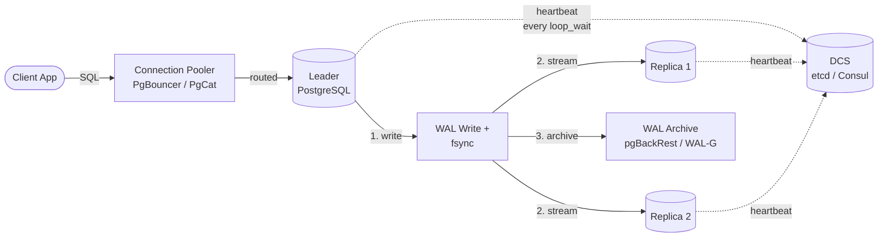

# Performance Tuning Under HA Constraints

## Executive Summary

Running PostgreSQL under Patroni adds measurable overhead: DCS heartbeats, watchdog timers, synchronous replication round-trips, and REST API health checks all consume resources and add latency. Most of this tax is small — single-digit milliseconds — but it compounds under load and becomes visible at the tail. This chapter quantifies each source of overhead, provides tuning knobs to minimize it, and gives you a benchmarking methodology to validate your configuration under both normal and degraded (N-1 node) conditions. The goal is not to eliminate the HA tax — that is the price of split-brain prevention — but to ensure you are not paying more than necessary.

## The Write Path Under HA



Every write traverses this path. The HA-specific additions compared to standalone PostgreSQL are steps 2 (streaming to replicas, blocking if synchronous), 3 (continuous archival), and the DCS heartbeat loop. Each is tunable.

## The HA Performance Tax

Before tuning, measure. The overhead breaks down into four categories:

| Source | Typical Overhead | When It Hurts |
|--------|-----------------|---------------|
| **DCS heartbeat** (`loop_wait`) | &lt;1ms per cycle | Rarely — but a slow DCS response can delay Patroni's main loop, causing false health-check failures |
| **REST API health checks** | 1–5ms per request | Under aggressive load-balancer polling (&lt;1s intervals) |
| **Synchronous replication** | 0.5–50ms per commit | Always, proportional to network RTT to the sync standby |
| **Watchdog timer** | Negligible CPU | Never during normal operation; only fires on Patroni hang |

**How to measure the delta**: Run `pgbench` against a standalone PostgreSQL instance, then against the same instance under Patroni with one synchronous standby. The difference in p50/p99 commit latency is your HA tax.

```bash
# Baseline: standalone
$ pgbench -c 16 -j 4 -T 60 -P 5 --protocol=prepared mydb

# HA mode: Patroni with sync standby
$ pgbench -c 16 -j 4 -T 60 -P 5 --protocol=prepared mydb
# Compare tps and latency average/stddev
```

## Checkpointer and WAL Settings Under HA

Checkpointer and WAL configuration directly affect failover speed, replication lag, and disk I/O patterns. Under HA, the stakes are higher because a checkpoint storm on the leader can spike replication lag on standbys, potentially triggering false failover alerts.

### Key Parameters

| Parameter | Default | HA-Tuned Range | Why It Matters Under HA |
|-----------|---------|---------------|------------------------|
| `checkpoint_timeout` | 5min | 10–15min | Longer intervals = fewer checkpoint storms = steadier replication lag |
| `max_wal_size` | 1GB | 2–4GB | Larger WAL budget between checkpoints; prevents forced checkpoints under write spikes |
| `min_wal_size` | 80MB | 512MB–1GB | Keeps WAL segments pre-allocated; reduces file-system allocation stalls |
| `wal_compression` | off | `zstd` (PG 18) or `lz4` | Reduces WAL volume shipped to standbys; meaningful for cross-AZ replication |
| `full_page_writes` | on | **on** (do not disable) | Required for crash recovery; disabling saves ~20% WAL volume but makes PITR unreliable |
| `wal_keep_size` | 0 | 2–4GB or use slots | Ensures standbys can reconnect after brief disconnects without needing a full base backup |

### wal_keep_size vs Replication Slots

Two strategies prevent standbys from falling behind and requiring a base backup rebuild:

1. **`wal_keep_size`**: Simple, no slot management overhead, but WAL is retained even if no standby needs it (disk waste) and a standby that falls too far behind still needs a rebuild.
2. **Replication slots** (`use_slots: true` in Patroni): WAL retention is per-standby and automatic, but a disconnected standby's slot can cause unbounded WAL accumulation (slot bloat).

**Recommendation**: Use replication slots (Patroni's default) with **slot bloat monitoring**. Set `max_slot_wal_keep_size` (PostgreSQL 13+) as a safety valve:

```yaml
# In Patroni dynamic configuration
postgresql:
  parameters:
    max_slot_wal_keep_size: 8GB  # Safety cap; alert well before this
```

Monitor slot lag with:

```sql
SELECT slot_name,
       pg_wal_lsn_diff(pg_current_wal_lsn(), restart_lsn) / 1024 / 1024 AS lag_mb
FROM pg_replication_slots
WHERE active = false;
```

## Autovacuum on Standbys

Autovacuum does not run on hot standbys — only on the leader. But standbys affect vacuum behavior on the leader through two mechanisms:

### hot_standby_feedback

When `hot_standby_feedback = on`, standbys send their oldest running transaction's `xmin` to the leader. The leader's vacuum will not remove tuples still visible to that transaction. A long-running analytical query on a standby can block vacuum on the leader, causing table bloat.

**Mitigation**:

- Set `max_standby_streaming_delay` to a bounded value (e.g., 30s) so long queries on standbys are canceled rather than blocking vacuum indefinitely
- Monitor `pg_stat_activity` on standbys for queries exceeding your delay budget
- Consider using a dedicated reporting replica with `hot_standby_feedback = off` for long analytical queries

### Replication Slot Interaction

Even without `hot_standby_feedback`, a standby's replication slot prevents the leader from removing WAL segments the standby hasn't consumed. If the standby is down, the slot retains WAL on the leader's disk indefinitely (absent `max_slot_wal_keep_size`).

**Combined effect**: A down standby + an analytical standby with `hot_standby_feedback = on` = table bloat + WAL bloat simultaneously. Monitor both.

## Connection Pooling at the Proxy Tier

Under HA, the connection pooler must be **failover-aware** — it needs to detect leader changes and reroute writes to the new leader. This is the most common source of application-visible latency during failover.

### PgBouncer vs PgCat (2026 State)

| Feature | PgBouncer | PgCat |
|---------|-----------|-------|
| **Maturity** | Battle-tested (15+ years) | Newer, rapidly maturing |
| **Protocol** | Session / Transaction / Statement | Transaction (primary); Session supported |
| **Multi-host** | Requires external failover signal (e.g., Patroni callback → `pgbouncer reload`) | Native multi-host with health checks |
| **Sharding** | No | Built-in query routing |
| **Auth passthrough** | `auth_query` | Native SCRAM passthrough |
| **TLS** | Supported | Supported |
| **Performance** | Excellent for single-backend routing | Comparable; Rust-based, lower tail latency at high concurrency |

### Failover-Aware Pool Configuration

**PgBouncer pattern** — Patroni callback triggers PgBouncer reconfiguration:

```yaml
# patroni.yml callback section
postgresql:
  callbacks:
    on_start: /usr/local/bin/update-pgbouncer.sh
    on_role_change: /usr/local/bin/update-pgbouncer.sh
```

The callback script updates PgBouncer's `[databases]` section to point at the new leader's IP, then signals `pgbouncer reload`. Total reroute time: 1–3 seconds, bounded by PgBouncer's drain of in-flight sessions.

**PgCat pattern** — configure multiple backends with health-check routing:

```toml
[pools.mydb]
pool_mode = "transaction"

[pools.mydb.shards.0]
servers = [
  ["node1:5432", "primary"],
  ["node2:5432", "replica"],
  ["node3:5432", "replica"],
]
healthcheck_timeout = 1000  # ms
ban_time = 10               # seconds; ban unhealthy backend
```

PgCat's health checks detect the new leader via Patroni's REST API or PostgreSQL's `pg_is_in_recovery()` function, and reroute automatically.

### Session vs Transaction Mode Under HA

- **Transaction mode** is strongly preferred under HA. It releases the backend connection after each transaction, allowing faster failover (no long-held sessions blocking pool drain) and better connection utilization.
- **Session mode** holds a dedicated backend connection for the client's entire session. During failover, these sessions must be forcibly terminated. Use session mode only for clients that rely on session-level state (`SET`, `PREPARE`, temp tables).

## HOT Updates vs Replication Trade-offs

PostgreSQL's Heap-Only Tuple (HOT) optimization avoids index updates when the updated columns are not indexed and the new tuple fits on the same page. Under HA, HOT matters because:

- **HOT-eligible updates generate less WAL** — the index entries are not modified, so less WAL volume is shipped to standbys
- **Lower `fillfactor` increases HOT eligibility** — leaving free space per page lets updated tuples stay on the same page, but increases physical table size
- **Replication lag is WAL-volume-dependent** — reducing WAL per transaction directly reduces replication lag under write-heavy workloads

**Tuning guidance**:

| Workload | Recommended `fillfactor` | HOT Impact |
|----------|------------------------|------------|
| Read-heavy (OLTP, ≤10% updates) | 100 (default) | Minimal benefit; don't waste space |
| Update-heavy (≥30% updates on non-indexed columns) | 70–80 | Significant WAL reduction; measure with `pg_stat_user_tables.n_tup_hot_upd` |
| Mixed | 85–90 | Moderate benefit; benchmark |

Monitor HOT effectiveness:

```sql
SELECT relname,
       n_tup_upd,
       n_tup_hot_upd,
       CASE WHEN n_tup_upd > 0
            THEN round(100.0 * n_tup_hot_upd / n_tup_upd, 1)
            ELSE 0 END AS hot_pct
FROM pg_stat_user_tables
WHERE n_tup_upd > 1000
ORDER BY n_tup_upd DESC;
```

## Tuning for Synchronous Replication

Synchronous replication (`synchronous_mode: true` in Patroni) guarantees RPO=0 but adds commit latency equal to the round-trip time to the slowest synchronous standby. Tuning decisions:

### Latency Budget

```
commit_latency = local_fsync + network_RTT_to_sync_standby + remote_WAL_write
```

- **Same-AZ standby**: ~0.5–2ms additional commit latency
- **Cross-AZ standby** (same region): ~2–5ms
- **Cross-region standby**: ~20–100ms+ (usually impractical for synchronous)

### synchronous_commit Levels

| Level | Durability | Latency | Use Case |
|-------|-----------|---------|----------|
| `on` (default) | WAL flushed on leader | Baseline | Non-replicated or async |
| `remote_write` | Standby received + written (not flushed) | +0.5–1ms | Acceptable for most HA setups |
| `remote_apply` | Standby applied (visible to reads) | +1–3ms | Read-your-writes consistency on standbys |
| `off` | Async; commit returns before WAL flush | -1–2ms | Bulk loads, non-critical writes |

**Recommendation**: Use `remote_apply` when you need read-your-writes consistency on standbys (common in active-active read routing). Use `remote_write` for lower latency when you only need durability guarantees.

### Network Bandwidth Planning

Synchronous replication consumes bandwidth proportional to WAL generation rate. Budget:

```
bandwidth_needed = wal_generation_rate × replication_factor
```

For a workload generating 100MB/s of WAL with 2 synchronous standbys: 200MB/s of replication bandwidth. Ensure your inter-node network can sustain this with headroom for spikes.

## Benchmarking Under HA

Standard `pgbench` runs are necessary but insufficient. HA-specific benchmarking must include:

### 1. Baseline Under Normal Operation

```bash
$ pgbench -i -s 100 mydb  # Initialize with scale factor 100
$ pgbench -c 32 -j 8 -T 300 -P 10 --protocol=prepared \
    --log --log-prefix=ha-normal mydb
```

Capture: tps, p50/p99/p999 latency, WAL generation rate (`pg_stat_wal`).

### 2. Under Degraded Mode (N-1 Nodes)

Stop one replica and re-run the same benchmark. Key questions:

- Does commit latency change? (It should if you lost the sync standby and Patroni downgraded to async.)
- Does WAL accumulate? (Check slot lag.)
- Does the remaining replica's apply lag increase?

### 3. With Failover Injection

Run `pgbench` continuously, then kill the leader mid-benchmark:

```bash
# In a separate terminal, after 60s of pgbench:
$ patronictl -c /etc/patroni/patroni.yml switchover --force
```

Measure:

- **Failover detection time**: From leader death to Patroni REST API showing new leader
- **Application recovery time**: From leader death to first successful `pgbench` transaction on the new leader
- **Transaction loss**: Number of `pgbench` transactions that received errors during failover

### 4. Commit Latency Distribution Under Sync Replication

```bash
$ pgbench -c 16 -j 4 -T 120 -P 5 --log --log-prefix=sync-latency mydb
# Post-process:
$ awk '{print $3}' sync-latency.* | sort -n | \
    awk 'BEGIN{n=0} {a[n++]=$1} END{
      printf "p50=%.3f p99=%.3f p999=%.3f max=%.3f\n",
        a[int(n*0.5)], a[int(n*0.99)], a[int(n*0.999)], a[n-1]}'
```

## Checklist

- [ ] I have measured my HA tax: p99 commit latency with Patroni vs standalone, and the delta is documented
- [ ] `checkpoint_timeout` and `max_wal_size` are tuned to prevent checkpoint storms that spike replication lag
- [ ] `wal_compression` is enabled (zstd or lz4) for cross-AZ replication
- [ ] Replication slot lag is monitored and `max_slot_wal_keep_size` is set as a safety valve
- [ ] `hot_standby_feedback` is bounded by `max_standby_streaming_delay` on reporting replicas
- [ ] My connection pooler is configured for failover-aware routing (callback or health-check based)
- [ ] I have benchmarked under degraded mode (N-1 nodes) and validated acceptable performance
- [ ] Synchronous replication latency has been measured with production-like load before enabling in production

## Gotchas

1. **`full_page_writes = off` is not a tuning knob under HA.** Disabling it saves ~20% WAL volume but makes PITR and crash recovery on standbys unreliable. The risk is not worth the savings.

2. **PgBouncer in session mode blocks clean failover.** Long-held sessions must be forcibly terminated during a leader switch. If your application uses session-mode features (`PREPARE`, `SET`, temp tables), isolate those clients in a separate pool.

3. **`synchronous_mode_strict` can cause write outages.** If all synchronous standbys go down, Patroni will not downgrade to async — writes will block. Use `synchronous_mode` (non-strict) unless your compliance posture absolutely requires RPO=0 at all times, even during standby failures.

4. **Autovacuum throttling (`autovacuum_vacuum_cost_delay`) affects standbys indirectly.** Slower vacuum on the leader means more dead tuples, more table bloat, and larger sequential scans shipped to standbys via replication. Tune vacuum aggressively on the leader, not conservatively.

5. **Cross-AZ replication latency is not constant.** Cloud providers do not guarantee AZ-to-AZ latency SLAs. Measure over 24 hours including peak periods before committing to synchronous replication across AZs.

6. **`max_wal_senders` must account for all consumers.** Standbys, pg_basebackup, logical replication slots, and WAL archivers all consume a wal_sender slot. Running out causes new standbys to fail to connect silently.

## Case Study — Gaming Platform: Synchronous Replication Latency Crisis

### Context

A gaming company running 12 Patroni clusters (3 nodes each, us-east-1 across 3 AZs) enabled `synchronous_mode_strict` to meet their "zero data loss" compliance requirement. Within 48 hours, player-facing write latency spiked 3x (p99: 15ms → 45ms) during peak concurrent sessions.

### Root Cause

Cross-AZ network latency averaged 1.2ms but spiked to 8–12ms during peak hours (cloud provider noisy-neighbor effect). Combined with `max_wal_size = 8GB` (default-like), checkpoint storms during peak writes amplified the latency spikes — the sync standby was flushing a checkpoint while also acknowledging WAL from the leader.

### Anti-Pattern

Enabling `synchronous_mode_strict` without:
1. Measuring cross-AZ latency under load (not just idle)
2. Tuning `max_wal_size` to reduce checkpoint frequency
3. Benchmarking with `pgbench` under production-like concurrency

### Pattern

1. Switch to `synchronous_mode` (non-strict) with `synchronous_node_count = 1` — allows Patroni to downgrade to async if the sync standby fails, preventing write outages
2. Tune `max_wal_size` to 2GB and `checkpoint_timeout` to 15min — reduced checkpoint frequency by 60%
3. Enable `wal_compression = lz4` — reduced cross-AZ WAL traffic by ~35%
4. Benchmark with `pgbench` failover injection before re-enabling in production

### Outcome

| Metric | Before | After |
|--------|--------|-------|
| p99 commit latency | 45ms | 8ms |
| Checkpoint frequency | Every 2min during peaks | Every 12min |
| WAL generation rate | 120MB/s peak | 78MB/s peak (compression) |
| Compliance | RPO=0 (strict) | RPO=0 (non-strict, single standby failure degrades to async with alert) |

The team accepted the trade-off: in the rare event *both* sync standbys fail simultaneously, writes continue in async mode with an alert, rather than blocking. Their compliance auditor accepted this with the documented monitoring and escalation procedure.

## Version Support

:::info Version Support
| Component | Versions | Notes |
|-----------|----------|-------|
| PostgreSQL | 18.x, 17.x | `wal_compression = zstd` is PG 15+; `max_slot_wal_keep_size` is PG 13+ |
| Patroni | 4.x (latest stable) | `synchronous_mode` and `synchronous_node_count` stable since Patroni 2.x |
| PgBouncer | 1.22+ | SCRAM auth passthrough requires 1.21+ |
| PgCat | 1.x+ | Multi-host health checks require 1.0+ |

**Compatibility window**: 12 months from publication.
:::

---

*Next: [Chapter 06 — Observability & Monitoring for Patroni Fleets](./06-observability-monitoring) covers the signals and dashboards that make performance tuning data-driven.*
