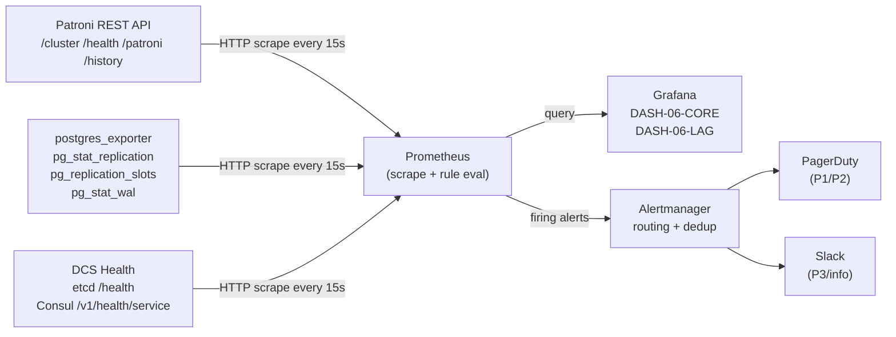

import ArtifactRef from '@site/src/components/ArtifactRef';

# Observability & Monitoring for Patroni Fleets

## Executive Summary

Patroni fails silently in a specific way: the cluster continues serving traffic while a background condition — a stuck replication slot, a DCS partition healing intermittently, a timeline divergence — quietly erodes your recovery guarantees. Disk-space alerts and basic "is Postgres up?" checks do not catch these failures until they become outages. This chapter builds a complete observability stack for Patroni fleets: a Required Signals Matrix that names every signal you must collect and from where; the Patroni REST API as a first-class observability surface; two reference Grafana dashboards covering fleet overview and replication lag; five alert rules with PromQL, severity, and runbook links; a structured-logging strategy for incident investigation; and two cross-reference notes that stitch this chapter's signal IDs into Chapter 07's troubleshooting playbooks and Appendix B's internals deep-dive.

---

## Observability Data Flow



Every signal in this chapter flows through this path. Prometheus is the single aggregation point; Alertmanager handles deduplication, grouping, and routing. Grafana queries Prometheus for dashboards. Nothing talks to Patroni or Postgres directly except the scrapers.

---

## Required Signals Matrix

This table is authoritative. Chapter 07 references signal names from this table as starting points for its decision trees (FR-014).

| Signal | Source | Endpoint / Query | Alert Threshold | Severity |
|--------|--------|-----------------|-----------------|----------|
| **SIG-01** Leader present | Patroni REST `/cluster` | `patroni_master` label == 1 on exactly one member | No leader for &gt;30s | Critical |
| **SIG-02** Member count | Patroni REST `/cluster` | Count members in `members[]` array | Members &lt; expected for &gt;2m | Warning |
| **SIG-03** Replication lag (bytes) | `postgres_exporter` | `pg_stat_replication_replay_lag_bytes` | &gt;50 MB for &gt;5m | Warning; &gt;500 MB Critical |
| **SIG-04** Replication lag (time) | `postgres_exporter` | `pg_stat_replication_replay_lag_seconds` | &gt;30s Warning; &gt;300s Critical | Warning / Critical |
| **SIG-05** Replication slot lag | `postgres_exporter` | `pg_replication_slots_pg_wal_lsn_diff` | &gt;1 GB for &gt;30m | Warning; &gt;10 GB Critical |
| **SIG-06** Inactive replication slot | `postgres_exporter` | `pg_replication_slots_active == 0` | Any slot inactive &gt;15m | Warning |
| **SIG-07** WAL generation rate | `postgres_exporter` | `rate(pg_stat_wal_wal_bytes[5m])` | Spike &gt;3× 7-day baseline | Warning |
| **SIG-08** Timeline ID | Patroni REST `/patroni` | `timeline` field | Change detected outside planned maintenance | Info / Critical (unplanned) |
| **SIG-09** DCS connectivity | Patroni REST `/patroni` | `dcs_last_seen` delta | &gt;`loop_wait` × 3 seconds stale | Critical |
| **SIG-10** Leader election count | Patroni REST `/history` | Count `promote` events in sliding window | &gt;2 promotions in 10m | Critical |
| **SIG-11** Patroni health | Patroni REST `/health` | HTTP 200 from all members | Non-200 for &gt;1m | Warning |
| **SIG-12** Postgres process health | Patroni REST `/health` | `state: running` in response body | Not `running` &gt;30s | Critical |
| **SIG-13** TLS cert expiry (Patroni) | Patroni REST `/patroni` | Custom prober or `ssl_exporter` | &lt;30 days remaining | Warning; &lt;7 days Critical |
| **SIG-14** TLS cert expiry (etcd) | etcd `/health` (TLS) | `ssl_exporter` | &lt;30 days remaining | Warning; &lt;7 days Critical |
| **SIG-15** Connection saturation | `postgres_exporter` | `pg_stat_activity_count / max_connections` | &gt;80% for &gt;5m | Warning |

Signals **SIG-01** through **SIG-15** are the complete required set. Every alert rule in this chapter maps to at least one signal row.

---

## Patroni REST API as Observability Surface

Patroni ships a built-in REST API on port 8008 (configurable). It is the authoritative source for cluster state — more reliable than querying Postgres directly because Patroni controls the state machine.

### Key Endpoints

| Endpoint | Method | Returns | Poll Interval |
|----------|--------|---------|---------------|
| `/health` | GET | 200 (leader/replica running), 503 (not running) | 10–15s |
| `/cluster` | GET | Full cluster JSON: all members, roles, lag, timeline | 15–30s |
| `/patroni` | GET | Node self-report: role, state, timeline, DCS last seen, version | 15s |
| `/history` | GET | Timeline change history: LSN, reason, timestamp per event | 60s (event-driven; low cardinality) |
| `/liveness` | GET | 200 if process alive (not state-aware) | 10s (Kubernetes liveness probe) |
| `/readiness` | GET | 200 if node is a healthy leader or replica accepting reads | 10s (Kubernetes readiness probe) |

### Polling Strategy

- **Prometheus scrape**: Use a dedicated `patroni` job in `prometheus.yml`. Each node's REST port is a separate target. Set `scrape_interval: 15s`, `scrape_timeout: 10s`.
- **HAProxy health checks**: Use `/health` with `option httpchk GET /health`. HTTP 200 routes to the pool; 503 removes the node. Do not use `/primary` or `/replica` aliases — they are convenience wrappers with less context than `/health`.
- **Rate limiting**: Patroni's REST API is not rate-limited by default. At 15s scrape intervals across 30 clusters × 3 nodes = 6 requests/second fleet-wide — well within safe bounds. If you drop below 5s intervals under incident conditions, Patroni's REST handler can queue up. Keep scrape interval ≥ 10s under all conditions.

### Parsing `/cluster` for Multi-Member Metrics

The `/cluster` response is a JSON object. A Prometheus blackbox or custom exporter is needed to extract per-member lag, role, and timeline into Prometheus labels. The companion repo provides a lightweight `/cluster` scraper at `AGENT-11-PF` for reference; for pure Prometheus shops, the `patroni_exporter` community project (or Patroni's built-in metrics endpoint when `restapi.enable_prometheus: true` is set) exposes these as native Prometheus metrics.

:::tip Enable Patroni's Built-in Prometheus Endpoint
Patroni 4.x supports `restapi.enable_prometheus: true` in `patroni.yml`. This exposes `/metrics` on the REST port, eliminating the need for a separate exporter for Patroni-specific signals. Add this to your configuration before deploying the dashboards.
:::

---

## Grafana Dashboards

### DASH-06-CORE — Fleet Overview

<ArtifactRef id="DASH-06-CORE" />

**Purpose**: Single-pane view of all Patroni clusters in the fleet. On-call engineers open this first during an incident.

**Key panels:**

| Panel | Metric | Visualization |
|-------|--------|---------------|
| Leader Status | `patroni_master` per cluster | Status grid (green/red) |
| Timeline | `patroni_patroni_info{key="timeline"}` | Stat: current value, change annotation |
| Member Count | Count of members from `/cluster` scrape | Gauge vs. expected |
| DCS Connectivity | `patroni_dcs_last_seen_seconds` delta | Time-series, alert band at `loop_wait × 3` |
| Failover Events (24h) | Rate of `promote` events from `/history` | Bar chart |
| Postgres Connections | `pg_stat_activity_count` per cluster | Time-series, 80% threshold line |

**Variables**: `cluster` (multi-value), `environment` (prod/staging), `datacenter`.

**Refresh**: 30s auto-refresh. Do not drop below 15s — it adds load without meaningful freshness gain.

### DASH-06-LAG — Replication Lag & WAL

<ArtifactRef id="DASH-06-LAG" />

**Purpose**: Deep-dive into replication health. Use this when DASH-06-CORE shows a lag warning or a WAL bloat alert fires.

**Key panels:**

| Panel | Metric | Visualization |
|-------|--------|---------------|
| Replication Lag Heatmap | `pg_stat_replication_replay_lag_seconds` per replica | Heatmap (all replicas × time) |
| Slot Lag (bytes) | `pg_replication_slots_pg_wal_lsn_diff` | Time-series per slot, 1 GB warning band |
| Inactive Slots | `pg_replication_slots_active == 0` | Alert list with slot names |
| WAL Generation Rate | `rate(pg_stat_wal_wal_bytes[5m])` | Time-series with 7-day baseline overlay |
| Replica Sync State | `pg_stat_replication_sync_state` | Table: replica name, sync state, sent LSN, replay LSN |
| Lag Budget Burn Rate | Lag bytes / per-commit WAL volume | Derived stat: hours until slot fills disk |

**Variables**: `cluster`, `replica`, `slot_name`.

---

## Alert Rules

Each alert below is defined in a Prometheus rule file. Runbooks live in Chapter 07 — each playbook leaf traces back to a signal ID from the Required Signals Matrix.

### ALERT-06-LAG — Replication Lag Exceeding Threshold

<ArtifactRef id="ALERT-06-LAG" />

**Rationale**: A replica falling behind means your RPO degrades. If the replica is also in `synchronous_standby_names`, commit latency rises as the sync standby buffer fills. Beyond 500 MB, planned failover to that replica risks data loss.

**Severity**: Warning at &gt;50 MB / 30s; Critical at &gt;500 MB / 300s.

**Trigger condition**: `SIG-03` or `SIG-04` threshold crossed for the specified duration.

```promql
# Warning
(pg_stat_replication_replay_lag_bytes > 50 * 1024 * 1024)
  and on(instance) up == 1
  for: 5m

# Critical
(pg_stat_replication_replay_lag_bytes > 500 * 1024 * 1024)
  and on(instance) up == 1
  for: 5m
```

**Runbook**: Chapter 07 → "Replication Lag" decision tree (SIG-03, SIG-04).

---

### ALERT-06-LEADER-FLAP — Leader Changed More Than N Times in M Minutes

<ArtifactRef id="ALERT-06-LEADER-FLAP" />

**Rationale**: A single failover is expected. Two or more promotions in a short window indicate either a split-brain scenario, a DCS instability causing repeated TTL expiry, or a misconfigured watchdog causing the leader to be killed and re-elected repeatedly. Each promotion is a brief availability gap. Flapping compounds the risk of timeline divergence.

**Severity**: Critical.

**Trigger condition**: `SIG-10` — more than 2 `promote` events in 10 minutes, derived from `/history` scrape.

```promql
increase(patroni_history_promote_total[10m]) > 2
  for: 0m
```

**Runbook**: Chapter 07 → "Leader Flapping" decision tree (SIG-08, SIG-10).

---

### ALERT-06-WAL-BLOAT — WAL Accumulation Beyond Safe Threshold

<ArtifactRef id="ALERT-06-WAL-BLOAT" />

**Rationale**: WAL accumulation is almost always caused by a replication slot whose consumer has fallen behind or disconnected. Unlike disk-space alerts (which fire too late — when the disk is full), slot-lag alerting catches the problem hours before impact, giving the operator time to intervene. This is the most important alert in a logical-replication environment. See the Case Study below for the consequences of missing it.

**Severity**: Warning at &gt;1 GB slot lag for &gt;30 minutes; Critical at &gt;10 GB.

**Trigger condition**: `SIG-05` or `SIG-06`.

```promql
# Warning: any slot holding back WAL > 1 GB for 30m
(pg_replication_slots_pg_wal_lsn_diff > 1073741824)
  for: 30m

# Critical: any slot holding back WAL > 10 GB (immediate action)
(pg_replication_slots_pg_wal_lsn_diff > 10737418240)
  for: 0m

# Companion: flag any inactive slot that has been inactive > 15m
(pg_replication_slots_active == 0)
  for: 15m
```

**Runbook**: Chapter 07 → "WAL Bloat / Stuck Slot" decision tree (SIG-05, SIG-06, SIG-07).

---

### ALERT-06-DCS-PARTITION — DCS Connectivity Loss from Any Patroni Node

<ArtifactRef id="ALERT-06-DCS-PARTITION" />

**Rationale**: Patroni's leader lock lives in the DCS. If a node loses DCS connectivity, it cannot renew the lock or observe cluster state. A leader that loses DCS connectivity will demote itself (or be killed by the watchdog) after `ttl` seconds — this is correct behavior, but it triggers a failover. A replica that loses DCS connectivity cannot be promoted and cannot participate in leader election. A DCS partition visible from any Patroni node is a pre-failure condition.

**Severity**: Critical.

**Trigger condition**: `SIG-09` — `patroni_dcs_last_seen_seconds` delta exceeds `loop_wait × 3` on any member.

```promql
(time() - patroni_dcs_last_seen_timestamp_seconds)
  > (patroni_loop_wait_seconds * 3)
  for: 0m
```

**Runbook**: Chapter 07 → "DCS Connectivity" decision tree (SIG-09).

---

### ALERT-06-CERT-EXPIRY — TLS Certificates Approaching Expiration

<ArtifactRef id="ALERT-06-CERT-EXPIRY" />

**Rationale**: Patroni, etcd, and Consul all support mutual TLS. An expired certificate causes immediate connectivity failure — Patroni cannot renew the leader lock, and the cluster loses quorum. Certificate expiry outages are entirely preventable with alerting. The 30-day warning window gives time for automated renewal systems (cert-manager, Vault PKI) to complete a rotation without incident pressure.

**Severity**: Warning at &lt;30 days; Critical at &lt;7 days.

**Trigger condition**: `SIG-13`, `SIG-14`.

```promql
# Warning: cert expires in less than 30 days
(ssl_cert_not_after - time()) / 86400 < 30
  for: 1h

# Critical: cert expires in less than 7 days
(ssl_cert_not_after - time()) / 86400 < 7
  for: 0m
```

These rules apply to any target in the `ssl_exporter` scrape job covering Patroni REST endpoints, etcd peer/client ports, and Consul agent ports.

**Runbook**: Chapter 07 → "Certificate Expiry" decision tree (SIG-13, SIG-14).

---

## Logging Strategy

### Structured JSON Logging

Configure Patroni to emit structured JSON logs:

```yaml
# patroni.yml
log:
  level: INFO
  format: '%(asctime)s %(levelname)s: %(message)s'
  # For JSON: use a log handler that serializes to JSON (e.g. python-json-logger)
  # or configure your log shipper (Promtail, Fluentd) to parse and re-emit as JSON
```

In practice, wrap Patroni's stdout with a JSON-structured log shipper. Loki + Promtail is the reference stack in the companion repo. Ship to Loki with labels: `cluster`, `node`, `role`, `environment`.

### Key Log Events to Index

Index these events with high cardinality; they are the primary source of truth for post-incident timelines:

| Event | Log Pattern | Correlation Use |
|-------|------------|-----------------|
| Leader lock acquired | `acquired session lock` | Marks promotion timestamp; correlates with SIG-10 |
| Leader lock released / lost | `released session lock` / `lost leader lock` | Marks demotion; triggers failover sequence |
| Timeline change | `promoted self to leader` / `following new timeline` | Correlates with SIG-08; key for PITR investigations |
| Failover trigger | `Trying to promote` | Marks the start of RTO measurement |
| DCS timeout | `DCS connection timeout` / `failed to update leader key` | Correlates with SIG-09; often precedes ALERT-06-DCS-PARTITION |
| Checkpoint / promote success | `promote completed` | Marks end of RTO measurement |
| Watchdog action | `watchdog activated` | Indicates Patroni hung; rare but critical |
| Configuration reload | `patronictl reload` accepted | Change-audit trail |

### Correlation IDs for Incident Investigation

Patroni does not natively emit trace/correlation IDs. Establish these conventions:

1. **Cluster + timeline as correlation key**: Every log event has `cluster` and `timeline` labels. A failover increments the timeline — events before and after are in separate timelines. Query by `cluster` + `timeline` range to reconstruct a failover sequence.
2. **Timestamp alignment**: Ensure all Patroni nodes, etcd nodes, and Prometheus use NTP-synchronized clocks. Drift &gt;100ms makes event ordering unreliable during a failover (the entire event sequence can complete in under 10 seconds).
3. **Incident labels in Alertmanager**: When ALERT-06-LEADER-FLAP fires, Alertmanager should annotate with `cluster`, `start_time`, and `timeline_at_alert`. This label set becomes the incident correlation key in PagerDuty/Slack.
4. **Link Grafana explore**: In Alertmanager notification templates, include a Grafana Explore link pre-scoped to the cluster and time window. Eliminates the manual "open dashboard and set time range" step during an incident.

---

## Cross-Reference: Troubleshooting

Chapter 07 uses the signal IDs (`SIG-01` through `SIG-15`) and alert IDs (`ALERT-06-LAG`, `ALERT-06-LEADER-FLAP`, `ALERT-06-WAL-BLOAT`, `ALERT-06-DCS-PARTITION`, `ALERT-06-CERT-EXPIRY`) defined in this chapter as the starting points for symptom-keyed decision trees. Every troubleshooting playbook leaf traces back to at least one signal defined here (FR-014). When a signal changes threshold or a new signal is added, the corresponding Chapter 07 decision tree node must be updated in the same PR.

---

## Cross-Reference: Patroni Internals

For the state machine transitions that generate these observability signals, see [Appendix B — Patroni Internals Deep-Dive](./appendix-b-patroni-internals). Specifically: the leader election loop (which generates SIG-01, SIG-08, SIG-10), the DCS lease renewal path (SIG-09), and the watchdog heartbeat sequence (relevant to ALERT-06-DCS-PARTITION). Understanding the internals makes threshold selection intuitive rather than arbitrary.

---

## Case Study: The Weekend WAL Accumulation Incident

**Context**: A payments company operating 30 Patroni clusters (PostgreSQL 15, migrating to 17) had comprehensive monitoring for query latency, connection counts, and disk utilization. They had no WAL bloat alerting — the assumption was that disk-space alerts would catch any storage problem in time.

**What happened**: A logical replication slot created for a data-warehouse sync was left inactive after the consumer service was restarted with a misconfigured connection string over a Friday evening. The slot remained active in the catalog (preventing WAL cleanup) but had zero consumers. By Sunday afternoon, 800 GB of unarchived WAL had accumulated on one primary node. The disk filled at 02:47 Monday morning. PostgreSQL shut down to prevent corruption. The node's failure caused Patroni to promote a replica — but the replica was 45 minutes behind (the lag alert would have fired, had it existed). The cascading effect: three services relying on the cluster went down; two of them had no circuit breaker and kept retrying, saturating the promoted primary's connection pool. Total outage: 4 hours 18 minutes. RTO was dominated not by the failover (under 30 seconds) but by the manual diagnosis of the slot and the decision to drop it.

**Pattern**: Alert on replication slot lag with a threshold measured in WAL volume and time — not only on disk utilization. A 2-hour window at 1 GB of slot lag would have fired 36 hours before the outage.

**Anti-pattern**: Relying exclusively on disk-space alerts for WAL accumulation problems. Disk alerts fire when the disk is already full. Slot-lag alerts fire while you still have time to act.

**Outcome**: `ALERT-06-WAL-BLOAT` was implemented fleet-wide the week after the incident. In the first month, it caught 4 separate slot-lag incidents (two from consumer restarts, one from a logical replication consumer crashing silently, one from a network partition between the slot consumer and the database). MTTR for WAL-related issues dropped from an average of 4 hours to 12 minutes. The 12-minute MTTR represents the time to identify the slot, confirm it is safe to drop or pause, and execute the remediation — the alert provides the 36-hour window to avoid the time pressure.

---

## Checklist

Before going to production, verify each item is testable and verified:

- [ ] **DASH-06-CORE is deployed and showing data for all cluster members** — no "No data" panels; all member rows populated with role, lag, and DCS status.
- [ ] **DASH-06-LAG shows slot lag for all replication slots** — including slots with zero lag; absence of a slot from the dashboard is a configuration error, not a clean state.
- [ ] **ALERT-06-LAG has fired in a test scenario** — artificially pause a replica's recovery (`pg_wal_replay_pause()`) and confirm the alert fires within the defined duration window.
- [ ] **ALERT-06-LEADER-FLAP has fired in a test scenario** — use `patronictl failover` twice within 10 minutes in a non-production cluster; confirm the alert fires and routes to the correct Alertmanager receiver.
- [ ] **ALERT-06-WAL-BLOAT has fired against a test slot** — create an inactive logical replication slot and wait for the 15-minute inactive threshold; confirm the alert includes the slot name in its labels.
- [ ] **ALERT-06-DCS-PARTITION fires when a Patroni node loses etcd connectivity** — use a firewall rule or `tc netem` to drop traffic from one Patroni node to etcd; confirm the alert fires within `loop_wait × 3` seconds plus scrape interval.
- [ ] **ALERT-06-CERT-EXPIRY fires against a test certificate** — issue a certificate with a 5-day validity period to a test endpoint; confirm both Warning and Critical thresholds fire correctly.
- [ ] **Structured logs are shipping to Loki and indexed by `cluster`, `node`, and `timeline`** — run a Loki query for a known timeline-change event and confirm it returns results within 30 seconds of the event.

---

## Gotchas

**1. `/health` returns 200 for replicas too — it is not a leader check.**
`/health` returns 200 when a node is healthy and running (regardless of role). Use `/primary` to check for the leader specifically, or parse the `role` field from `/patroni`. HAProxy's `http-check expect status 200` against `/health` routes to *any* healthy node; route leader traffic to `/primary`.

**2. Scraping `/cluster` on every node returns the same data from all nodes — deduplicate.**
`/cluster` returns the full cluster view from each member's perspective. If you scrape all 3 nodes, you get 3 copies of the same data. Either scrape only the leader (harder — the leader changes), or scrape all nodes and deduplicate by deduplicating on the `cluster` label and keeping only one copy. The Patroni Prometheus exporter handles this correctly; raw HTTP scraping does not.

**3. `pg_replication_slots_pg_wal_lsn_diff` is 0 for inactive slots when there is no LSN reference.**
An inactive slot that has never had a consumer shows `NULL` for `confirmed_flush_lsn`. The difference metric will be 0 or absent. Use `pg_replication_slots_active == 0` as the companion alert (SIG-06) to catch these. Do not rely solely on the byte-delta metric for inactive-slot detection.

**4. WAL generation rate spikes are normal during bulk loads — tune the baseline window.**
`rate(pg_stat_wal_wal_bytes[5m])` over a 7-day baseline will catch a genuine WAL bloat event, but bulk ETL jobs or `VACUUM FULL` on large tables generate legitimate spikes. Use a longer baseline window (7d), a higher multiplier (3×), or exclude known maintenance windows via Alertmanager silence rules.

**5. DCS scrape failures look like DCS connectivity failures — distinguish them.**
If Prometheus cannot scrape the Patroni `/patroni` endpoint (because the node is down), `patroni_dcs_last_seen_timestamp_seconds` goes absent, not stale. An absent metric triggers `absent()` not the staleness alert. Ensure your ALERT-06-DCS-PARTITION rule uses `absent()` as a parallel condition, and your alerting pipeline distinguishes "node unreachable" (Patroni down) from "DCS partition" (Patroni up, DCS unreachable).

**6. Certificate expiry alerts require the `ssl_exporter` to be configured for all ports — not just 443.**
Patroni uses port 8008, etcd uses 2379/2380, and Consul uses 8501. Default `ssl_exporter` configurations cover only HTTPS on 443. Explicitly add scrape targets for every TLS port in your fleet, or certificate expiry will go undetected on the infrastructure layer.

---

## Version Support

| Component | Supported Versions |
|-----------|-------------------|
| PostgreSQL | 18.x (current), 17.x (N-1) |
| Patroni | Latest stable 4.x |
| etcd | 3.5.x |
| Consul | 1.18+ |
| Kubernetes | 1.31+ |
| Prometheus | 2.50+ (for `absent_over_time` support) |
| Grafana | 10.x+ |

**Support window**: 12 months from publication. Signals and thresholds are validated against the versions above. If you are running Patroni 3.x, the `/metrics` Prometheus endpoint may not be available — fall back to the `patroni_exporter` community project.
