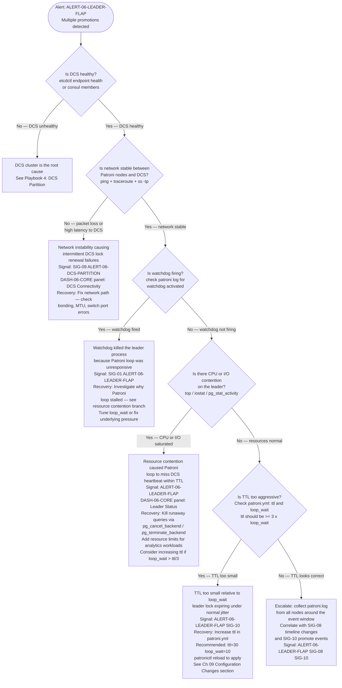
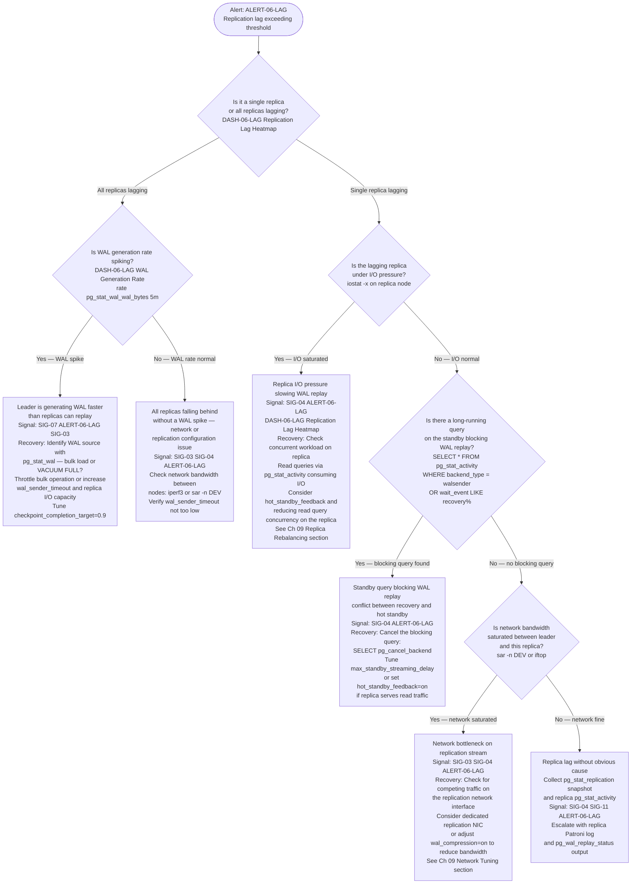
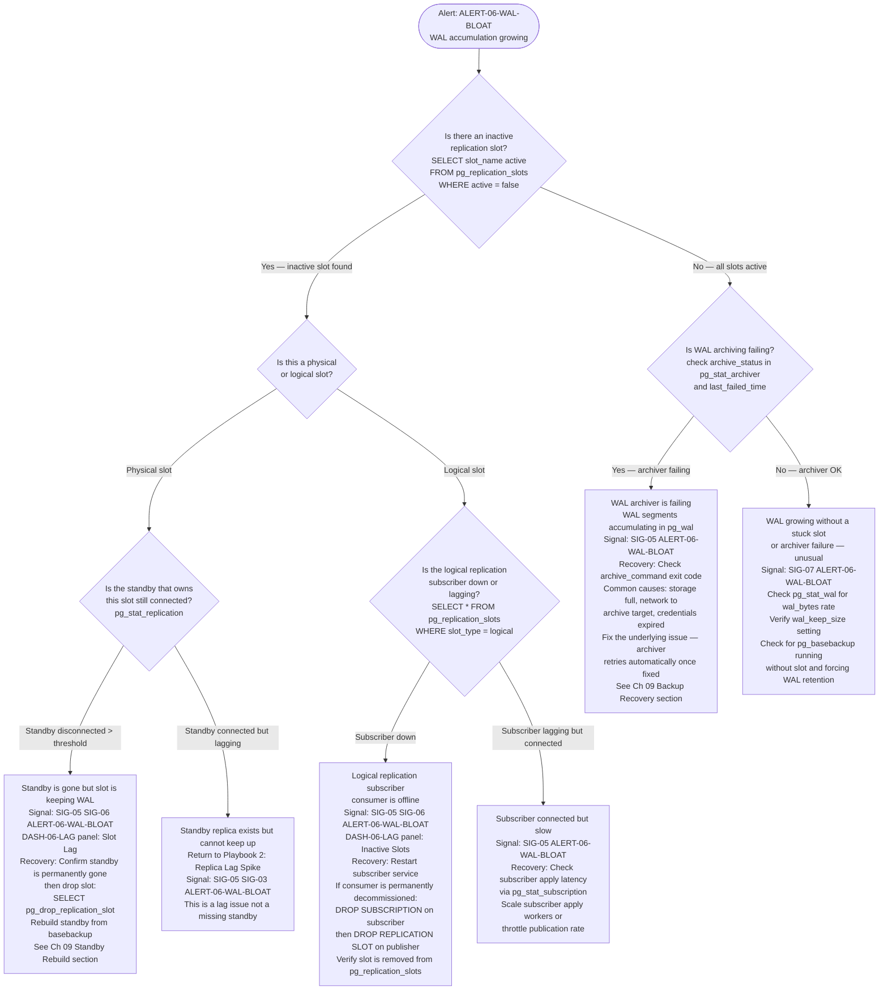
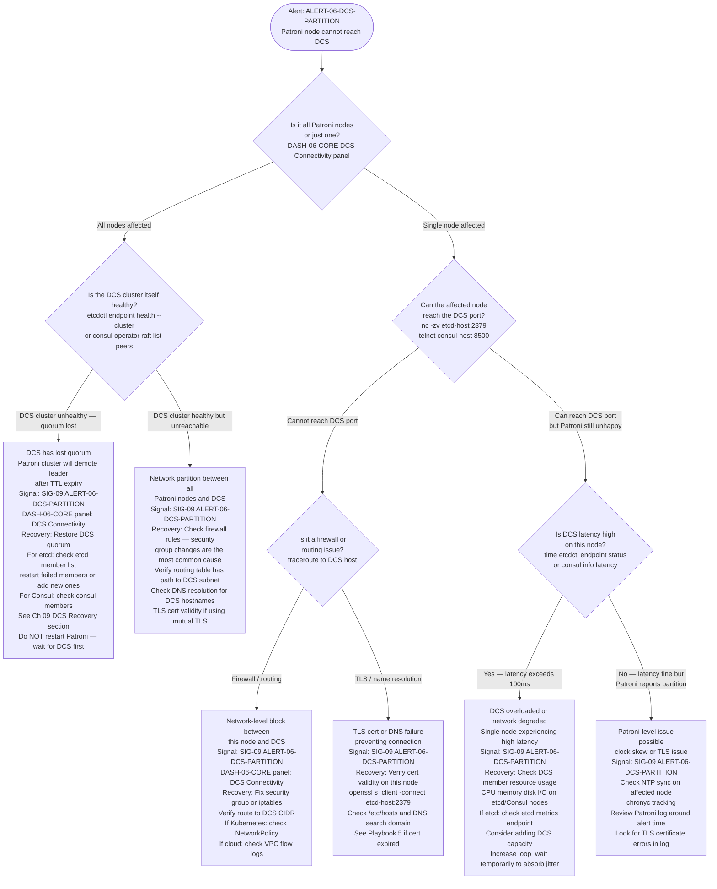
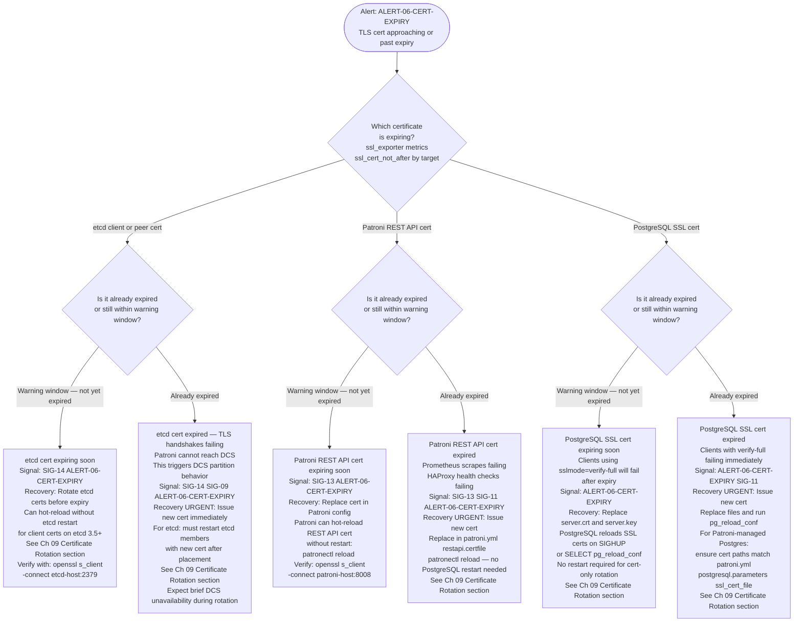

# Troubleshooting Playbooks

## Executive Summary

This chapter is a set of five decision trees. Each tree is keyed to a specific observable symptom — the thing your alert or dashboard is showing you at 3 AM — and walks you through a deterministic branching sequence that terminates at a verified root cause with a concrete recovery action. You do not need to read this chapter start to finish; navigate directly to the playbook matching your symptom. Every leaf node cites the Chapter 06 signal or alert ID that provides evidence for the diagnosis, and every recovery action either appears inline or cross-references the detailed procedure in [Chapter 09 — Zero-Downtime Operations](./09-zero-downtime-operations). The decision trees are designed to be followed under pressure: four to six steps, no ambiguous branches, root cause in under five minutes.

The five symptoms: **Leader Flapping**, **Replica Lag Spike**, **WAL Bloat**, **DCS Partition**, and **Certificate Expiry**.

---

## How to Use These Playbooks

1. **Identify your symptom** — match the firing alert or dashboard panel to one of the five playbook headings.
2. **Follow the tree top to bottom** — each diamond is a yes/no check you can execute in seconds.
3. **Stop at a leaf** — every leaf has a signal ID (for evidence) and a recovery action (for remediation).
4. **Run the recovery** — inline commands are complete; cross-references point to the exact section in Chapter 09.
5. **Post-incident** — file the root cause against the leaf node; if the tree was wrong, open a PR to improve it.

---

## Playbook 1 — Leader Flapping

**Symptom**: `ALERT-06-LEADER-FLAP` fires. `DASH-06-CORE` shows multiple promotion events in a short window. Clients see intermittent connection errors.

### Branch Notes

**DCS unhealthy** → The leader cannot renew its lock; TTL expires; a standby promotes. This is expected behavior but the DCS is the true cause. Follow Playbook 4.

**Network instability** → Intermittent packet loss to etcd/Consul is enough to cause sporadic lock renewal failures. Even a single dropped renewal within a TTL window can trigger a promotion. Check NIC bonding configuration, switch port errors (`ethtool -S ethX`), and MTU mismatches.

**Watchdog firing** → The watchdog is a last-resort kill switch: it only fires if the Patroni process itself is hung (not merely slow). If the watchdog fired, Patroni could not respond to its own heartbeat timer — almost always caused by the Python GIL contention under extreme CPU pressure or a blocking system call.

**Resource contention** → This is the most common real-world cause. A runaway query on the leader consumes enough CPU that Patroni's main loop (which runs in the same process) cannot execute within `loop_wait`. If `loop_wait` cannot complete before `ttl` expires, the lock drops. The fix is to kill the runaway query immediately and investigate why it ran without resource constraints. See the Case Study at the end of this chapter.

**TTL too aggressive** → In high-jitter environments (virtualized, cloud with noisy neighbors), `ttl=10` with `loop_wait=10` provides zero margin. Industry standard: `ttl >= 3 × loop_wait`. Changing `ttl` requires `patronictl reload` — no restart needed.

---

## Playbook 2 — Replica Lag Spike

**Symptom**: `ALERT-06-LAG` fires. `DASH-06-LAG` shows one or more replicas with rising lag in bytes or seconds.

### Branch Notes

**All replicas lagging with WAL spike** → This is a write burst on the leader, not a replica problem. The replicas are healthy but cannot absorb the firehose. Throttle at the source (pause the bulk job, limit `max_wal_senders`) or accept temporary lag and monitor for slot accumulation.

**Single replica, I/O saturated** → Hot standbys serving read traffic compete for I/O with WAL replay. This is a capacity problem. Either reduce read load on the replica or provision faster storage. If this replica is a sync standby, its lag directly increases leader commit latency.

**Blocking query on standby** → PostgreSQL's hot standby conflict mechanism can delay WAL replay when a replica query holds a lock that conflicts with a recovery operation (e.g., a vacuum on the primary that truncates a page the replica query is reading). `hot_standby_feedback=on` prevents this at the cost of potentially blocking vacuum on the primary. The right call depends on whether the replica serves user traffic.

**Network saturated** → `wal_compression = on` (PostgreSQL 15+) reduces WAL stream bandwidth by 40–60% for text-heavy workloads at the cost of CPU on sender and receiver. A quick win if replication is competing with application traffic on a shared NIC.

---

## Playbook 3 — WAL Bloat

**Symptom**: `ALERT-06-WAL-BLOAT` fires. `DASH-06-LAG` panel "Slot Lag" shows a slot accumulating bytes. `pg_replication_slots` shows one or more slots with large `pg_wal_lsn_diff` or `active = false`.

### Branch Notes

**Inactive physical slot** → The most dangerous case: every minute the standby remains gone, WAL accumulates. There is no automatic cleanup. Patroni does not drop slots on standby departure. You must intervene. Before dropping, confirm the standby is truly gone (not temporarily partitioned) — dropping a slot that a live standby is about to reconnect to will force a full rebuild.

**Logical subscriber down** → Logical replication slots are the leading cause of unexpected WAL accumulation in mixed OLTP/analytics environments. The consumer goes down (deployment, crash, network partition) and WAL builds up silently. `ALERT-06-WAL-BLOAT` with SIG-06 (inactive slot) is your early warning. If the consumer has been down longer than your WAL retention budget, you will need to resync from scratch.

**Archiver failing** → `pg_stat_archiver.last_failed_time` and `last_failed_wal` tell you exactly which segment failed and when. Check that `archive_command` is correct and that the destination is reachable. Note: an archiver failure does not stop replication, but it means your PITR coverage stops at the last successfully archived segment.

---

## Playbook 4 — DCS Partition

**Symptom**: `ALERT-06-DCS-PARTITION` fires. `DASH-06-CORE` panel "DCS Connectivity" shows one or more nodes with stale `dcs_last_seen`. Patroni logs show `DCS connection timeout` or `failed to update leader key`.

### Branch Notes

**All nodes, DCS quorum lost** → This is a full cluster emergency. Do not restart Patroni to "fix" it — Patroni will correctly demote the leader once TTL expires, which is the right behavior. Your priority is restoring DCS quorum. For etcd, losing a majority of members (2 of 3, or 3 of 5) means the cluster is read-only. Recover the failed members before touching Patroni.

**Single node, firewall/routing** → Cloud security group changes are the most common cause. A routine infrastructure change that accidentally drops TCP 2379 (etcd) or 8500 (Consul) from a Patroni node's outbound rules will manifest as a DCS partition alert within `loop_wait × 3` seconds.

**High DCS latency (&gt;100ms)** → etcd is sensitive to disk latency. If etcd is co-located on nodes with noisy I/O neighbors, its fsync latency increases, which increases the time to renew the leader key, which increases the risk of TTL expiry. Dedicated IOPS for etcd members is a hard requirement for production.

**Clock skew** → Patroni and etcd both rely on monotonic clocks for TTL calculations. NTP drift &gt;100ms can cause spurious DCS partition alerts. This is rare on modern hypervisors but appears in environments with poor NTP discipline.

---

## Playbook 5 — Certificate Expiry

**Symptom**: `ALERT-06-CERT-EXPIRY` fires. TLS handshake failures in Patroni logs. Clients cannot connect to the Patroni REST API or DCS.

### Branch Notes

**etcd cert expired** → This is the highest-severity cert expiry scenario. An expired etcd cert causes Patroni to lose DCS connectivity (triggering Playbook 4 symptoms simultaneously). The recovery requires issuing a new cert and restarting the affected etcd member. In a 3-node etcd cluster, rotate one member at a time — the cluster remains operational as long as quorum (2 nodes) is maintained.

**Patroni REST API cert expired** → HAProxy health checks will fail, routing read/write traffic to the wrong nodes or stopping traffic entirely. Prometheus scrapes fail, creating observability blindness at the worst moment. Hot reload is fast — get the new cert in place immediately.

**PostgreSQL SSL cert** → Clients using `sslmode=require` are unaffected by cert expiry (they don't validate the cert). Clients using `sslmode=verify-full` or `sslmode=verify-ca` will fail immediately. `pg_reload_conf()` is sufficient — no restart, no Patroni involvement. This is the least disruptive rotation.

**Hot-reload vs restart summary**:
| Component | Hot-reload? | Command |
|-----------|-------------|---------|
| Patroni REST API cert | ✅ Yes | `patronictl reload <cluster>` |
| PostgreSQL SSL cert | ✅ Yes | `SELECT pg_reload_conf()` |
| etcd client cert (3.5+) | ✅ Yes (client only) | `kill -SIGHUP <etcd_pid>` |
| etcd peer cert | ❌ No | Rolling restart required |
| Consul TLS | ❌ No | Rolling restart required |

**Prevention**: Deploy cert-manager or Vault PKI with auto-renewal. The 30-day warning window from `ALERT-06-CERT-EXPIRY` (SIG-13, SIG-14) is designed to give automated renewal systems two full rotation cycles before expiry.

---

## Cross-References

**Observability signals**: Every leaf in these decision trees traces back to at least one observability signal defined in [Chapter 06 — Observability & Monitoring](./06-observability-monitoring) (FR-014). The signal IDs (`SIG-01` through `SIG-15`) and alert IDs (`ALERT-06-LEADER-FLAP`, `ALERT-06-LAG`, `ALERT-06-WAL-BLOAT`, `ALERT-06-DCS-PARTITION`, `ALERT-06-CERT-EXPIRY`) in that chapter are the authoritative source. If a signal threshold changes, the corresponding leaf node in this chapter must be updated in the same PR.

**Recovery procedures**: Recovery procedures that involve operational changes — upgrades, region drains, certificate rotations, standby rebuilds — are detailed in [Chapter 09 — Zero-Downtime Operations](./09-zero-downtime-operations). Leaf nodes in this chapter that say "See Ch 09" are not deferring responsibility; they are pointing to the detailed step-by-step procedure with rollback paths that does not belong in an incident-pressure decision tree.

**Patroni internals**: For the internal Patroni state machine transitions that cause these symptoms — specifically the leader election loop, DCS lease renewal path, and watchdog heartbeat sequence — see [Appendix B — Patroni Internals Deep-Dive](./appendix-b-patroni-internals). Understanding why the state machine behaves as it does makes the decision branches in these playbooks intuitive rather than memorized.

---

## Case Study — The 3 AM Leader Flap

**Context**: A streaming media company running 12 Patroni clusters (PostgreSQL 17 primary read-write workload, replicas serving recommendation engine reads). On-call SRE received `ALERT-06-LEADER-FLAP` at 03:14 local time. `DASH-06-CORE` showed three promotion events on `cluster-prod-us-east-3` in an 8-minute window.

**Following the decision tree (Playbook 1)**:

1. **DCS healthy?** → `etcdctl endpoint health --cluster` returned healthy on all 3 members. ✅ DCS not the cause.
2. **Network stable?** → `ping` from all Patroni nodes to etcd nodes showed &lt;1ms latency, 0% packet loss. ✅ Network not the cause.
3. **Watchdog firing?** → `grep "watchdog" /var/log/patroni/patroni.log` returned no watchdog events. ✅ Watchdog not involved.
4. **Resource contention?** → `top` on the leader showed `postgres` at 97% CPU. `pg_stat_activity` revealed a single query: an unindexed `SELECT` on a 2 TB analytics table, running for 23 minutes, issued by a data science pipeline that had been pointed at the production primary by mistake. **Root cause found in step 4, approximately 3 minutes from alert.**

**What happened mechanically**: The runaway query consumed enough CPU that Patroni's Python main loop (which renews the DCS leader key on every iteration) could not complete within `loop_wait` (10s). Three consecutive missed iterations pushed the time since last renewal to 31s — just past `ttl` (30s). etcd expired the leader key; a standby acquired it and promoted. The new leader then also ran the analytics query (it had reconnected automatically), and the cycle repeated twice more.

**Recovery**: `SELECT pg_terminate_backend(pid)` for the analytics query. Immediate: loop_wait completed normally, no further flapping. Within 5 minutes: `patronictl switchover` back to the original leader to restore the preferred topology. Same day: analytics connections were moved to a dedicated read replica and granted only `pg_read_only` with a `statement_timeout = 120s` resource group limit.

**Pattern**: The decision tree led to root cause in 4 steps, under 3 minutes, without guessing. The SRE did not need to know the internal Patroni loop mechanics — the tree asked the right questions in the right order.

**Anti-pattern**: The SRE's first instinct was to restart Patroni on the leader ("maybe it's a bug"). This would have triggered a fourth failover, extended the incident by 5–10 minutes, and destroyed the `pg_stat_activity` evidence needed to identify the analytics query. The decision tree enforced diagnosis before action.

**Outcome**: Zero data loss (async replicas, all WAL flushed before each promotion). Total client-visible errors: 3 brief connection resets during the three involuntary failovers (each &lt;10s). Post-incident: `ttl` increased from 30s to 45s to provide margin; the analytics pipeline received a dedicated connection pool.

---

## Checklist

Before relying on these playbooks in a production incident, verify each item in a tabletop or simulated scenario:

- [ ] **Playbook 1 validated**: Induced resource contention on a staging leader (e.g., `yes > /dev/null` to saturate CPU), confirmed `ALERT-06-LEADER-FLAP` fired, followed the tree to the "resource contention" leaf, and recovered without a restart.
- [ ] **Playbook 2 validated**: Paused WAL replay on a replica (`SELECT pg_wal_replay_pause()`), confirmed `ALERT-06-LAG` fired within the defined duration window, identified the blocking session via `pg_stat_activity`, and resumed replay.
- [ ] **Playbook 3 validated**: Created an inactive logical replication slot (`SELECT pg_create_logical_replication_slot('test_slot', 'pgoutput')`), confirmed `ALERT-06-WAL-BLOAT` fired for SIG-06 within 15 minutes, dropped the slot cleanly.
- [ ] **Playbook 4 validated**: Used `iptables -A OUTPUT -p tcp --dport 2379 -j DROP` on one Patroni node to simulate DCS partition, confirmed `ALERT-06-DCS-PARTITION` fired within `loop_wait × 3 + scrape_interval` seconds, restored the rule, confirmed alert resolved.
- [ ] **Playbook 5 validated**: Issued a test certificate with 5-day validity to a non-production endpoint, confirmed `ALERT-06-CERT-EXPIRY` fired at both Warning (&lt;30 days) and Critical (&lt;7 days) thresholds.
- [ ] **All playbook leaf nodes produce actionable evidence**: For each leaf reached during simulation, the cited signal ID (`ALERT-06-*`, `SIG-*`) was visible in `DASH-06-CORE` or `DASH-06-LAG` at the time of the simulated incident.
- [ ] **Recovery procedures tested end-to-end**: Each cross-reference to Chapter 09 has been followed in a staging environment and confirmed to reach a healthy cluster state.

---

## Gotchas

**1. Restarting Patroni is almost never the right first step.**
A Patroni restart triggers a failover if the node is the current leader. Under incident pressure, the impulse to "restart the service" is strong. Every playbook above asks you to diagnose first. The only scenario where restarting Patroni is the correct immediate action is if the Patroni process itself is dead (not the PostgreSQL process it manages). Check `systemctl status patroni` before any restart decision.

**2. DCS health and Patroni DCS connectivity are two different things.**
`etcdctl endpoint health` passes even when a specific Patroni node cannot reach etcd (firewall, routing, TLS). Playbook 4 branches on this distinction explicitly. Always check connectivity from the affected Patroni node, not from your workstation or a jump host.

**3. An inactive slot with `pg_wal_lsn_diff = 0` is not safe — it just hasn't consumed any WAL yet.**
A freshly created, never-used logical slot shows zero lag but will hold back WAL from the moment WAL is generated. `SIG-06` (inactive slot) fires on `active = false` regardless of lag — this is intentional. Do not dismiss a zero-lag inactive slot; investigate whether it is expected.

**4. Increasing `ttl` without increasing `loop_wait` proportionally does not solve flapping — it delays it.**
If the root cause is resource contention that prevents the loop from completing, a higher TTL just means the leader runs longer before losing the lock. The correct fix is to remove the resource contention. `ttl >= 3 × loop_wait` is a ratio requirement, not an absolute value.

**5. Certificate rotation during an active incident compounds the problem.**
Playbook 5 covers cert expiry before and after the expiry date. If a cert expires during another incident (e.g., a DCS partition), rotating the cert while the cluster is in a degraded state risks cascading failures. Complete the cert rotation as a separate action with a stable cluster, or coordinate the two recoveries explicitly with a written order of operations.

---

## Version Support

| Component | Supported Versions |
|-----------|-------------------|
| PostgreSQL | 18.x (current), 17.x (N-1) |
| Patroni | Latest stable 4.x |
| etcd | 3.5.x |
| Consul | 1.18+ |
| Kubernetes | 1.31+ |
| ssl_exporter | 0.20+ (for per-port cert scraping) |
| Prometheus | 2.50+ |
