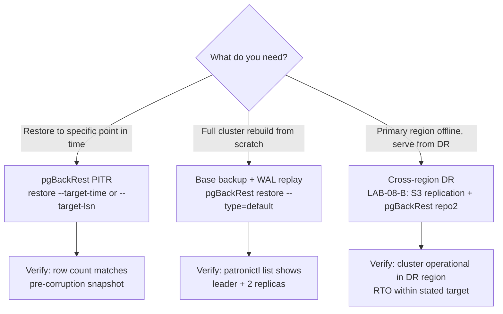

import ArtifactRef from '@site/src/components/ArtifactRef';

# Backup, DR, and PITR at Enterprise Scale

## Executive Summary

A Patroni cluster gives you automatic failover within a region. What it does not give you — by itself — is protection against logical corruption, accidental `DROP TABLE`, or a full regional outage. Those guarantees require a deliberate backup strategy: consistent base backups, continuous WAL archiving, tested PITR procedures, and a documented DR runbook with measured RTO and RPO targets.

This chapter covers the full stack: choosing between pgBackRest and WAL-G, retention and encryption patterns that satisfy enterprise compliance requirements, how PITR interacts with Patroni's timeline management, and why you must take backups from a standby rather than the leader. Two hands-on labs anchor the theory — [LAB-08-A](https://github.com/ivishalgandhi/blog-source/tree/main/docs/devops/postgres-ha-patroni-book/_companion/docker/lab-08-a) proves that you can restore to a precise LSN after corruption, and [LAB-08-B](https://github.com/ivishalgandhi/blog-source/tree/main/docs/devops/postgres-ha-patroni-book/_companion/terraform/lab-08-b) proves that your cluster can survive a complete primary-region failure and fail back cleanly.

The single most common DR failure mode is not infrastructure — it is an untested restore procedure. Every configuration in this chapter is paired with a verification step. If you cannot run the restore, you do not have a backup.

## Backup/Restore Decision Tree



---

## Decision Matrix: pgBackRest vs WAL-G vs Streaming + Delayed Standby

All three approaches are production-viable. The right choice depends on your operational maturity, cloud environment, and RTO requirements.

| Feature | pgBackRest | WAL-G | Delayed Standby |
|---|---|---|---|
| **Maturity** | Very high (2013, pgBackRest 2.x widely deployed) | High (Wal-G 2.x, Yandex-originated, broad adoption) | Native Postgres — no external tool |
| **PITR granularity** | LSN, timestamp, transaction ID, recovery target name | Timestamp, LSN | Configurable lag (`recovery_min_apply_delay`) |
| **Parallelism** | Configurable process count per backup/restore | Concurrent WAL upload via goroutines | N/A — replay speed is I/O-bound |
| **Cloud storage** | S3, GCS, Azure Blob, SFTP, local | S3, GCS, Azure Blob, Swift | N/A |
| **Encryption at rest** | AES-256-CBC (built-in cipher option) | GPG or AWS KMS / GCS CMEK | Filesystem-level only |
| **Compression** | gz, bz2, lz4, zst (selectable per backup type) | lz4, brotli, zst | N/A |
| **Incremental / differential** | Full, differential, incremental (delta restore) | Full + WAL only (no native differential) | N/A |
| **Backup verification** | `pgbackrest verify` command; built-in checksums | No built-in verify; manual WAL listing | Replay lag observable via `pg_stat_replication` |
| **Patroni integration** | First-class: standby-preferred archive/backup | Works; requires external scheduling | Native: configure `recovery_min_apply_delay` in `postgresql.conf` |
| **Community / docs** | Excellent; active PgBackRest GitHub + mailing list | Good; GitHub + Telegram community | Postgres core docs |
| **When to use** | Default choice for new deployments; richest feature set | Greenfield teams comfortable with Go ecosystem; simpler ops model | Supplement only — protects against logical errors with near-zero RTO for recent mistakes; not a backup substitute |

**Recommendation for Patroni clusters**: use pgBackRest as the primary tool. Its `standby` backup mode, built-in `archive_command` integration, and `verify` command make it the most operationally complete solution for Patroni environments. Use WAL-G if your team already operates it elsewhere and values a simpler binary. Use a delayed standby as a complement — never as a replacement — for catching logical errors quickly.

---

## Retention and Encryption Patterns

### Retention Schedules

A retention policy must answer two questions: how much history do you keep, and how long can a restore take? The following schedule satisfies most enterprise requirements:

| Backup type | Frequency | Retention | Notes |
|---|---|---|---|
| Full | Weekly (Sunday 01:00) | 4 fulls (28 days) | Anchor for differential/incremental chain |
| Differential | Daily (01:00 Mon–Sat) | 7 differentials | Reduces daily restore time vs. incremental chain |
| Incremental | Every 4 hours | 48 (8 days) | Fine-grained PITR within business week |
| WAL archive | Continuous | 35 days | Must outlive the oldest full backup |

Configure this in pgBackRest:

```ini
# /etc/pgbackrest/pgbackrest.conf (relevant excerpt)
[global]
repo1-retention-full=4
repo1-retention-full-type=count
repo1-retention-diff=7
# WAL archive retention is derived: pgBackRest removes WAL
# automatically once the oldest dependent backup is expired.
```

:::tip
Set `repo1-retention-archive-type=diff` to anchor WAL retention to your differential backups rather than full backups alone. This prevents WAL accumulation between weekly fulls.
:::

### Encryption at Rest

Never store unencrypted backups offsite. Both tools support encryption, but the configuration differs:

**pgBackRest** (recommended):
```ini
[global]
repo1-cipher-type=aes-256-cbc
repo1-cipher-pass=<store-in-vault-not-in-this-file>
```

Store the passphrase in HashiCorp Vault or AWS Secrets Manager; inject it at runtime via the `PGBACKREST_REPO1_CIPHER_PASS` environment variable. Never commit it to git.

**WAL-G**:
```bash
# GPG symmetric encryption
export WALG_GPG_KEY_ID=<your-gpg-key-fingerprint>
# Or AWS KMS
export WALG_KMS_KEY_ID=arn:aws:kms:<region>:<acct>:key/<key-id>
```

### Offsite Storage and Lifecycle Policies

Cross-region replication for S3 example:

```hcl
# Terraform excerpt — enable S3 cross-region replication
resource "aws_s3_bucket_replication_configuration" "backup_replication" {
  bucket = aws_s3_bucket.pgbackrest_primary.id
  role   = aws_iam_role.replication.arn

  rule {
    id     = "backup-dr"
    status = "Enabled"
    destination {
      bucket        = aws_s3_bucket.pgbackrest_dr.arn
      storage_class = "STANDARD_IA"
    }
  }
}
```

Add an S3 lifecycle policy to transition backups to cheaper storage after 7 days and expire after 35 days. Align the lifecycle policy expiry with your `repo1-retention-full` setting — misalignment silently deletes WAL that pgBackRest still needs.

:::warning
IAM roles used by pgBackRest's `archive_command` must be monitored for expiry. A role that expires silently stops WAL archiving — and Postgres itself will not error; it only logs a warning. Add an independent freshness alert (see the Case Study section).
:::

---

## PITR Mechanics Under Patroni

Patroni introduces timeline management on top of standard Postgres PITR. Understanding the interaction is essential before you attempt a restore.

### Timelines and Failover History

Every Patroni failover increments the Postgres timeline. When you restore from a base backup, you must specify which timeline to follow — or let pgBackRest choose the latest (`--target-timeline=latest`). If your backup was taken on timeline 3 and a failover happened between backup and restore target time (moving to timeline 4), you need the WAL from both timelines. pgBackRest handles this transparently if your archive contains both.

```
Timeline 1 ──── Failover ──── Timeline 2 ──── Failover ──── Timeline 3
                                                               ↑
                                                         Your backup
                                 Your target time ─────────────┘
                                 (crosses two timelines: 2→3)
```

pgBackRest's `--target-timeline=latest` follows the latest promotion history, which is correct for most PITR scenarios. Use `--target-timeline=&lt;N&gt;` only when you want to restore to a specific historical branch.

### Backup Consistency Under Patroni

The `archive_command` runs on whichever node Patroni designates as the primary — it switches automatically on failover. Your `pgbackrest.conf` must configure an `archive_command` that works from any node in the cluster:

```bash
# postgresql.conf (managed via Patroni's postgresql section)
archive_command = 'pgbackrest --stanza=main archive-push %p'
restore_command = 'pgbackrest --stanza=main archive-get %f "%p"'
```

Patroni injects `recovery_target_timeline = 'latest'` into `recovery.conf` (or `postgresql.auto.conf` on PG 12+) automatically during standby bootstrap. Do not override this without understanding the timeline implications.

### Recovery Target Settings

| Recovery target | pgBackRest flag | Use case |
|---|---|---|
| Specific timestamp | `--target="2026-03-15 14:23:00+00"` | "Restore to 5 minutes before the bad `DELETE`" |
| Specific LSN | `--target=0/A1234B00` | Precise — use when you know the exact LSN from logs |
| Transaction ID | `--target=98234` | When you can identify the transaction from `pg_xact` |
| Named restore point | `--target=before_migration` | Set via `SELECT pg_create_restore_point('before_migration')` |

Set `--target-action=promote` to have the restored instance immediately accept writes. Use `--target-action=pause` to inspect data before promoting.

---

## Lab: Full Backup + PITR {#lab-08-a}

## Lab <ArtifactRef id="LAB-08-A" /> — Full Backup and Point-in-Time Recovery

**Supported substrates**: `proxmox-lxc`, `docker`

### Prerequisites

| Component | Version |
|---|---|
| PostgreSQL | 18.x or 17.x |
| Patroni | 4.x |
| pgBackRest | 2.54+ |
| etcd | 3.5.x |
| Docker / Docker Compose | 25.x+ (docker substrate) |

System resources: 2 CPU cores, 4 GB RAM, 10 GB free disk (for backup repository).

Clone the companion repo and navigate to the lab directory:

```bash
git clone https://github.com/your-org/postgres-ha-patroni-companion
cd postgres-ha-patroni-companion/docker/lab-08-a
```

### What You'll Learn

- How to create a pgBackRest stanza and perform full + incremental backups from a standby node.
- How Patroni's timeline management interacts with PITR.
- How to restore to a precise LSN after logical data corruption.
- How to verify restore success with a row count assertion.

### Setup

**Step 1 — Start the cluster and pgBackRest repository**:

```bash
docker compose up -d
# Wait for the cluster to elect a leader (~30s)
docker compose exec patroni1 patronictl -c /etc/patroni/patroni.yml list
```

Expected output shows one Leader and two Replica nodes.

**Step 2 — Initialize the pgBackRest stanza** (run from the standby node):

```bash
docker compose exec patroni2 pgbackrest --stanza=main stanza-create
docker compose exec patroni2 pgbackrest --stanza=main check
```

**Step 3 — Take a full backup from the standby**:

```bash
docker compose exec patroni2 \
  pgbackrest --stanza=main --type=full backup
# Confirm backup appears in the repository
docker compose exec patroni2 pgbackrest --stanza=main info
```

**Step 4 — Seed test data and create an incremental backup**:

```bash
docker compose exec patroni1 psql -U postgres -c "
  CREATE TABLE orders (id serial PRIMARY KEY, amount numeric, created_at timestamptz DEFAULT now());
  INSERT INTO orders (amount) SELECT random()*1000 FROM generate_series(1,10000);
"
docker compose exec patroni2 \
  pgbackrest --stanza=main --type=incr backup
```

**Step 5 — Record the pre-corruption LSN and row count**:

```bash
docker compose exec patroni1 psql -U postgres -c "
  SELECT count(*) AS row_count FROM orders;
  SELECT pg_current_wal_lsn() AS safe_lsn;
"
# Save both values — you will need them in the verification step.
```

**Verify clean state**:

```bash
docker compose exec patroni2 pgbackrest --stanza=main info
# Output should show at least one full backup and one incremental backup.
```

### Break It on Purpose

:::danger
**Run this only on the lab cluster.** The following commands permanently delete rows from the `orders` table. Never run destructive commands against a production database without a tested restore procedure.
:::

```bash
# Simulate accidental bulk delete — this is the corruption event
docker compose exec patroni1 psql -U postgres -c "
  DELETE FROM orders;
  SELECT count(*) FROM orders;  -- should return 0
"
# Record the LSN immediately after the delete
docker compose exec patroni1 psql -U postgres -c \
  "SELECT pg_current_wal_lsn() AS corruption_lsn;"
```

The cluster is now in a logically corrupted state. The base backup + WAL archive contain the data needed to recover it.

### Verification

Stop the corrupted primary (do not destroy volumes):

```bash
docker compose stop patroni1 patroni2 patroni3
```

Restore to the LSN recorded before the delete:

```bash
# Replace <SAFE_LSN> with the value captured in Step 5
docker compose run --rm patroni1 \
  pgbackrest --stanza=main restore \
    --target-lsn="<SAFE_LSN>" \
    --target-action=promote \
    --type=lsn
docker compose start patroni1
```

Wait for Postgres to complete recovery, then verify row count:

```bash
docker compose exec patroni1 psql -U postgres -c \
  "SELECT count(*) AS row_count FROM orders;"
# Expected: 10000 — matches the pre-corruption snapshot
```

### Recovery Procedure

After confirming data integrity, restart the full cluster and allow Patroni to re-establish replication:

```bash
docker compose start patroni2 patroni3
# Allow ~60s for replicas to stream from the restored primary
docker compose exec patroni1 patronictl -c /etc/patroni/patroni.yml list
```

Both replicas should show `running` state. Patroni will advance to the next timeline automatically.

### Teardown

```bash
docker compose down -v
# Removes all containers, networks, and named volumes created by the lab.
```

### What This Tells You About Production

- A standby-based backup does not add checkpoint pressure to the leader — critical for OLTP workloads.
- Always record a "known-good LSN" before major schema changes or bulk operations; `SELECT pg_create_restore_point('before_migration')` makes this human-readable.
- Patroni's automatic timeline increment means your `restore_command` must be able to fetch WAL from multiple timelines — pgBackRest handles this, but WAL-G requires explicit timeline configuration.

---

## Lab: Cross-Region Restore {#lab-08-b}

## Lab <ArtifactRef id="LAB-08-B" /> — Cross-Region Disaster Recovery

**Supported substrates**: `terraform-aws`, `terraform-gcp`

### Prerequisites

| Component | Version / Requirement |
|---|---|
| PostgreSQL | 18.x or 17.x |
| Patroni | 4.x |
| pgBackRest | 2.54+ |
| Terraform | ≥ 1.7 |
| Ansible | ≥ 2.16 |
| AWS CLI / gcloud | Latest stable |

System resources: AWS/GCP credentials with permissions to create VPC, EC2/GCE instances, S3/GCS buckets, IAM roles. Estimated cloud cost: ~$2–4 USD for a 2-hour lab run.

```bash
cd postgres-ha-patroni-companion/terraform/lab-08-b/aws
terraform init && terraform apply -var-file=lab.tfvars
```

### What You'll Learn

- How to configure pgBackRest with a cross-region S3/GCS repository (`repo2`).
- How to simulate a primary-region outage and bring the cluster up in the DR region.
- How to measure actual RTO and RPO against your stated targets.
- How to fail back to the primary region after the outage is resolved.

### Setup

**Step 1 — Provision infrastructure**:

```bash
# AWS example — GCP variant in terraform/lab-08-b/gcp/
terraform apply -var-file=lab.tfvars
# Outputs: primary_cluster_endpoint, dr_cluster_endpoint, backup_bucket_primary, backup_bucket_dr
```

**Step 2 — Configure pgBackRest with dual repositories** (applied by Ansible role `pgbackrest`):

```ini
# /etc/pgbackrest/pgbackrest.conf on all Patroni nodes
[global]
repo1-type=s3
repo1-s3-bucket=<backup_bucket_primary>
repo1-s3-region=us-east-1
repo1-cipher-type=aes-256-cbc

repo2-type=s3
repo2-s3-bucket=<backup_bucket_dr>
repo2-s3-region=us-west-2
repo2-cipher-type=aes-256-cbc

[main]
pg1-path=/var/lib/postgresql/18/main
```

S3 cross-region replication is enabled on `repo1` bucket to sync to `repo2` automatically (see Terraform module `s3-replication` in the companion repo).

**Step 3 — Take a full backup and seed data**:

```bash
ansible-playbook -i inventory/primary.ini playbooks/backup-full.yml
# Inserts 500,000 rows across 5 tables to establish a meaningful dataset
ansible-playbook -i inventory/primary.ini playbooks/seed-data.yml
```

**Verify clean state**:

```bash
# From primary region — confirm repo2 is synced
pgbackrest --stanza=main --repo=2 info
# Should show at least one full backup
```

### Break It on Purpose

:::danger
**Run this only against the lab infrastructure provisioned by Terraform.** The following command terminates all EC2 instances in the primary region. This simulates a complete AZ/region failure. Confirm you are targeting the lab environment before proceeding.
:::

```bash
# Terminate all primary-region instances (simulates region outage)
aws ec2 terminate-instances \
  --instance-ids $(terraform output -json primary_instance_ids | jq -r '.[]') \
  --region us-east-1
# Record the outage start time
echo "OUTAGE_START=$(date -u +%Y-%m-%dT%H:%M:%SZ)" | tee /tmp/dr-timing.env
```

The primary Patroni cluster is now completely unavailable.

### Verification

**Activate DR cluster** (start the RTO clock):

```bash
source /tmp/dr-timing.env
ansible-playbook -i inventory/dr.ini playbooks/dr-activate.yml \
  --extra-vars "backup_repo=repo2"
echo "DR_READY=$(date -u +%Y-%m-%dT%H:%M:%SZ)" | tee -a /tmp/dr-timing.env
```

The playbook performs:
1. `pgbackrest --stanza=main --repo=2 restore` on the DR primary node.
2. `patronictl reinit` on DR replica nodes to stream from the restored DR primary.
3. HAProxy reconfiguration to point to DR endpoints.

**Verify cluster operational in DR region**:

```bash
ansible-playbook -i inventory/dr.ini playbooks/verify-dr.yml
# Checks: patronictl list shows Leader + 2 Replica; row counts match seeded data
```

**Measure RTO and RPO**:

```bash
# RTO: time from outage declaration to application serving traffic
python3 scripts/measure-rto.py --env /tmp/dr-timing.env
# RPO: compare last committed transaction on primary vs first transaction in DR
python3 scripts/measure-rpo.py --primary-last-lsn /tmp/primary-lsn.txt \
  --dr-endpoint $(terraform output -raw dr_cluster_endpoint)
```

### Recovery Procedure (Failback to Primary)

After the "outage" is resolved (i.e., primary region restored or infrastructure rebuilt):

```bash
# Rebuild primary cluster from DR backup
ansible-playbook -i inventory/primary.ini playbooks/failback.yml \
  --extra-vars "source_repo=repo2"
# Verify primary cluster healthy
patronictl -c /etc/patroni/patroni.yml list
# Switch application traffic back to primary
ansible-playbook -i inventory/primary.ini playbooks/restore-traffic.yml
```

### Teardown

```bash
terraform destroy -var-file=lab.tfvars
# Destroys all provisioned infrastructure in both regions.
# S3 buckets are force-deleted by the destroy target — review before running in non-lab environments.
```

### What This Tells You About Production

- S3 cross-region replication lag (typically &lt;15 minutes) is your RPO floor for this architecture. Monitor replication lag independently.
- DR activation is primarily an Ansible/Terraform operation, not a DBA operation. Automate it and rehearse it with your ops team.
- Failback is slower than failover — plan for a longer maintenance window when returning to the primary region.

---

## Measuring RTO and RPO

Empirical measurement is the only evidence that your DR plan works. Stated targets without measurements are aspirations.

### Definitions

- **RTO (Recovery Time Objective)**: Maximum tolerable downtime. Measured as the elapsed time from "disaster declared" to "application serving production traffic from the recovered cluster."
- **RPO (Recovery Point Objective)**: Maximum tolerable data loss. Measured as the gap between the last committed transaction on the failed system and the first consistent state of the recovered system.

### RTO Formula

```
RTO_measured = T_traffic_restored - T_disaster_declared
```

Where:
- `T_disaster_declared` = timestamp when the on-call engineer (or automated alert) formally declares an outage.
- `T_traffic_restored` = timestamp when the load balancer health check returns green and synthetic transactions succeed.

Example measurement from a monthly DR drill:

| Phase | Duration |
|---|---|
| Alert fired → on-call acknowledged | 3 min |
| Runbook located + DR activation started | 5 min |
| `pgbackrest restore` completed | 9 min |
| Patroni cluster healthy (leader elected) | 4 min |
| Application smoke test passed | 1 min |
| **Total measured RTO** | **22 min** |

### RPO Formula

```
RPO_measured = T_last_committed_primary - T_first_consistent_dr
```

Where:
- `T_last_committed_primary` = LSN/timestamp of the last transaction committed to the primary before the outage (from WAL archive metadata).
- `T_first_consistent_dr` = LSN/timestamp of the restored state in the DR cluster.

In practice, extract the last archived WAL segment timestamp from your backup repository and compare to the restore target:

```bash
# Last archived WAL on S3
aws s3 ls s3://<backup_bucket>/main/archive/main/ \
  --recursive | sort | tail -1

# pgBackRest restore target info
pgbackrest --stanza=main info --output=json | \
  jq '.[].backup[-1].timestamp.stop'
```

The difference between these two values is your measured RPO. It should be &lt;5 minutes with continuous WAL archiving and a healthy S3 IAM role.

### Documenting Measurements

Capture measurements in a structured file checked into your runbook repository:

```yaml
# dr-measurements.yml
date: 2026-04-01
drill_type: region_outage
rto_target_minutes: 30
rto_measured_minutes: 22
rpo_target_minutes: 5
rpo_measured_minutes: 2
notes: "DR activation playbook ran without intervention. Failback took 45 minutes."
```

Trend this file over time. A rising measured RTO signals drift in your infrastructure or runbook.

---

## Backup from Standby, Not Leader

This is the single most impactful operational change for Patroni clusters with active OLTP workloads.

### Why the Leader Is the Wrong Backup Source

When pgBackRest runs a full backup from the primary node, it forces a checkpoint at the start and end of the backup. On a busy OLTP system:

- The start-of-backup checkpoint flushes dirty pages, adding I/O spikes observable in `pg_stat_bgwriter`.
- Checkpoint frequency increases during the backup window because the WAL volume written by the backup itself triggers additional checkpoints.
- Buffer cache eviction during the backup competes with in-flight queries.

A three-node Patroni cluster with one replica available has spare I/O capacity on that replica. Use it.

### Configuring pgBackRest for Standby-Preferred Backups

```ini
# /etc/pgbackrest/pgbackrest.conf
[global]
backup-standby=y          # Prefer standby; fall back to primary if no standby available

[main]
pg1-path=/var/lib/postgresql/18/main
pg1-host=patroni1          # Primary (leader)
pg1-host-user=postgres
pg2-path=/var/lib/postgresql/18/main
pg2-host=patroni2          # Standby
pg2-host-user=postgres
```

pgBackRest connects to both `pg1` and `pg2`. With `backup-standby=y`, it reads data from `pg2` while using `pg1` for WAL metadata (ensuring backup consistency). If `patroni2` is promoted to leader before the backup completes, pgBackRest detects the role change and fails the backup cleanly — it does not silently corrupt the backup.

### Failover-Aware Backup Scheduling

A naive cron on `patroni2` breaks when `patroni2` becomes the leader and a new standby `patroni3` is available. Use a scheduling pattern that queries Patroni's REST API to pick a healthy standby:

```bash
#!/bin/bash
# backup-from-standby.sh — run from a dedicated backup host or cron on all nodes
PATRONI_API="http://patroni1:8008"

# Find a running replica (not the leader)
STANDBY=$(curl -sf "${PATRONI_API}/cluster" | \
  jq -r '.members[] | select(.role == "replica" and .state == "running") | .name' | \
  head -1)

if [ -z "$STANDBY" ]; then
  echo "No healthy standby found — skipping backup to protect leader I/O"
  exit 1
fi

echo "Running backup via standby: ${STANDBY}"
ssh "${STANDBY}" "pgbackrest --stanza=main --type=full backup"
```

Schedule this script instead of a direct `pgbackrest backup` call. It degrades gracefully: if no standby is available, it skips the backup rather than hammering the leader — and your monitoring should alert on a missed backup (not just a failed one).

---

## Checklist

Before declaring your backup and DR posture production-ready, verify each item with a measured result, not an assumption:

- [ ] **Backup from standby configured**: `pgbackrest info` output confirms the backup was taken from a replica node (check `backup/database/id` in JSON output matches a standby `pg*-host`).
- [ ] **WAL archiving freshness alert active**: An independent alert fires if no WAL segment has been archived in the last 10 minutes. Verify by pausing archiving and confirming the alert fires within 10 minutes.
- [ ] **Full backup verified post-creation**: `pgbackrest verify --stanza=main` runs after every full backup and exits 0.
- [ ] **PITR restore tested end-to-end**: A restore to a specific LSN or timestamp has been completed in a non-production environment within the last 30 days, with row-count verification.
- [ ] **Measured RTO is documented and within target**: `dr-measurements.yml` (or equivalent) contains a drill result from the last 30 days showing `rto_measured_minutes` ≤ `rto_target_minutes`.
- [ ] **Measured RPO is documented and within target**: The same drill file shows `rpo_measured_minutes` ≤ `rpo_target_minutes` (target: &lt;5 min with continuous WAL archiving).
- [ ] **IAM roles / service account keys monitored for expiry**: An alert fires ≥30 days before credential expiry for any role used by `archive_command` or the backup scheduler.
- [ ] **Failback procedure tested**: At least one DR drill has included a full failback to the primary region, with measured failback duration recorded.

---

## Gotchas

**1. WAL archiving silently stops on IAM expiry.**
Postgres logs a warning when `archive_command` fails, but it does not halt and does not surface to Patroni. Your cluster remains healthy while your WAL archive goes stale. The only reliable detection is an independent freshness check on the archive storage, not on Postgres logs.

**2. pgBackRest `stanza-upgrade` is required after a major Postgres version upgrade.**
Upgrading from PG 17 to PG 18 without running `pgbackrest stanza-upgrade` causes all subsequent backups to fail with a version mismatch error. Run the upgrade before taking the first post-upgrade backup.

**3. Timeline gaps break WAL-G restores.**
WAL-G does not handle timeline history files as gracefully as pgBackRest. After a Patroni failover, WAL-G restores targeting a timestamp that crosses a timeline boundary require manual `pg_wal` directory management. If your cluster fails over frequently, pgBackRest's timeline-aware restore is significantly safer.

**4. `backup-standby=y` does not guarantee the standby is caught up.**
If replication lag is high, a standby-based backup may contain a consistent snapshot that is seconds (or minutes) behind the primary. This is still a valid backup — but your RPO is effectively the sum of archiving lag and replication lag, not just archiving lag. Monitor `pg_stat_replication.write_lag` on the backup standby.

**5. S3 lifecycle policies that delete WAL before pgBackRest expires it.**
If your S3 lifecycle policy expires objects at 30 days but your full backup retention is 4 weeks plus the backup window, WAL files can be deleted before the oldest full backup is expired. Always set the lifecycle expiry to `retention_full_days + 7` days as a safety margin, or disable lifecycle policies and let pgBackRest manage object expiry.

**6. Restored cluster joins the wrong Patroni scope.**
After restoring a cluster for a DR scenario, the `scope` field in `patroni.yml` must match the new cluster name — or be explicitly different from the production cluster name — to prevent the DR cluster from attempting to join the production DCS. Verify `patronictl list` shows only DR nodes before allowing application traffic.

---

## Case Study: Insurance Company DR Drill Reveals Silent Backup Failure

*Details anonymized.*

A regional insurance company operated six Patroni clusters (three OLTP, two analytics, one reporting) across two data centers. Their backup policy called for daily pgBackRest full backups and continuous WAL archiving to S3. They had never experienced a production outage requiring a full restore.

### What They Found

During a scheduled annual DR drill, two problems emerged simultaneously:

**Problem 1: Backups were running from the leader, not a standby.** The pgBackRest configuration lacked `backup-standby=y`. Every nightly backup forced a checkpoint on the OLTP leader. Operations had attributed the nightly I/O spike to "batch jobs" for over a year. Monitoring showed 3x normal checkpoint frequency during the 01:00–03:00 backup window, degrading OLTP P99 latency by 40% during that period.

**Problem 2: WAL archiving had stopped 3 days earlier.** An S3 IAM role used by `archive_command` had expired. Postgres logged `archive_command failed` warnings, but no alert was configured on archive failures. The pgBackRest repository showed the last archived WAL segment was 72 hours old. The PITR restore they attempted during the drill failed because the WAL needed to reach the restore target did not exist.

Their stated RTO was 1 hour. Their measured RTO during the failed drill: 4+ hours (aborted; data integrity could not be confirmed).

### Anti-Patterns Identified

- Backup from leader, not standby.
- No independent WAL archive freshness alert — relying solely on Postgres log warnings.
- Annual DR drills, not monthly — the 3-day archiving gap was not caught in time.
- No `pgbackrest verify` step after each backup.

### Remediation and Outcomes

Within 30 days:

1. **Switched to standby-based backups** (`backup-standby=y`). The 01:00–03:00 checkpoint spikes disappeared. Leader I/O during backup windows dropped by 40%.
2. **Added WAL archive freshness alert**: a Lambda function checks the last-modified timestamp of the most recent object in the S3 archive prefix every 5 minutes and fires a PagerDuty alert if no new WAL has been archived in 10 minutes.
3. **Moved to monthly DR drills** with mandatory RTO/RPO measurement captured in `dr-measurements.yml` and reviewed in the monthly infrastructure review meeting.
4. **Added IAM role expiry monitoring**: a CloudWatch alarm fires 30 days before any role used by the backup pipeline expires.

**Measured outcomes after 90 days**:
- Measured RTO: 22 minutes (down from the 4+ hour drill failure).
- Measured RPO: &lt;2 minutes.
- Zero undetected WAL archiving gaps (three credential-related issues caught by freshness alert before they caused gaps).

The pattern: treat your backup and DR configuration as infrastructure that requires continuous verification, not a one-time setup. Monthly drills with measured outcomes are the feedback loop that keeps RTO and RPO targets credible.

---

## Version Support

| Component | Supported versions | Notes |
|---|---|---|
| PostgreSQL | 18.x (current), 17.x (N-1) | Labs tested on both; PITR syntax is identical |
| Patroni | 4.x (latest stable) | Pin to a specific tag in companion repo `ARTIFACT-IDS.md` |
| pgBackRest | 2.54+ | `backup-standby=y` available since 2.32; `verify` command since 2.41 |
| WAL-G | 2.x | KMS support; timeline handling improvements in 2.0+ |
| etcd | 3.5.x | |
| Consul | 1.18+ | |
| Kubernetes | 1.31+ | For kind/k3d substrates |
| Terraform | ≥ 1.7 | LAB-08-B terraform modules |
| Ansible | ≥ 2.16 | LAB-08-B provisioning roles |

*Version support window: 12 months from publication date. Postgres N-2 (16.x) is out of scope.*
