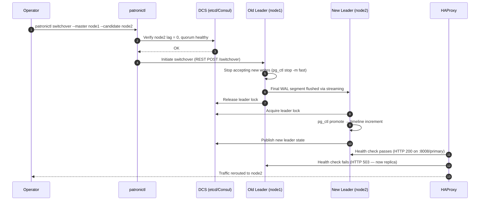

# Zero-Downtime Operations

## Executive Summary

Zero downtime is not a binary outcome — it is a spectrum of carefully sequenced steps that keep client-visible disruption below a threshold the business can accept. This chapter covers the five operations that cause most planned outages in Patroni clusters: switchovers, major version upgrades, minor version and Patroni upgrades, region drains, and certificate rotations. For each, you will see what happens under the hood, what commands to run in what order, and — critically — what to do when something goes wrong mid-operation. The chapter closes with a healthcare SaaS case study that upgraded eight Patroni clusters from PostgreSQL 15 to 17 without a single client-visible error. The unifying theme: every zero-downtime operation is a rehearsed, reversible procedure with explicit go/no-go gates and a documented rollback path. If either condition is not met, delay the operation until it is.

:::tip Relationship to Troubleshooting Playbooks
This chapter documents **planned** recovery procedures. If you arrived here from an **unplanned** incident, start with the symptom-keyed decision trees in [Chapter 07 — Troubleshooting Playbooks](./07-troubleshooting-playbooks) to identify root cause first, then return here for the detailed recovery steps.
:::

---

## Switchover vs Failover Semantics

### Definitions

| Term | Trigger | Operator-initiated? | Timeline increment? | RPO guarantee |
|------|---------|-------------------|--------------------|-|
| **Switchover** | Planned maintenance | Yes | Yes | 0 (all WAL flushed before promotion) |
| **Failover** | Unplanned leader loss | No | Yes | Depends on sync mode |

A **switchover** is a controlled handoff: the current leader finishes in-flight transactions, flushes WAL to the target standby, releases the DCS leader lock, and the target promotes. A **failover** is Patroni's automatic response to a leader that has stopped sending heartbeats — the TTL expires, a standby races to acquire the lock, and the winner promotes without a clean leader shutdown.

Use `patronictl switchover` for all planned operations. Never rely on `patronictl failover` in production maintenance — it bypasses the clean-flush sequence and may lose committed transactions if you are not in synchronous mode.

### The Planned Switchover Flow



### What Happens Under the Hood

1. **DCS lock handoff**: Patroni's leader holds a lease key in the DCS (e.g., `/service/mycluster/leader` in etcd). During switchover, the old leader explicitly deletes this key before promoting the candidate, rather than waiting for TTL expiry. This is the critical difference from failover — no TTL wait, no race.

2. **`pg_ctl promote`**: Patroni calls `pg_ctl promote` (or the equivalent via `pg_ctl stop -m fast` on the old leader followed by `pg_ctl promote` on the new). PostgreSQL writes a `.recovery_signal` completion record, increments the timeline ID, and begins accepting writes.

3. **Timeline increment**: Every promotion creates a new timeline. The old leader's replicas must recognize the new timeline before they can reconnect. Patroni handles this automatically via `pg_rewind` or reconnection — replicas detect the timeline switch in streaming replication and follow the new leader.

### Commands

```bash
# Check cluster state before any planned operation
patronictl -c /etc/patroni/patroni.yml list

# Dry-run: show what switchover would do (Patroni 3.x+)
patronictl -c /etc/patroni/patroni.yml switchover \
  --master node1 --candidate node2 --scheduled now

# Execute switchover (prompts for confirmation)
patronictl -c /etc/patroni/patroni.yml switchover \
  --master node1 --candidate node2

# Verify new leader
patronictl -c /etc/patroni/patroni.yml list
```

---

## Major Version Upgrade

Major version upgrades (e.g., 15 → 17) require a new PostgreSQL data directory format. Two patterns cover the full spectrum of database sizes and maintenance window constraints.

### Pattern A — pg_upgrade (In-Place, Brief Downtime Per Node)

**When to use**: Databases under ~200GB where `pg_upgrade --check` completes well within your maintenance window. Simpler operationally; recommended for smaller clusters.

**Downtime profile**: Brief per-node (~1–5 minutes for a 100GB database; dominated by `pg_upgrade`'s `--link` mode file relinking, not data copy).

#### Step-by-Step

```bash
# 1. PAUSE Patroni auto-failover to prevent unintended promotions
patronictl -c /etc/patroni/patroni.yml pause

# 2. Verify cluster is paused
patronictl -c /etc/patroni/patroni.yml list
# All nodes should show "paused" in State column

# 3. On EACH REPLICA first (one at a time), then the leader:
#    a. Stop Patroni
systemctl stop patroni

#    b. Install new PostgreSQL binaries (e.g., pg 17)
apt-get install -y postgresql-17   # Debian/Ubuntu example

#    c. Run pg_upgrade in check mode (dry run)
/usr/lib/postgresql/17/bin/pg_upgrade \
  --old-datadir /var/lib/postgresql/15/main \
  --new-datadir /var/lib/postgresql/17/main \
  --old-bindir /usr/lib/postgresql/15/bin \
  --new-bindir /usr/lib/postgresql/17/bin \
  --check

#    d. Run pg_upgrade with --link (hardlinks; avoids data copy)
/usr/lib/postgresql/17/bin/pg_upgrade \
  --old-datadir /var/lib/postgresql/15/main \
  --new-datadir /var/lib/postgresql/17/main \
  --old-bindir /usr/lib/postgresql/15/bin \
  --new-bindir /usr/lib/postgresql/17/bin \
  --link

#    e. Update Patroni config to point at new data dir + binaries
#       (update data_dir, bin_dir in patroni.yml)

#    f. For replicas: rebuild from the upgraded leader using pg_basebackup
#       (pg_upgrade on replicas is NOT supported — rebuild is required)

# 4. Restart Patroni on replicas
systemctl start patroni

# 5. Verify replication lag is &lt;1MB before proceeding to next node
patronictl -c /etc/patroni/patroni.yml list

# 6. Switchover to an upgraded replica, then upgrade the old leader
patronictl -c /etc/patroni/patroni.yml switchover

# 7. RESUME Patroni auto-failover only after ALL nodes are on new version
patronictl -c /etc/patroni/patroni.yml resume
```

**Key constraint**: `pg_upgrade` cannot upgrade replicas directly. After upgrading the leader, replicas must be rebuilt via `pg_basebackup` from the new leader. Patroni's `reinit` command automates this:

```bash
patronictl -c /etc/patroni/patroni.yml reinit mycluster node2
```

### Pattern B — Logical Replication (Zero-Downtime, More Complex)

**When to use**: Databases over ~200GB where `pg_upgrade`'s downtime exceeds your maintenance window. Also appropriate when you need continuous reads on the old version during the migration cutover window.

**Downtime profile**: 0–10 seconds of read-only time during cutover; no write downtime at all if your application handles read-only mode.

#### Step-by-Step

```bash
# --- On the OLD cluster (source, pg 15) ---

# 1. Create a publication for all tables
psql -c "CREATE PUBLICATION upgrade_pub FOR ALL TABLES;"

# 2. Note the current LSN (used to start replication from a consistent point)
psql -c "SELECT pg_current_wal_lsn();"

# --- Build the NEW cluster (pg 17) in parallel ---

# 3. Deploy a new Patroni cluster running pg 17 (separate cluster name)
#    Use pg_dump --schema-only to copy DDL
pg_dump --schema-only -d mydb | psql -h new-cluster-host -d mydb

# 4. Create a logical replication subscription on the new cluster
psql -h new-cluster-host -c "
  CREATE SUBSCRIPTION upgrade_sub
  CONNECTION 'host=old-leader-host dbname=mydb user=replicator'
  PUBLICATION upgrade_pub
  WITH (copy_data = true);
"

# 5. Monitor replication lag until it reaches zero
psql -h new-cluster-host -c "
  SELECT subname,
         pg_wal_lsn_diff(pg_current_wal_lsn(), received_lsn) AS lag_bytes
  FROM pg_stat_subscription;
"

# --- Cutover (when lag = 0) ---

# 6. Set old cluster to read-only at the application tier
#    (HAProxy: remove old cluster from write pool, or: SET default_transaction_read_only = on)

# 7. Wait for subscription lag to reach exactly 0
# 8. Disable the subscription on the new cluster
psql -h new-cluster-host -c "ALTER SUBSCRIPTION upgrade_sub DISABLE;"

# 9. Flip application connection strings / HAProxy backend to new cluster
# 10. Drop publication on old cluster (cleanup)
psql -c "DROP PUBLICATION upgrade_pub;"
```

**Prerequisites**: Logical replication requires all tables to have a replica identity. Check before starting:

```sql
SELECT relname FROM pg_class
WHERE relkind = 'r'
  AND relreplident = 'd'   -- default: primary key required
  AND oid NOT IN (
    SELECT indrelid FROM pg_index WHERE indisprimary
  );
-- Empty result means all tables have a primary key; you are ready.
```

### Patroni `pause` Mode for Upgrade Windows

Both patterns depend on `patronictl pause`. In paused mode:
- Patroni stops modifying the cluster state (no automatic failover, no restart on crash).
- The DCS lock is still held by the leader; replicas still stream WAL.
- Manual `systemctl stop/start patroni` is safe without triggering a failover race.

**Never leave a cluster paused indefinitely.** Set a calendar reminder to `resume` before the operator leaves the maintenance window.

```bash
# Always verify pause status before performing destructive operations
patronictl -c /etc/patroni/patroni.yml list | grep -i paused
```

---

## Minor Version / Patroni Upgrade

Minor version upgrades (e.g., 17.3 → 17.4, or Patroni 4.0.1 → 4.0.3) use a rolling restart: upgrade one node at a time, verify replication health between each node.

### Rolling Restart Pattern

```bash
# 1. Pause auto-failover
patronictl -c /etc/patroni/patroni.yml pause

# 2. On a REPLICA node: install new packages
apt-get install -y postgresql-17=17.4* patroni=4.0.3*

# 3. Restart Patroni (preferred — Patroni manages pg restart gracefully)
patronictl -c /etc/patroni/patroni.yml restart mycluster node2

# Alternative: systemd restart (use when Patroni itself is upgraded)
systemctl restart patroni

# 4. Verify node2 is streaming and lag is acceptable
patronictl -c /etc/patroni/patroni.yml list
# node2 should show Role=Replica, State=streaming, Lag in MB &lt; threshold

# 5. Repeat for remaining replicas, one at a time

# 6. Switchover to a fully upgraded replica
patronictl -c /etc/patroni/patroni.yml switchover \
  --master node1 --candidate node2

# 7. Upgrade and restart the old leader (now a replica)
apt-get install -y postgresql-17=17.4* patroni=4.0.3*
systemctl restart patroni

# 8. Verify all nodes healthy, then resume
patronictl -c /etc/patroni/patroni.yml resume
```

### `patronictl restart` vs `systemctl restart`

| Method | When to Use |
|--------|-------------|
| `patronictl restart` | PostgreSQL minor version upgrade; Patroni is already at the new version and managing the process |
| `systemctl restart patroni` | Patroni itself is being upgraded; the Patroni binary has changed |

For Patroni upgrades, always use `systemctl restart patroni` — `patronictl restart` sends a signal to the running Patroni process, which may be the old binary.

---

## Region Drain

A region drain gracefully moves all database traffic out of one region (or AZ) before maintenance — hardware replacement, network reconfiguration, kernel patching — without client disruption.

### Procedure

```bash
# 1. Tag the nodes in the target region to stop receiving new load
#    Edit patroni.yml on each node in the region:
#    tags:
#      nofailover: true    # This node will not be promoted automatically
#      noloadbalance: true # HAProxy will not send reads to this node

# 2. Reload Patroni to apply tag changes (no restart needed)
systemctl reload patroni
# Or via API:
curl -s -XPATCH http://node3:8008/config \
  -H "Content-Type: application/json" \
  -d '{"tags": {"nofailover": true, "noloadbalance": true}}'

# 3. Verify HAProxy has removed the nodes from the read pool
# HAProxy stats page: http://haproxy-host:9000/stats
# Nodes with noloadbalance=true will return HTTP 503 on the replica health endpoint

# 4. Wait for existing connections to drain
#    Monitor active connections on the regional nodes:
psql -h node3 -c "SELECT count(*) FROM pg_stat_activity WHERE state != 'idle';"

# 5. If the leader is in the drain region, switchover first
patronictl -c /etc/patroni/patroni.yml switchover \
  --master node3 --candidate node1

# 6. Perform maintenance on the regional nodes

# 7. Remove drain tags after maintenance
curl -s -XPATCH http://node3:8008/config \
  -H "Content-Type: application/json" \
  -d '{"tags": {"nofailover": false, "noloadbalance": false}}'

# 8. Verify HAProxy restores the node to the read pool
patronictl -c /etc/patroni/patroni.yml list
```

### Interaction with HAProxy Health Checks

Patroni's REST API returns HTTP 200 on `/replica` for a healthy replica and HTTP 503 for a replica tagged `noloadbalance: true`. HAProxy's `option httpchk` uses this endpoint:

```haproxy
backend pg_replicas
    option httpchk GET /replica
    http-check expect status 200
    server node1 node1:5432 check port 8008
    server node2 node2:5432 check port 8008
    server node3 node3:5432 check port 8008
```

The tag change propagates to HAProxy within one health-check interval (typically 2–5 seconds). No HAProxy reload is required.

---

## Certificate Rotation

TLS certificates expire. Rotating them without downtime requires the **double-certificate overlap pattern**: both old and new certificates are trusted simultaneously during a transition window, so no service loses connectivity.

### Certificate Surfaces in a Patroni Cluster

| Certificate | Used By | Rotation Impact |
|-------------|---------|----------------|
| Patroni REST API TLS | HAProxy, operators, Patroni peers | REST API unreachable if rotated incorrectly |
| etcd client TLS | Patroni → etcd | DCS unreachable; cluster unmanageable |
| PostgreSQL SSL | Application clients | Client connections rejected |

### Double-Certificate Overlap Pattern

```bash
# --- Step 1: Generate new certificates (do not deploy yet) ---
# (Using your PKI tooling — cfssl, Vault PKI, certbot, etc.)
# Produces: new-server.crt, new-server.key, new-ca.crt

# --- Step 2: Add new CA cert to all trust stores (old certs still active) ---
# On every node, append new CA to existing CA bundle:
cat /etc/patroni/tls/ca.crt new-ca.crt > /etc/patroni/tls/ca-bundle.crt

# Reload Patroni to pick up expanded CA bundle (no restart):
systemctl reload patroni

# Verify old and new clients can still connect:
curl --cacert /etc/patroni/tls/ca-bundle.crt https://node1:8008/health

# --- Step 3: Deploy new server certs, one node at a time ---
# Replace server cert on node2 (replica first):
cp new-server.crt /etc/patroni/tls/server.crt
cp new-server.key /etc/patroni/tls/server.key
systemctl reload patroni

# Verify node2 REST API responds with new cert:
openssl s_client -connect node2:8008 -CAfile /etc/patroni/tls/ca-bundle.crt \
  </dev/null 2>/dev/null | openssl x509 -noout -dates

# Repeat for remaining replicas, then switchover and rotate the leader

# --- Step 4: Remove old CA cert from trust bundle ---
# Only after ALL nodes are using new certs:
cp new-ca.crt /etc/patroni/tls/ca.crt
systemctl reload patroni

# --- Step 5: Rotate PostgreSQL SSL certs (same overlap pattern) ---
# pg_reload_conf() picks up new ssl_cert_file without a server restart:
psql -c "SELECT pg_reload_conf();"
```

### etcd Client Certificate Rotation

etcd client certs (used by Patroni to authenticate to etcd) must be rotated with the same overlap pattern. etcd supports multiple client CA certs; add the new CA, rotate client certs, then remove the old CA:

```bash
# Add new client CA to etcd's trusted CA list (etcd config reload)
# See etcd documentation for --peer-trusted-ca-file hot-reload procedures

# Verify Patroni can still reach etcd after cert swap:
patronictl -c /etc/patroni/patroni.yml list
```

---

## Break/Recovery Exercises

Every operation above has a failure mode. These are the ones that bite production clusters most often.

### Switchover Fails Mid-Flight — DCS Lock Stuck

**Symptom**: `patronictl list` shows the old leader in "stopped" state but no new leader has been elected. The DCS lock key still exists but is not being renewed.

**Cause**: Old leader released the lock but the candidate failed to acquire it (e.g., candidate was behind in WAL, or a network partition isolated the candidate from the DCS quorum).

**Recovery**:
```bash
# 1. Check which node holds the DCS lock (or if it has expired)
# etcd:
etcdctl get /service/mycluster/leader

# 2. If the lock is stale (old leader is down), wait for TTL expiry
#    Patroni will auto-elect when TTL expires (typically 30s)

# 3. If auto-election does not occur, manually trigger failover to a healthy node
patronictl -c /etc/patroni/patroni.yml failover mycluster --candidate node2

# 4. If the old leader's Patroni process is stuck, kill it
systemctl kill -s SIGKILL patroni   # on old leader node

# 5. Verify new cluster state
patronictl -c /etc/patroni/patroni.yml list
```

**Prevention**: Always verify candidate WAL lag is 0 before switchover (`patronictl list`). Never switchover when a node is in "lagging" state.

---

### pg_upgrade Fails on One Node — Rollback Path

**Symptom**: `pg_upgrade` exits non-zero on a replica node mid-upgrade. The old data directory is intact (`--link` mode only links; it does not delete old files).

**Recovery**:
```bash
# 1. pg_upgrade with --link preserves the old data directory
#    The old datadir is safe; new datadir may be corrupt
rm -rf /var/lib/postgresql/17/main

# 2. Restore patroni.yml to point at old data dir + old binaries
#    (Revert your config changes)

# 3. If this was a replica: reinitialize from the current leader
patronictl -c /etc/patroni/patroni.yml reinit mycluster node2

# 4. Verify the node rejoins as a streaming replica
patronictl -c /etc/patroni/patroni.yml list

# 5. Resume Patroni only after root cause is understood
patronictl -c /etc/patroni/patroni.yml resume
```

**If pg_upgrade failed on the leader after switchover**: The cluster is in a mixed-version state (leader on new version, one replica on old). Do not panic — streaming replication between major versions is not supported, but the old replica is not streaming yet. Rebuild it:

```bash
patronictl -c /etc/patroni/patroni.yml reinit mycluster failed-node
```

---

### Certificate Rotation Causes Connectivity Loss — Emergency Rollback

**Symptom**: After deploying new server cert on a node, `patronictl list` shows the node as "unknown" and REST API calls return TLS handshake errors.

**Cause**: The new certificate's CA was not added to all trust stores before the server cert was deployed (skipped Step 2 of the overlap pattern).

**Recovery**:
```bash
# 1. Immediately restore the old server cert on the affected node
cp /etc/patroni/tls/server.crt.backup /etc/patroni/tls/server.crt
cp /etc/patroni/tls/server.key.backup /etc/patroni/tls/server.key
systemctl reload patroni

# 2. Verify connectivity is restored
curl --cacert /etc/patroni/tls/ca.crt https://node2:8008/health

# 3. Restart the overlap pattern correctly:
#    Add new CA to trust bundle FIRST, verify, then deploy new server cert

# Emergency: if Patroni itself cannot start due to cert errors
# Start with ssl disabled temporarily (only on isolated node, briefly):
# Edit patroni.yml: remove restapi.cafile temporarily
# systemctl restart patroni
# Fix certs, then re-add cafile
```

**Prevention**: Always keep `.backup` copies of active certs before rotation. Use `openssl verify` to validate cert chains before deploying:

```bash
openssl verify -CAfile /etc/patroni/tls/ca-bundle.crt new-server.crt
# Should output: new-server.crt: OK
```

---

## Checklist

- [ ] Before any planned operation: `patronictl list` shows all nodes healthy, replication lag is 0, no nodes in "lagging" or "unknown" state
- [ ] `patronictl pause` is confirmed active before performing operations that involve stopping Patroni or modifying data directories
- [ ] For major version upgrades: `pg_upgrade --check` has been run and passed with zero errors on all nodes before the maintenance window begins
- [ ] For logical replication upgrades: all tables have a primary key (replica identity verified with the `pg_class` query above)
- [ ] For certificate rotations: new CA cert is added to all trust stores and connectivity is verified before any server cert is replaced
- [ ] Rollback path is documented and tested: old data directories preserved (`pg_upgrade --link`), old certs backed up, DCS lock TTL noted
- [ ] `patronictl resume` is on your checklist and has a calendar reminder — never leave a cluster paused at end of shift
- [ ] After any planned operation: replication lag returns to 0, `pg_stat_replication` shows all standbys connected, HAProxy health checks are green

---

## Gotchas

1. **`patronictl pause` does not disable PostgreSQL crash recovery.** If PostgreSQL crashes on a paused cluster, it will restart (via `pg_ctl`) but Patroni will not attempt failover. The node may come back as a standalone instance. Always monitor node health during paused windows.

2. **pg_upgrade replicas must be rebuilt, not upgraded in-place.** `pg_upgrade` is a leader-only operation. Any documentation or tool that suggests running `pg_upgrade` on a streaming replica is wrong. Use `patronictl reinit` to rebuild replicas from the upgraded leader.

3. **Logical replication does not replicate DDL.** Schema changes during the migration window must be applied manually to both old and new clusters in the correct order (old first, then new, for additive changes; new first, then old, for destructive changes). Plan a schema freeze for the migration window.

4. **`nofailover: true` does not prevent a node from being elected if it is the only survivor.** Patroni respects `nofailover` only when there are other eligible candidates. If all non-tagged nodes are down, a `nofailover` node will still be elected to prevent a complete outage.

5. **TLS reload (`systemctl reload patroni`) does not interrupt active connections.** PostgreSQL's `pg_reload_conf()` and Patroni's `reload` both pick up new cert files without dropping existing sessions. However, new TLS handshakes will use the new cert immediately — verify the new cert is valid before reloading.

6. **A logical replication slot on the old cluster will accumulate WAL if the subscription lags.** During a slow initial copy (`copy_data = true`), the old cluster may fill its WAL volume. Set `max_slot_wal_keep_size` on the old cluster as a safety valve, or monitor `pg_replication_slots.wal_status` closely.

---

## Case Study — Healthcare SaaS: PostgreSQL 15 → 17 Across Eight Clusters

### Context

A healthcare SaaS platform ran eight Patroni clusters (3–5 nodes each) on PostgreSQL 15. A compliance mandate required upgrading to PostgreSQL 17 within a 90-day window. Database sizes ranged from 40GB (internal audit log) to 2TB (primary patient records cluster). The platform's SLA required &lt;30 seconds of any client-visible degradation per upgrade event.

### Approach

The team evaluated both upgrade patterns against each cluster:

| Cluster | Size | Pattern Chosen | Rationale |
|---------|------|---------------|-----------|
| patient-records | 2TB | Logical replication | `pg_upgrade --check` estimated 45-minute downtime; exceeded 30-second SLA by 90× |
| audit-log | 40GB | pg_upgrade | pg_upgrade completed in &lt;3 minutes in pre-prod testing; simpler rollback |
| 6 remaining clusters | 80–400GB | pg_upgrade | All completed within 10-minute test runs |

**Rule of thumb that emerged**: Use logical replication when `pg_upgrade --check` (in a staging environment with production-sized data) takes longer than half your maintenance window budget. Use pg_upgrade for everything else — the simpler operational model reduces risk.

**Anti-pattern avoided**: The team initially proposed running `pg_upgrade` on the 2TB cluster with a "30-minute window that we'll extend if needed." This was rejected — a `pg_upgrade` on a 2TB database with an indefinite window is not a plan; it is a hope. The logical replication path gave them a hard 4-second cutover regardless of database size.

### Execution

1. **Weeks 1–2**: Seven pg_upgrade clusters upgraded using the rolling pattern above. Each cluster took 2–4 hours of total operator time (including pre/post validation), with &lt;5 minutes of Patroni-paused time per node.

2. **Week 3**: The 2TB patient-records cluster upgraded via logical replication:
   - Initial copy (`copy_data = true`): 18 hours to replicate 2TB over 10Gbps inter-cluster link
   - Lag catch-up after initial copy: 2 hours (high write workload during business hours)
   - Cutover window: chosen at 02:00 Sunday (lowest traffic)
   - Actual cutover time: 4 seconds of read-only mode (HAProxy removed old cluster from write pool → subscription lag reached 0 → HAProxy pointed at new cluster)

### Outcome

All eight clusters were upgraded in 14 days with zero client-visible errors. The logical replication cluster's 4-second read-only window was below the monitoring alert threshold (10 seconds) and was not observed by any client application.

**Key takeaway**: The investment in logical replication infrastructure (parallel cluster, subscription setup, monitoring) paid for itself in risk reduction. The team reused the same logical replication playbook to migrate one cluster between cloud regions three months later — the procedure transferred directly.

---

## Version Support

:::info Version Support
| Component | Versions | Notes |
|-----------|----------|-------|
| PostgreSQL | 18.x, 17.x | `pg_upgrade --link` supported since PG 9.0; logical replication since PG 10 |
| Patroni | 4.x (latest stable) | `pause`/`resume` stable since Patroni 1.x; `reinit` since 2.x |
| etcd | 3.5.x | Client cert hot-reload requires etcd 3.4+ |
| Consul | 1.18+ | Tag-based service health filtering stable in 1.x |
| Kubernetes | 1.31+ | Rolling upgrade patterns apply to Patroni on K8s with appropriate PodDisruptionBudgets |

**Compatibility window**: 12 months from publication.
:::

---

*Next: [Chapter 10 — Geo-Distributed Patroni](./10-geo-distributed-patroni) covers multi-region topologies, cascade standbys, and the trade-offs between synchronous cross-region replication and regional autonomy.*
