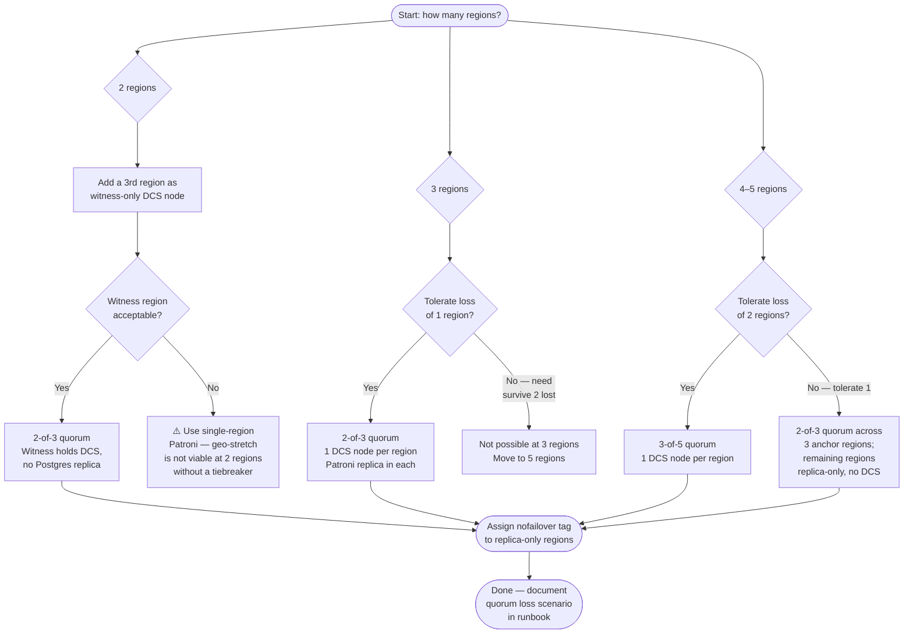

# Chapter 10 — Geo-Distributed Patroni

## Executive Summary

Stretching a Patroni cluster across geographic regions is one of the highest-leverage architectural decisions in PostgreSQL HA — and one of the most frequently botched. Done correctly, geo-distribution gives you region-level fault tolerance and compliance-grade data locality. Done carelessly, it delivers perpetual split-brain anxiety, write latency that breaks SLAs, and GDPR exposure hiding in your replication topology.

This chapter covers the full decision surface: where to place DCS nodes so that quorum survives a regional outage, how to draw the sync/async replication boundary to hit RPO targets without destroying write throughput, how `nofailover` and `noloadbalance` tags combine with DCS quorum to make split-brain structurally impossible rather than merely unlikely, how to architect for data sovereignty using logical replication seams, how to budget for and measure network latency at every layer, and how to navigate the five most common multi-region failure modes step by step. A logistics SaaS case study closes the chapter with a concrete EU + US-East + APAC architecture that achieved 4ms p99 regional writes and full GDPR compliance.

---

## Diagrams

### Quorum Placement Decision Tree

The flowchart below guides you from your regional count and failure tolerance requirements to the correct DCS quorum configuration.



> **Note:** A detailed Excalidraw multi-region topology diagram is available in `_diagrams/excalidraw/multi-region-topology.svg`. (The file will be created in a subsequent authoring pass.)

---

## Quorum Placement

### The Math of Quorum Loss

A Raft/Paxos-based DCS (etcd, Consul) requires `⌊N/2⌋ + 1` nodes to form a quorum. For a 3-node cluster that is 2; for a 5-node cluster it is 3. The corollary: a 3-node DCS cluster tolerates exactly **one** node failure before it becomes read-only and Patroni can no longer elect a new leader.

The critical insight for geo-distribution is that **a regional outage is equivalent to losing all DCS nodes in that region simultaneously**. If you place two DCS nodes in region A and one in region B, losing region A loses quorum immediately — the opposite of what you wanted. The rule is inviolable:

> **Never put a majority of your DCS nodes in any single region.**

For a 3-node DCS cluster across 3 regions (one node each), losing any single region leaves 2 nodes alive — quorum intact. For a 5-node cluster across 5 regions, losing any 2 regions leaves 3 nodes — quorum intact.

### 2-of-3 vs 3-of-5

**2-of-3** (one DCS node per region, 3 regions):
- Tolerates 1 full regional outage.
- Operationally simpler; most teams should start here.
- If you only have 2 application regions, add a **witness region**: a small VM or cloud instance running only the DCS node (etcd or Consul member), no Postgres replica. The witness participates in leader election but never promotes.

**3-of-5** (one DCS node per region, 5 regions):
- Tolerates 2 simultaneous full regional outages.
- Higher operational overhead; justified when your SLA explicitly requires surviving two concurrent regional failures or when you operate in 5+ geographic zones already.
- etcd 5-node clusters have higher write amplification; benchmark heartbeat RTTs before committing to this topology in high-latency meshes (>80ms inter-region).

### Witness / Tiebreaker Nodes

A witness node runs only the DCS agent — no PostgreSQL process, no Patroni. Configure it in etcd as a full voting member. In Consul, it is a server with `bootstrap_expect` matching the full cluster count.

Key constraints for the witness pattern:
- The witness region must have reliable connectivity to both primary regions; it is not immune to the split-brain it is meant to prevent.
- Never place application load balancers or Patroni nodes on the witness. Its sole job is quorum arithmetic.
- Tag any Patroni node in the witness region (if one accidentally exists) with `nofailover: true` and `noloadbalance: true` — though ideally the witness hosts no Patroni at all.

### DCS Placement Rules (Summary)

1. Distribute DCS nodes evenly — one per region for a 3-node cluster.
2. No region may hold more than `⌊N/2⌋` DCS nodes.
3. Inter-region DCS heartbeat RTT must stay under **half the election timeout**. For etcd defaults (heartbeat interval 100ms, election timeout 1000ms), RTT budget is ≤500ms.
4. Use a witness region when you have exactly 2 application regions and need quorum.
5. Document the quorum-loss scenario in your runbook: what Patroni does when DCS becomes read-only, and how operators recover.

---

## Sync vs Async by Region

### The Fundamental Tradeoff

Synchronous replication means the primary waits for at least one standby to confirm WAL receipt (and optionally flush) before returning success to the client. It gives **RPO = 0** for that standby — no committed transaction is ever lost, even on leader death. The cost is commit latency: every `COMMIT` incurs at least one inter-node round trip.

Within a single region — say, two nodes in the same data center or availability zone — round-trip times are typically 0.1–2ms. Synchronous replication here is essentially free.

Across regions, the same RTT is 20–200ms. At 100ms inter-region RTT, synchronous replication adds ≥100ms to every write commit. For an OLTP application targeting &lt;10ms p99 write latency, that is a hard constraint.

**The canonical geo-distributed pattern:**

- **Synchronous replication within region** — between the primary and its local standby. RPO = 0 for intra-region failures.
- **Asynchronous replication across regions** — cross-region standbys receive WAL without blocking commits. RPO is bounded by replication lag, typically seconds to low tens of seconds under normal load.

### Configuring Patroni for Hybrid Sync/Async

Patroni's `synchronous_mode` and `synchronous_node_count` control how many standbys must be synchronous:

```yaml
# patroni.yml — primary node
bootstrap:
  dcs:
    synchronous_mode: true
    synchronous_node_count: 1   # exactly 1 synchronous standby required
```

With `synchronous_node_count: 1`, Patroni selects **one** standby as the synchronous partner and maintains `synchronous_standby_names` in PostgreSQL accordingly. It will prefer a low-latency standby (typically the intra-region one) but does not have built-in latency-awareness for selection — you must guide this with tags and `nofailover`.

To **prevent** a cross-region standby from ever being selected as the synchronous partner, tag it in Patroni:

```yaml
# patroni.yml — cross-region replica node
tags:
  nofailover: false       # can still promote in a region-wide DR event if you choose
  noloadbalance: false
  nosync: true            # never selected as a synchronous standby
```

The `nosync` tag (introduced in Patroni 3.0, confirmed in 4.x) excludes the node from `synchronous_standby_names` selection, keeping cross-region replication permanently asynchronous regardless of `synchronous_mode` being enabled cluster-wide.

### Synchronous Node Count Per Region

For a 3-region topology with one primary and one standby per region:

| Region | Role | `nosync` | Replication Mode |
|--------|------|----------|-----------------|
| EU-West (primary region) | Primary | — | — |
| EU-West | Local standby | `false` | **Synchronous** |
| US-East | Cross-region standby | `true` | Asynchronous |
| APAC | Cross-region standby | `true` | Asynchronous |

`synchronous_node_count: 1` with one eligible synchronous standby (EU-West local) gives RPO = 0 for the primary region and async-bounded RPO for the other regions.

:::caution Synchronous mode and availability
With `synchronous_node_count: 1`, if the sole synchronous standby goes down, PostgreSQL blocks all writes until a new synchronous standby is elected or `synchronous_mode_strict: false` degrades gracefully. Know your availability vs. RPO tradeoff before enabling strict synchronous mode across a geo-distributed cluster.
:::

---

## Split-Brain Prevention with `nofailover` Tags + DCS Quorum

### The Two Lines of Defense

Patroni's split-brain prevention architecture has two independent layers:

1. **DCS quorum** — a node can only become leader if it can acquire the DCS leader key, which requires quorum. If DCS is partitioned and a node cannot reach quorum, it will not promote — it demotes itself or stays as a replica.

2. **Patroni tags** — `nofailover: true` marks a node as permanently ineligible for automatic promotion. Even if DCS quorum is intact, the tagged node will never be selected as a failover target.

Neither layer alone is sufficient for all scenarios. DCS quorum is the ultimate arbiter; tags are surgical controls for topology-driven promotion eligibility.

### Using `nofailover` in Geo-Distributed Topologies

In a 3-region cluster, you typically want failover to happen only within the primary region (or to a designated DR region), not to any cross-region replica:

```yaml
# patroni.yml — cross-region replicas (US-East, APAC)
tags:
  nofailover: true       # never auto-promoted, even if DCS quorum is intact
  noloadbalance: true    # exclude from HAProxy/pgBouncer read replica pool
  nosync: true           # never selected as synchronous standby
```

The intra-region standby carries none of these tags and is the sole automatic failover candidate.

### `noloadbalance` and `clonefrom`

- `noloadbalance: true` — the node is excluded from the replica endpoint returned by Patroni's REST API (`/replica`). Use this for cross-region nodes you don't want serving latency-sensitive reads.
- `clonefrom: true` — designates the node as a preferred clone source for new replicas. In geo-distributed topologies, set `clonefrom: true` on the cross-region replica closest (latency-wise) to where new nodes are being bootstrapped, to avoid pulling base backups across long-haul links.

### When the DCS Itself Partitions

This is the scenario operators fear most. If the inter-region DCS network partitions:

- **Minority partition** (fewer than quorum DCS nodes reachable): Patroni on affected nodes detects DCS loss. The leader on the minority side starts a countdown: it will demote itself after `ttl` seconds if it cannot renew the leader key. Replicas on the minority side enter a holding pattern — they will not promote without quorum. **No split-brain occurs.**
- **Majority partition** retains quorum. The surviving leader continues serving writes. If the primary is on the minority side and demotes, a replica on the majority side may promote — the intended behavior.
- **Symmetric partition** (each side has exactly half the DCS nodes): neither side has quorum. Both sides go read-only. Patroni's existing primary demotes. Writes are blocked until the partition heals or an operator manually intervenes with `patronictl failover --force`. This is correct behavior — availability is sacrificed to prevent split-brain.

:::caution Manual intervention after symmetric DCS partition
After the partition heals, the cluster does not automatically recover to a clean state. You must run `patronictl restart <cluster> <node>` for any nodes that entered an inconsistent state, and confirm a single leader is registered in the DCS before restoring write traffic.
:::

---

## Data Sovereignty Patterns

### The Core Problem

GDPR (EU), LGPD (Brazil), PIPL (China), and similar regulations require that certain categories of personal data never leave a defined geographic jurisdiction. A naive geo-distributed PostgreSQL cluster — where every replica has a full copy of all data — violates this by design.

### Per-Region Patroni Clusters with Logical Replication Seams

The recommended architecture for data-sovereignty compliance is **independent Patroni clusters per region**, connected by logical replication for shared reference data only:

```
EU Cluster (Patroni) ──logical pub/sub──► US-East Cluster (Patroni)
        │                                         │
        └──────────────────────────────────────────┘
               Shared reference data only
               (product catalog, config tables)

EU customer PII: stays in EU Cluster, never replicated outbound.
US customer PII: stays in US-East Cluster, never replicated outbound.
```

Each regional cluster is a self-contained Patroni HA cluster. Physical replication (streaming) remains intra-region. Cross-region data movement is purely through controlled logical replication publications.

### Setting Up Logical Replication Publications

```sql
-- On EU primary: publish only non-PII reference tables
CREATE PUBLICATION geo_reference_pub
  FOR TABLE product_catalog, region_config, feature_flags
  WITH (publish = 'insert, update, delete');
```

```sql
-- On US-East primary: subscribe to EU reference data
CREATE SUBSCRIPTION geo_reference_sub
  CONNECTION 'host=eu-primary.internal dbname=app user=repl_user'
  PUBLICATION geo_reference_pub;
```

The subscription runs on the US-East primary. When US-East fails over within its own Patroni cluster, the logical replication subscription is re-established on the new primary automatically (Patroni handles this via `pg_rewind` + replica promotion; the subscription slot lives on the publishing side).

:::caution Replication slot accumulation
Logical replication slots on the publisher do not advance while the subscriber is down. During a prolonged US-East outage, the EU primary will accumulate WAL and can run out of disk space. Set `max_slot_wal_keep_size` (PostgreSQL 13+) to bound WAL retention, and monitor `pg_replication_slots.wal_lag` actively.
:::

### Per-Table Routing at the Application Layer

For a shared schema where data is partitioned by customer region, use PostgreSQL row-level security (RLS) or application-layer routing to ensure:

- EU customer writes go to the EU cluster primary.
- US customer writes go to the US-East cluster primary.
- Reads are served from the local cluster replica pool.

No cross-region physical replication is needed. The application connection string chooses the cluster by customer region attribute.

### When NOT to Do Cross-Region Physical Replication

Cross-region streaming replication (physical, as Patroni manages it) is inappropriate when:

1. **Data sovereignty requirements prohibit full data copies** in other jurisdictions — there is no column-level filter in physical replication.
2. **Inter-region RTT makes synchronous mode impractical** and your RPO target is incompatible with asynchronous lag under load.
3. **Your write volume saturates cross-region bandwidth** — physical replication is a full WAL stream with no filtering; logical replication lets you publish only specific tables.
4. **Schema divergence across regions** is needed — physical replication requires identical schemas.

---

## Network Latency Budget

### Three Latency Layers

In a geo-distributed Patroni cluster, network latency affects three distinct paths, each with different tolerance thresholds:

| Layer | Typical RTT | Patroni Sensitivity | Hard Limit |
|-------|-------------|--------------------|-----------:|
| DCS heartbeat (etcd/Consul) | 10–200ms | High — drives leader election | `ttl / 3` ms recommended |
| WAL shipping (streaming replication) | 10–200ms | Medium — drives replication lag | Async: no hard limit; sync: commit RTT |
| Client commit latency | Varies | Very high — user-facing | Depends on SLA |

### DCS Heartbeat Budget

Patroni heartbeats to the DCS every `loop_wait` seconds (default: 10s). The DCS leader key TTL is configurable (default: 30s). A node failing to renew within TTL triggers leader election.

For stable cross-region DCS operation:
- **`loop_wait`**: set to 10s minimum (default is fine; do not decrease below 5s for cross-region).
- **`ttl`**: must be greater than `loop_wait × 3` to tolerate transient latency spikes. Default 30s provides 3 missed heartbeats.
- **`retry_timeout`**: how long Patroni retries a DCS operation before declaring failure. Default 10s; increase to 15–20s for high-latency DCS paths.
- **etcd election timeout** (in etcd configuration): must be at least 5× the heartbeat interval, and heartbeat interval should be roughly 10× the RTT to the slowest peer.

To measure actual heartbeat round-trip time to the DCS:

```bash
# Measure etcd latency from the Patroni host
etcdctl endpoint status --cluster \
  --endpoints=https://etcd-eu:2379,https://etcd-us:2379,https://etcd-ap:2379 \
  -w table
```

Watch the `DB SIZE` and `RAFT TERM` columns; a stalled `RAFT TERM` across peers indicates election instability.

### WAL Shipping Latency

Measure replication lag continuously via:

```sql
SELECT
  client_addr,
  application_name,
  state,
  write_lag,
  flush_lag,
  replay_lag,
  sync_state
FROM pg_stat_replication
ORDER BY replay_lag DESC NULLS LAST;
```

For async cross-region replicas, `replay_lag` in seconds is your effective RPO under steady-state load. Spikes during batch operations can push this to minutes — account for this in your RPO commitment.

### When Latency Makes Sync Replication Impractical

Rule of thumb: if inter-region RTT exceeds **20ms**, synchronous replication to a cross-region standby will add ≥20ms to every write commit. For applications with &lt;10ms write SLA, this is already a hard no. For batch-heavy applications with relaxed latency requirements, sync cross-region may be acceptable — measure under realistic write load, not just idle.

A practical test:

```bash
# Simulate synchronous replication commit overhead
pgbench -h <cross-region-primary> -c 10 -T 60 \
  -f <(echo "BEGIN; UPDATE accounts SET balance=balance+1 WHERE id=1; COMMIT;")
```

Compare TPS and latency percentiles against an intra-region baseline. If p99 latency exceeds your SLA budget, `nosync: true` is mandatory for cross-region nodes.

---

## Multi-Region Failure Scenarios

### Scenario 1: Single Region Outage (Expected Behavior)

**Setup**: 3-region cluster (EU primary, US-East standby, APAC standby). EU hosts the primary and the sole synchronous standby (both intra-region). DCS: one node per region.

**What happens**:
- EU region goes dark (power, network, cloud AZ failure).
- EU DCS node is lost; US-East and APAC DCS nodes retain quorum (2-of-3).
- The EU Patroni leader fails to renew the DCS key within TTL (default 30s).
- US-East and APAC replicas detect leader expiry. The node without `nofailover: true` runs the leader election.
- **Expected**: no automatic promotion occurs if both US-East and APAC carry `nofailover: true`. The cluster enters a read-only state until an operator intervenes.
- **If US-East is the designated DR target** (no `nofailover` tag): it promotes automatically after TTL expires. Writes resume in US-East.

**Manual intervention**: Run `patronictl failover <cluster> --master us-east-node --force` if auto-failover is disabled for all cross-region nodes.

**Recovery**: When EU comes back, Patroni on the returning nodes detects a new leader in the DCS, runs `pg_rewind` if needed, and rejoins as replicas.

### Scenario 2: Inter-Region Link Failure (Network Partition)

**Setup**: EU and US-East can reach each other; APAC is isolated. APAC holds one DCS node.

**What happens**:
- APAC DCS node is unreachable from EU and US-East.
- EU + US-East retain 2-of-3 quorum. The cluster continues normally.
- APAC Patroni node detects DCS loss. It cannot acquire the leader key (not that it would try — it has `nofailover: true`). It stops accepting connections if configured with `master_start_timeout: 0` or degrades to replica mode.
- APAC replica falls behind (asynchronous lag increases). If the APAC replica was serving reads, clients fail over to the EU replica endpoint.

**Manual intervention**: None required if APAC is tagged `nofailover: true` and `noloadbalance: true`. Monitor replication lag; when the link heals, lag catchup begins automatically.

**Recovery**: Link restored → APAC DCS node rejoins quorum → APAC Patroni replica resumes streaming from the current leader → lag drains.

### Scenario 3: Partial DCS Partition

**Setup**: 3-region, 3-node DCS. EU DCS node becomes isolated from US-East and APAC DCS nodes, but EU Patroni nodes can still reach each other locally.

**What happens**:
- EU DCS node loses quorum (1-of-3 is not quorum).
- US-East and APAC DCS nodes retain quorum (2-of-3).
- The EU Patroni primary cannot renew the DCS leader key (the quorum majority is on US-East + APAC DCS nodes which the EU Patroni primary cannot reach via DCS).
- After TTL, the EU primary demotes itself. It sets `postgres` to replica mode.
- **No split-brain**: the EU primary demotes before a new leader can be elected.
- If a US-East or APAC node lacks `nofailover: true`, one of them promotes.

**Manual intervention**: Once the DCS partition heals, the old EU primary may need `patronictl restart` to rejoin cleanly. Confirm the DCS shows a single leader before resuming writes.

---

## Checklist

- [ ] **DCS balance verified**: no single region holds a majority of DCS nodes (`N_region ≤ ⌊DCS_total/2⌋`).
- [ ] **`nofailover` tags audited**: every cross-region replica that should NOT auto-promote is tagged `nofailover: true` in its `patroni.yml`, and the DCS reflects this (`patronictl list` → verify `Tags` column).
- [ ] **`nosync` tags on cross-region nodes**: confirm `synchronous_standby_names` in PostgreSQL never includes a cross-region host (`SELECT * FROM pg_stat_replication WHERE sync_state = 'sync'`).
- [ ] **DCS heartbeat RTTs measured**: `etcdctl endpoint status --cluster -w table` shows all peers healthy with RTT within the `ttl / 3` budget.
- [ ] **Replication lag baseline documented**: `pg_stat_replication.replay_lag` measured under representative write load, compared against RPO commitment for each cross-region standby.
- [ ] **Logical replication slots monitored**: `pg_replication_slots.wal_lag` and `max_slot_wal_keep_size` configured to prevent disk exhaustion during subscriber downtime.
- [ ] **Failover runbook tested**: executed `patronictl failover --force` against a staging cluster; verified the correct node promoted; verified old primary rejoined as replica.
- [ ] **Data sovereignty boundary documented**: a written inventory lists which tables are published via logical replication and which tables are confined to each regional cluster; GDPR/data-residency compliance review signed off.

---

## Gotchas

**1. `nofailover` is a Patroni tag, not a DCS ACL.**
The tag is stored in the DCS and respected by Patroni during leader election. It does not prevent a rogue `patronictl failover --force` by an operator. Enforce change-control discipline on manual failover commands; treat `--force` like a production incident action.

**2. Logical replication slots block WAL cleanup on the publisher.**
If a subscriber (cross-region replica) is down for hours or days, the publisher accumulates WAL indefinitely (up to disk capacity) unless `max_slot_wal_keep_size` is set. The default is `-1` (unlimited). Set a sensible limit and alert on `wal_lag` before it becomes a disk incident.

**3. Witness nodes must be in a third geographic zone, not a third AZ in the same region.**
A "region" in quorum arithmetic means an independent failure domain. Two AZs in `eu-west-1` that share a regional backbone are not independent for region-loss scenarios. Place your witness in a genuinely separate geographic footprint (different cloud region, different data center operator, different physical building).

**4. `synchronous_mode: true` + all sync-eligible standbys down = write outage.**
With strict synchronous mode, PostgreSQL will refuse to commit if no synchronous standby is available. In a geo-distributed cluster where the sole eligible synchronous standby (intra-region) crashes, writes block until Patroni elects a new synchronous partner or you intervene. Set `synchronous_mode_strict: false` if availability trumps strict RPO=0, or maintain two intra-region sync-eligible replicas.

**5. `pg_rewind` requires `wal_log_hints = on` or data checksums.**
After a regional failover, the old primary rejoins as a replica via `pg_rewind`. If `wal_log_hints` is not set and checksums are not enabled, `pg_rewind` cannot safely rewind the old primary and Patroni falls back to a full `pg_basebackup`. On large clusters, this can take hours. Enable checksums at cluster init or `wal_log_hints = on` in `postgresql.conf` before you need it.

**6. Cross-region pgBouncer / HAProxy routing adds its own latency layer.**
If your application routes through a global load balancer to the regional Patroni primary, the load balancer's health check interval determines how quickly it redirects after a regional failover. A 30-second TTL on the health check + a 30-second Patroni TTL = up to 60 seconds of write unavailability after a regional failure. Tune both together, and test end-to-end client failover time explicitly.

---

## Case Study — Logistics SaaS: EU + US-East + APAC

### Context

An anonymized logistics SaaS platform processes shipment and tracking events for customers across three jurisdictions. EU customers are subject to GDPR, which requires their personal data (name, address, tracking history) to remain within the EU. The platform ran a single PostgreSQL cluster with Patroni for three years before geo-expansion; the naive extension of this architecture to three regions created both a compliance problem and a latency problem.

### The Anti-Pattern They Started With

**Global synchronous replication across all three regions.** The initial architecture placed the primary in EU-West and two synchronous standbys in US-East and APAC. Reasoning: "maximum data safety."

Problems encountered within 90 days:
- **Commit latency**: EU-West to APAC RTT was 210ms. Every write committed at >210ms. The p99 write latency for EU customers jumped from 3ms (intra-region) to 240ms. SLA breaches began within weeks.
- **GDPR violation risk**: US-East and APAC standbys held complete copies of EU customer PII. The data processor agreements (DPAs) with the EU customers did not cover APAC data residency. Legal flagged the architecture within 60 days.
- **Cascading synchronous mode issues**: When APAC connectivity degraded during a cable maintenance window, the primary entered write-blocking wait, causing a 4-minute write outage for all customers globally.

### The Pattern That Worked

**Per-region Patroni clusters with logical replication for shared reference data; writes pinned to customer's home region.**

Architecture:
- EU Cluster: 1 primary + 1 intra-region synchronous standby + 1 asynchronous standby. Holds all EU customer PII. Serves EU customer writes.
- US-East Cluster: 1 primary + 1 intra-region synchronous standby. Holds US customer data. Serves US customer writes.
- APAC Cluster: 1 primary + 1 intra-region synchronous standby. Holds APAC customer data.

DCS: 3 independent etcd clusters, one per region. Each cluster has 3 nodes within the region (multi-AZ). No cross-region DCS federation.

Logical replication:
- EU publishes `product_catalog`, `carrier_lookup`, `region_config` (no PII).
- US-East and APAC subscribe.
- Reference data lag: measured at &lt;500ms under normal load.

Application routing: The API gateway reads the customer's `data_residency` attribute (set at onboarding) and routes writes to the appropriate regional cluster primary. Cross-region reads for reference data are served from the local replica pool.

### Outcomes

| Metric | Before (global sync) | After (per-region) |
|--------|---------------------|--------------------|
| EU write p99 latency | 240ms | 4ms |
| APAC write p99 latency | >210ms | 6ms |
| Reference data cross-region lag | N/A (sync) | &lt;500ms |
| GDPR compliance status | ❌ At risk | ✅ Documented and audited |
| Write outage during APAC maintenance | 4 minutes | 0 (isolated to APAC cluster) |

The GDPR-compliant architecture was documented, reviewed by legal counsel, and presented to EU enterprise customers as part of their DPA renewal. The per-region Patroni cluster architecture reduced operational blast radius: an APAC cluster incident no longer affected EU or US-East write availability.

---

## Version Support

| Component | Supported Versions | Notes |
|-----------|-------------------|-------|
| **PostgreSQL** | 18.x, 17.x (N-1) | Logical replication improvements in PG18 (two-phase commit for logical slots) benefit the publisher/subscriber pattern in this chapter |
| **Patroni** | 4.x (latest stable) | `nosync` tag, `synchronous_node_count`, and REST API `/replica` filtering confirmed in 4.x |
| **etcd** | 3.5.x | 3-node and 5-node quorum configurations covered |
| **Consul** | 1.18+ | Full voting server members for DCS quorum |
| **Kubernetes** | 1.31+ | Kubernetes-backed DCS (Endpoints/Leases) supported; quorum math is identical |

**Compatibility window**: 12 months from publication. Cross-region network topology and cloud-provider latency characteristics evolve independently of software versions; re-validate RTT budgets when changing cloud regions or providers.

:::info Next chapter
[Chapter 11 — Agentic AI for Autonomous Patroni Operations](./11-agentic-ai-autonomous-ops) covers AI-agent workflows for predictive failover, self-tuning, and natural-language operations, with explicit guardrails and documented manual fallbacks for every automated action.
:::
