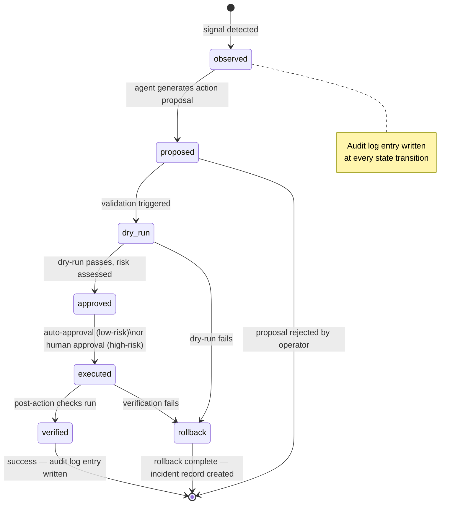

import ArtifactRef from '@site/src/components/ArtifactRef';

# Chapter 11 — Agentic AI for Autonomous Patroni Operations

## Executive Summary

AI agents can observe a Patroni cluster faster than any human, correlate signals across dozens of metrics simultaneously, and execute recovery procedures in seconds rather than minutes. The productivity upside is real. So is the blast radius when an agent misbehaves in production.

This chapter takes a pragmatic, guardrails-first approach: every agent action traverses a six-state lifecycle (observed → proposed → dry-run → approved → executed → verified), with approval gates that are automatic for low-risk actions and human-in-the-loop for anything destructive. Five agent workflows are documented — autonomous monitoring, predictive failover, self-tuning, auto-remediation, and natural language operations — each grounded in the observability signals and playbooks from Chapters 06, 07, and 09.

Every workflow has an explicit manual equivalent. If AI agents are not appropriate for your environment, this chapter still has value: the manual equivalents are the right procedures regardless of automation. The agents automate execution; they do not replace understanding.

---

## Diagram — Agent Action Lifecycle State Machine



Every state transition writes an immutable audit log entry. Every failure path leads to rollback, never silent abandonment.

---

## The Agent Action Lifecycle

Autonomous operations are only trustworthy when they are predictable. The six-state lifecycle enforces predictability regardless of which agent workflow is running.

### State 1 — Observed

The agent samples telemetry: Prometheus metrics, Patroni REST API responses, `pg_stat_replication`, DCS key state, system-level I/O and memory. It compares current readings against learned baselines or threshold rules. When a signal crosses a threshold or a multi-signal correlation fires, the agent transitions from passive observation to active reasoning.

Every observation that triggers further action writes an audit log entry: what signal was seen, at what timestamp, from which source, with what value.

### State 2 — Proposed

The agent produces a structured action proposal: a typed, validated object (via pydantic-ai) that names the action, the target node, the expected outcome, the risk tier (low / medium / high), and the estimated blast radius. The proposal is human-readable — it must be interpretable by an on-call SRE who has never seen this agent before.

Low-risk proposals (e.g., "cancel a blocking query that has been idle for &gt;5 minutes") can proceed to dry-run automatically. High-risk proposals (e.g., "initiate a planned switchover") require explicit human approval before advancing past this state.

### State 3 — Dry-Run

Before any real action, the agent simulates execution in a safe context: calling the target API with a `dry_run=true` flag, running `patronictl ... --dry-run`, or executing the action against a staging cluster. The dry-run result is validated: did the simulation produce the expected outcome? If not, the proposal is rejected and the failure is logged.

Dry-run is **mandatory** for every action involving DDL, failover, parameter changes, or slot management. No exceptions.

### State 4 — Approved

For low-risk tiers, the agent self-approves after a passing dry-run. For medium and high-risk tiers, a human operator receives a structured approval request (via PagerDuty, Slack, or a web console) and must explicitly approve, modify, or reject the proposal within a configurable timeout. If the timeout expires without a response, the action is automatically rejected and escalated.

The approval record — who approved, at what timestamp, with what context — is written to the immutable audit log.

### State 5 — Executed

The approved action is executed against the production system. Execution is always single-cluster, never fleet-wide in one operation. If an action would affect multiple clusters, the agent queues one cluster at a time with a configurable inter-action delay.

Execution failures are caught immediately. Any exception or unexpected API response triggers an emergency rollback without waiting for the verification step.

### State 6 — Verified

After execution, the agent waits a configured settle time (typically 30–120 seconds depending on action type) and then re-samples the original signal that triggered the lifecycle. Did the metric return to normal range? Did the cluster rejoin the expected state?

Verification failure triggers automatic rollback. Success writes the final audit log entry and closes the incident record. No action is considered complete until verification passes.

---

## Model-Provider Abstraction

### Using litellm for Provider Portability

Committing to a single model provider is an operational risk. Provider outages, pricing changes, and regulatory constraints all argue for portability. The reference implementation uses [litellm](https://github.com/BerriAI/litellm) as a unified routing layer:

```python
import litellm

# Switch provider by changing the model string — no other code changes
response = litellm.completion(
    model="anthropic/claude-opus-4",  # or "openai/gpt-4o", "bedrock/anthropic.claude-3-5-sonnet-20241022-v2:0"
    messages=[{"role": "user", "content": prompt}],
    temperature=0,  # determinism is non-negotiable for autonomous actions
)
```

The `model` string is the only change needed to move between OpenAI, Anthropic, AWS Bedrock, GCP Vertex, Azure OpenAI, or a local model served via an OpenAI-compatible endpoint (Ollama, vLLM). Set `temperature=0` for all action-generating calls — stochastic outputs are incompatible with reproducible autonomous operations.

For air-gapped or highly regulated environments, swap to a locally-hosted model:

```python
# Local model via Ollama (no data leaves the datacenter)
response = litellm.completion(
    model="ollama/llama3.3",
    api_base="http://localhost:11434",
    messages=[{"role": "user", "content": prompt}],
    temperature=0,
)
```

### Using pydantic-ai for Typed, Validated Agent Interfaces

Raw LLM text output is not safe to execute. All agent proposals use [pydantic-ai](https://ai.pydantic.dev/) to enforce structured, type-validated outputs:

```python
from pydantic import BaseModel
from pydantic_ai import Agent
from enum import Enum

class RiskTier(str, Enum):
    low = "low"
    medium = "medium"
    high = "high"

class ActionProposal(BaseModel):
    action_type: str           # e.g. "cancel_query", "drop_slot", "switchover"
    target_node: str           # e.g. "patroni-node-2"
    target_cluster: str        # e.g. "prod-pg-cluster-eu"
    expected_outcome: str      # human-readable description
    risk_tier: RiskTier
    estimated_blast_radius: str
    manual_equivalent_ref: str # e.g. "Ch. 07 § Dead Replication Slot"
    requires_human_approval: bool

# The agent is constrained to return only valid ActionProposal objects
agent = Agent(
    "anthropic/claude-opus-4",
    result_type=ActionProposal,
    system_prompt="You are a PostgreSQL SRE agent. Propose only safe, reversible actions.",
)
```

If the model returns output that does not parse into `ActionProposal`, pydantic-ai raises a validation error and the lifecycle halts at the `proposed` state. The validated object is what traverses all subsequent states — never raw model output.

---

## Five Agent Workflows

### Workflow 1 — AGENT-11-MON: Autonomous Monitoring

**Artifact**: <ArtifactRef id="AGENT-11-MON" />

**Purpose**: Correlates signals from the observability layer (Chapter 06) across the full cluster fleet, generates structured incident summaries, and proposes severity classifications. Replaces the first 5–10 minutes of an on-call SRE's "what is happening?" investigation.

**State machine specialization**:
- *Observed*: The agent polls Prometheus, the Patroni REST API, and `pg_stat_replication` every 30 seconds. An alert fires or a multi-signal correlation pattern matches (e.g., replication lag rising + DCS heartbeat latency spiking + one node returning HTTP 503 from Patroni's `/health` endpoint).
- *Executed*: The agent writes a structured incident summary to the on-call channel: affected nodes, timeline, correlated signals, proposed severity (P1–P4), and a link to the relevant Chapter 07 playbook section.

**Guardrails — what the agent is NOT allowed to do**:
- AGENT-11-MON may not modify any cluster configuration.
- It may not initiate any DBA or operational action.
- It may not suppress or silence alerts.
- It may only *read* from APIs; all writes are blocked at the tool layer.

**Failure modes**:
- *Telemetry gap*: If Prometheus is unavailable, the agent falls back to direct Patroni REST polling. Blast radius: delayed incident detection, not a false action.
- *Over-correlation*: The agent may produce false-positive severity assessments during routine maintenance windows. Mitigation: maintenance-mode flag suppresses classification upgrades.
- *Model hallucination on incident summary*: Structured output via pydantic-ai catches missing or malformed fields. Free-text summary sections are logged but not acted upon automatically.

**Manual equivalent (FR-019)**: SRE reads the DASH-06-CORE Grafana dashboard and DASH-06-LAG replication panel (Chapter 06 § Core Dashboard), then follows the Chapter 07 § Triage Decision Tree to classify severity. AGENT-11-MON compresses this to seconds; the manual procedure is the fallback when the agent is unavailable or distrusted.

**Post-mortem template reference**: See [Post-Mortem Template](#post-mortem-template) at the end of this chapter.

---

### Workflow 2 — AGENT-11-PF: Predictive Failover

**Artifact**: <ArtifactRef id="AGENT-11-PF" />

**Purpose**: Monitors leading indicators of leader instability — DCS heartbeat latency trend, disk I/O saturation rate-of-change, replication lag acceleration — and proposes a preemptive planned switchover before the leader fails. Converts unplanned failovers (RPO uncertain) into planned switchovers (RPO = 0).

**State machine specialization**:
- *Observed*: The agent computes trend derivatives over a 5-minute rolling window. A proposal fires when ≥2 of the following thresholds are breached: DCS heartbeat p99 &gt;500ms and rising; disk I/O utilization &gt;85% and accelerating; replication lag &gt;10s and doubling within 2 minutes. Single-signal breaches produce a warning observation only.
- *Executed*: The agent calls `patronictl switchover` targeting the healthiest replica (lowest replication lag, `nofailover: false`, passing health checks) as the new leader.

**Guardrails — what the agent is NOT allowed to do**:
- AGENT-11-PF may not initiate `patronictl failover --force` under any circumstances (forced failover bypasses WAL flush and risks data loss).
- It may not switchover when replication lag on all candidates exceeds 1MB (RPO guarantee cannot be made).
- It may not perform more than one switchover per cluster per 30-minute window.
- High-risk tier: requires human approval unless the cluster is enrolled in a pre-approved autonomous switchover policy.

**Failure modes**:
- *False positive switchover*: Leading indicators spike but the leader recovers. The switchover was unnecessary. Blast radius: brief client reconnect (typically &lt;30s) but no data loss and no real failover.
- *All replicas lagged at proposal time*: Agent proposes switchover, dry-run fails the lag check, proposal is rejected. The cluster limps along until a human intervenes or AGENT-11-AR addresses the lag root cause.
- *Leader demotes between proposal and execution*: The switchover races with an organic failover. Execution fails; the agent observes the promoted replica via the DCS, logs the event, and transitions to verified state (cluster recovered without agent action).

**Manual equivalent (FR-019)**: SRE monitors DCS latency and I/O trends in DASH-06-CORE (Chapter 06 § Core Dashboard) and initiates a planned switchover per Chapter 09 § The Planned Switchover Flow when trends indicate instability. AGENT-11-PF automates the trend correlation; the manual execution path is `patronictl switchover` as documented in Chapter 09.

**Post-mortem template reference**: See [Post-Mortem Template](#post-mortem-template).

---

### Workflow 3 — AGENT-11-ST: Self-Tuning

**Artifact**: <ArtifactRef id="AGENT-11-ST" />

**Purpose**: Adjusts PostgreSQL runtime parameters — `work_mem`, `shared_buffers`, `checkpoint_completion_target`, `max_wal_size`, and related checkpoint/memory settings — based on observed workload patterns from `pg_stat_statements` and system memory telemetry. Closes the loop between load characterization and configuration.

**State machine specialization**:
- *Observed*: The agent samples `pg_stat_statements` every 15 minutes, computes average and p99 sort/hash memory usage, monitors checkpoint frequency and write-behind ratio. It detects workload regime changes (e.g., batch window started, OLAP queries appeared) and evaluates whether current parameters are suboptimal relative to a tuning model.
- *Executed*: The agent applies parameter changes via the Patroni REST API (`PATCH /config`) — never directly to `postgresql.conf`. Patroni reloads parameters that do not require a restart; restart-requiring parameters are staged and applied only during the next approved maintenance window.

**Guardrails — what the agent is NOT allowed to do**:
- AGENT-11-ST may not change `max_connections`, `wal_level`, `archive_mode`, or any parameter that requires a cluster restart, without human approval.
- It may not reduce `shared_buffers` below 25% of system RAM or increase it above 40%.
- It may not apply more than 3 parameter changes per 24-hour window per cluster.
- It may not change parameters on the primary and a replica simultaneously.
- Medium-risk tier: human approval required for any parameter change that requires a PostgreSQL reload across the cluster.

**Failure modes**:
- *OOM after work_mem increase*: The agent increases `work_mem` during a batch window; concurrent sort operations exhaust memory. Mitigation: the agent monitors `pg_stat_activity` for OOM-adjacent conditions during the verification settle period. Rollback restores the previous value via `PATCH /config`.
- *Checkpoint storm after max_wal_size increase*: Larger WAL max means less frequent checkpoints, but can produce long recovery times after a crash. The agent must track `checkpoint_warning` log events post-change and roll back if checkpoint duration p99 increases by &gt;50%.
- *Parameter drift across nodes*: If a replica has a divergent configuration, Patroni will converge it at next restart. The agent must not assume all nodes reflect the applied change until convergence is confirmed.

**Manual equivalent (FR-019)**: DBA reviews `pg_stat_statements` for sort and hash memory pressure, cross-references system memory headroom, and applies tuned values via `patronictl edit-config` or the Patroni REST API, as documented in Chapter 04 § Runtime Parameter Management. AGENT-11-ST automates the data collection and decision; the manual adjustment procedure is identical.

**Post-mortem template reference**: See [Post-Mortem Template](#post-mortem-template).

---

### Workflow 4 — AGENT-11-AR: Auto-Remediation

**Artifact**: <ArtifactRef id="AGENT-11-AR" />

**Purpose**: Executes the leaf-level recovery actions from the Chapter 07 troubleshooting playbooks automatically — dropping dead replication slots, cancelling long-running blocking queries, restarting stuck WAL senders — when the Chapter 07 decision tree reaches a clear leaf with low blast radius.

**State machine specialization**:
- *Observed*: The agent monitors ALERT-06-WAL-BLOAT, ALERT-06-LAG, and direct API polling. It runs the Chapter 07 decision tree programmatically: is there a dead slot? Is the blocking query idle-in-transaction for &gt;5 minutes? Has the WAL sender been stuck for &gt;10 minutes? Each check corresponds to a documented playbook leaf.
- *Executed*: The agent runs the leaf action: `SELECT pg_drop_replication_slot(...)` for a dead slot (after a 30-minute inactivity confirmation gate — see Case Study), `SELECT pg_cancel_backend(pid)` for a blocking query, or `patronictl restart <cluster> <node> --force` for a stuck WAL sender.

**Guardrails — what the agent is NOT allowed to do**:
- AGENT-11-AR may not drop a slot that has shown any activity in the last 30 minutes (see Case Study for why this matters).
- It may not cancel more than 3 queries per 10-minute window per cluster.
- It may not restart a node that is currently the primary leader.
- It may not execute two remediation actions on the same cluster within 10 minutes.
- High-risk actions (slot drops, node restarts): require human approval unless the cluster is enrolled in an auto-remediation policy.
- Rate limiter: max 1 slot drop per 10-minute window per cluster, regardless of how many dead slots are detected.

**Failure modes**:
- *Dropped active slot*: The highest-severity failure mode. A slot that appeared dead due to monitoring lag was still active. A 30-minute inactivity gate and a pre-drop confirmation query (`pg_replication_slots.active = false` checked twice, 5 minutes apart) are mandatory.
- *Query cancel caused cascading rollback*: Cancelling a large long-running transaction triggers rollback that briefly increases I/O. The agent must not cancel during an already-high-I/O period.
- *WAL sender restart cascaded to replica reconnect storm*: If multiple replicas share a WAL sender, restarting it causes all to reconnect simultaneously. Limit to one WAL sender restart per event.

**Manual equivalent (FR-019)**: SRE follows the Chapter 07 decision tree (§ WAL Bloat, § Blocking Queries, § WAL Sender Issues) to the appropriate leaf, then executes the recovery action manually. AGENT-11-AR automates the tree traversal and execution; the manual procedure is the documented fallback and the source of truth for what the agent should do.

**Post-mortem template reference**: See [Post-Mortem Template](#post-mortem-template).

---

### Workflow 5 — AGENT-11-NL: Natural Language Ops

**Artifact**: <ArtifactRef id="AGENT-11-NL" />

**Purpose**: Answers operator questions grounded in live cluster telemetry and recent log history. "Why did node B fall behind last night?" "Which queries are consuming the most WAL?" "Is the cluster safe to switchover now?" The agent retrieves facts, cites sources, and refuses to speculate.

**State machine specialization**:
- *Observed*: An operator submits a natural language question via CLI, Slack bot, or web console.
- *Executed*: The agent retrieves relevant telemetry (querying Prometheus, the Patroni REST API, recent log excerpts from Loki, `pg_stat_replication`, `pg_stat_statements`), constructs a factual answer with source citations, and returns it to the operator. It proposes follow-up actions where appropriate, but does not execute them — execution is always a separate lifecycle.

**Guardrails — what the agent is NOT allowed to do**:
- AGENT-11-NL is a **read-only** agent. It may not modify any cluster state under any circumstances.
- It may not answer questions by generating hypothetical data — all answers must be grounded in retrieved telemetry.
- If it cannot retrieve enough data to answer confidently, it must say so explicitly and specify what additional data would be needed.
- It may not access data outside the clusters it has been explicitly authorized to query.

**Failure modes**:
- *Stale telemetry answers*: Prometheus scrape delays or Loki indexing lag can cause the agent to answer based on data that is minutes old. The agent must display the timestamp of the most recent data point used in its answer.
- *Confabulation*: The model may generate plausible-sounding but factually wrong SQL or metric names. Mitigation: all SQL is executed (read-only) and results are returned verbatim; the agent does not generate synthetic data.
- *Authorization boundary confusion*: The agent is authorized for cluster A but the operator asks about cluster B. The tool layer must enforce cluster-level authorization; the model must not route around it.

**Manual equivalent (FR-019)**: SRE queries `pg_stat_replication` for replication lag history, searches Patroni logs for the relevant time window, and reviews Prometheus/Grafana for the relevant metrics window, as documented in Chapter 06 § Interpreting Replication Lag and Chapter 07 § Log-Based Triage. AGENT-11-NL compresses this multi-tool investigation to a single question; the manual lookup procedure is the fallback.

**Post-mortem template reference**: See [Post-Mortem Template](#post-mortem-template).

---

## Guardrails Framework

The five workflows share a universal guardrails framework. These rules apply to every agent, with no exceptions for "emergency" or "obvious" situations.

**1. No destructive actions without human approval.**
Any action that cannot be fully reversed (slot drops, forced restarts, forced failovers) requires explicit human approval at the `approved` state. The approval record is written to the audit log. "Auto-approve if no response in 5 minutes" is not an acceptable policy for destructive actions.

**2. Dry-run is mandatory before any DDL, failover, or parameter change.**
The dry-run result must pass before the proposal advances to `approved`. A failed dry-run is a rejected proposal. Skipping dry-run because "we've done this a hundred times" is how the hundred-and-first incident happens.

**3. Blast radius containment: one cluster at a time.**
No agent may hold active executions across more than one cluster simultaneously. Fleet-wide operations must be sequenced with explicit inter-cluster delays. A bug in an agent should affect one cluster, not all of them.

**4. Automatic rollback on verification failure.**
If the verified state shows the action did not resolve the original signal, rollback is triggered automatically. The agent does not try a second remediation action; it escalates to human review. Chained automated remediation is a blast-radius multiplier.

**5. Immutable audit trail.**
Every state transition writes to an append-only audit log: agent ID, action type, target, proposal text, approval record (human or automatic), execution result, and verification outcome. The audit log must be stored outside the cluster being managed and must be tamper-evident (e.g., write to an S3 bucket with object lock, or a separate Loki instance).

**6. Rate limiters are hard limits, not soft suggestions.**
Every agent has configurable rate limits (see per-workflow guardrails). Hitting a rate limit does not trigger an escalated override — it triggers a human escalation. Rate limits exist precisely because the scenarios where "we need to do more than the limit allows" are the scenarios where human judgment is most needed.

---

## Safety Checklist

Use this checklist before enrolling any cluster in autonomous agent workflows.

- [ ] **Audit log configured**: An append-only, tamper-evident audit log exists outside the managed cluster. All state transitions write to it. Retention ≥90 days.
- [ ] **Dry-run validated**: Each agent workflow has been executed in dry-run mode against a staging cluster with realistic workload. Dry-run outputs were reviewed and judged correct by a senior DBA.
- [ ] **Rate limits documented and tested**: Per-workflow rate limits are configured and tested. Exceeding a rate limit was tested (simulated burst scenario) and confirmed to escalate to human review rather than proceed.
- [ ] **Human approval path tested**: For each high-risk workflow, a human approval request was sent, received, and acted upon in a test environment. The approval timeout behavior was validated.
- [ ] **Rollback tested**: A deliberate verification failure was injected after an execution. Confirmed that rollback was triggered, the cluster returned to its pre-action state, and an incident record was created.
- [ ] **Manual equivalent validated**: The manual fallback procedure for each enrolled workflow was executed by an SRE without agent assistance in the last 90 days. Runbook currency confirmed.
- [ ] **Authorization boundaries enforced**: The agent's tooling layer enforces cluster-level authorization. Confirmed the agent cannot query or act on clusters outside its scope, even if instructed to by an operator question.
- [ ] **Model provider fallback configured**: A secondary model provider (or local model) is configured in litellm. The fallback path was tested by simulating primary provider unavailability.

---

## Post-Mortem Template {#post-mortem-template}

Use this template whenever an agent misbehaves — meaning: takes an action that was incorrect, caused harm, or would have caused harm if not caught by a guardrail.

```
## Agent Incident Post-Mortem

**Date**: YYYY-MM-DD
**Agent ID**: AGENT-11-[MON|PF|ST|AR|NL]
**Cluster affected**: <cluster-name>
**Severity**: P[1–4]

### What Happened
[One paragraph: what the agent observed, what it proposed, what it executed, and what the outcome was.]

### Agent Lifecycle Audit Trail
- Observed at: [timestamp] — Signal: [metric name, value]
- Proposed at: [timestamp] — Action: [action type, target, risk tier]
- Dry-run at: [timestamp] — Result: [pass/fail, output]
- Approved at: [timestamp] — By: [human name or "automatic"]
- Executed at: [timestamp] — Result: [success/failure, API response]
- Verified at: [timestamp] — Result: [pass/fail, metric value after action]

### What Went Wrong
[Which guardrail failed or was insufficient? Was the signal misread? Was the dry-run inadequate?]

### What the Manual Equivalent Would Have Done
[Cite the specific Chapter 06/07/09 procedure. Would a human SRE following that procedure have made the same mistake?]

### Blast Radius Actual
[What was affected? How many rows, connections, replicas, clients?]

### Remediation
1. [Immediate: what was done to recover]
2. [Short-term: what guardrail was added or tightened]
3. [Long-term: what structural change prevents recurrence]

### Guardrail Change
- Old: [previous guardrail configuration]
- New: [updated guardrail configuration]
- Rationale: [why this change prevents recurrence]
```

---

## Graceful Degradation (FR-019) {#graceful-degradation}

**If AI agents are not permitted in your environment — due to regulatory constraints, organizational risk appetite, data-residency requirements, or policy — every workflow documented in this chapter has a manual equivalent. The manual equivalents are the procedures documented in Chapters 06, 07, and 09. This chapter adds automation on top of those foundations. It does not replace them.**

| Agent Workflow | Manual Equivalent | Primary Chapter Reference |
|----------------|-------------------|--------------------------|
| AGENT-11-MON (Autonomous Monitoring) | SRE reads DASH-06-CORE + DASH-06-LAG, follows Ch. 07 triage decision tree | Ch. 06 § Core Dashboard; Ch. 07 § Triage Decision Tree |
| AGENT-11-PF (Predictive Failover) | SRE monitors trends in DASH-06-CORE, initiates planned switchover when leading indicators degrade | Ch. 06 § Core Dashboard; Ch. 09 § The Planned Switchover Flow |
| AGENT-11-ST (Self-Tuning) | DBA reviews `pg_stat_statements`, adjusts parameters via `patronictl edit-config` or REST API | Ch. 04 § Runtime Parameter Management |
| AGENT-11-AR (Auto-Remediation) | SRE follows Ch. 07 decision tree to the appropriate leaf and executes recovery manually | Ch. 07 § WAL Bloat; Ch. 07 § Blocking Queries; Ch. 07 § WAL Sender Issues |
| AGENT-11-NL (Natural Language Ops) | SRE queries `pg_stat_replication`, searches Patroni/Postgres logs, reviews Grafana for the relevant time window | Ch. 06 § Interpreting Replication Lag; Ch. 07 § Log-Based Triage |

The manual equivalents are not degraded fallbacks — they are the authoritative procedures. Every agent in this chapter was designed by first documenting the manual procedure and then automating the execution path. If you understand the manual procedure, you understand what the agent does and when to override it.

:::tip No AI? No problem.
Chapters 06, 07, and 09 are fully self-contained. You can run a production Patroni cluster safely and correctly using only those chapters. Chapter 11 is an efficiency multiplier, not a prerequisite.
:::

---

## Checklist

- [ ] **Lifecycle state machine implemented**: Every agent workflow traverses all six states (observed → proposed → dry-run → approved → executed → verified). No state is skipped. Confirmed via audit log inspection on a test action.
- [ ] **litellm provider configured**: Primary and fallback model providers are configured. Model string and `temperature=0` are enforced in all action-generating calls. Fallback path tested.
- [ ] **pydantic-ai output validation active**: All agent proposals return typed `ActionProposal` objects. A deliberate malformed model response was tested and confirmed to halt the lifecycle at the `proposed` state.
- [ ] **Immutable audit log operational**: Audit log is write-once, stored outside the managed cluster, and retention is ≥90 days. A test audit trail was inspected end-to-end.
- [ ] **Rate limiters configured for AGENT-11-AR**: Max 1 slot drop per 10-minute window per cluster, max 3 query cancels per 10-minute window. Rate limit breach triggers human escalation (confirmed in test).
- [ ] **30-minute inactivity gate for slot drops**: `pg_replication_slots.active = false` is verified twice, 5 minutes apart, before any slot drop is proposed. Gate tested against a slot with simulated monitoring lag.
- [ ] **Manual equivalents runbook current**: Each workflow's manual equivalent runbook (Ch. 06/07/09) was executed by a team member in the last 90 days. No procedure gaps found.
- [ ] **Post-mortem template integrated**: The post-mortem template is in the incident management system. At least one synthetic incident was run through the full template to confirm it captures all required fields.

---

## Gotchas

**1. `temperature=0` is not the same as deterministic.**
Setting `temperature=0` maximizes the probability of the most likely token at each step, but most inference APIs still apply sampling internally at low temperatures. Two identical prompts may produce different proposals across model versions or provider updates. Always validate proposals through the pydantic-ai type gate, not by assuming outputs will be identical.

**2. The dry-run only validates what it can observe.**
`patronictl switchover --dry-run` validates that a candidate exists and lag is acceptable — it does not simulate the actual promotion sequence or HAProxy re-routing. A passing dry-run is a necessary gate, not a sufficient one. Supplement with staging cluster validation for high-risk actions.

**3. Monitoring lag is a silent enemy for auto-remediation.**
Prometheus scrape intervals (typically 15–30 seconds) plus Alertmanager evaluation intervals (typically 30–60 seconds) mean an agent acting on an alert may be acting on data that is 45–90 seconds old. A slot that was `active = false` at alert evaluation time may be actively streaming by the time the agent's drop action executes. Always re-query the live system immediately before execution (see the two-check pattern in AGENT-11-AR).

**4. Human approval workflows must be tested under pressure.**
It is easy to approve a well-formatted proposal in a calm review. It is harder when the approval request arrives at 3 AM with a 5-minute timeout and the on-call engineer is half-awake. Test approval flows under simulated on-call conditions, including timeout expiry behavior (confirm it rejects, not approves).

**5. Agent blast radius accumulates across incidents.**
Each individual agent action may be low-risk. But three consecutive low-risk auto-approved actions on the same cluster within 20 minutes can produce a high-risk compound effect. Implement cluster-level "action budget" tracking: if N auto-approved actions have fired on a cluster within a rolling window, the next action escalates to human review regardless of individual risk tier.

**6. Model upgrades are production changes.**
When your model provider updates the underlying model (GPT-4o to a new version, Claude Opus 4 to Claude Opus 5), your agent's behavior can change without any code change. Treat model version pins with the same discipline as dependency pins. Test your action proposal generation against the new model version in staging before promoting to production.

---

## Case Study — Fintech: AGENT-11-AR and the WAL Bloat Gauntlet

### Context

An anonymized fintech platform runs eight Patroni clusters supporting payment processing pipelines. WAL bloat from dead replication slots was a recurring operational pain point: approximately 4–5 incidents per month, each requiring an on-call SRE to be paged, diagnose the dead slot, verify it was truly inactive, and drop it. Mean time to resolution was 22 minutes, mostly waiting for the SRE to be available.

The team deployed AGENT-11-AR with auto-remediation enrolled for dead slot drops, using the following configuration:
- Risk tier: high (requires human approval)
- Initial deployment: human approval required for every slot drop
- After 30-day validation period: moved to auto-approval for slots inactive &gt;60 minutes (later reduced to &gt;30 minutes after further confidence)

### The First 12 Incidents

Over 3 months, AGENT-11-AR autonomously resolved 12 WAL bloat incidents. The lifecycle worked as designed: alert fired, agent observed the dead slot, proposed a drop (citing the specific slot name and last-active timestamp), passed dry-run, received auto-approval (after the validation period), executed the drop, and verified that WAL lag on the alert dropped to zero. Mean time to resolution: 47 seconds. On-call engineers were notified after resolution, not before.

### The 13th Incident

On the 13th incident, a slot named `replica_node_4` appeared dead: `pg_replication_slots.active = false`, `wal_lag` at 42GB. The ALERT-06-WAL-BLOAT alert fired. AGENT-11-AR entered the lifecycle.

The slot had gone inactive 38 minutes prior — past the 30-minute gate. The agent's first `active = false` check passed. The agent queued the second check (5 minutes later). Between the first and second check, `replica_node_4` reconnected after a transient network partition. The slot became active again. The second check should have caught this.

It did not, because of a Prometheus scrape delay: the second check queried Prometheus rather than querying `pg_replication_slots` directly. Prometheus data was 52 seconds stale — still showing `active = false`. The agent proposed the drop.

The blast-radius containment guardrail intervened: a slot drop had already fired on this cluster 8 minutes prior (for a different, genuinely dead slot). The rate limiter — max 1 slot drop per 10-minute window — blocked the second drop. The proposal was rejected, escalated to the human on-call queue, and the SRE confirmed the slot was now active. No data loss.

### What Changed

1. **Second check queries live system, not Prometheus**: The pre-drop confirmation check was changed to query `pg_replication_slots` directly via `pg_execute_query` tool, bypassing Prometheus. Prometheus is used only for alert triggering, not for the final pre-drop gate.
2. **Inactivity gate extended to 35 minutes**: The two-check window is now 5 minutes apart, and the total inactivity period from both checks must be &gt;30 minutes. A slot that reconnected between checks cannot pass both checks.
3. **Slot activity confirmed via replication statistics**: Before dropping, the agent also checks `pg_stat_replication` for any active entry matching the slot's `plugin` and `database` — a belt-and-suspenders check against stale `pg_replication_slots` data.

### Outcome

Since the guardrail update, AGENT-11-AR has resolved 40+ WAL bloat incidents with zero false positives. The rate limiter has fired twice more — both times correctly preventing a cascade drop scenario. The on-call WAL-bloat page rate has dropped from 4–5/month to 0 (the incidents still happen; the agent resolves them silently).

**Pattern**: Every auto-remediation action must include a live-system verification gate immediately before execution, plus a rate limiter that treats the window as an incident signal in itself.

**Anti-pattern**: Querying a monitoring system (Prometheus, Grafana) as the source of truth for a pre-execution safety check. Monitoring systems have scrape delays, evaluation intervals, and caching. For safety checks, query the source of truth directly.

---

## Version Support

| Component | Supported Versions | Notes |
|-----------|-------------------|-------|
| **PostgreSQL** | 18.x, 17.x (N-1) | `pg_stat_statements`, `pg_replication_slots`, `pg_stat_replication` all stable across both versions |
| **Patroni** | 4.x (latest stable) | REST API (`/config`, `/switchover`, `/health`, `/replica`) and `patronictl` CLI stable in 4.x |
| **etcd** | 3.5.x | DCS leader key TTL and quorum behavior leveraged by AGENT-11-PF |
| **Consul** | 1.18+ | Equivalent DCS semantics; agent workflows are DCS-agnostic |
| **Kubernetes** | 1.31+ | Endpoints/Lease-based DCS supported; agent tooling queries Patroni REST API, not DCS directly |
| **pydantic-ai** | 0.x (pin to tested version) | API is evolving; pin the version in `requirements.txt` and test on upgrade |
| **litellm** | 1.x (pin to tested version) | Model string format may change across major versions; validate on upgrade |

**Compatibility window**: 12 months from publication. Model provider APIs and pydantic-ai interfaces are particularly subject to change; re-validate agent workflows against updated dependencies before each quarterly review.

:::info This is the final chapter
The appendices follow: [Appendix A — Patroni Python Runtime Management](./appendix-a-python-runtime) covers the Python 3.6 → 3.12 rolling upgrade path for Patroni itself. [Appendix B — Patroni Internals](./appendix-b-patroni-internals) provides a deep-dive into the Patroni state machine, leader election algorithm, watchdog integration, and DCS lease mechanics.
:::
