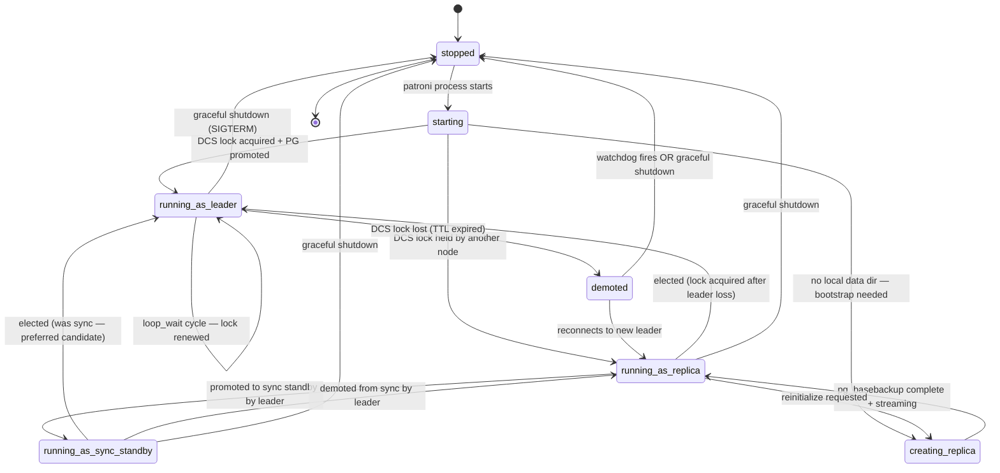
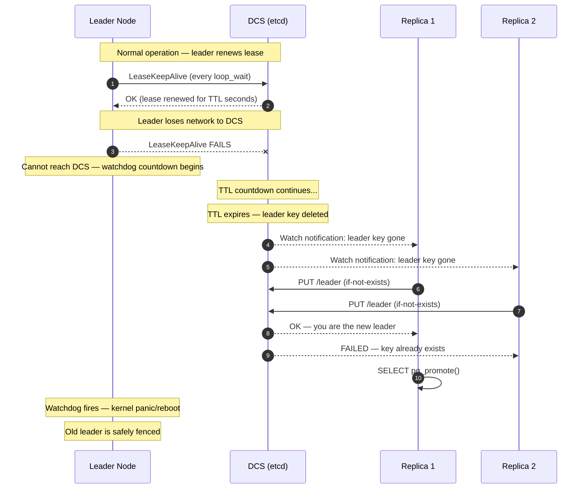

import ArtifactRef from '@site/src/components/ArtifactRef';

# Patroni Internals Deep-Dive

## Executive Summary

Patroni is a Python daemon that implements a consensus-driven leader-election protocol on top of a Distributed Consensus Store (DCS). Understanding its internal state machine, lease mechanics, and fencing strategy is essential for diagnosing subtle failure modes that surface-level monitoring cannot explain. This appendix dissects four core subsystems: the node state machine (what states exist and what triggers transitions), leader-election semantics (how the DCS lock is acquired and defended across etcd, Consul, and Kubernetes), watchdog-based fencing (how split-brain is prevented at the kernel level), and DCS lease timing (the math that governs failover speed vs. stability). The accompanying lab (LAB-B-A) lets you observe these mechanisms under controlled network partitions. Every state transition maps back to an observable signal defined in Chapter 06.

---

## Patroni State Machine

Every Patroni node exists in exactly one state at any moment. The main loop (`PatroniDaemon._run_cycle`) evaluates the current state, checks DCS, checks PostgreSQL, and decides whether to transition.



### Transition Details

| From | To | Trigger | DCS Write | PostgreSQL Effect |
|------|----|---------|-----------|-------------------|
| starting | running_as_leader | No existing lock in DCS; this node wins the race | Creates leader key with TTL | `SELECT pg_promote()` |
| starting | running_as_replica | Leader key exists and is held by another node | Writes member key with connection info | Starts streaming replication |
| starting | creating_replica | No local `PGDATA` or `pg_controldata` reports invalid state | Writes member key (state: creating) | Runs `pg_basebackup` from leader |
| running_as_leader | demoted | DCS renewal failed — TTL expired before next successful write | Leader key deleted or expired | `pg_ctl stop -m fast` or watchdog fires |
| running_as_replica | running_as_leader | Leader key expired + this node acquired lock | Creates leader key | `SELECT pg_promote()` |
| running_as_replica | running_as_sync_standby | Leader updates `/sync` key to include this node | No write from this node | No PostgreSQL change — already streaming |
| demoted | running_as_replica | New leader established; this node detects it and starts following | Updates member key (state: replica) | `pg_rewind` or re-basebackup, then streaming |

### The Main Loop

Each cycle of Patroni's main loop (every `loop_wait` seconds):

1. **Read DCS state** — fetch leader key, member keys, cluster configuration
2. **Check PostgreSQL health** — `pg_isready`, recovery status, replication lag
3. **Decide action** — based on current state + DCS state + PG state
4. **Execute action** — promote, demote, renew lock, update member key, do nothing
5. **Write DCS** — update member key with latest LSN, state, connection info
6. **Pet the watchdog** — if leader, reset the watchdog timer

If step 1 fails (DCS unreachable), the leader enters a degraded path: it cannot renew the lock, and the watchdog countdown begins.

---

## Leader Election Semantics

Leader election is not implemented by Patroni itself — it delegates to the DCS. Patroni's role is to attempt lock acquisition and respect the outcome. The mechanics differ significantly across backends.

### etcd

**Lock mechanism**: A key (e.g., `/patroni/cluster-name/leader`) is created with a lease TTL. Only one client can hold the key at a time via `compare-and-swap` (CAS) semantics — the `put` succeeds only if the key does not exist or the existing lease has expired.

**Renewal**: The leader sends `LeaseKeepAlive` RPCs every `loop_wait` seconds. If the lease is not renewed before TTL expiry, etcd automatically deletes the key.

**Election race**: When the leader key disappears, all replicas attempt a `put-if-absent` in the same `loop_wait` cycle. etcd's linearizable guarantees ensure exactly one succeeds.

**Split-brain window**: Zero — etcd's consensus guarantees that exactly one client holds the key at any point. However, the *old* leader may not know it has lost the key until its next DCS read, creating a window of `loop_wait` seconds where the old leader still *thinks* it is the leader.

### Consul

**Lock mechanism**: Consul uses session-based locks. Patroni creates a session with a TTL and acquires a lock on the leader key. The session's `lock-delay` parameter (default 15s) prevents immediate re-acquisition after session invalidation — this is an anti-flap mechanism.

**Renewal**: Session renewal via HTTP API every `loop_wait` seconds.

**Election race**: After a session expires and `lock-delay` elapses, the first node to successfully acquire the lock becomes leader.

**Split-brain window**: `lock-delay` adds latency to failover but reduces flapping risk. Total failover time = TTL + lock-delay + election time.

### Kubernetes

**Lock mechanism**: Patroni uses Kubernetes Endpoints or Lease objects (preferred in K8s 1.14+). The leader annotation/lease is updated with a `resourceVersion` check — optimistic concurrency control via the K8s API server.

**Renewal**: The leader updates the Lease object every `loop_wait` seconds.

**Election race**: Replicas watch the Lease object. When `renewTime` exceeds the TTL, they attempt to update the object with their own identity. The K8s API server serializes writes — exactly one succeeds.

**Split-brain window**: Similar to etcd — depends on the K8s API server's consistency. In practice, API server outages (not just network partitions) can affect leader election.

### Comparison Table

| Property | etcd | Consul | Kubernetes |
|----------|------|--------|------------|
| Lock acquisition latency | 1-5 ms (LAN) | 15-20 ms (LAN, includes lock-delay check) | 5-50 ms (API server dependent) |
| Anti-flap mechanism | None built-in (Patroni handles via `retry_timeout`) | `lock-delay` (default 15s) | None built-in |
| Failure detection time | TTL (default 30s) | Session TTL (default 30s) + lock-delay | Lease duration (default 30s) |
| Total failover time (typical) | 30-40s | 45-60s | 30-50s |
| Split-brain prevention | Linearizable writes | Session invalidation + lock-delay | resourceVersion CAS |



---

## Watchdog and Fencing

The watchdog is Patroni's **fencing mechanism** — it ensures that a demoted leader's PostgreSQL process is killed before a new leader can accept writes, preventing split-brain.

### Why Watchdog Exists

Consider this scenario without watchdog:
1. Leader loses DCS connectivity (network partition to etcd only)
2. TTL expires — replica promotes to new leader
3. Old leader's PostgreSQL is still running and accepting writes (it doesn't know it's been demoted)
4. **Split-brain**: two PostgreSQL instances accepting writes on the same cluster

The watchdog prevents step 3 by ensuring the old leader's entire operating system reboots if Patroni cannot confirm it still holds the lock.

### Watchdog Modes

| Mode | Mechanism | When watchdog fires | Use case |
|------|-----------|--------------------|----|
| `required` | Linux `softdog` or hardware watchdog | Kernel panic → immediate reboot | Production (recommended) |
| `automatic` | Uses watchdog if available, degrades to `off` if not | Same as `required` when available | Development with optional safety |
| `off` | No fencing | Nothing — demoted leader must self-stop via Patroni's main loop | **Dangerous in production** |

### How softdog Works

1. Patroni opens `/dev/watchdog` at startup
2. Every `loop_wait` cycle (while leader), Patroni writes to the device — this "pets" the watchdog
3. If Patroni fails to pet the watchdog within `safety_margin` seconds, the kernel triggers a panic
4. The machine reboots — PostgreSQL is guaranteed dead

The `safety_margin` is calculated as:

```
safety_margin = ttl - loop_wait * 2
```

For default values (`ttl=30`, `loop_wait=10`): `safety_margin = 30 - 20 = 10` seconds. This means if Patroni misses two consecutive loop cycles without renewing, the watchdog fires.

### The Double-Leader Fence Path

Step-by-step sequence when a leader is partitioned from DCS:

1. **T+0s**: Leader's `LeaseKeepAlive` fails (network partition begins)
2. **T+10s**: Next `loop_wait` cycle — renewal fails again. Patroni logs: `failed to update leader lock`
3. **T+20s**: Third cycle — still failing. Patroni has now missed 2 renewals.
4. **T+30s**: DCS-side TTL expires. Leader key is deleted. Replicas detect and begin election.
5. **T+30s**: Watchdog `safety_margin` (10s) expires — the leader has not petted the watchdog for &gt;10s. **Kernel panic**. Machine reboots.
6. **T+31-35s**: Replica acquires lock, promotes PostgreSQL.

**Critical invariant**: The old leader is fenced (step 5) *before or simultaneously with* the new leader accepting writes (step 6). This is why `safety_margin` must be &le; `ttl - loop_wait`.

### Hardware Watchdog vs softdog

| Property | softdog (kernel module) | Hardware (IPMI/BMC) |
|----------|----------------------|------|
| Reliability | Process-level — kernel must be responsive | Board-level — fires even if kernel is hung |
| Timeout granularity | 1-second resolution | Typically 1-second |
| Recovery action | Kernel panic → reboot | Power cycle via BMC |
| Recommended for | VMs, LXC containers, cloud instances | Bare-metal servers |

---

## DCS Lease Semantics

The timing parameters in `patroni.yml` directly control failover speed, stability, and split-brain risk. Misconfiguring them is the most common cause of flapping and unexpected failovers.

### Key Parameters

| Parameter | Default | Description |
|-----------|---------|-------------|
| `ttl` | 30 | Seconds before the DCS leader key expires if not renewed |
| `loop_wait` | 10 | Seconds between Patroni main-loop iterations |
| `retry_timeout` | 10 | Seconds Patroni retries DCS operations before giving up |
| `maximum_lag_on_failover` | 1048576 (1 MB) | Maximum replication lag (bytes) for a replica to be eligible for promotion |

### The Renewal Math

The fundamental constraint:

```
ttl > loop_wait × 3
```

Why × 3? The leader must survive missing **two consecutive** renewal attempts (due to transient network blips) without triggering failover. With `loop_wait=10` and `ttl=30`:
- Renewal at T+0: success → TTL resets to 30s
- Renewal at T+10: fails (transient) → TTL has 20s remaining
- Renewal at T+20: fails (transient) → TTL has 10s remaining
- Renewal at T+30: succeeds → TTL resets to 30s (just in time)

If `ttl` were only `loop_wait × 2` (20s), a single missed renewal would leave only 10s margin — one more miss and the leader is demoted.

### Failover Timeline (Default Parameters)

| Time | Event | Who |
|------|-------|-----|
| T+0 | Leader stops (crash, OOM, or partition begins) | Leader |
| T+0 to T+30 | TTL countdown — no renewal arriving | DCS |
| T+30 | Leader key expires, deleted from DCS | DCS |
| T+30 to T+40 | Replicas detect leader absence in their next `loop_wait` cycle | Replicas |
| T+40 | Winning replica acquires lock | DCS + Replica |
| T+40 | `SELECT pg_promote()` executes | New leader |
| T+41-43 | HAProxy health check detects new leader (depends on check interval) | Proxy |

**Total failover time**: ~40-43 seconds with defaults. This is the trade-off: faster failover requires lower TTL, which increases flapping risk on unstable networks.

### Recommended Parameter Combinations

| Environment | `ttl` | `loop_wait` | `retry_timeout` | Expected failover time | Notes |
|-------------|-------|-------------|-----------------|----------------------|-------|
| LAN (same rack) | 30 | 10 | 10 | ~40s | Default — good for most deployments |
| LAN (same DC, different racks) | 30 | 10 | 10 | ~40s | Same as above — network is reliable |
| WAN (cross-DC, same region) | 60 | 20 | 20 | ~80s | Higher TTL absorbs latency variance |
| Cross-region | 90 | 30 | 30 | ~120s | Accept slower failover for stability |
| High-frequency trading | 15 | 5 | 5 | ~20s | Aggressive — requires very stable network |

### How `retry_timeout` Interacts with Failover

`retry_timeout` controls how long a **replica** will retry DCS operations when attempting to acquire the leader lock. If the DCS is experiencing transient issues during failover, replicas will retry for `retry_timeout` seconds before giving up on that attempt and waiting for the next `loop_wait` cycle.

Setting `retry_timeout` too low: replicas give up quickly, potentially missing valid election windows.
Setting `retry_timeout` too high: during DCS instability, replicas block on retries and may miss state changes.

---

## Lab <ArtifactRef id="LAB-B-A" /> — Watchdog and Lease Pathology

### Supported Substrates

- `proxmox-lxc` (privileged containers with `/dev/watchdog` access)
- `bare-vm-ansible` (VMs or bare metal with root access)

:::caution Docker Unsuitability
Docker containers cannot load kernel modules or access `/dev/watchdog` without `--privileged` mode and host PID namespace. Even with those flags, the watchdog will panic the *host* kernel, not just the container. This lab requires kernel-level isolation that Docker does not provide safely.
:::

### Prerequisites

- 3-node Patroni cluster running (Patroni 4.x, PostgreSQL 18.x or 17.x)
- `softdog` kernel module available: `modprobe softdog`
- Network namespace tools: `ip netns`, `iptables`
- Root access on all nodes
- Patroni configured with `watchdog.mode: required`

### Setup

```bash
# On all nodes — load softdog
sudo modprobe softdog
ls /dev/watchdog  # Should exist

# Verify Patroni is using the watchdog
patronictl show-config | grep -A2 watchdog
# Expected: mode: required

# Verify cluster is healthy
patronictl list
# All 3 nodes: Leader + Replica + Replica (or Sync Standby)

# Record current leader
LEADER=$(patronictl list -f json | jq -r '.[] | select(.Role=="Leader") | .Member')
echo "Current leader: $LEADER"
```

### What You Will Learn

- How DCS lease expiry triggers watchdog-based fencing on the old leader
- The exact timing between partition start, TTL expiry, watchdog fire, and new leader promotion
- Why the watchdog fires *before* the new leader promotes (the safety invariant)
- How to verify that no split-brain occurred by examining WAL timelines

### Break It on Purpose

:::danger Lab Environment Only
The following command partitions the leader from DCS. In production, this would cause an unplanned failover with a brief period of write unavailability. Execute ONLY in the lab cluster.
:::

```bash
# On the LEADER node — block traffic to etcd (port 2379) only
# This simulates a network partition where the leader can still
# reach PostgreSQL replicas but NOT the DCS
sudo iptables -A OUTPUT -p tcp --dport 2379 -j DROP
sudo iptables -A INPUT -p tcp --sport 2379 -j DROP

# Start a timer
echo "Partition started at: $(date +%T.%N)"

# Watch Patroni logs on the leader (in another terminal)
journalctl -u patroni -f
# Expected: "failed to update leader lock in DCS"
# Then: watchdog trigger → system reboots
```

### Verification

After the leader reboots (30-45 seconds):

```bash
# On a REPLICA node — verify new leader elected
patronictl list
# Expected: one of the replicas is now Leader

# Verify timeline increment (proves promotion happened)
psql -h new-leader -c "SELECT timeline_id FROM pg_control_checkpoint();"
# Expected: timeline_id = previous + 1

# On the OLD leader (after reboot) — verify it rejoined as replica
patronictl list
# Expected: old leader is now Replica, streaming from new leader

# Verify NO split-brain — check WAL timeline on old leader
psql -h old-leader -c "SELECT timeline_id FROM pg_control_checkpoint();"
# Expected: same timeline as new leader (followed the new timeline)

# Check dmesg for watchdog trigger
ssh old-leader "dmesg | grep -i watchdog"
# Expected: "watchdog: watchdog0: watchdog did not stop!"
```

**Timeline of events** (record actual timestamps from your lab):

| Expected offset | Event | How to observe |
|-------|-------|---------|
| T+0 | iptables applied — partition begins | Your terminal |
| T+10-20s | Patroni logs "failed to update leader lock" | `journalctl -u patroni` on leader |
| T+30s | Leader key expires in etcd | `etcdctl get /patroni/cluster/leader` from replica |
| T+30-32s | Watchdog fires — leader reboots | `dmesg` on leader after reboot |
| T+30-40s | Replica acquires lock, promotes | `patronictl list` from replica |
| T+60-90s | Old leader boots, rejoins as replica | `patronictl list` |

### Recovery Procedure

```bash
# On the old leader (after reboot) — remove iptables rules
sudo iptables -D OUTPUT -p tcp --dport 2379 -j DROP
sudo iptables -D INPUT -p tcp --sport 2379 -j DROP

# Patroni will automatically:
# 1. Connect to DCS
# 2. Discover it is no longer leader
# 3. Start following the new leader (pg_rewind if needed)

# Verify recovery
patronictl list
# All 3 nodes healthy: 1 Leader + 2 Replicas
```

### Teardown

```bash
# Remove any lingering iptables rules on ALL nodes
for node in node1 node2 node3; do
  ssh $node "sudo iptables -D OUTPUT -p tcp --dport 2379 -j DROP 2>/dev/null; \
             sudo iptables -D INPUT -p tcp --sport 2379 -j DROP 2>/dev/null"
done

# Stop Patroni and PostgreSQL on all nodes
for node in node1 node2 node3; do
  ssh $node "sudo systemctl stop patroni"
done

# Unload softdog if no longer needed
sudo rmmod softdog
```

### What This Tells You About Production

1. **The watchdog IS the fencing mechanism.** Without it, there is a split-brain window equal to `ttl` seconds. With it, the old leader is guaranteed dead before the new leader accepts writes.
2. **The safety invariant holds**: watchdog fires at `ttl - loop_wait` seconds after the last successful renewal — this is always *before* the TTL actually expires and a replica can promote.
3. **Rejoining is automatic**: Patroni handles the old leader's recovery without operator intervention (assuming the network partition is resolved). `pg_rewind` makes this fast even for large clusters.

---

## Observability Hook Table

Every state transition produces observable signals. This table maps transitions to the Chapter 06 monitoring infrastructure.

| Transition | PostgreSQL Effect | DCS Write | Observable Signal | Alert Rule |
|-----------|-------------------|-----------|-------------------|------------|
| replica → leader | `pg_promote()`, timeline increment | Leader key created | Timeline ID change in `pg_control_checkpoint()` | ALERT-06-LEADER-FLAP (if repeated) |
| leader → demoted | `pg_ctl stop -m fast` | Leader key expired/deleted | Connection refused on port 5432 | ALERT-06-LEADER-FLAP |
| replica → sync_standby | None (already streaming) | `/sync` key updated | `pg_stat_replication.sync_state` changes to `sync` | DASH-06-CORE: Sync Status panel |
| sync_standby → replica | None | `/sync` key updated | `sync_state` reverts to `async` | DASH-06-CORE: Sync Status panel |
| running → creating_replica | `pg_basebackup` starts | Member key: state=creating | High network I/O, `pg_stat_progress_basebackup` | DASH-06-LAG: Basebackup Progress |
| leader (healthy) → leader (healthy) | None | Lease renewed | `dcs_last_seen` timestamp updates | ALERT-06-DCS-PARTITION (if stale) |
| any → stopped | PG process exits | Member key removed | Port 5432 unreachable | DASH-06-CORE: Node Count |
| demoted → running_as_replica | `pg_rewind` then streaming | Member key: state=replica | Replication lag drops to 0 | ALERT-06-LAG (clears) |

Use the DASH-06-CORE Grafana dashboard panels "Leader History" and "Node State Timeline" to visualize these transitions over time.

---

## Anti-Patterns

1. **Disabling watchdog without alternative fencing** — If `watchdog.mode: off` and you have no external fencing (STONITH, cloud instance termination), you have zero split-brain protection. The only thing preventing two leaders is Patroni's main loop detecting the lost lock — but if the main loop is frozen (GC pause, OOM, CPU starvation), PostgreSQL continues accepting writes.

2. **Setting TTL too low** — A TTL of 10s with `loop_wait=5` means one missed renewal triggers failover. On any network with occasional latency spikes (cloud, cross-AZ), this causes chronic flapping. Minimum recommended: `ttl=30`.

3. **Running DCS on the same nodes as Patroni** — If an etcd member runs on the same VM as a Patroni node, a single host failure takes out both the DCS member and the Patroni node simultaneously. If this happens to enough nodes, you lose DCS quorum AND cluster capacity at the same time.

4. **Ignoring `retry_timeout` in high-latency environments** — The default `retry_timeout=10` may be insufficient for cross-region DCS calls. If retries exhaust before the DCS responds, Patroni treats it as a failure and may demote prematurely.

5. **Assuming all DCS backends have identical semantics** — Consul's `lock-delay` adds 15s to every failover that etcd does not have. Kubernetes Lease objects have different consistency guarantees than etcd keys. Migrating DCS backends without recalculating timing parameters will produce unexpected failover behavior.

6. **Setting `maximum_lag_on_failover` to 0** — This means no replica is eligible for promotion unless it has *exactly zero lag*. In practice, this can prevent failover entirely because even healthy synchronous standbys may show bytes-level lag during measurement.

---

## Checklist

- [ ] Watchdog is enabled (`mode: required`) on all production nodes and `/dev/watchdog` is accessible
- [ ] `ttl` is at least `loop_wait × 3` for your environment's network characteristics
- [ ] DCS nodes run on separate hosts from Patroni nodes (no shared-fate failure mode)
- [ ] `safety_margin` (ttl - loop_wait × 2) is &gt;0 and provides sufficient fencing time
- [ ] I have tested failover timing in the lab and recorded actual T+0 to T+promotion times
- [ ] `maximum_lag_on_failover` is set to a value that allows promotion of healthy sync standbys (not 0)
- [ ] `retry_timeout` is tuned for the actual DCS latency in my environment (measured, not assumed)
- [ ] I can explain the full sequence from leader loss to new-leader promotion including watchdog timing for my specific parameter values

---

## Gotchas

1. **softdog timeout vs Patroni safety_margin** — The softdog module has its own internal timeout (default 60s). If Patroni's calculated `safety_margin` is shorter than softdog's timeout, the watchdog may not fire in time. Verify with: `cat /sys/class/watchdog/watchdog0/timeout`.

2. **Virtualization and watchdog** — Some hypervisors intercept `/dev/watchdog` writes. On KVM/QEMU, ensure the VM is configured with a watchdog device (`-watchdog i6300esb`) and the appropriate action (`-watchdog-action reset`).

3. **etcd auto-compaction** — etcd periodically compacts its history. If Patroni's `retry_timeout` overlaps with a compaction event, watch requests may fail with `ErrCompacted`. This is transient but can cause a single missed renewal.

4. **Consul lock-delay is per-session, not per-key** — Destroying and recreating a Consul session does not bypass `lock-delay`. The delay is tracked by the key, not the session. This means "restart Patroni to force faster election" does not work with Consul.

5. **K8s API server outage is NOT the same as DCS partition** — If the K8s API server is down, ALL Patroni nodes lose DCS access simultaneously. This is distinct from a network partition where only one node loses connectivity. Patroni's `pause` mode should be considered during planned API server maintenance.

6. **pg_rewind requires `wal_log_hints=on`** — If the old leader needs to rejoin after promotion of a replica, `pg_rewind` rewrites divergent WAL. This requires `wal_log_hints=on` (or data checksums). Without it, the old leader must do a full `pg_basebackup` — significantly slower recovery.

---

## Version Support

| Component | Tested Versions | Notes |
|-----------|----------------|-------|
| PostgreSQL | 18.x, 17.x | N and N-1 per version-support window |
| Patroni | 4.x (latest stable) | State machine has been stable since 3.0; 4.x adds Lease object support for K8s |
| etcd | 3.5.x | Lease API stable since 3.0; 3.5 adds improved watch performance |
| Consul | 1.18+ | Session locks stable; lock-delay semantics unchanged since 1.0 |
| Kubernetes | 1.31+ | Lease objects GA since 1.19; 1.31 is current baseline |
| Linux kernel (softdog) | 5.x+ | softdog module stable across all modern kernels |
