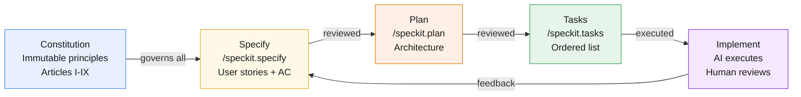

<style>
@import url('https://fonts.googleapis.com/css2?family=Inter:wght@300;400;500;600&display=swap');

:root {
  --color-background: #ffffff;
  --color-foreground: #1d1d1f;
  --color-heading: #000000;
  --color-accent: #0071e3;
  --color-subtle: #6e6e73;
  --color-surface: #f5f5f7;
  --color-border: #d2d2d7;
  --font-default: 'Inter', -apple-system, BlinkMacSystemFont, 'SF Pro Text', sans-serif;
}

section {
  background-color: var(--color-background);
  color: var(--color-foreground);
  font-family: var(--font-default);
  font-weight: 400;
  box-sizing: border-box;
  line-height: 1.7;
  font-size: 22px;
  padding: 56px 80px;
}

h1, h2, h3 {
  font-family: var(--font-default);
  color: var(--color-heading);
  letter-spacing: -0.02em;
  margin: 0 0 24px 0;
  padding: 0;
}

h1 { font-size: 56px; font-weight: 600; line-height: 1.15; }
h2 { font-size: 38px; font-weight: 600; margin-bottom: 32px; }
h3 { font-size: 26px; font-weight: 500; color: var(--color-accent); margin-bottom: 16px; }

ul, ol { padding-left: 28px; }
li { margin-bottom: 12px; line-height: 1.6; }

strong { font-weight: 600; color: var(--color-heading); }

code {
  font-family: 'SF Mono', 'Fira Code', 'Courier New', monospace;
  background: var(--color-surface);
  border: 1px solid var(--color-border);
  border-radius: 4px;
  padding: 2px 8px;
  font-size: 0.88em;
  color: var(--color-accent);
}

pre {
  background: var(--color-surface);
  border: 1px solid var(--color-border);
  border-radius: 10px;
  padding: 24px 28px;
  font-size: 18px;
  line-height: 1.6;
  overflow: auto;
}

pre code {
  background: none;
  border: none;
  padding: 0;
  color: var(--color-foreground);
  font-size: inherit;
}

blockquote {
  border-left: 3px solid var(--color-accent);
  padding-left: 20px;
  margin: 20px 0;
  color: var(--color-subtle);
  font-style: italic;
}

table {
  border-collapse: collapse;
  width: 100%;
  font-size: 20px;
}

th {
  background: var(--color-surface);
  padding: 12px 18px;
  text-align: left;
  font-weight: 600;
  border-bottom: 2px solid var(--color-border);
}

td {
  padding: 10px 18px;
  border-bottom: 1px solid var(--color-border);
}

section.lead {
  display: flex;
  flex-direction: column;
  justify-content: center;
  align-items: flex-start;
  text-align: left;
}

section.section-break {
  display: flex;
  flex-direction: column;
  justify-content: center;
  background: var(--color-surface);
}

section.section-break h2 {
  font-size: 52px;
  color: var(--color-accent);
}

footer {
  font-size: 13px;
  color: var(--color-subtle);
  position: absolute;
  left: 80px;
  right: 80px;
  bottom: 28px;
}

.tag {
  display: inline-block;
  background: var(--color-accent);
  color: white;
  padding: 3px 12px;
  border-radius: 20px;
  font-size: 16px;
  font-weight: 500;
  margin-bottom: 16px;
}
</style>

<!-- _class: lead -->
<!-- _paginate: false -->
<!-- _footer: "" -->

# Spec-Driven Development

### Writing specs before code — with AI as your co-author

&nbsp;

**Vishal Gandhi** · April 2026  
*60 minutes · hands-on*

---

## Agenda

- **Part 1** — What is SDD and why it matters *(15 min)*
- **Part 2** — The spec-kit workflow deep dive *(15 min)*
- **Part 3** — Connecting SDD to Windsurf *(10 min)*
- **Part 4** — Live demo: Health Check Scanner *(15 min)*
- **Part 5** — Practical guidance & Q&A *(5 min)*

&nbsp;

> Prerequisites: You were in our Windsurf session 3 weeks ago — this builds directly on that.

---

<!-- _class: section-break -->

## Part 1

### What is Spec-Driven Development?

---

## The problem we all know

You spend a week writing a PRD. It gets reviewed, approved, filed away.

Then the sprint starts and everyone reads the *code* to understand what was built.

&nbsp;

> "We tried to bridge the gap with better docs, more detailed requirements, stricter processes. These approaches fail because they **accept the gap as inevitable**."
> — Martin Fowler, ThoughtWorks

&nbsp;

The spec becomes archaeology. The code becomes truth.

---

## What is Spec-Driven Development?

**SDD inverts the power structure.**

Specs don't serve code — **code serves specs.**

&nbsp;

| Traditional | Spec-Driven |
|-------------|-------------|
| Code is the source of truth | Spec is the source of truth |
| Docs written after the fact | Spec written first, always |
| AI generates code from prompts | AI generates code from specs |
| Debugging = fix code | Debugging = fix spec |

&nbsp;

> *"Maintaining software means evolving specifications."* — GitHub spec-kit

---

## What is a "spec"?

A spec is a **structured, behavior-oriented artifact** written in natural language that:

- Expresses software functionality as user stories
- Defines acceptance criteria in GIVEN / WHEN / THEN format
- Captures edge cases and constraints
- Serves as guidance to AI coding agents

&nbsp;

**Not a detailed prompt. Not a PRD. Not a ticket.**

A living contract between humans and AI.

---

## Three levels of SDD

```
Level 1: Spec-First
  Write spec → use it for this task → spec may be discarded
  ──────────────────────────────────────────────────────
  "I write a spec to focus the AI for this feature"

Level 2: Spec-Anchored
  Write spec → use it → KEEP it → evolve it with the feature
  ──────────────────────────────────────────────────────
  "The spec lives alongside the code forever"

Level 3: Spec-as-Source
  Spec IS the primary artifact → code is generated output
  ──────────────────────────────────────────────────────
  // GENERATED FROM SPEC - DO NOT EDIT
```

&nbsp;

Most teams start at Level 1. Spec-kit targets Level 2.

---

## Why now?

Three forces converging:

- **AI crossed a threshold** — LLMs can reliably translate natural language specs into working code
- **Complexity is exponential** — modern systems have dozens of services; manual alignment fails
- **Pace of change demands it** — pivots are normal; re-generating from spec beats manual rewrites

&nbsp;

> With SDD, a change in requirements triggers a **systematic regeneration**, not a manual search-and-fix through the codebase.

---

## From "Vibe Coding" to Intent-First Engineering

<div style="display:grid;grid-template-columns:1fr 1fr;gap:32px;margin-top:16px;font-size:19px">
<div style="background:#fff5f5;border-radius:12px;padding:24px 28px;border:2px solid #ffd0d0">

### Vibe Coding (Code-First)

Unstructured prompts → AI guesses → drifted code

| | |
|---|---|
| **Source of truth** | Latest code state |
| **Control** | Successive prompting |
| **Failure mode** | Silent architectural drift |

> *"Why did it build that?  
That's not what I meant."*

</div>
<div style="background:#f0fff4;border-radius:12px;padding:24px 28px;border:2px solid #b0f0c0">

### Spec-Driven (Intent-First)

**Specify & Plan** → define *what* and *why*  
**Task Decomposition** → AI-sized work units  
**Implement & Validate** → code checked against spec

| | |
|---|---|
| **Source of truth** | Structured specification |
| **Control** | Explicit validation gates |
| **Failure mode** | Visible test failures |

</div>
</div>

---

<!-- _class: section-break -->

## Part 2

### The spec-kit workflow

---

## What is spec-kit?

GitHub's open-source SDD toolkit — distributed as a CLI.

```bash
uvx spec-kit init      # set up your project
/speckit.specify       # idea → spec.md
/speckit.plan          # spec.md → plan.md
/speckit.tasks         # plan.md → tasks.md
```

&nbsp;

- Works with Windsurf, Cursor, Claude, GitHub Copilot
- All artifacts live in your repo (`.specify/` folder)
- Versioned alongside code in feature branches
- Fully customisable templates

---

## The Constitution — project DNA

**The most important file in your project.**

`memory/constitution.md` — immutable principles that apply to every single AI interaction.

```markdown
## Article I: Spec-First Imperative
No implementation shall be written without a corresponding spec.md.

## Article II: Test-First Development
No implementation code before tests are written AND failing.

## Article III: Simplicity Over Cleverness
Maximum 3 top-level modules. No future-proofing.

## Article IV: Observable by Default
All CLI commands produce structured output. Errors are explicit.
```

&nbsp;

Think of it as: **the rules file your whole team agrees on, enforced by AI.**

---

## Constitution: The 9 Articles (spec-kit)

| Article | Principle |
|---------|-----------|
| I | **Library-First** — every feature starts as a standalone library |
| II | **CLI Interface** — all libraries expose a text-in / text-out CLI |
| III | **Test-First** — tests before implementation, always |
| IV | *Integration tests* — contract tests before implementation |
| V | *Research-driven* — research phase before planning |
| VI | *Versioning* — specs are branched and versioned |
| VII | **Simplicity Gate** — ≤ 3 projects, no future-proofing |
| VIII | **Anti-Abstraction** — use framework directly, don't wrap it |
| IX | **Integration-First** — real databases over mocks |

---

## Step 1: `/speckit.specify`

**Input:** A plain English description of what you want to build.

**Output:** `spec.md` with:
- Numbered user stories in "As a … I want … So that …" format
- Acceptance criteria in GIVEN / WHEN / THEN format  
- Edge cases and constraints
- Technical constraints (what's out of scope)

&nbsp;

```bash
# You type:
/speckit.specify PostgreSQL health check scanner with FastAPI and CLI

# spec-kit creates:
.specify/001-health-scanner/spec.md
```

---

## What spec.md looks like

```markdown
# Spec: PostgreSQL Health Check Scanner

## US-1: Database Connectivity Check
**As a** platform engineer
**I want** to verify the database is reachable
**So that** I know immediately if it is down

**Acceptance Criteria:**
- [ ] GET /health/db returns {"status": "healthy"} when DB is up
- [ ] Returns 503 with error message when DB is down
- [ ] Response includes checked_at timestamp and duration_ms

## EC-1: Database Unreachable
**Given** DATABASE_URL points to an unreachable host
**When** any health check runs
**Then** return status "unhealthy" — never a 500
```

---

## Step 2: `/speckit.plan`

**Input:** `spec.md` + your architecture hints

**Output:** `plan.md` with:
- Architecture overview and component diagram
- Technology choices with documented rationale
- Data models and API contracts
- File structure
- Security considerations
- Test strategy

&nbsp;

Every technical decision **traces back** to a specific user story.

---

## What plan.md looks like

```markdown
# Technical Plan: Health Check Scanner

## Architecture
FastAPI app + Typer CLI sharing a checks.py core module.
Docker Compose provides Postgres for local development.

## Why FastAPI?
- US-1 requires REST endpoints → FastAPI's type-safe responses
- US-4 requires async scan → FastAPI handles concurrent checks
- Pydantic models enforce the HealthResult schema from the spec

## File Structure
src/
├── main.py      # FastAPI app (serves US-1, US-2, US-3, US-4)
├── cli.py       # Typer CLI (serves US-1, US-4 from terminal)
├── checks.py    # Core logic (shared by API and CLI)
└── models.py    # Pydantic models
```

---

## Step 3: `/speckit.tasks`

**Input:** `plan.md` + supporting design docs

**Output:** `tasks.md` — an executable, ordered task list

```markdown
## [T01] Set up project structure         [depends: none]
## [T02] Write Pydantic models             [depends: T01]
## [T03] Write tests for check_connectivity [depends: T02] ← TEST FIRST
## [T04] Implement check_connectivity      [depends: T03]
## [T05] Write tests for check_latency    [depends: T02] [P] ← parallel
## [T06] Implement check_latency          [depends: T05] [P]
...
```

&nbsp;

`[P]` marks tasks safe to run in parallel.  
Windsurf executes tasks one by one, checking off as it goes.

---

## The full artifact chain

```
.specify/
└── 001-health-scanner/
    ├── spec.md          ← what to build & why  (human-reviewed)
    ├── plan.md          ← how to build it       (human-reviewed)
    ├── tasks.md         ← step-by-step tasks    (AI executes)
    ├── research.md      ← library comparisons   (auto-generated)
    ├── data-model.md    ← entity schemas        (auto-generated)
    └── contracts/       ← API contracts         (auto-generated)
        └── openapi.md
```

&nbsp;

**Traditional approach:** ~12 hours of documentation work  
**With spec-kit:** ~15 minutes, fully structured, traceable

---

<!-- _class: section-break -->

## Part 3

### SDD meets Windsurf

---

## You already know this

Three weeks ago we covered **Rules, Workflows, and Skills** in Windsurf.

SDD is the *methodology* that gives those tools their purpose.

&nbsp;

| Windsurf concept | Spec-kit equivalent | Role |
|-----------------|---------------------|------|
| **Rules** (`.windsurfrules`) | `constitution.md` | Immutable project principles |
| **Plan mode** (`.windsurf/plans/`) | `spec.md` + `plan.md` | Requirements → architecture |
| **Workflows** (`.windsurf/workflows/`) | `tasks.md` | Executable step sequences |
| **Skills** | Spec-kit templates | Reusable prompt patterns |
| **`.windsurf/`** directory | **`.specify/`** directory | Project AI config root |

---

## Rules = Constitution

Both define **immutable principles** the AI must always follow.

```markdown
# .windsurfrules (Windsurf Rules)           # constitution.md (spec-kit)

## Code Style                               ## Article III: Simplicity
- No abstractions for single-use code       - No abstractions for single-use code
- Match existing style                      - Maximum 3 top-level modules
- Minimal changes only                      - Junior engineer must understand in 5 min

## Testing                                  ## Article II: Test-First
- Always write tests before implementation  - Tests written before implementation
- Tests must fail before implementation     - Tests must fail (Red) before code
```

&nbsp;

**The constitution is your team's rules file — agreed upon, version-controlled, AI-enforced.**

---

## Workflows = Tasks

Both are **executable, ordered step sequences** the AI follows.

```markdown
# .windsurf/workflows/deploy.md (Workflow)  # tasks.md (spec-kit)

---                                         ## [T03] Write failing tests
description: Deploy the application         ## [T04] Implement connectivity check
---                                         ## [T05] Write CLI command [P]

1. Run tests                                Status tracking:
2. Build Docker image                       - [ ] T03 — write tests
3. Push to registry                         - [x] T04 — implemented ✅
4. Deploy to production                     - [ ] T05 — in progress
```

---

## Skills = Spec templates

Both provide **reusable, structured patterns** for common tasks.

&nbsp;

- A Windsurf **Skill** is a reusable prompt blueprint (e.g., "create a REST API endpoint")
- A spec-kit **template** is a structured markdown blueprint (e.g., `feature-spec-template.md`)

&nbsp;

Both prevent the AI from starting with a blank slate — they encode your team's **best practices** into every interaction.

---

## Real example: this repo

`.specify/auth-for-docs/` — already in this codebase.

```
.specify/
└── auth-for-docs/
    ├── spec.md    ← Google OAuth user stories + acceptance criteria
    ├── plan.md    ← AuthContext, DocRoot swizzle, LoginPage architecture
    └── tasks.md   ← T01–T13 with dependencies and status tracking
```

&nbsp;

This is spec-driven development **you've already done** — before you knew it had a name.

---

## The complete SDD pipeline



&nbsp;

**Constitution governs all phases. Human review required at every arrow.**

---

<!-- _class: section-break -->

## Part 4

### Live Demo

*PostgreSQL Health Check Scanner*

---

## Demo plan — 15 minutes

We're going to build a **PostgreSQL health check tool** from scratch, spec-first, in 15 minutes.

&nbsp;

**What we'll use:**
- `uvx spec-kit` — generates the spec/plan/tasks artifacts
- Windsurf Cascade — executes the tasks
- Docker Compose — provides a live Postgres instance

&nbsp;

**The rule:** No code written until `spec.md` is reviewed and approved.

---

## Step 1 — Start Postgres

```bash
# from docs/demos/health-check-scanner/
docker compose up -d
# postgres:16 starts on localhost:5432
```

&nbsp;

```yaml
# docs/demos/health-check-scanner/docker-compose.yml
services:
  postgres:
    image: postgres:16-alpine
    environment:
      POSTGRES_USER: postgres
      POSTGRES_PASSWORD: postgres
    ports:
      - "5432:5432"
```

&nbsp;

*One command. Database ready. No manual setup.*

---

## Step 2 — Generate the spec

```bash
uvx spec-kit init
```

Then in Windsurf:

```
/speckit.specify
Build a PostgreSQL health check scanner.
It should have a FastAPI REST API and a Typer CLI.
Checks: connectivity, query latency, connection pool usage.
Single command to run all checks and report overall status.
```

&nbsp;

**Watch:** spec.md materialises with user stories, acceptance criteria, edge cases.

*Now review it together as a team before proceeding.*

---

## Step 3 — Generate the plan

```
/speckit.plan
Use psycopg2-binary, FastAPI, Typer.
Share check logic between API and CLI.
Test against real Docker Postgres — no mocks.
```

&nbsp;

**Watch:** plan.md appears with architecture, file structure, rationale for every decision.

Every choice traces back to a user story in spec.md.

---

## Step 4 — Generate tasks

```
/speckit.tasks
```

&nbsp;

**Watch:** tasks.md with ordered, dependency-aware task list.

Article II (Test-First) enforced: T03 "write failing tests" always before T04 "implement".

---

## Step 5 — Execute with Windsurf

Tell Cascade: *"Work through tasks.md from T01"*

```
T01 [ ]  Setting up project structure...
T02 [ ]  Writing Pydantic models...
T03 [ ]  Writing failing tests (RED phase)...
T04 [ ]  Implementing connectivity check (GREEN)...
T05 [ ]  Writing latency tests...
T06 [ ]  Implementing latency check...
T07 [ ]  Wiring FastAPI endpoints...
T08 [ ]  Adding Typer CLI commands...
```

&nbsp;

*Watch the spec become running code — then run it live:*

```bash
uvicorn src.main:app --reload
scanner check       # CLI
curl /health/scan   # API
```

---

<!-- _class: section-break -->

## Part 5

### Practical guidance

---

## Be honest about the tradeoffs

SDD is powerful but not a silver bullet. From Martin Fowler's research:

- **"Sledgehammer for a nut"** — for a small bug, a full spec workflow is overkill
- **"False sense of control"** — AI doesn't always follow all instructions perfectly
- **"Reviewing markdown is harder than reviewing code"** — spec-kit creates *many* files

&nbsp;

> "An effective SDD tool would cater to an iterative approach — and small work packages almost seem counter to the idea of SDD."

---

## When to use SDD

| Situation | Use SDD? |
|-----------|----------|
| New feature (3–8 points) | Yes — spec-first pays off |
| Greenfield project | Yes — absolutely |
| Small bug fix (< 1 point) | No — overkill, just write the fix |
| Major refactor | Yes — spec the outcome, not the steps |
| Prototype / spike | Maybe — spec-first then throw away |
| Emergency hotfix | No — fix first, spec retrospectively |

&nbsp;

**Start with Level 1 (spec-first). Earn Level 2 (spec-anchored).**

---

## Getting started this week

**1. Install spec-kit**
```bash
uvx spec-kit init
```

**2. Write a constitution for your next project**
- 4–6 articles that encode your team's non-negotiables
- Version-control it — it's a team agreement

**3. On your next feature, try the full workflow**
```
/speckit.specify → review → /speckit.plan → review → /speckit.tasks → execute
```

**4. Compare** the spec you wrote to the code that was generated  
Did the AI respect the spec? If not — refine the constitution.

---

## Resources

| Resource | Link |
|----------|------|
| **spec-kit** (GitHub) | `github.com/github/spec-kit` |
| **spec-driven.md** (philosophy) | `github.com/github/spec-kit/blob/main/spec-driven.md` |
| **Martin Fowler: SDD Tools** | `martinfowler.com/articles/exploring-gen-ai/sdd-3-tools.html` |
| **Awesome SDD** | `github.com/Engineering4AI/awesome-spec-driven-development` |
| **Marp** (these slides) | `marp.app` |
| **This repo** | `.specify/auth-for-docs/` — real SDD example |

&nbsp;

Detailed notes for every step are in the team docs: **`/docs/genai/spec-driven-development/`**

---

<!-- _class: lead -->
<!-- _paginate: false -->

# Questions?

&nbsp;

Slides, demo files, and full notes:  
`docs/genai/spec-driven-development/`

&nbsp;

*"The lingua franca of development moves to a higher level,  
and code is the last-mile approach."*  
— GitHub spec-kit
