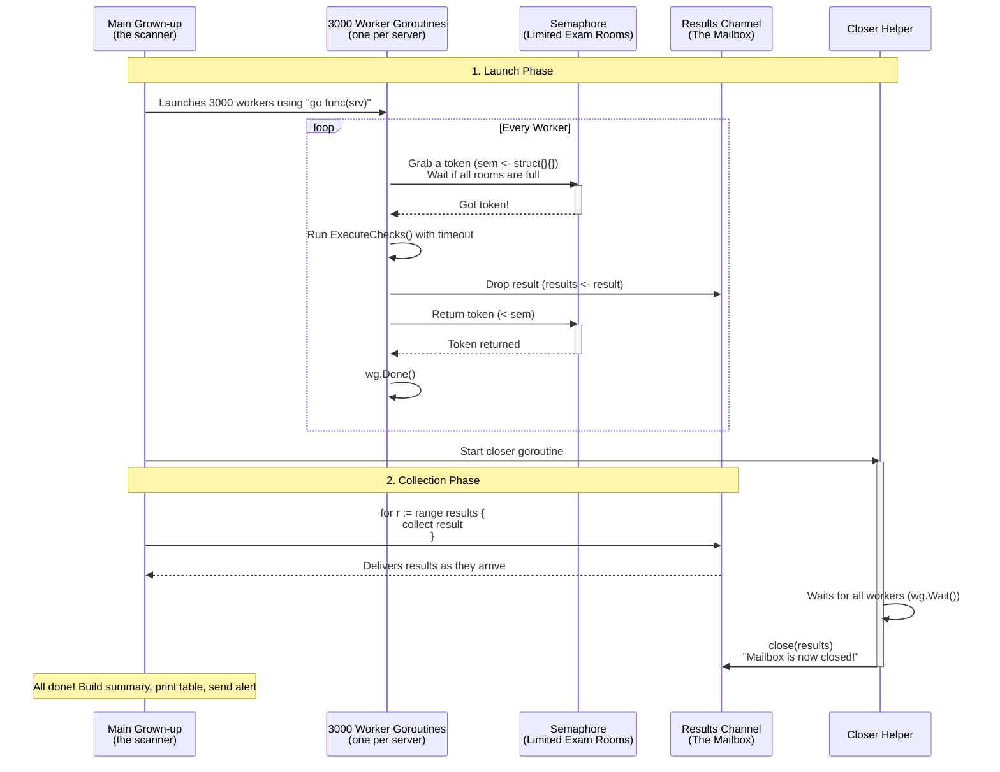

# Go `func` and Concurrency Explained Like You're 5 (With Real Code)

Hey there! Today we're going to learn about **functions** and **concurrency** in Go — but explained in the simplest way possible, like you're a curious 5-year-old who loves building things and playing with friends.

We'll use fun stories: **recipe cards**, **sticky notes**, and a **busy doctor's office** full of kids getting check-ups. At the end, you'll see exactly how real production code uses these ideas to check **3000+ SQL servers** quickly and safely.

---

## Part 1: What is a `func`?

A **func** is just a **recipe card**.

It has:
- A name (what you're making)
- Ingredients it needs
- What it gives back when it's done

**Example recipe card:**

```go
// executor.go
func ExecuteChecks(
    ctx context.Context,      // a timer that can say "stop!"
    serverName string,        // which server to check
    checks []*check.CheckDefinition, // list of health checks
    loginTimeout, queryTimeout, retryCount, retryDelay int,
) *model.ServerResult {   // gives back: one server's results
```

"Give me a server name and some checks, and I'll hand you back the results."
That's all a function is — a helpful recipe!

### Secret Helper Recipes: Closures (Sticky Notes)

Sometimes you write a **little recipe inside another recipe**.
The inner one can remember things from the outer one, even after the outer recipe is gone.

Think of it like this:
A kid writes a **sticky note** that says *"Set the timer to 30 seconds"*.
The kid walks away, but the sticky note still remembers 30!

Here's how it looks in real code:

```go
// connection.go
func WithLoginTimeout(seconds int) ConnOption {
    return func(o *connOpts) {
        o.loginTimeout = seconds
    }
}
```

Now you can do:

```go
opts := []ConnOption{
    connection.WithLoginTimeout(30),   // sticky note: "set login timeout to 30"
    connection.WithRetryCount(2),      // sticky note: "set retries to 2"
    inventory.WithDC("AUS"),           // sticky note: "only datacenter AUS"
}

for _, fn := range opts {
    fn(o)  // peel off each sticky note and follow it
}
```

This pattern is used heavily in the codebase for connection options and filters. Super clean!

---

## Part 2: Concurrency — Checking 3000 Servers at Once

Imagine you have to health-check **3000+ SQL servers**.
Doing one after another would take **forever**.

So we use **concurrency**: many things happening at the same time, but with smart limits.

### The Doctor's Office Story

Without concurrency (one at a time):
> Kid 1 walks in → gets checked → walks out.
> Then Kid 2... This would take all year!

With concurrency:
> The office has **many exam rooms**.
> Many kids can get checked **at the same time**.
> When a room opens up, the next kid in line goes in.

That's exactly what happens in `scanner.go`.

---

### How It All Works Together



### Breaking It Down Step by Step

#### 1. The Semaphore — "Only X Exam Rooms"

```go
sem := make(chan struct{}, cfg.MaxConcurrency)  // e.g. 400 rooms
```

This is a special bucket that holds a limited number of tokens.
Before a worker can start heavy work, it must **grab a token**. When finished, it **puts the token back**.

```go
sem <- struct{}{}           // take a token (or wait)
defer func() { <-sem }()    // put it back when done
```

#### 2. Goroutines — "Go Do It Yourself!"

```go
for _, srv := range servers {
    wg.Add(1)
    go func(s *inventory.Server) {   // Important: pass srv as parameter!
        defer wg.Done()

        sem <- struct{}{}           // grab room
        defer func() { <-sem }()    // return room when done

        result := executor.ExecuteChecks(...)
        results <- result           // send result to mailbox
    }(srv)
}
```

`go func()` means: **"Go do this on your own, don't make me wait!"**

**Important tip**: Always pass the loop variable (`(srv)`) — otherwise all goroutines would fight over the same server.

#### 3. The Results Channel — "The Mailbox"

```go
results := make(chan *model.ServerResult, len(servers))
```

Workers drop their results here. The main code picks them up:

```go
for r := range results {
    serverResults = append(serverResults, r)
}
```

#### 4. WaitGroup + Closer — "Are All Kids Done?"

```go
var wg sync.WaitGroup

// Inside each worker:
defer wg.Done()

// Separate helper that closes the channel when done:
go func() {
    wg.Wait()      // wait until everyone calls Done()
    close(results) // seal the mailbox
}()
```

#### 5. Personal Timer (Context + Timeout)

Each server gets its own timer:

```go
srvCtx, cancel := context.WithTimeout(ctx, time.Duration(cfg.HardTimeoutSeconds)*time.Second)
defer cancel()
```

If a server hangs too long, the timer says "Time's up!" and we mark it as unreachable.

#### 6. Safe Counting (Atomic)

```go
var completed atomic.Int32
n := int(completed.Add(1))
progress(n, total)  // update progress bar safely
```

`atomic` is like a turnstile — it never gets confused even when many workers finish at the same time.

---

## TL;DR Cheat Sheet

| Concept              | 5-Year-Old Version                    | Real Code Example                     |
|----------------------|---------------------------------------|---------------------------------------|
| `func`               | Recipe card                           | `ExecuteChecks(...)`                  |
| Closure              | Sticky note that remembers things     | `WithLoginTimeout(30)`                |
| `go func()`          | "Go do your thing, don't wait for me" | One goroutine per server              |
| Channel              | Mailbox for results                   | `results <- result`                   |
| Semaphore            | Limited exam rooms (tokens)           | `make(chan struct{}, 400)`            |
| WaitGroup            | "Are all kids done yet?"              | `wg.Add(1)`, `wg.Done()`, `wg.Wait()` |
| Context              | Personal timer for each kid           | `context.WithTimeout`                 |
| Atomic               | Magic turnstile counter               | `atomic.Int32`                        |

---

## How to Write Concurrency in Go (High-Level Pattern)

At the highest level, Go concurrency follows this recipe:

1. Launch work with `go func()`
2. Send results back through a **channel**
3. Use `WaitGroup` to know when everyone is finished

**The full pattern used in this project:**

```go
sem := make(chan struct{}, 400)           // limit concurrency
results := make(chan Result, len(items))
var wg sync.WaitGroup

for _, item := range items {
    wg.Add(1)
    go func(it Item) {
        defer wg.Done()

        sem <- struct{}{}                 // grab slot
        defer func() { <-sem }()          // release slot

        results <- doWork(it)             // send result
    }(item)
}

// Close the channel when all work is done
go func() {
    wg.Wait()
    close(results)
}()

// Collect all results
for r := range results {
    // process result
}
```

### Example: Using `makeConnection` with Goroutines

```go
// Your function
func makeConnection(server string) (*sql.DB, error) { ... }

// Using it concurrently
results := make(chan *sql.DB, len(servers))
var wg sync.WaitGroup

for _, srv := range servers {
    wg.Add(1)
    go func(name string) {
        defer wg.Done()
        db, err := makeConnection(name)
        if err != nil {
            results <- nil
            return
        }
        results <- db
    }(srv)
}

go func() { wg.Wait(); close(results) }()

for db := range results {
    // use the connection
}
```

---

## Final Thoughts

Concurrency in Go is powerful because it's **simple and safe** when you follow the patterns:
- Use `go func()` to run things in parallel
- Use **channels** to communicate
- Use **semaphores** to control how many things run at once
- Use **WaitGroup** to know when everything is finished

In this codebase, these tools let us scan thousands of SQL servers efficiently without overwhelming the network or the target servers.

The production setting uses **MaxConcurrency = 400** — a sweet spot between speed and safety.

---

**Happy coding!**
Now go write some `go func()` magic of your own. 🚀

*This post explains concepts used in a real-world SQL Server auditing tool.*
